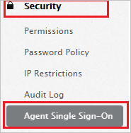
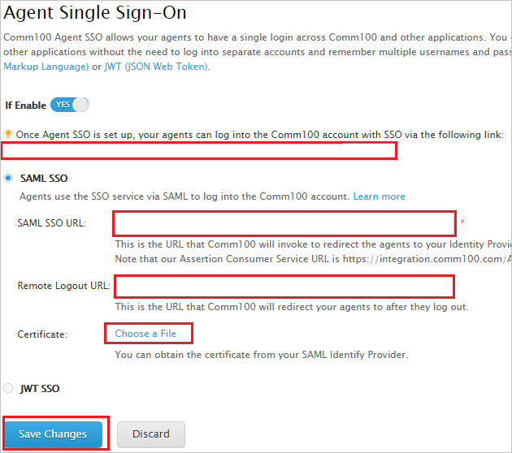
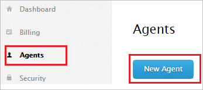
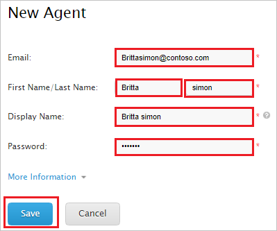

# Configure Comm100 Live Chat for Single sign-on with Microsoft Entra ID

In this article,  you learn how to integrate Comm100 Live Chat with Microsoft Entra ID. When you integrate Comm100 Live Chat with Microsoft Entra ID, you can:

* Control in Microsoft Entra ID who has access to Comm100 Live Chat.
* Enable your users to be automatically signed-in to Comm100 Live Chat with their Microsoft Entra accounts.
* Manage your accounts in one central location.

## Prerequisites

The scenario outlined in this article assumes that you already have the following prerequisites:

[!INCLUDE [common-prerequisites.md](~/identity/saas-apps/includes/common-prerequisites.md)]
* Comm100 Live Chat single sign-on (SSO) enabled subscription.

## Scenario description

In this article,  you configure and test Microsoft Entra SSO in a test environment.

* Comm100 Live Chat supports **SP** initiated SSO.

> [!NOTE]
> Identifier of this application is a fixed string value so only one instance can be configured in one tenant.

## Add Comm100 Live Chat from the gallery

To configure the integration of Comm100 Live Chat into Microsoft Entra ID, you need to add Comm100 Live Chat from the gallery to your list of managed SaaS apps.

1. Sign in to the [Microsoft Entra admin center](https://entra.microsoft.com) as at least a [Cloud Application Administrator](~/identity/role-based-access-control/permissions-reference.md#cloud-application-administrator).
1. Browse to **Entra ID** > **Enterprise apps** > **New application**.
1. In the **Add from the gallery** section, type **Comm100 Live Chat** in the search box.
1. Select **Comm100 Live Chat** from results panel and then add the app. Wait a few seconds while the app is added to your tenant.

 [!INCLUDE [sso-wizard.md](~/identity/saas-apps/includes/sso-wizard.md)]

## Configure and test Microsoft Entra SSO for Comm100 Live Chat

Configure and test Microsoft Entra SSO with Comm100 Live Chat using a test user called **B.Simon**. For SSO to work, you need to establish a link relationship between a Microsoft Entra user and the related user in Comm100 Live Chat.

To configure and test Microsoft Entra SSO with Comm100 Live Chat, perform the following steps:

1. **[Configure Microsoft Entra SSO](#configure-azure-ad-sso)** - to enable your users to use this feature.
   1. **Create a Microsoft Entra test user** - to test Microsoft Entra single sign-on with B.Simon.
   1. **Assign the Microsoft Entra test user** - to enable B.Simon to use Microsoft Entra single sign-on.
1. **[Configure Comm100 Live Chat SSO](#configure-comm100-live-chat-sso)** - to configure the single sign-on settings on application side.
   1. **[Create Comm100 Live Chat test user](#create-comm100-live-chat-test-user)** - to have a counterpart of B.Simon in Comm100 Live Chat that's linked to the Microsoft Entra representation of user.
1. **[Test SSO](#test-sso)** - to verify whether the configuration works.

## Configure Microsoft Entra SSO

Follow these steps to enable Microsoft Entra SSO.

1. Sign in to the [Microsoft Entra admin center](https://entra.microsoft.com) as at least a [Cloud Application Administrator](~/identity/role-based-access-control/permissions-reference.md#cloud-application-administrator).
1. Browse to **Entra ID** > **Enterprise apps** > **Comm100 Live Chat** > **Single sign-on**.
1. On the **Select a single sign-on method** page, select **SAML**.
1. On the **Set up single sign-on with SAML** page, select the pencil icon for **Basic SAML Configuration** to edit the settings.

   

1. On the **Basic SAML Configuration** section, perform the following step:

    In the **Sign-on URL** text box, type a URL using the following pattern:
    `https://<SUBDOMAIN>.comm100.com/AdminManage/LoginSSO.aspx?siteId=<SITEID>`

	> [!NOTE] 
	> The Sign-on URL value isn't real. You update the Sign-on URL value with the actual Sign-on URL, which is explained later in the article.

1. Comm100 Live Chat application expects the SAML assertions in a specific format, which requires you to add custom attribute mappings to your SAML token attributes configuration. The following screenshot shows the list of default attributes.

	

1. In addition to above, Comm100 Live Chat application expects few more attributes to be passed back in SAML response which are shown below. These attributes are also pre populated but you can review them as per your requirement.

	| Name |  Source Attribute|
	| ---------------| --------------- |
	|   email    | user.mail |

1. On the **Set up single sign-on with SAML** page, in the **SAML Signing Certificate** section,  find **Certificate (Base64)** and select **Download** to download the certificate and save it on your computer.

	

1. On the **Set up Comm100 Live Chat** section, copy the appropriate URL(s) based on your requirement.

	

[!INCLUDE [create-assign-users-sso.md](~/identity/saas-apps/includes/create-assign-users-sso.md)]

## Configure Comm100 Live Chat SSO

1. In a different web browser window, sign in to Comm100 Live Chat as a Security Administrator.

1. On the top right side of the page, select **My Account**.

   

1. From the left side of menu, select **Security** and then select **Agent Single Sign-On**.

   

1. On the **Agent Single Sign-On** page, perform the following steps:

   

   a. Copy the first highlighted link and paste it in **Sign-on URL** textbox in **Basic SAML Configuration** section.

   b. In the **SAML SSO URL** textbox, paste the value of **Login URL**, which you copied previously.

   c. In the **Remote Logout URL** textbox, paste the value of **Logout URL**, which you copied previously.

   d. Select **Choose a File** to upload the base-64 encoded certificate that you have downloaded, into the **Certificate**.

   e. Select **Save Changes**.

### Create Comm100 Live Chat test user

To enable Microsoft Entra users to sign in to Comm100 Live Chat, they must be provisioned into Comm100 Live Chat. In Comm100 Live Chat, provisioning is a manual task.

**To provision a user account, perform the following steps:**

1. Sign in to Comm100 Live Chat as a Security Administrator.

2. On the top right side of the page, select **My Account**.

	

3. From the left side of menu, select **Agents** and then select **New Agent**.

	

4. On the **New Agent** page, perform the following steps:

	

	a. a. In **Email** text box, enter the email of user like **B.simon\@contoso.com**.

	b. In **First Name** text box, enter the first name of user like **B**.

	c. In **Last Name** text box, enter the last name of user like **simon**.

	d. In the **Display Name** textbox, enter the display name of user like **B.simon**

	e. In the **Password** textbox, type your password.

	f. Select **Save**.

## Test SSO 

In this section, you test your Microsoft Entra single sign-on configuration with following options. 

* Select **Test this application**, this option redirects to Comm100 Live Chat Sign-on URL where you can initiate the login flow. 

* Go to Comm100 Live Chat Sign-on URL directly and initiate the login flow from there.

* You can use Microsoft My Apps. When you select the Comm100 Live Chat tile in the My Apps, this option redirects to Comm100 Live Chat Sign-on URL. For more information about the My Apps, see [Introduction to the My Apps](https://support.microsoft.com/account-billing/sign-in-and-start-apps-from-the-my-apps-portal-2f3b1bae-0e5a-4a86-a33e-876fbd2a4510).

## Related content

Once you configure Comm100 Live Chat you can enforce session control, which protects exfiltration and infiltration of your organization’s sensitive data in real time. Session control extends from Conditional Access. [Learn how to enforce session control with Microsoft Defender for Cloud Apps](/cloud-app-security/proxy-deployment-aad).
