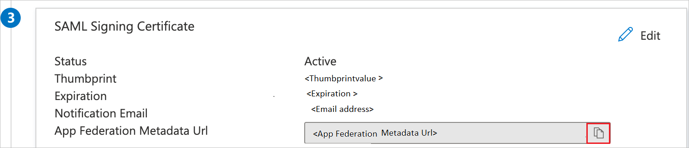
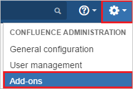
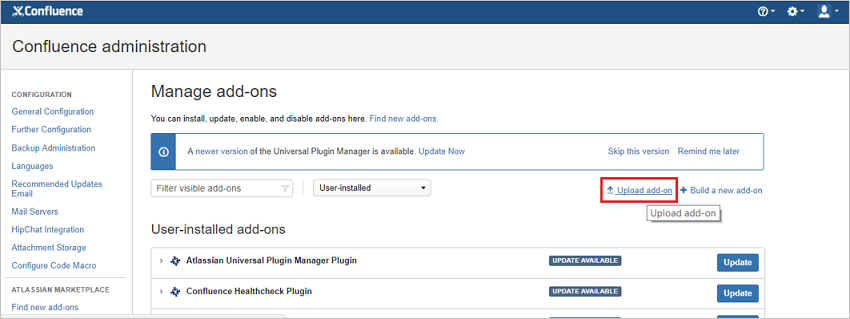
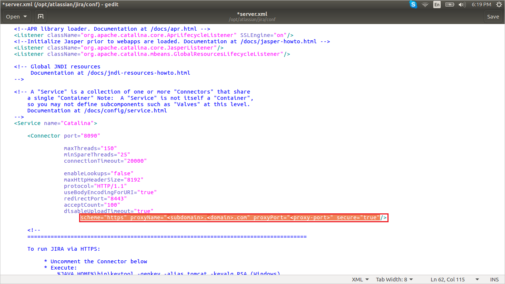
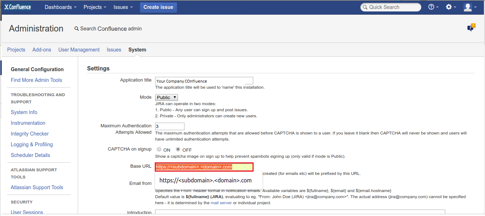
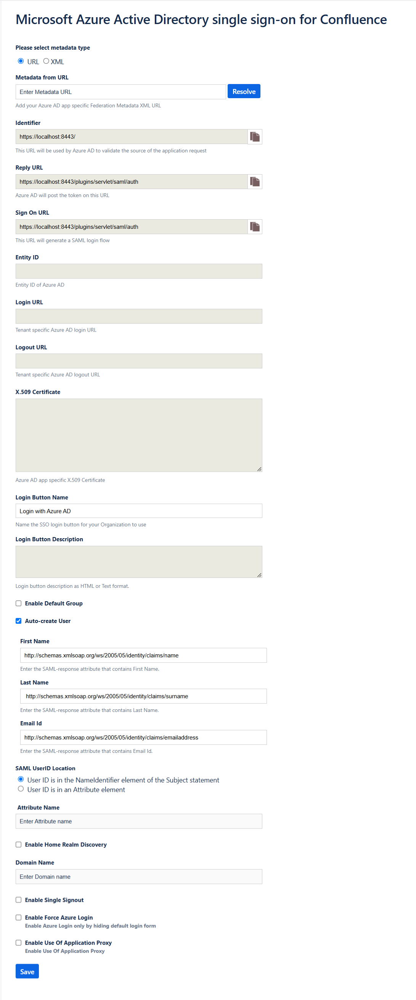
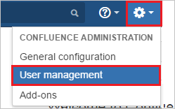
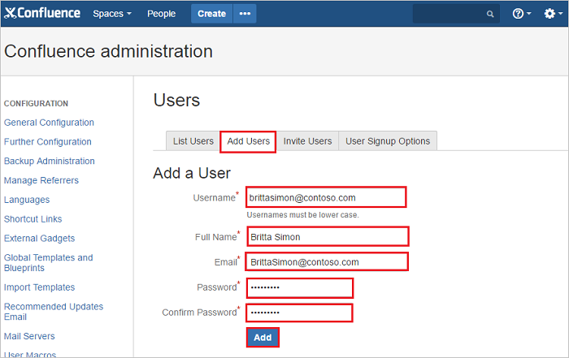

# Configure Confluence SAML SSO by Microsoft for Single sign-on with Microsoft Entra ID

In this article,  you learn how to integrate Confluence SAML SSO by Microsoft with Microsoft Entra ID. When you integrate Confluence SAML SSO by Microsoft with Microsoft Entra ID, you can:

* Control in Microsoft Entra ID who has access to Confluence SAML SSO by Microsoft.
* Enable your users to be automatically signed-in to Confluence SAML SSO by Microsoft with their Microsoft Entra accounts.
* Manage your accounts in one central location.

## Description:

Use your Microsoft Entra account with Atlassian Confluence server to enable single sign-on. This way all your organization users can use the Microsoft Entra credentials to sign in into the Confluence application. This plugin uses SAML 2.0 for federation.

## Prerequisites

The scenario outlined in this article assumes that you already have the following prerequisites:

[!INCLUDE [common-prerequisites.md](~/identity/saas-apps/includes/common-prerequisites.md)]
- Confluence server application installed on a Windows 64-bit server (on-premises or on the cloud IaaS infrastructure).
- Confluence server is HTTPS enabled.
- Note the supported versions for Confluence Plugin are mentioned in below section.
- Confluence server is reachable on internet particularly to Microsoft Entra Login page for authentication and should able to receive the token from Microsoft Entra ID.
- Admin credentials are set up in Confluence.
- WebSudo is disabled in Confluence.
- Test user created in the Confluence server application.

> [!NOTE]
> To test the steps in this article,  we don't recommend using a production environment of Confluence. Test the integration first in development or staging environment of the application and then use the production environment.

> [!NOTE]
> This integration is also available to use from Microsoft Entra US Government Cloud environment. You can find this application in the Microsoft Entra US Government Cloud Application Gallery and configure it in the same way as you do from public cloud.

To get started, you need the following items:

* don't use your production environment, unless it's necessary.
* A Microsoft Entra subscription. If you don't have a subscription, you can get a [free account](https://azure.microsoft.com/free/).
* Confluence SAML SSO by Microsoft single sign-on (SSO) enabled subscription.

> [!NOTE]
> For the information on application proxy configuration for Confluence, please refer [this](confluence-app-proxy-tutorial.md) article.

## Supported versions of Confluence

As of now, following versions of Confluence are supported:

- Confluence: 5.0 to 5.10
- Confluence: 6.0.1 to 6.15.9
- Confluence: 7.0.1 to 7.20.3
- Confluence: 8.0.0 to 8.9.8
- Confluence: 9.0.1 to 9.5.1

> [!NOTE]
> Please note that our Confluence Plugin was last supported on **Ubuntu 16.04**, which is no longer supported. The plugin now supports **only Windows**.

## Scenario description

In this article,  you configure and test Microsoft Entra SSO in a test environment.

* Confluence SAML SSO by Microsoft supports **SP** initiated SSO.

## Adding Confluence SAML SSO by Microsoft from the gallery

To configure the integration of Confluence SAML SSO by Microsoft into Microsoft Entra ID, you need to add Confluence SAML SSO by Microsoft from the gallery to your list of managed SaaS apps.

1. Sign in to the [Microsoft Entra admin center](https://entra.microsoft.com) as at least a [Cloud Application Administrator](~/identity/role-based-access-control/permissions-reference.md#cloud-application-administrator).
1. Browse to **Entra ID** > **Enterprise apps** > **New application**.
1. In the **Add from the gallery** section, type **Confluence SAML SSO by Microsoft** in the search box.
1. Select **Confluence SAML SSO by Microsoft** from results panel and then add the app. Wait a few seconds while the app is added to your tenant.

 [!INCLUDE [sso-wizard.md](~/identity/saas-apps/includes/sso-wizard.md)]

## Configure and test Microsoft Entra SSO for Confluence SAML SSO by Microsoft

Configure and test Microsoft Entra SSO with Confluence SAML SSO by Microsoft using a test user called **B.Simon**. For SSO to work, you need to establish a link relationship between a Microsoft Entra user and the related user in Confluence SAML SSO by Microsoft.

To configure and test Microsoft Entra SSO with Confluence SAML SSO by Microsoft, perform the following steps:

1. **[Configure Microsoft Entra SSO](#configure-azure-ad-sso)** - to enable your users to use this feature.
    1. **Create a Microsoft Entra test user** - to test Microsoft Entra single sign-on with B.Simon.
    1. **Assign the Microsoft Entra test user** - to enable B.Simon to use Microsoft Entra single sign-on.
1. **[Configure Confluence SAML SSO by Microsoft SSO](#configure-confluence-saml-sso-by-microsoft-sso)** - to configure the single sign-on settings on application side.
    1. **[Create Confluence SAML SSO by Microsoft test user](#create-confluence-saml-sso-by-microsoft-test-user)** - to have a counterpart of B.Simon in Confluence SAML SSO by Microsoft that's linked to the Microsoft Entra representation of user.
1. **[Test SSO](#test-sso)** - to verify whether the configuration works.

## Configure Microsoft Entra SSO

Follow these steps to enable Microsoft Entra SSO.

1. Sign in to the [Microsoft Entra admin center](https://entra.microsoft.com) as at least a [Cloud Application Administrator](~/identity/role-based-access-control/permissions-reference.md#cloud-application-administrator).
1. Browse to **Entra ID** > **Enterprise apps** > **Confluence SAML SSO by Microsoft** > **Single sign-on**.
1. On the **Select a single sign-on method** page, select **SAML**.
1. On the **Set up single sign-on with SAML** page, select the pencil icon for **Basic SAML Configuration** to edit the settings.

   

1. On the **Basic SAML Configuration** section, perform the following steps:

    a. In the **Identifier** box, type a URL using the following pattern:
    `https://<DOMAIN:PORT>/`

    b. In the **Reply URL** text box, type a URL using the following pattern:
    `https://<DOMAIN:PORT>/plugins/servlet/saml/auth`
    
    c. In the **Sign-on URL** text box, type a URL using the following pattern:
    `https://<DOMAIN:PORT>/plugins/servlet/saml/auth`

    > [!NOTE]
    > These values aren't real. Update these values with the actual Identifier, Reply URL, and Sign-on URL. Port is optional in case it’s a named URL. These values are received during the configuration of Confluence plugin, which is explained later in the article.

1. On the **Set up single sign-on with SAML** page, In the **SAML Signing Certificate** section, select copy button to copy **App Federation Metadata Url** and save it on your computer.

    

[!INCLUDE [create-assign-users-sso.md](~/identity/saas-apps/includes/create-assign-users-sso.md)]

## Configure Confluence SAML SSO by Microsoft SSO

1. In a different web browser window, sign in to your Confluence instance as an administrator.

1. Hover on cog and select the **Add-ons**.

    

1. Download the plugin from [Microsoft Download Center](https://www.microsoft.com/download/details.aspx?id=56503). Manually upload the plugin provided by Microsoft using **Upload add-on** menu. The download of plugin is covered under [Microsoft Service Agreement](https://www.microsoft.com/servicesagreement/).

    

1. For running the Confluence reverse proxy scenario or load balancer scenario perform the following steps:

    > [!NOTE]
    > You should be configuring the server first with the below instructions and then install the plugin.

    a. Add below attribute in **connector** port in **server.xml** file of JIRA server application.

    `scheme="https" proxyName="<subdomain.domain.com>" proxyPort="<proxy_port>" secure="true"`

    

    b. Change **Base URL** in **System Settings** according to proxy/load balancer.

    

1. Once the plugin is installed, it appears in **User Installed** add-ons section of **Manage Add-on** section. Select **Configure** to configure the new plugin.

1. Perform following steps on configuration page:

    > [!TIP]
    > Ensure that there is only one certificate mapped against the app so that there is no error in resolving the metadata. If there are multiple certificates, admin gets an error upon resolving the metadata.

    

    1. In the **Metadata URL** textbox, paste **App Federation Metadata Url** value which you have copied and select the **Resolve** button. It reads the IdP metadata URL and populates all the fields information.

    1. Copy the **Identifier, Reply URL and Sign on URL** values and paste them in **Identifier, Reply URL and Sign on URL** textboxes respectively in **Basic SAML Configuration** section.

    1. In **Login Button Name** type the name of button your organization wants the users to see on login screen.

    1. In **Login Button Description** type the description of button your organization wants the users to see on login screen.
  
    1. In **Default Group** Select your organization Default Group to assign to new users (Default groups facilitate organized access rights to new user account).
  
    1. In **Auto-create User** feature (JIT User Provisioning): It automates user account creation in authorized web applications, without the need for manual provisioning. This reduces administrative workload and increases productivity. Because JIT relies on the login response from Azure AD, enter the SAML-response attribute values, which include the user's email address, last name, and first name.

    1. In **SAML User ID Locations**, select either **User ID is in the NameIdentifier element of the Subject statement** or **User ID is in an Attribute element**.  This ID has to be the Confluence user ID. If the user ID isn't matched, then system doesn't allow users to sign in. 

       > [!Note]
       > Default SAML User ID location is Name Identifier. You can change this to an attribute option and enter the appropriate attribute name.

    1. If you select **User ID is in an Attribute element** option, then in **Attribute name** textbox type the name of the attribute where User ID is expected. 

    1. If you're using the federated domain (like ADFS, and so on) with Microsoft Entra ID, then select the **Enable Home Realm Discovery** option and configure the **Domain Name**.

    1. In **Domain Name** type the domain name here in case of the ADFS-based login.

    1. Check **Enable Single Sign out** if you wish to sign out from Microsoft Entra ID when a user signs out from Confluence. 

    1. Enable **Force Azure Login** checkbox, if you wish to sign in through Microsoft Entra credentials only.

       > [!Note]
       > To enable the default login form for admin login on the login page when the force azure login is enabled, add the query parameter in the browser URL.
       > `https://<DOMAIN:PORT>/login.action?force_azure_login=false`

    1. **Enable Use of Application Proxy** checkbox, if you have configured your on-premise atlassian application in an application proxy setup. For App proxy setup , follow the steps on the [Microsoft Entra application proxy Documentation](~/identity/app-proxy/overview-what-is-app-proxy.md).

    1. Select **Save** button to save the settings.

       > [!NOTE]
       > For more information about installation and troubleshooting, visit [MS Confluence SSO Connector Admin Guide](./ms-confluence-jira-plugin-adminguide.md). There's also an [FAQ](./ms-confluence-jira-plugin-adminguide.md) for your assistance.

### Create Confluence SAML SSO by Microsoft test user

To enable Microsoft Entra users to sign in to Confluence on-premises server, they must be provisioned into Confluence SAML SSO by Microsoft. For Confluence SAML SSO by Microsoft, provisioning is a manual task.

**To provision a user account, perform the following steps:**

1. Sign in to your Confluence on-premises server as an administrator.

1. Hover on cog and select the **User management**.

    

1. Under Users section, select **Add users** tab. On the **Add a User** dialog page, perform the following steps:

    

    a. In the **Username** textbox, type the email of user like B.Simon.

    b. In the **Full Name** textbox, type the full name of user like B.Simon.

    c. In the **Email** textbox, type the email address of user like B.Simon@contoso.com.

    d. In the **Password** textbox, type the password for B.Simon.

    e. Select **Confirm Password** reenter the password.

    f. Select **Add** button.

## Test SSO 

In this section, you test your Microsoft Entra single sign-on configuration with following options. 

* Select **Test this application**, this option redirects to Confluence SAML SSO by Microsoft Sign-on URL where you can initiate the login flow. 

* Go to Confluence SAML SSO by Microsoft Sign-on URL directly and initiate the login flow from there.

* You can use Microsoft My Apps. When you select the Confluence SAML SSO by Microsoft tile in the My Apps, this option redirects to Confluence SAML SSO by Microsoft Sign-on URL. For more information about the My Apps, see [Introduction to the My Apps](https://support.microsoft.com/account-billing/sign-in-and-start-apps-from-the-my-apps-portal-2f3b1bae-0e5a-4a86-a33e-876fbd2a4510).

## Related content

Once you configure Confluence SAML SSO by Microsoft you can enforce Session control, which protects exfiltration and infiltration of your organization’s sensitive data in real time. Session control extends from Conditional Access. [Learn how to enforce session control with Microsoft Defender for Cloud Apps](/cloud-app-security/proxy-deployment-aad).
