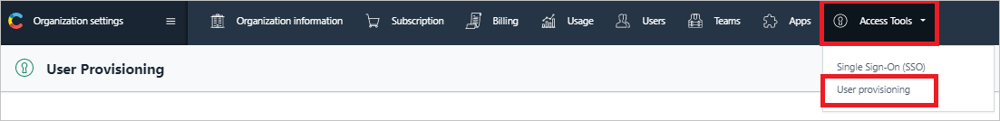
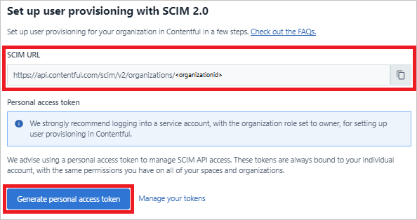
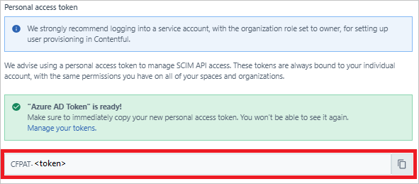

# Tutorial: Configure Contentful for automatic user provisioning

This article describes the steps you need to complete in Contentful and in Microsoft Entra ID to configure automatic user provisioning. When configured, Microsoft Entra ID automatically provisions and deprovisions users and groups to [Contentful](https://www.contentful.com/) by using the Microsoft Entra provisioning service. For important details about what this service does and how it works, and for frequently asked questions, see [Automate user provisioning and deprovisioning to SaaS applications with Microsoft Entra ID](~/identity/app-provisioning/user-provisioning.md). 

## Capabilities supported

> [!div class="checklist"]
> * Create users in Contentful
> * Remove users in Contentful when they don't require access anymore
> * Keep user attributes synchronized between Microsoft Entra ID and Contentful
> * Provision groups and group memberships in Contentful
> * [Single sign-on](contentful-tutorial.md) to Contentful (recommended)

## Prerequisites

The scenario outlined in this tutorial assumes that you already have the following prerequisites:

* [A Microsoft Entra tenant](~/identity-platform/quickstart-create-new-tenant.md). 
* One of the following roles: [Application Administrator](/entra/identity/role-based-access-control/permissions-reference#application-administrator), [Cloud Application Administrator](/entra/identity/role-based-access-control/permissions-reference#cloud-application-administrator), or [Application Owner](/entra/fundamentals/users-default-permissions#owned-enterprise-applications).
* A Contentful organization account that has a subscription that supports System for Cross-domain Identity Management (SCIM) provisioning. If you have questions about your organization's subscription, contact [Contentful Support](mailto:support@contentful.com).
 
## Plan your provisioning deployment

1. Learn about [how the provisioning service works](~/identity/app-provisioning/user-provisioning.md).
2. Determine who will be in [scope for provisioning](~/identity/app-provisioning/define-conditional-rules-for-provisioning-user-accounts.md).
3. Determine what data to [map between Microsoft Entra ID and Contentful](~/identity/app-provisioning/customize-application-attributes.md). 

## Configure Contentful to support provisioning with Microsoft Entra ID

1. In Contentful, create a **Service User** account. All provisioning permissions for Azure are provided through this account. We recommend that you choose **Owner** as the organization role for this account.

2. Sign in to Contentful as the **Service User**.

3. In the left menu, select **Organization settings** > **Access Tools** > **User provisioning**.

   

4. Copy and save the **SCIM URL**. You'll enter this value in the Azure portal, on the **Provisioning** tab of your Contentful application.

5. Select **Generate personal access token**.

    

6. In the modal window, enter a name for your personal access token, and then select **Generate**.

7. The SCIM URL and the secret token are generated. Copy and save these values. You'll enter these values on the **Provisioning** tab of your Contentful application.

    

If you have questions while you configure provisioning in the Contentful admin console, contact [Contentful Support](mailto:support@contentful.com).

## Add Contentful from the Microsoft Entra application gallery

To manage provisioning to Contentful, add Contentful from the Microsoft Entra application gallery. If you have previously set up Contentful for single sign-on, you can use the same application. However, we recommend that you create a separate app to initially test the integration. Learn how to [add an application in the gallery](~/identity/enterprise-apps/add-application-portal.md). 

## Define who will be in scope for provisioning 

You can use the Microsoft Entra provisioning service to scope who will be provisioned based on assignment to the application or based on attributes of the user or group. 

If you choose to scope who will be provisioned to your app based on assignment, complete the steps to [assign users and groups to the application](~/identity/enterprise-apps/assign-user-or-group-access-portal.md).

If you choose to scope who will be provisioned based solely on attributes of the user or group, use a scoping filter to [define conditional rules for provisioning user accounts](~/identity/app-provisioning/define-conditional-rules-for-provisioning-user-accounts.md). 

* When you assign users and groups to Contentful, you must select a role other than **Default Access**. Users who have the Default Access role are excluded from provisioning and are indicated in the provisioning logs as not effectively entitled. If the only role available on the application is the Default Access role, you can [update the application manifest](~/identity-platform/howto-add-app-roles-in-apps.md) to add more roles. 
* Start small. Test with a small set of users and groups before you roll out to everyone. When provisioning scope is set to assigned users and groups, you can control the scope by assigning one or two users or groups to the app. When the scope is set to all users and groups, you can specify an [attribute-based scoping filter](~/identity/app-provisioning/define-conditional-rules-for-provisioning-user-accounts.md). 

## Configure automatic user provisioning to Contentful 

This section guides you through the steps to set up the Microsoft Entra provisioning service to create, update, and disable users and groups in a test app based on user or group assignments in Microsoft Entra ID.

### Configure automatic user provisioning for Contentful in Microsoft Entra ID

1. Sign in to the [Microsoft Entra admin center](https://entra.microsoft.com) as at least a [Cloud Application Administrator](~/identity/role-based-access-control/permissions-reference.md#cloud-application-administrator).
1. Browse to **Identity** > **Applications** > **Enterprise applications**.

   

1. In the applications list, select **Contentful**.

   

3. Select the **Provisioning** tab.

   

4. Set **Provisioning Mode** to **Automatic**.

   

5. In the **Admin Credentials** section, enter your Contentful tenant URL and secret token. To ensure that Microsoft Entra ID can connect to Contentful, select **Test Connection**. If the connection fails, be sure that your Contentful account has Admin permissions, and then try again.

   

6. In **Notification Email**, enter the email address of a person or group who should receive the provisioning error notifications, and then select the **Send an email notification when a failure occurs** check box.

   

7. Select **Save**.

8. In the **Mappings** section, select **Synchronize Microsoft Entra users to Contentful**.

9. In the **Attribute-Mapping** section, review the user attributes that are synced from Microsoft Entra ID to Contentful. The attributes selected as **Matching** properties are used to match the user accounts in Contentful for update operations. If you choose to change the [matching target attribute](~/identity/app-provisioning/customize-application-attributes.md), you must ensure that the Contentful API supports filtering users based on that attribute. Select the **Save** button to commit any changes.

   |Attribute|Type|Supported for filtering|
   |---|---|---|
   |userName|String|&check;|
   |name.givenName|String|
   |name.familyName|String|

10. In the **Mappings** section, select **Synchronize Microsoft Entra groups to Contentful**.

11. In the **Attribute-Mapping** section, review the group attributes that are synced from Microsoft Entra ID to Contentful. The attributes selected as **Matching** properties are used to match the groups in Contentful for update operations. Select the **Save** button to commit any changes.

    |Attribute|Type|Supported for filtering|
    |---|---|---|
    |displayName|String|&check;|
    |members|Reference|

12. To set up scoping filters, complete the steps that are described in the [scoping filter tutorial](~/identity/app-provisioning/define-conditional-rules-for-provisioning-user-accounts.md).

13. To enable the Microsoft Entra provisioning service for Contentful, in the **Settings** section, for **Provisioning Status**, select **On**.

    

14. To define the users or groups that you want to provision to Contentful, in the **Settings** section, for **Scope**, select the relevant option.

    

15. When you're ready to provision, select **Save**.

    

This operation starts the initial sync cycle of all users and groups defined in **Scope** under **Settings**. The initial cycle takes longer to perform than subsequent cycles, which occur approximately every 40 minutes as long as the Microsoft Entra provisioning service is running. 

## Monitor your deployment

After you configure provisioning, use the following resources to monitor your deployment:

* To determine which users have been provisioned successfully or unsuccessfully, view the [provisioning logs](~/identity/monitoring-health/concept-provisioning-logs.md).
* To see the status of the provisioning cycle and how close it is to finishing, check the [progress bar](~/identity/app-provisioning/application-provisioning-when-will-provisioning-finish-specific-user.md).
* If the provisioning configuration seems to be in an unhealthy state, the application goes into quarantine. Learn more about [quarantine states](~/identity/app-provisioning/application-provisioning-quarantine-status.md).  

## Next steps

* [Learn how to review logs and get reports on provisioning activity](~/identity/app-provisioning/check-status-user-account-provisioning.md)
* [Manage user account provisioning for Enterprise Apps](~/identity/app-provisioning/configure-automatic-user-provisioning-portal.md)
* [What is application access and single sign-on with Microsoft Entra ID?](~/identity/enterprise-apps/what-is-single-sign-on.md)
