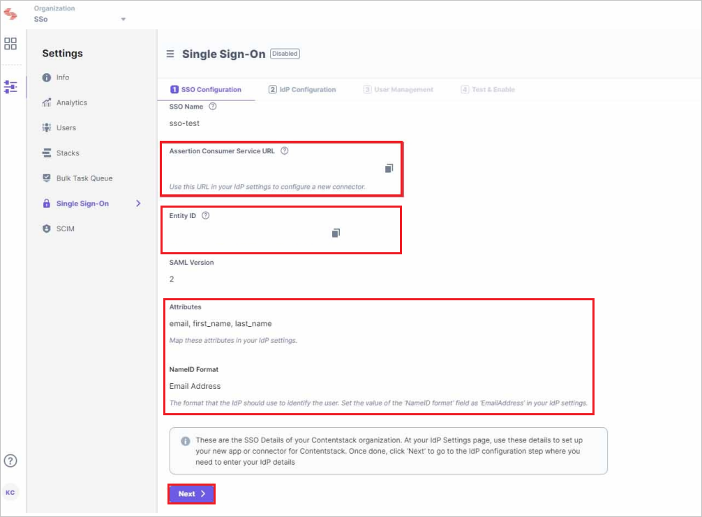
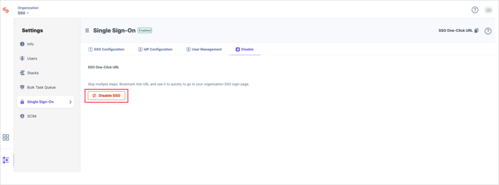

# Microsoft Entra SSO integration with Contentstack

In this tutorial, you'll learn how to integrate Contentstack with Microsoft Entra ID. When you integrate Contentstack with Microsoft Entra ID, you can:

* Control in Microsoft Entra ID who has access to Contentstack.
* Enable your users to be automatically signed-in to Contentstack with their Microsoft Entra accounts.
* Manage your accounts in one central location.

## Prerequisites

To integrate Microsoft Entra ID with Contentstack, you need:

* A Microsoft Entra subscription. If you don't have a subscription, you can get a [free account](https://azure.microsoft.com/free/).
* Contentstack single sign-on (SSO) enabled subscription.

## Scenario description

In this tutorial, you configure and test Microsoft Entra SSO in a test environment.

* Contentstack supports both **SP and IDP** initiated SSO.
* Contentstack supports **Just In Time** user provisioning.

## Add Contentstack from the gallery

To configure the integration of Contentstack into Microsoft Entra ID, you need to add Contentstack from the gallery to your list of managed SaaS apps.

1. Sign in to the [Microsoft Entra admin center](https://entra.microsoft.com) as at least a [Cloud Application Administrator](~/identity/role-based-access-control/permissions-reference.md#cloud-application-administrator).
1. Browse to **Identity** > **Applications** > **Enterprise applications** > **New application**.
1. In the **Add from the gallery** section, type **Contentstack** in the search box.
1. Select **Contentstack** from results panel and then add the app. Wait a few seconds while the app is added to your tenant.

Alternatively, you can also use the [Enterprise App Configuration Wizard](https://portal.office.com/AdminPortal/home?Q=Docs#/azureadappintegration). In this wizard, you can add an application to your tenant, add users/groups to the app, assign roles, and walk through the SSO configuration as well. [Learn more about Microsoft 365 wizards.](/microsoft-365/admin/misc/azure-ad-setup-guides)

## Configure and test Microsoft Entra SSO for Contentstack

Configure and test Microsoft Entra SSO with Contentstack using a test user called **B.Simon**. For SSO to work, you need to establish a link relationship between a Microsoft Entra user and the related user in Contentstack.

To configure and test Microsoft Entra SSO with Contentstack, perform the following steps:

1. **[Configure Microsoft Entra SSO](#configure-microsoft-entra-sso)** - to enable your users to use this feature.
    1. **[Create a Microsoft Entra test user](#create-a-microsoft-entra-id-test-user)** - to test Microsoft Entra single sign-on with B.Simon.
    1. **[Assign the Microsoft Entra test user](#assign-the-microsoft-entra-id-test-user)** - to enable B.Simon to use Microsoft Entra single sign-on.
1. **[Configure Contentstack SSO](#configure-contentstack-sso)** - to configure the single sign-on settings on application side.
    1. **[Create Contentstack test user](#create-contentstack-test-user)** - to have a counterpart of B.Simon in Contentstack that is linked to the Microsoft Entra representation of user.
1. **[Test SSO](#test-sso)** - to verify whether the configuration works.

## Configure Microsoft Entra SSO

Follow these steps to enable Microsoft Entra SSO in the Microsoft Entra admin center.

1. Sign in to the [Microsoft Entra admin center](https://entra.microsoft.com) as a [Cloud Application Administrator](~/identity/role-based-access-control/permissions-reference.md#cloud-application-administrator) and browse to **Identity** > **Applications** > **Enterprise applications**.
1. Now click on **+ New Application** and search for Contentstack then click **Create**. Once created, now go to **Setup single sign on** or click the **Single sign-on** link from the left menu.
    
    

1. Next, on the **Select a single sign-on method** page, select **SAML**.
    
    

1. On the **Set up single sign-on with SAML** page, click the pencil icon for **Basic SAML Configuration** to edit the settings.

   

1. In the **Basic SAML Configuration** section, you need to perform a few steps. To obtain the information necessary for these steps, you will first need to go to the Contentstack application and create **SSO Name** and **ACS URL** in the following manner:
    
    a. Log in to your Contentstack account, go to the Organization Settings page, and click on the **Single Sign-On** tab.

    

    b. Enter an **SSO Name** of your choice, and click **Create**.

    

    > [!NOTE]
    > For example, if your company name is “Acme, Inc.” enter “acme” here. This name will be used as one of the login credentials by the organization users while signing in. The SSO Name can contain only alphabets (in lowercase), numbers (0-9), and/or hyphens (-).

    c. When you click on **Create**, this will generate the **Assertion Consumer Service URL** or ACS URL, and other details such as **Entity ID**, **Attributes**, and **NameID Format**.

    

1. Back in the **Basic SAML Configuration** section, paste the **Entity ID** and the **ACS URL** generated in the above set of steps, against the **Identifier (Entity ID)** and **Reply URL** sections respectively, and save the entries.

    1.  In the **Identifier** text box, paste the **Entity ID** value, which you have copied from Contentstack.
    
        

    1. In the **Reply URL** text box, paste the **ACS URL**, which you have copied from Contentstack.

        

1. This is an optional step. If you wish to configure the application in SP-initiated mode, enter the Sign-on URL against the Sign-on URL section:

    

    > [!NOTE]
    > You will find the **SSO One-Click URL** (that is, the Sign on URL) when you complete configuring Contentstack SSO.
    

1. Contentstack application expects the SAML assertions in a specific format, which requires you to add custom attribute mappings to your SAML token attributes configuration. The following screenshot shows the list of default attributes.

	

1. In addition to above, Contentstack application expects a few more attributes to be passed back in SAML response which are shown below. These attributes are also pre populated but you can review them as per your requirements. This is an optional step.

	| Name | Source Attribute|
	| ----- | --------------- |
    | roles | user.assignedroles|

    > [!NOTE]
    > Please click [here](~/identity-platform/howto-add-app-roles-in-apps.md#app-roles-ui) to know how to configure Role in Microsoft Entra ID.

1. On the **Set up single sign-on with SAML** page, in the **SAML Signing Certificate** section, find **Certificate (Base64)** and select **Download** to download the certificate and save it on your computer.

	

1. On the **Set up Contentstack** section, copy the appropriate URL(s) based on your requirement.

	

### Create a Microsoft Entra test user

In this section, you'll create a test user in the Microsoft Entra admin center called B.Simon.

1. Sign in to the [Microsoft Entra admin center](https://entra.microsoft.com) as at least a [User Administrator](~/identity/role-based-access-control/permissions-reference.md#user-administrator).
1. Browse to **Identity** > **Users** > **All users**.
1. Select **New user** > **Create new user**, at the top of the screen.
1. In the **User** properties, follow these steps:
   1. In the **Display name** field, enter `B.Simon`.  
   1. In the **User principal name** field, enter the username@companydomain.extension. For example, `B.Simon@contoso.com`.
   1. Select the **Show password** check box, and then write down the value that's displayed in the **Password** box.
   1. Select **Review + create**.
1. Select **Create**.

### Assign the Microsoft Entra test user

In this section, you'll enable B.Simon to use Microsoft Entra single sign-on by granting access to Contentstack.

1. Sign in to the [Microsoft Entra admin center](https://entra.microsoft.com) as at least a [Cloud Application Administrator](~/identity/role-based-access-control/permissions-reference.md#cloud-application-administrator).
1. Browse to **Identity** > **Applications** > **Enterprise applications** > **Contentstack**.
1. In the app's overview page, select **Users and groups**.
1. Select **Add user/group**, then select **Users and groups** in the **Add Assignment** dialog.
   1. In the **Users and groups** dialog, select **B.Simon** from the Users list, then click the **Select** button at the bottom of the screen.
   1. If you are expecting a role to be assigned to the users, you can select it from the **Select a role** dropdown. If no role has been set up for this app, you see "Default Access" role selected.
   1. In the **Add Assignment** dialog, click the **Assign** button.

## Configure Contentstack SSO

1. Log in to your Contentstack company site as an administrator.

1. Go to the Organization Settings page and click on the **Single Sign-On** tab on the left menu.

1. In the **Single Sign-On** page, navigate to **SSO Configuration** section and perform the following steps:

    1. Enter a valid **SSO Name** of your choice and click **Create**.
        
        

        > [!NOTE]
        > For example, if your company name is “Acme, Inc.” enter “acme” here. This name will be used as one of the login credentials by the organization users while signing in. The SSO Name can contain only alphabets (in lowercase), numbers (0-9), and/or hyphens (-).

    1. When you click on **Create**, this will generate the **Assertion Consumer Service URL** or ACS URL, and other details such as **Entity ID**, **Attributes**, and **NameID Format** and click **Next**.

        

1. Navigate to **Idp Configuration** tab and perform the following steps:

    

    1. In the **Single Sign-On Url** textbox, paste the **Login URL**, which you have copied from the Microsoft Entra admin center.

    1. Open the downloaded **Certificate (Base64)** from Microsoft Entra admin center and upload into the **Certificate** field.

    1. Click **Next**.

1. Next, you need to create role mapping in Contentstack.
    > [!NOTE]
    > You will only be able to view and perform this step if IdP Role Mapping is part of your Contentstack plan.

1. In the **User Management** section of Contentstack's SSO Setup page, you will see [**Strict Mode**](https://www.contentstack.com/docs/developers/single-sign-on/set-up-sso-in-contentstack#strict-mode) (authorize access to organization users only via SSO login) and [**Session Timeout**](https://www.contentstack.com/docs/developers/single-sign-on/set-up-sso-in-contentstack#session-timeout) (define session duration for a user signed in through SSO). Below these options, you will also see the [**Advanced Settings**](https://www.contentstack.com/docs/developers/single-sign-on/set-up-sso-in-contentstack#advanced-settings) option.

    

1. Click on the **Advanced Settings** to expand the IdP Role Mapping section to map IdP roles to Contentstack. This is an optional step.

1. In the **Add Role Mapping** section, click on the **+ ADD ROLE MAPPING** link to add the mapping details of an IdP role which includes the following details:

    

    1. In the **IdP Role Identifier**, enter the IdP group/role identifier (for example, "developers"), which you can use the value from your manifest.

    1. For the **Organization Roles**, select either **Admin** or **Member** role to the mapped group/role.

    1. For the **Stack-Level Permissions** (optional) assign stacks and the corresponding stack-level roles to this role. Likewise, you can add more role mappings for your Contentstack organization. To add a new Role mapping, click on **+ ADD ROLE MAPPING** and enter the details.

    1.  Keep **Role Delimiter** blank as Microsoft Entra ID usually returns roles in an array.

    1. Finally, select the **Enable IdP Role Mapping** checkbox to enable the feature and click **Next**.

    > [!NOTE]
    > For more information, please refer [Contentstack SSO guide](https://www.contentstack.com/docs/developers/single-sign-on).

1. Before enabling SSO, it is recommended that you need to test the SSO settings configured so far. To do so, perform the following steps:

    1. Click the **Test SSO** button and it will take you to Contentstack’s Log in via SSO page where you need to specify your organization's SSO name. 
    1. Then, click on Continue to go to your IdP sign in page.
    1. Sign in to your account and if you are able to sign in to your IdP, your test is successful.
    1. On successful connection, you will see a success message as follows.

    

1. Once you have tested your SSO settings, click **Enable SSO** to enable SSO for your Contentstack organization.

    

1. Once this is enabled, users can access the organization through SSO. If needed, you can also **Disable SSO** from this page as well.

    

### Create Contentstack test user

In this section, a user called Britta Simon is created in Contentstack. Contentstack supports just-in-time user provisioning, which is enabled by default. There is no action item for you in this section. If a user doesn't already exist in Contentstack, a new one is created after authentication.

## Test SSO 

In this section, you test your Microsoft Entra single sign-on configuration with following options.
 
#### SP initiated:
 
* Click on **Test this application** in Microsoft Entra admin center. This will redirect to Contentstack Sign-on URL where you can initiate the login flow.  
 
* Go to Contentstack Sign-on URL directly and initiate the login flow from there.
 
#### IDP initiated:
 
* Click on **Test this application** in Microsoft Entra admin center and you should be automatically signed in to the Contentstack for which you set up the SSO.
 
You can also use Microsoft My Apps to test the application in any mode. When you click the Contentstack tile in the My Apps, if configured in SP mode you would be redirected to the application sign-on page for initiating the login flow and if configured in IDP mode, you should be automatically signed in to the Contentstack for which you set up the SSO. For more information about the My Apps, see [Introduction to the My Apps](https://support.microsoft.com/account-billing/sign-in-and-start-apps-from-the-my-apps-portal-2f3b1bae-0e5a-4a86-a33e-876fbd2a4510).

## Next steps

Once you configure Contentstack you can enforce session control, which protects exfiltration and infiltration of your organization's sensitive data in real time. Session control extends from Conditional Access. [Learn how to enforce session control with Microsoft Defender for Cloud Apps](/cloud-app-security/proxy-deployment-any-app).
