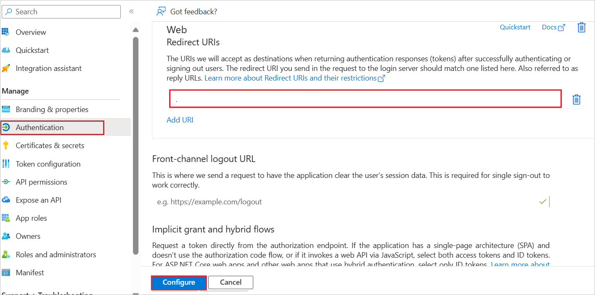

# Tutorial: Microsoft Entra single sign-on (SSO) integration with Continuity Software Platform

In this tutorial, you'll learn how to integrate Continuity Software Platform with Microsoft Entra ID. When you integrate Continuity Software Platform with Microsoft Entra ID, you can:

Use Microsoft Entra ID to control who can access Continuity Software Platform.
Enable your users to be automatically signed in to Continuity Software Platform with their Microsoft Entra accounts.
Manage your accounts in one central location: the Azure portal.

## Prerequisites

To get started, you need the following items:

* A Microsoft Entra subscription. If you don't have a subscription, you can get a [free account](https://azure.microsoft.com/free/).
* Continuity Software Platform single sign-on (SSO) enabled subscription.

## Add Continuity Software Platform from the gallery

To configure the integration of Continuity Software Platform into Microsoft Entra ID, you need to add Continuity Software Platform from the gallery to your list of managed SaaS apps.

1. Sign in to the [Microsoft Entra admin center](https://entra.microsoft.com) as at least a [Cloud Application Administrator](~/identity/role-based-access-control/permissions-reference.md#cloud-application-administrator).

1. Browse to **Identity > Applications > Enterprise applications > New application**.

1. In the **Add from the gallery** section, enter **Continuity Software Platform** in the search box.

1. Select **Continuity Software Platform** in the results panel and then add the app. Wait a few seconds while the app is added to your tenant.

## Configure Microsoft Entra SSO

Follow these steps to enable Microsoft Entra SSO in the Microsoft Entra admin center.

1. Sign in to the [Microsoft Entra admin center](https://entra.microsoft.com) as at least a [Cloud Application Administrator](~/identity/role-based-access-control/permissions-reference.md#cloud-application-administrator).

1. Browse to **Identity** > **Applications** > **Enterprise applications** > **Continuity Software Platform** > **Single sign-on**.

1. Perform the following steps in the below section:

    1. Click **Go to application**.

        

    1. Under **Endpoints**, copy **Application (client) ID** and **Directory (tenant) ID**. Use them later in the Continuity Software Platform side configuration.

1. Navigate to **Authentication** tab on the left menu and perform the following steps:

    1. In the **Redirect URIs** textbox, type a URL using the following pattern: `https://login.microsoftonline.com/<Tenant_ID>/oauth2`

        
       
    1. Click **Configure**.

    > [!NOTE]
    > The Redirect URI value is not real. Replace <Tenant_ID>  with actual tenant id value in the Redirect URI pattern.

1. Navigate to **Certificates & secrets** on the left menu and perform the following steps:

    1. Go to **Client secrets** tab and click **+New client secret**.
    1. Enter a valid **Description** in the textbox and select **Expires** days from the drop-down as per your requirement and click **Add**.

        

    1. Once you add a client secret, **Value** will be generated. Copy the value and use it later in the Continuity Software Platform side configuration.

        

### Create a Microsoft Entra test user

In this section, you'll create a test user called B.Simon.

1. Sign in to the [Microsoft Entra admin center](https://entra.microsoft.com) as at least a [User Administrator](~/identity/role-based-access-control/permissions-reference.md#user-administrator).
1. Browse to **Identity** > **Users** > **All users**.
1. Select **New user** > **Create new user**, at the top of the screen.
1. In the **User** properties, follow these steps:
   1. In the **Display name** field, enter `B.Simon`.  
   1. In the **User principal name** field, enter the username@companydomain.extension. For example, `B.Simon@contoso.com`.
   1. Select the **Show password** check box, and then write down the value that's displayed in the **Password** box.
   1. Select **Review + create**.
1. Select **Create**.

### Assign the Microsoft Entra test user

In this section, you'll enable B.Simon to use single sign-on by granting access to Continuity Software Platform.

1. Sign in to the [Microsoft Entra admin center](https://entra.microsoft.com) as at least a [Cloud Application Administrator](~/identity/role-based-access-control/permissions-reference.md#cloud-application-administrator).
1. Browse to **Identity** > **Applications** > **Enterprise applications** > **Continuity Software Platform**.
1. In the app's overview page, select **Users and groups**.
1. Select **Add user/group**, then select **Users and groups** in the **Add Assignment** dialog.
   1. In the **Users and groups** dialog, select **B.Simon** from the Users list, then click the **Select** button at the bottom of the screen.
   1. If you are expecting a role to be assigned to the users, you can select it from the **Select a role** dropdown. If no role has been set up for this app, you see "Default Access" role selected.
   1. In the **Add Assignment** dialog, click the **Assign** button.

## Configure Continuity Software Platform SSO

Below are the configuration steps to complete the OAuth/OIDC federation setup:

1. Sign into the Continuity Software Platform with admin account.

2. Click on **Admin** on the left bar of the **Settings** tab. Then select **Identity Providers** under **Access**.

3. Click **+**.

4. The **Add Identity provider** window is displayed.

    a. In the **Name** field, enter the name for identification.

    b. In the **Description** field, enter a valid description value.

    c. Select **Type** as Azure AD.

    d. In the **Client ID** field, paste the **Application ID** value, which you have copied from Entra page.

    e. In the **Client Secret** field, paste the value, which you have copied from **Certificates & secrets** section at Entra side.

    f. In the **Tenant** field, paste the **Tenant ID** value, which you have copied from Entra page.

