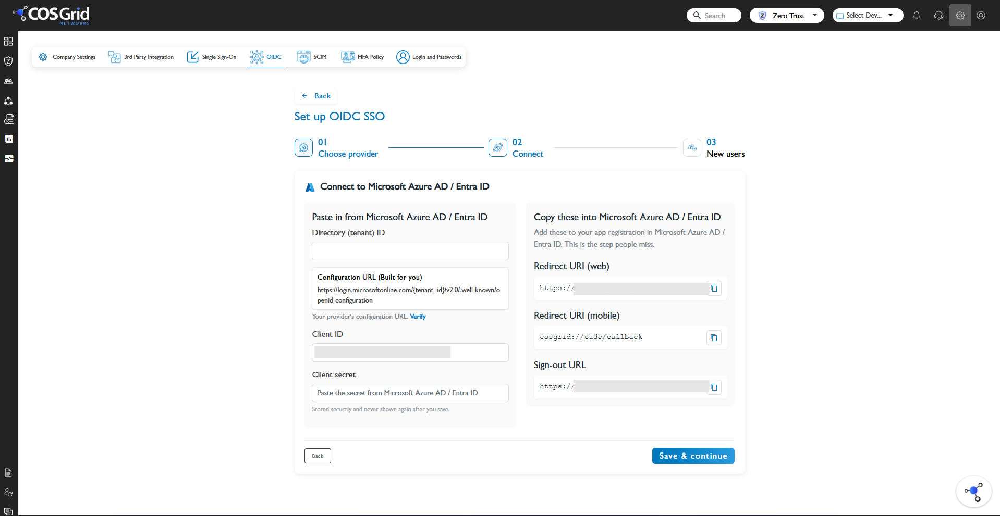

# Configure Cosgrid Networks for OIDC single sign-on with Microsoft Entra ID

This article describes how to configure OpenID Connect (OIDC) single sign-on between Cosgrid Networks and Microsoft Entra ID. The integration allows users to authenticate to Cosgrid Networks using their Microsoft Entra ID credentials.

This article covers:

- Create an application registration in Microsoft Entra ID
- Configure the OIDC redirect URIs
- Create a client secret
- Configure Microsoft Entra ID in Cosgrid Networks
- Configure user provisioning options
- Assign users
- Test OIDC single sign-on

## Prerequisites

To integrate Microsoft Entra ID with Cosgrid Networks, you need:

- A Microsoft Entra ID tenant.
- Permission to create an application registration in Microsoft Entra ID.
- A Cosgrid Networks tenant.
- Administrator access to Cosgrid Networks.
- A test user account in Microsoft Entra ID.

## Step 1: Create an application registration in Microsoft Entra ID

1. Sign in to the [Microsoft Entra admin center](https://entra.microsoft.com).
1. Browse to **Entra ID** > **App registrations**.
1. Select **New registration**.
1. Enter a name for the application, for example `Cosgrid Networks`.
1. Select the appropriate **Supported account types** for your organization.
1. Select **Register**.
1. After the application is created, open the application registration.
1. From the **Overview** page, copy the following values:
   - **Application (client) ID**
   - **Directory (tenant) ID**

You use these values when configuring OIDC in Cosgrid Networks.

## Step 2: Configure the redirect URI in Microsoft Entra ID

Cosgrid Networks provides the redirect URIs that must be configured in the Microsoft Entra application registration.

1. Sign in to your Cosgrid Networks administrator portal.
1. Navigate to **Single Sign-On**.
1. Select **OIDC**.
1. Select **Microsoft Azure AD / Entra ID**.
1. The OIDC configuration page displays the values that need to be configured in Microsoft Entra ID.

    

    The page includes:

    - **Redirect URI (web)**
    - **Redirect URI (mobile)**
    - **Sign-out URL**

1. In the Microsoft Entra application registration, select **Authentication**.
1. Add the **Redirect URI (web)** provided by Cosgrid Networks.
1. Select the appropriate platform for the web redirect URI.
1. If your deployment uses mobile OIDC authentication, add the **Redirect URI (mobile)** provided by Cosgrid Networks.
1. Save the authentication configuration.

> [!NOTE]
> Use the redirect URI values displayed by your Cosgrid Networks tenant. Don't use example or placeholder values from this article.

## Step 3: Create a client secret

Cosgrid Networks requires a client secret to authenticate the OIDC application.

1. In the Microsoft Entra application registration, select **Certificates & secrets**.
1. Select **Client secrets**.
1. Select **New client secret**.
1. Enter a description for the secret, for example `Cosgrid Networks OIDC`.
1. Select an appropriate expiration period.
1. Select **Add**.
1. Copy the **Value** of the client secret.

> [!NOTE]
> Copy the client secret value immediately after creating it. Microsoft Entra ID doesn't display the secret value again after you leave the page. Treat the client secret as a credential — don't include it in screenshots, documentation, source code, or support tickets.

## Step 4: Configure OIDC in Cosgrid Networks

1. Sign in to your Cosgrid Networks administrator portal.
1. Navigate to **Single Sign-On**.
1. Select **OIDC**.
1. Select **Microsoft Azure AD / Entra ID**.

The **Connect to Microsoft Azure AD / Entra ID** page is displayed, with two sections:

- **Paste in from Microsoft Azure AD / Entra ID** — values obtained from Microsoft Entra ID.
- **Copy these into Microsoft Azure AD / Entra ID** — values that must be configured in the Microsoft Entra application registration.

1. In **Directory (tenant) ID**, enter the Directory (tenant) ID copied from the Microsoft Entra application registration.
1. Review the **Configuration URL** displayed by Cosgrid Networks. This URL is generated for the Microsoft Entra ID tenant and is used to retrieve the provider's OIDC configuration.
1. In **Client ID**, enter the Application (client) ID from the Microsoft Entra application registration.
1. In **Client secret**, enter the client secret value created in Microsoft Entra ID.
1. Verify the redirect URI values displayed by Cosgrid Networks.
1. Verify the **Sign-out URL** provided by Cosgrid Networks.
1. Select **Save & continue**.

## Step 5: Configure the Microsoft Entra application

The OIDC configuration page in Cosgrid Networks provides values that must be added to the Microsoft Entra application.

| Cosgrid Networks value | Microsoft Entra ID configuration |
| ----- | ----- |
| Directory (tenant) ID | Directory (tenant) ID from the Microsoft Entra application |
| Client ID | Application (client) ID |
| Client secret | Client secret value |
| Redirect URI (web) | Microsoft Entra ID > Authentication > Web redirect URI |
| Redirect URI (mobile) | Microsoft Entra ID mobile redirect URI, if applicable |
| Sign-out URL | Configure according to the Cosgrid Networks OIDC configuration |

> [!NOTE]
> The exact URI values are tenant-specific. Always use the values displayed in your Cosgrid Networks OIDC configuration.

## Step 6: Configure OIDC user options

After the OIDC connection is configured, Cosgrid Networks provides options for handling users created through the identity provider. The OIDC setup flow displays **03 New users** after the connection is configured.

Configure the available user options according to your organization's requirements. Depending on the Cosgrid Networks configuration, these options can include:

- Auto-create users
- Auto-update users
- Activation
- Groups from IdP
- Default role

> [!NOTE]
> The exact options available may depend on the Cosgrid Networks tenant configuration.

## Step 7: Assign users in Microsoft Entra ID

Assign the users who should be allowed to authenticate through the Cosgrid Networks application.

1. Open the Microsoft Entra application registration or enterprise application used for Cosgrid Networks.
1. Navigate to **Users and groups**.
1. Select **Add user/group**.
1. Select the test user.
1. Assign the user to the application.

## Step 8: Test OIDC single sign-on

1. Open the Cosgrid Networks portal.
1. Start the OIDC sign-in process.
1. Select **Microsoft Azure AD / Entra ID**, if prompted.
1. Sign in using the assigned Microsoft Entra ID test account.
1. Complete any authentication or consent prompts displayed by Microsoft Entra ID.
1. Verify that Microsoft Entra ID redirects the user back to Cosgrid Networks.
1. Verify that the user is successfully signed in.
1. Verify that the user information is populated correctly.

If the test succeeds, OIDC single sign-on is configured.

## Troubleshooting

**Redirect URI error**: If Microsoft Entra ID reports a redirect URI mismatch:

1. Open the OIDC configuration in Cosgrid Networks.
1. Copy the exact Redirect URI (web).
1. Open the Microsoft Entra application registration.
1. Navigate to **Authentication**.
1. Verify that the redirect URI exactly matches the URI configured in Cosgrid Networks. Check for differences in protocol, domain, port, path, and trailing slash.

**Client authentication fails**: If Cosgrid Networks can't connect to Microsoft Entra ID, verify:

- **Directory (tenant) ID** is correct.
- **Client ID** is correct.
- **Client secret** is correct and hasn't expired.
- The correct Microsoft Entra application registration is being used.

If necessary, create a new client secret and update the value in Cosgrid Networks.

**User can't sign in**: Check that:

- The user is assigned to the Microsoft Entra application.
- The user is allowed to sign in to the application.
- The redirect URI is configured correctly.
- The OIDC configuration in Cosgrid Networks is saved.
- The Microsoft Entra application is active.

**User information isn't populated correctly**: Verify that the required user information is available in the OIDC identity information returned by Microsoft Entra ID, and verify the user provisioning options configured under **New users** in Cosgrid Networks.

## Next steps

- [Configure SAML single sign-on](cosgrid-networks-tutorial.md)
- [Configure automatic user provisioning with SCIM](cosgrid-networks-provisioning-tutorial.md)
