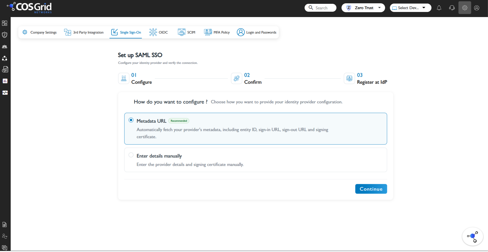
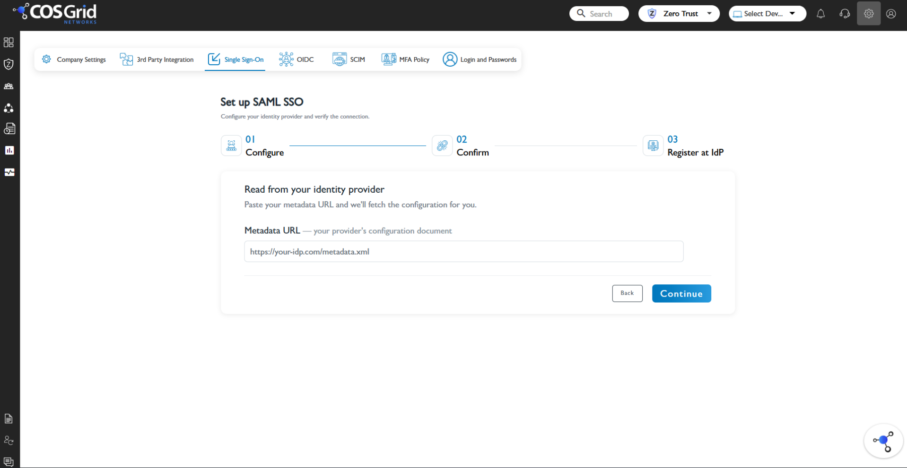

# Configure Cosgrid Networks for Single sign-on with Microsoft Entra ID

In this article, you learn how to configure single sign-on (SSO) between Cosgrid Networks and Microsoft Entra ID using Security Assertion Markup Language (SAML). The integration allows users to sign in to Cosgrid Networks using their Microsoft Entra ID credentials.

This article covers:

- Configure SAML SSO in Cosgrid Networks
- Configure Cosgrid Networks in Microsoft Entra ID
- Configure SAML claims
- Assign users to the application
- Test SSO

## Prerequisites

To integrate Microsoft Entra ID with Cosgrid Networks, you need:

- A Microsoft Entra ID tenant.
- One of the following roles: [Application Administrator](~/identity/role-based-access-control/permissions-reference.md#application-administrator), [Cloud Application Administrator](~/identity/role-based-access-control/permissions-reference.md#cloud-application-administrator), or [Application Owner](~/fundamentals/users-default-permissions.md#owned-enterprise-applications).
- A Cosgrid Networks tenant.
- Administrator access to Cosgrid Networks.
- A test user account in Microsoft Entra ID.

## Configure SAML SSO in Cosgrid Networks

1. Sign in to your Cosgrid Networks administrator portal.
1. Navigate to **Single Sign-On**.
1. Select **SAML**.
1. The **Set up SAML SSO** page is displayed.

    

    Cosgrid Networks provides two options for configuring the identity provider:

    - **Metadata URL**: Automatically retrieves the identity provider configuration, including the entity ID, sign-in URL, sign-out URL, and signing certificate.
    - **Enter details manually**: Allows you to enter the identity provider details and signing certificate manually.

    The **Metadata URL** option is recommended.

1. Select **Metadata URL**, then select **Continue**.
1. The **Read from your identity provider** page is displayed.

    

1. Enter the SAML metadata URL provided by Microsoft Entra ID in the **Metadata URL** field.
1. Select **Continue**.

Cosgrid Networks retrieves the identity provider configuration from the metadata URL. The metadata URL provides identity provider information such as:

- Entity ID
- Sign-in URL
- Sign-out URL
- Signing certificate

### Manual configuration

If you don't use a metadata URL, select **Enter details manually** on the SAML configuration page and enter the identity provider details provided by Microsoft Entra ID.

| Setting | Value |
| ----- | ----- |
| Entity ID | Microsoft Entra ID Entity ID |
| Sign-in URL | Microsoft Entra login URL |
| Sign-out URL | Microsoft Entra logout URL |
| Signing certificate | Microsoft Entra SAML certificate |

> [!NOTE]
> The exact fields displayed may depend on the configuration supported by the Cosgrid Networks tenant.

## Add Cosgrid Networks to Microsoft Entra ID

1. Sign in to the [Microsoft Entra admin center](https://entra.microsoft.com) as at least a [Cloud Application Administrator](~/identity/role-based-access-control/permissions-reference.md#cloud-application-administrator).
1. Browse to **Entra ID** > **Enterprise applications** > **New application**.
1. Search for **Cosgrid Networks**.
1. Select the **Cosgrid Networks** application and add it to your tenant.

If Cosgrid Networks is already configured in your tenant, open the existing enterprise application instead.

## Configure SAML

1. In the Cosgrid Networks enterprise application, select **Single sign-on**.
1. Select **SAML**.
1. In **Basic SAML Configuration**, enter the values provided by Cosgrid Networks.

    | Microsoft Entra setting | Value |
    | ----- | ----- |
    | Identifier (Entity ID) | `https://cosgridnetworks.in/api/v1/auth/acs/` |
    | Reply URL (ACS URL) | `https://cosgridnetworks.in/api/v1/auth/acs/` |
    | Sign-on URL | `https://cosgrid.net/auth/login` |

1. Save the configuration.
1. Under **SAML Certificates**, locate the certificate used to sign SAML responses.
1. Download or copy the certificate information required by Cosgrid Networks.

> [!NOTE]
> Use the exact values displayed by your Cosgrid Networks tenant. Don't use the placeholder values shown in this article.

## Configure user attributes

Configure the claims that Cosgrid Networks uses to identify users. For example:

| Claim | Source attribute |
| ----- | ----- |
| Email | `user.mail` |
| First name | `user.givenname` |
| Last name | `user.surname` |
| Username | `user.userprincipalname` |
| Groups | Microsoft Entra group attribute |

> [!NOTE]
> The exact claims and source attributes must match the attribute mappings supported and configured by Cosgrid Networks.

Save the claim configuration.

## Assign users

1. In the Cosgrid Networks enterprise application, select **Users and groups**.
1. Select **Add user/group**.
1. Select the test user.
1. Assign the user to the application.

Only users assigned to the enterprise application can access the application when user assignment is required.

## Test SSO

1. Sign in to the Cosgrid Networks portal.
1. Select the SSO option.
1. Sign in using the assigned Microsoft Entra ID account.
1. Complete the Microsoft Entra authentication process.
1. Verify that you're redirected to Cosgrid Networks.
1. Verify that the user is successfully signed in.
1. Verify that the user's attributes are populated correctly.

If the test succeeds, SAML SSO is configured.

## Troubleshooting

If SAML SSO doesn't work, verify the following:

**Metadata URL**: Make sure the metadata URL entered in Cosgrid Networks is correct and accessible.

**Entity ID**: Verify that the Identifier (Entity ID) configured in Microsoft Entra ID matches the service provider Entity ID expected by Cosgrid Networks.

**Reply URL**: Verify that the Reply URL (ACS URL) exactly matches the ACS URL provided by Cosgrid Networks.

**User assignment**: Verify that the test user is assigned to the Cosgrid Networks enterprise application.

**Claims**: Verify that the claims sent by Microsoft Entra ID match the attributes expected by Cosgrid Networks.

**Certificate**: Verify that the SAML signing certificate configured in Cosgrid Networks matches the certificate currently used by Microsoft Entra ID.

## Next steps

- [Configure OIDC single sign-on with Cosgrid Networks](cosgrid-networks-oidc-tutorial.md)
- [Configure automatic user provisioning with SCIM](cosgrid-networks-provisioning-tutorial.md)
