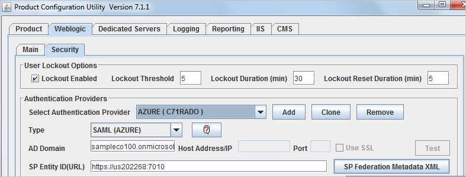
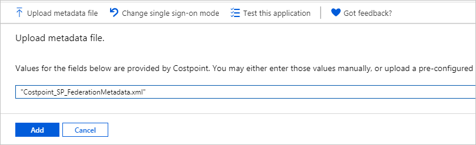
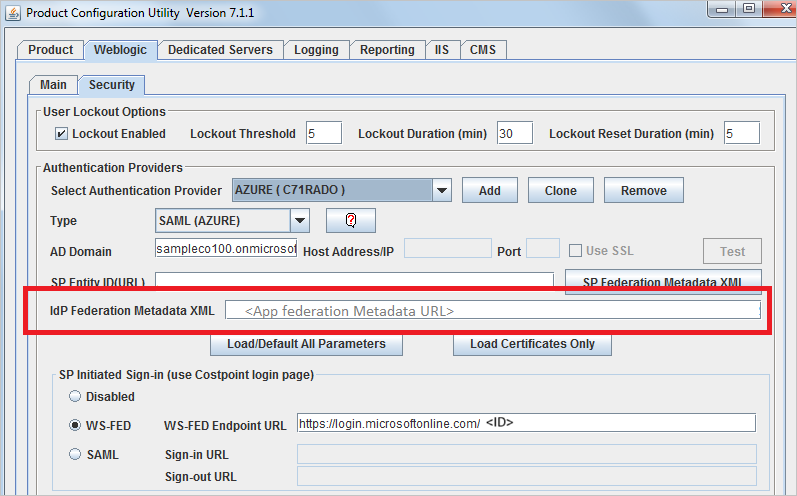

# Configure Costpoint for Single sign-on with Microsoft Entra ID

In this article,  you learn how to integrate Costpoint with Microsoft Entra ID. When you integrate Costpoint with Microsoft Entra ID, you can:

* Control in Microsoft Entra ID who has access to Costpoint.
* Enable your users to be automatically signed-in to Costpoint with their Microsoft Entra accounts.
* Manage your accounts in one central location.

## Prerequisites

The scenario outlined in this article assumes that you already have the following prerequisites:

[!INCLUDE [common-prerequisites.md](~/identity/saas-apps/includes/common-prerequisites.md)]
* Costpoint single sign-on (SSO) enabled subscription.

## Scenario description

In this article,  you configure and test Microsoft Entra SSO in a test environment. 

* Costpoint supports **SP and IDP** initiated SSO.

## Generate Costpoint metadata

Costpoint SAML SSO configuration is explained in the **DeltekCostpoint711Security.pdf** guide. Download this guide from the Deltek Costpoint support site and refer to the **SAML Single Sign-on Setup** > **Configure SAML Single Sign-on between Costpoint and Microsoft Azure** section. Follow the instructions and generate a **Costpoint SP Federation Metadata XML** file. 

## Add Costpoint from the gallery

To configure the integration of Costpoint into Microsoft Entra ID, you need to add Costpoint from the gallery to your list of managed SaaS apps.

1. Sign in to the [Microsoft Entra admin center](https://entra.microsoft.com) as at least a [Cloud Application Administrator](~/identity/role-based-access-control/permissions-reference.md#cloud-application-administrator).
1. Browse to **Entra ID** > **Enterprise apps** > **New application**.
1. In the **Add from the gallery** section, type **Costpoint** in the search box.
1. Select **Costpoint** from results panel and then add the app. Wait a few seconds while the app is added to your tenant.

 [!INCLUDE [sso-wizard.md](~/identity/saas-apps/includes/sso-wizard.md)]

## Configure and test Microsoft Entra SSO for Costpoint

Configure and test Microsoft Entra SSO with Costpoint using a test user called **B.Simon**. For SSO to work, you need to establish a link relationship between a Microsoft Entra user and the related user in Costpoint.

To configure and test Microsoft Entra SSO with Costpoint, perform the following steps:

1. **[Configure Microsoft Entra SSO](#configure-azure-ad-sso)** - to enable your users to use this feature.
    1. **Create a Microsoft Entra test user** - to test Microsoft Entra single sign-on with B.Simon.
    1. **Assign the Microsoft Entra test user** - to enable B.Simon to use Microsoft Entra single sign-on.
1. **[Configure Costpoint SSO](#configure-costpoint-sso)** - to configure the single sign-on settings on application side.
    1. **[Create Costpoint test user](#create-costpoint-test-user)** - to have a counterpart of B.Simon in Costpoint that's linked to the Microsoft Entra representation of user.
1. **[Test SSO](#test-sso)** - to verify whether the configuration works.

## Configure Microsoft Entra SSO

Follow these steps to enable Microsoft Entra SSO in the Azure portal:

1. On the **Costpoint** application integration page, select **Single sign-on**.

1. In the **Basic SAML Configuration** section, if you have the **Service Provider metadata file**, complete these steps:

   > [!NOTE]
   > You get the Service Provider metadata file in [Generate Costpoint metadata](#generate-costpoint-metadata). How to use the file is explained later in the article.
 
   1. Select the **Upload metadata file** button, then select the **Costpoint SP Federation Metadata XML** file previously generated by Costpoint, and then select the **Add** button to upload the file.

      
	
   1. When the metadata file is successfully uploaded, the **Identifier** and **Reply URL** values are auto populated in the Costpoint section.

      > [!NOTE]
      > If the **Identifier** and **Reply URL** values aren't auto populated, enter the values manually according to your requirement. Verify that **Identifier (Entity ID)** and **Reply URL (Assertion Consumer Service URL)** are correctly set, and that **ACS URL** is a valid Costpoint URL that ends with **/LoginServlet.cps**.

   1. Select **Set additional URLs**. For **Relay State**, enter a value using the following pattern:`system=[your system]` (for example, **system=DELTEKCP**).

1. On the **Set up Single Sign-On with SAML** page, in the **SAML Signing Certificate** section, select the **Copy** icon to copy the **App Federation Metadata Url** and save it to Notepad.

   

[!INCLUDE [create-assign-users-sso.md](~/identity/saas-apps/includes/create-assign-users-sso.md)]

## Configure Costpoint SSO

1. Return to Costpoint Configuration Utility. In the **IdP Federation Metadata XML** text box, paste the contents of the *App Federation Metadata Url* file. 

   

1. Continue the instructions from the **DeltekCostpoint711Security.pdf** guide to finish the Costpoint SAML setup.

### Create Costpoint test user

In this section, you create a user in Costpoint. Assume the user ID is **B.SIMON** and the user's name is **B.Simon**. Work with the [Costpoint Client support team](https://www.deltek.com/about/contact-us) to add the user in the Costpoint platform. The user must be created and activated before they can use single sign-on.

After the user is created, the user's **Authentication Method** selection should be **Active Directory**, the **SAML Single Sign-on** check box should be selected, and the user name from Microsoft Entra ID should be **Active Directory or Certificate ID**.

## Test SSO

In this section, you test your Microsoft Entra single sign-on configuration with following options. 

#### SP initiated:

* Select **Test this application**, this option redirects to Costpoint Sign on URL where you can initiate the login flow.  

* Go to Costpoint Sign-on URL directly and initiate the login flow from there.

#### IDP initiated:

* Select **Test this application**, and you should be automatically signed in to the Costpoint for which you set up the SSO. 

You can also use Microsoft My Apps to test the application in any mode. When you select the Costpoint tile in the My Apps, if configured in SP mode you would be redirected to the application sign on page for initiating the login flow and if configured in IDP mode, you should be automatically signed in to the Costpoint for which you set up the SSO. For more information about the My Apps, see [Introduction to the My Apps](https://support.microsoft.com/account-billing/sign-in-and-start-apps-from-the-my-apps-portal-2f3b1bae-0e5a-4a86-a33e-876fbd2a4510).

## Related content

Once you configure Costpoint you can enforce session control, which protects exfiltration and infiltration of your organization’s sensitive data in real time. Session control extends from Conditional Access. [Learn how to enforce session control with Microsoft Defender for Cloud Apps](/cloud-app-security/proxy-deployment-any-app).
