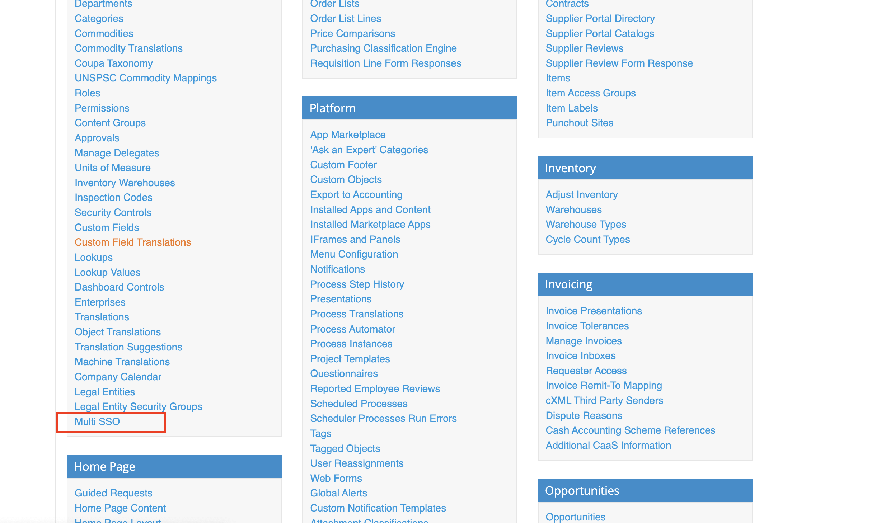
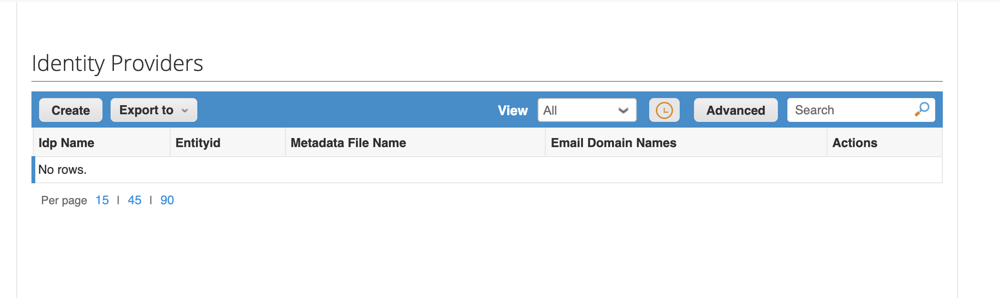
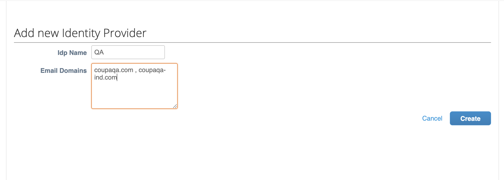
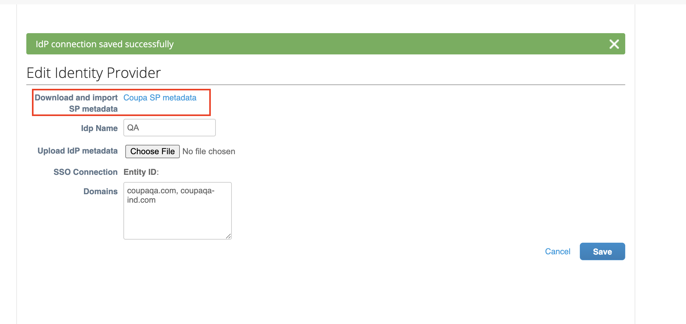
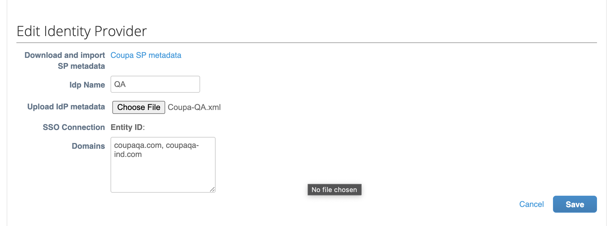
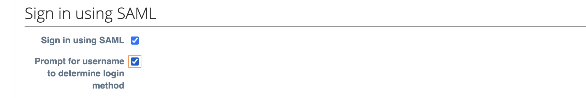
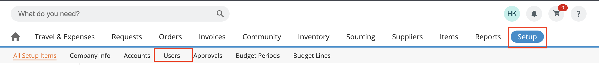
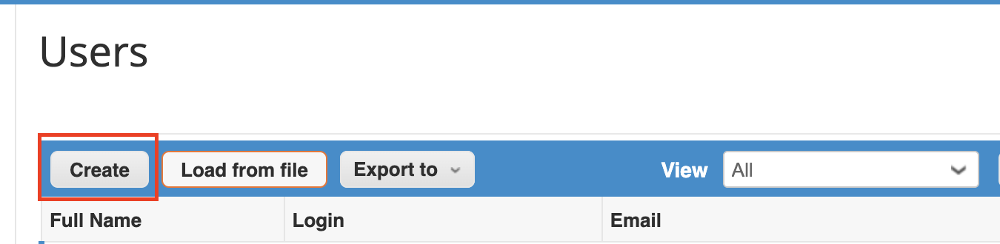
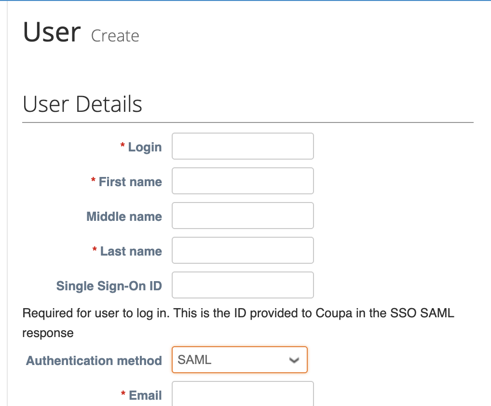

# Configure multiple IdP connections on Coupa for Single sign-on with Microsoft Entra ID

In this article,  you learn how to integrate multiple IdP connections on Coupa with Microsoft Entra ID. When you integrate Coupa with Microsoft Entra ID, you can:

* Control in Microsoft Entra ID who has access to Coupa.
* Enable your users to be automatically signed-in to Coupa with their Microsoft Entra accounts.
* Manage your accounts in one central location.

## Prerequisites

This article's presumes that you have the following prerequisites already in place:

[!INCLUDE [common-prerequisites.md](~/identity/saas-apps/includes/common-prerequisites.md)]
* Coupa single sign-on (SSO) enabled subscription.
* Single sign-on (SSO) is configured for you instance. [coupa-sso-tutorial.md](./coupa-sso-tutorial.md)
* Coupa Multi sign-on (SSO) enabled subscription.

## Scenario description

This article outlines step to configure and test Coupa with Microsoft Entra single sign-on in a test environment.

* Coupa supports **SP initiated SSO** and **IdP initiated SSO**.

## Download Coupa SP Metadata
1. Sign on to your Coupa company site as an administrator.
2. Go to Setup > **Multi SSO**.

3. Select **Create**.
4. Enter **IdP Name** and **Email Domains**. These email domains will be used to redirect the users the IdP for SSO login. Multiple Email domains can be specified as comma-seperated.

5. Select **Create**. Which will take you to edit page. 
6. Download the **Coupa SP metadata** for the IdP.

## Add Coupa from the gallery

To configure the integration of Coupa into Microsoft Entra ID, you need to add Coupa from the gallery to your list of managed SaaS apps.

1. Sign in to the [Microsoft Entra admin center](https://entra.microsoft.com) as at least a [Cloud Application Administrator](~/identity/role-based-access-control/permissions-reference.md#cloud-application-administrator).
1. Browse to **Entra ID** > **Enterprise apps** > **New application**.
1. In the **Add from the gallery** section, type **Coupa** in the search box.
1. Select **Coupa** from results panel and then add the app. Wait a few seconds while the app is added to your tenant.

 [!INCLUDE [sso-wizard.md](./includes/sso-wizard.md)]

## Configure and test Microsoft Entra SSO for Coupa

Configure and test Microsoft Entra SSO with Coupa using a test user called **B.Simon**. For SSO to work, you need to establish a link relationship between a Microsoft Entra user and the related user in Coupa.

To configure and test Microsoft Entra SSO with Coupa, perform the following steps:

1. **[Configure Microsoft Entra SSO](#configure-azure-ad-sso)** - to enable your users to use this feature.
    1. **Create a Microsoft Entra test user** - to test Microsoft Entra single sign-on with B.Simon.
    1. **Assign the Microsoft Entra test user** - to enable B.Simon to use Microsoft Entra single sign-on.
1. **[Configure Coupa SSO](#configure-coupa-sso)** - to configure the single sign-on settings on application side.
    1. **[Create Coupa test user](#create-coupa-test-user)** - to have a counterpart of B.Simon inCoupa that's linked to the Microsoft Entra representation of user.
1. **[Test SSO](#download-coupa-sp-metadata)** - to verify whether the configuration works.

## Configure Microsoft Entra SSO

Follow these steps to enable Microsoft Entra SSO.

1. Sign in to the [Microsoft Entra admin center](https://entra.microsoft.com) as at least a [Cloud Application Administrator](/docs/identity/role-based-access-control/permissions-reference.md#cloud-application-administrator).
1. Browse to **Entra ID** > **Enterprise apps** > **Coupa** > **Single sign-on**.
1. On the **Select a single sign-on method** page, select **SAML**.
1. On the **Set up single sign-on with SAML** page, select the pencil icon for **Basic SAML Configuration** to edit the settings.

   

1. On the **Basic SAML Configuration** section, perform the following steps:

    a. In the **Sign-on URL** text box, type a URL using the following pattern:
    `https://<companyname>.coupahost.com`

> [!NOTE]
> The Sign-on URL value isn't real. Update this value with the actual Sign-On URL from Coupa SP Metadata downloaded in **[Download Coupa SP  Metadata](#download-coupa-sp-metadata)** above. Contact [Coupa Client support team](https://compass.coupa.com/en-us/support) to get this value.

    b. In the **Identifier** box, type the URL:

    | Environment  | URL |
    |:-------------|----|
    | Sandbox | `https://identity-stg0.io.coupahost.com/realms/<ID>`|
    | Production | `https://identity-prd0.io.coupahost.com/realms/<ID>`|
    | | |

    c. In the **Reply URL** text box, type the URL:

    | Environment | URL |
    |------------- |----|
    | Sandbox | `https://identity-stg0.io.coupahost.com/realms/<ID>/broker/<IdP Name>/endpoint`|
    | Production | `https://identity-prd0.io.coupahost.com/realms/<ID>/broker/<IdP Name>/endpoint`|
    | | |

4. On the **Set up Single Sign-On with SAML** page, in the **SAML Signing Certificate** section, select **Download** to download the **Federation Metadata XML** from the given options as per your requirement and save it on your computer.

    

[!INCLUDE [create-assign-users-sso.md](~/identity/saas-apps/includes/create-assign-users-sso.md)]

## Configure Coupa SSO for respective IdP

1. In Coupa Company site, Goto the edit page of the IdP created in the step **[Download Coupa SP  Metadata](#download-coupa-sp-metadata)** above.
2. Upload the IdP Metadata downloaded above in **[Configure Microsoft Entra SSO](#configure-microsoft-entra-sso)**. Select **Save**.

     

3. Go to **Setup** > **Security**.

4. Enable **Prompt for username to determine login method** in Sign in using SAML. Select **Save**.

     
     

### Create Coupa test user

In order to enable Microsoft Entra users to log into Coupa, they must be provisioned into Coupa.  

* In the case of Coupa, provisioning is a manual task.

**To configure user provisioning, perform the following steps:**

1. Log in to your **Coupa** company site as administrator.

2. In the menu on the top, select **Setup**, and then select **Users**.

    

3. Select **Create**.

    

4. In the **User Create** section, perform the following steps:

    

    a. Type the **Login**, **First name**, **Last Name**, **Single Sign-On ID**, **Email** attributes of a valid Microsoft Entra account you want to provision into the related textboxes.

    b. Select **Create**.

>[!NOTE]
>The Microsoft Entra account holder gets an email with a link to confirm the account before it becomes active.
    

>[!NOTE]
>You can use any other Coupa user account creation tools or APIs provided by Coupa to provision Microsoft Entra user accounts.

## Test SSO

In this section, you test your Microsoft Entra single sign-on configuration with following options. 

* Select **Test this application**, this option redirects to Coupa Sign-on URL where you can initiate the login flow. 

* Go to Coupa Sign-on URL directly and initiate the login flow from there.

* You can use Microsoft My Apps. When you select the Coupa tile in the My Apps, you should be automatically signed in to the Coupa for which you set up the SSO. For more information about the My Apps, see [Introduction to the My Apps](https://support.microsoft.com/account-billing/sign-in-and-start-apps-from-the-my-apps-portal-2f3b1bae-0e5a-4a86-a33e-876fbd2a4510).

**Once these steps are complete, you can follow same steps to create multiple connections.**