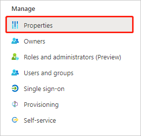
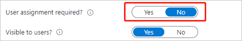

# Configure Datadog for Single sign-on with Microsoft Entra ID

In this article,  you learn how to integrate Datadog with Microsoft Entra ID. When you integrate Datadog with Microsoft Entra ID, you can:

* Control in Microsoft Entra ID who has access to Datadog.
* Enable your users to be automatically signed-in to Datadog with their Microsoft Entra accounts.
* Manage your accounts in one central location.

## Prerequisites

The scenario outlined in this article assumes that you already have the following prerequisites:

[!INCLUDE [common-prerequisites.md](~/identity/saas-apps/includes/common-prerequisites.md)]
* Datadog single sign-on (SSO) enabled subscription.

## Scenario description

In this article,  you configure and test Microsoft Entra SSO in a test environment.

* Datadog supports **SP and IDP** initiated SSO.
* Datadog supports [Automated user provisioning](datadog-provisioning-tutorial.md).

## Add Datadog from the gallery

To configure the integration of Datadog into Microsoft Entra ID, you need to add Datadog from the gallery to your list of managed SaaS apps.

1. Sign in to the [Microsoft Entra admin center](https://entra.microsoft.com) as at least a [Cloud Application Administrator](~/identity/role-based-access-control/permissions-reference.md#cloud-application-administrator).
1. Browse to **Entra ID** > **Enterprise apps** > **New application**.
1. In the **Add from the gallery** section, type **Datadog** in the search box.
1. Select **Datadog** from results panel and then add the app. Wait a few seconds while the app is added to your tenant.

 [!INCLUDE [sso-wizard.md](~/identity/saas-apps/includes/sso-wizard.md)]

## Configure and test Microsoft Entra SSO for Datadog

Configure and test Microsoft Entra SSO with Datadog using a test user called **B.Simon**. For SSO to work, you need to establish a link relationship between a Microsoft Entra user and the related user in Datadog.

To configure and test Microsoft Entra SSO with Datadog, perform the following steps:

1. **[Configure Microsoft Entra SSO](#configure-azure-ad-sso)** - to enable your users to use this feature.
    1. **Create a Microsoft Entra test user** - to test Microsoft Entra single sign-on with B.Simon.
    1. **Assign the Microsoft Entra test user** - to enable B.Simon to use Microsoft Entra single sign-on.
1. **[Configure Datadog SSO](#configure-datadog-sso)** - to configure the single sign-on settings on application side.
    1. Create Datadog test user - to have a counterpart of B.Simon in Datadog that's linked to the Microsoft Entra representation of user.
1. **[Test SSO](#test-sso)** - to verify whether the configuration works.

## Configure Microsoft Entra SSO

Follow these steps to enable Microsoft Entra SSO.

1. Sign in to the [Microsoft Entra admin center](https://entra.microsoft.com) as at least a [Cloud Application Administrator](~/identity/role-based-access-control/permissions-reference.md#cloud-application-administrator).
1. Browse to **Entra ID** > **Enterprise apps** > **Datadog** application integration page, find the **Manage** section and select **single sign-on**.

1. On the **Set up single sign-on with SAML** page, select the pencil icon for **Basic SAML Configuration** to edit the settings.

1. In the **Basic SAML Configuration** section, the user doesn't take any action because the application is pre-integrated with Azure.

1. Select **Set additional URLs** and perform the following step if you want to configure the application in **SP** initiated mode:

    In the **Sign-on URL** text box, type a URL using the following pattern:
    `https://app.datadoghq.com/account/login/id/<CUSTOM_IDENTIFIER>`

    > [!NOTE]
    > The value isn't real. Update the value with the actual Sign-on URL in your [Datadog SAML settings](https://app.datadoghq.com/organization-settings/login-methods/saml). You can also refer to the patterns shown in the **Basic SAML Configuration** section. Using IdP initiated login and SP initiated login together requires both version of the ACS URL configured in Azure.

1. Select **Save**.

1. On the **Set up Single Sign-On with SAML** page under **User Attributes & Claims**, select the pencil icon to edit the settings.

1. Select the **Add a group claim** button. By default in Microsoft Entra ID, the group claim name is a URL. For example,  `http://schemas.microsoft.com/ws/2008/06/identity/claims/groups`). If you want to change this to a display name value like **groups**, select **Advanced options**, and then change  the name of the group claim to **groups**.

   > [!NOTE]
   > The source attribute is set to `Group ID`. This is the UUID of the group in Microsoft Entra ID. This means that the group ID is sent by Microsoft Entra ID as a group claim attribute value, not as the group name. You need to change mappings in Datadog to map to the group ID instead of to the group name. For more information, see [Datadog SAML mappings](https://docs.datadoghq.com/account_management/saml/#mapping-saml-attributes-to-datadog-roles).

1. On the **Set up single sign-on with SAML** page, in the **SAML Signing Certificate** section, find **Federation Metadata XML** and select **Download** to download the certificate and save it on your computer.

1. In the **Set up Datadog** section, copy the appropriate URL(s) based on your requirement.

[!INCLUDE [create-assign-users-sso.md](~/identity/saas-apps/includes/create-assign-users-sso.md)]

## Configure Datadog SSO

To configure single sign-on on the **Datadog** side, you need to upload the downloaded **Federation Metadata XML** in the [Datadog SAML settings](https://app.datadoghq.com/organization-settings/login-methods/saml).

## Test SSO 

Test your Microsoft Entra single sign-on configuration with following options. 

#### SP initiated:

* Select **Test this application**, this option redirects to Datadog Sign on URL where you can initiate the login flow.  

* Go to the Datadog Sign-on URL directly and initiate the login flow from there.

#### IDP initiated:

* Select **Test this application**, and you should be automatically signed in to the Datadog for which you set up the SSO. 

You can also use Microsoft My Apps to test the application in any mode. When you select the Datadog tile in the My Apps portal, if configured in SP mode you would be redirected to the application sign on page for initiating the login flow and if configured in IDP mode, you should be automatically signed in to the Datadog for which you set up the SSO. For more information about My Apps, see [Introduction to the My Apps portal](https://support.microsoft.com/account-billing/sign-in-and-start-apps-from-the-my-apps-portal-2f3b1bae-0e5a-4a86-a33e-876fbd2a4510).

### Enable all users from your tenant to authenticate with the app

In this section, you enable everyone within your tenant to access Datadog if one user has an account on the Datadog side.

1. Sign in to the [Microsoft Entra admin center](https://entra.microsoft.com) as at least a [Cloud Application Administrator](~/identity/role-based-access-control/permissions-reference.md#cloud-application-administrator).
1. Browse to **Entra ID** > **Enterprise apps** > **Datadog**.
1. On the app's overview page, under **Manage**, select **Properties**.

    

1. For **User assignment required?**, select **No**.

    

1. Select **Save**.

## Related content

Once you configure Datadog you can enforce session control, which protects exfiltration and infiltration of your organization’s sensitive data in real time. Session control extends from Conditional Access. [Learn how to enforce session control with Microsoft Defender for Cloud Apps](/cloud-app-security/proxy-deployment-any-app).
