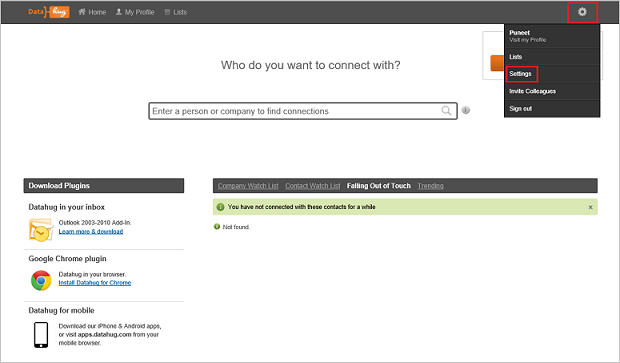
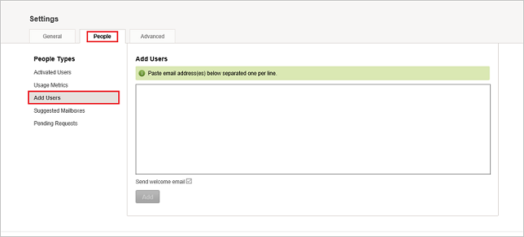
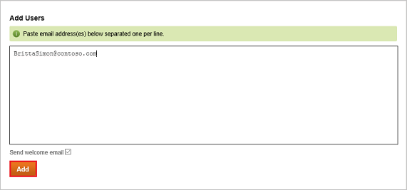

# Configure Datahug for Single sign-on with Microsoft Entra ID

In this article,  you learn how to integrate Datahug with Microsoft Entra ID. When you integrate Datahug with Microsoft Entra ID, you can:

* Control in Microsoft Entra ID who has access to Datahug.
* Enable your users to be automatically signed-in to Datahug with their Microsoft Entra accounts.
* Manage your accounts in one central location.

## Prerequisites

The scenario outlined in this article assumes that you already have the following prerequisites:

[!INCLUDE [common-prerequisites.md](~/identity/saas-apps/includes/common-prerequisites.md)]
* Datahug single sign-on (SSO) enabled subscription.

## Scenario description

In this article,  you configure and test Microsoft Entra single sign-on in a test environment.

* Datahug supports **SP** and **IDP** initiated SSO.

## Add Datahug from the gallery

To configure the integration of Datahug into Microsoft Entra ID, you need to add Datahug from the gallery to your list of managed SaaS apps.

1. Sign in to the [Microsoft Entra admin center](https://entra.microsoft.com) as at least a [Cloud Application Administrator](~/identity/role-based-access-control/permissions-reference.md#cloud-application-administrator).
1. Browse to **Entra ID** > **Enterprise apps** > **New application**.
1. In the **Add from the gallery** section, type **Datahug** in the search box.
1. Select **Datahug** from results panel and then add the app. Wait a few seconds while the app is added to your tenant.

 [!INCLUDE [sso-wizard.md](~/identity/saas-apps/includes/sso-wizard.md)]

## Configure and test Microsoft Entra SSO for Datahug

Configure and test Microsoft Entra SSO with Datahug using a test user called **B.Simon**. For SSO to work, you need to establish a link relationship between a Microsoft Entra user and the related user in Datahug.

To configure and test Microsoft Entra SSO with Datahug, perform the following steps:

1. **[Configure Microsoft Entra SSO](#configure-azure-ad-sso)** - to enable your users to use this feature.
    1. **Create a Microsoft Entra test user** - to test Microsoft Entra single sign-on with B.Simon.
    1. **Assign the Microsoft Entra test user** - to enable B.Simon to use Microsoft Entra single sign-on.
1. **[Configure Datahug SSO](#configure-datahug-sso)** - to configure the single sign-on settings on application side.
    1. **[Create Datahug test user](#create-datahug-test-user)** - to have a counterpart of B.Simon in Datahug that's linked to the Microsoft Entra representation of user.
1. **[Test SSO](#test-sso)** - to verify whether the configuration works.

## Configure Microsoft Entra SSO

Follow these steps to enable Microsoft Entra SSO.

1. Sign in to the [Microsoft Entra admin center](https://entra.microsoft.com) as at least a [Cloud Application Administrator](~/identity/role-based-access-control/permissions-reference.md#cloud-application-administrator).
1. Browse to **Entra ID** > **Enterprise apps** > **Datahug** > **Single sign-on**.
1. On the **Select a single sign-on method** page, select **SAML**.
1. On the **Set up single sign-on with SAML** page, select the pencil icon for **Basic SAML Configuration** to edit the settings.

   

1. On the **Basic SAML Configuration** section, If you wish to configure the application in **IDP** initiated mode, perform the following steps:

    a. In the **Identifier** text box, type a URL using the following pattern:
    `https://apps.datahug.com/identity/<uniqueID>`

    b. In the **Reply URL** text box, type a URL using the following pattern:
    `https://apps.datahug.com/identity/<uniqueID>/acs`

1. Select **Set additional URLs** and perform the following step if you wish to configure the application in **SP** initiated mode:

    In the **Sign-on URL** text box, type the URL:
    `https://apps.datahug.com/`

	> [!NOTE]
	> These values aren't real. Update these values with the actual Identifier and Reply URL. Contact [Datahug Client support team](https://www.sap.com/corporate/en/company/office-locations.html) to get these values. You can also refer to the patterns shown in the **Basic SAML Configuration** section.

1. On the **Set-up Single Sign-On with SAML** page, in the **SAML Signing Certificate** section, select **Download** to download the **Federation Metadata XML** from the given options as per your requirement and save it on your computer.

	

1. In the **SAML Signing Certificate** section, select **Edit** button to open **SAML Signing Certificate** dialog and perform the following steps.

	

	a. Select **Sign SAML assertion** from the **Signing Option**.

	b. Select **SHA-1** from the **Signing Algorithm**.
	
	c. Select **Save**.

1. On the **Set up Datahug** section, copy the appropriate URL(s) as per your requirement.

	

[!INCLUDE [create-assign-users-sso.md](~/identity/saas-apps/includes/create-assign-users-sso.md)]

## Configure Datahug SSO

To configure single sign-on on **Datahug** side, you need to send the downloaded **Federation Metadata XML** and appropriate copied URLs from the application configuration to [Datahug support team](https://www.sap.com/corporate/en/company/office-locations.html). They set this setting to have the SAML SSO connection set properly on both sides.

### Create Datahug test user

To enable Microsoft Entra users to sign in to Datahug, they must be provisioned into Datahug.  
When Datahug, provisioning is a manual task.

**To provision a user account, perform the following steps:**

1. Sign in to your Datahug company site as an administrator.

2. Hover over the **cog** in the top right-hand corner and select **Settings**.
   
	

3. Choose **People** and select the **Add Users** tab.

	

4. Type the email of the person you would like to create an account for and select **Add**.

	

    > [!NOTE] 
	> You can send registration mail to user by selecting **Send welcome email** checkbox.	
	> If you're creating an account for Salesforce don't send the welcome email.

## Test SSO

In this section, you test your Microsoft Entra single sign-on configuration with following options. 

#### SP initiated:

* Select **Test this application**, this option redirects to Datahug Sign on URL where you can initiate the login flow.  

* Go to Datahug Sign-on URL directly and initiate the login flow from there.

#### IDP initiated:

* Select **Test this application**, and you should be automatically signed in to the Datahug for which you set up the SSO. 

You can also use Microsoft My Apps to test the application in any mode. When you select the Datahug tile in the My Apps, if configured in SP mode you would be redirected to the application sign on page for initiating the login flow and if configured in IDP mode, you should be automatically signed in to the Datahug for which you set up the SSO. For more information about the My Apps, see [Introduction to the My Apps](https://support.microsoft.com/account-billing/sign-in-and-start-apps-from-the-my-apps-portal-2f3b1bae-0e5a-4a86-a33e-876fbd2a4510).

## Related content

Once you configure Datahug you can enforce session control, which protects exfiltration and infiltration of your organization’s sensitive data in real time. Session control extends from Conditional Access. [Learn how to enforce session control with Microsoft Defender for Cloud Apps](/cloud-app-security/proxy-deployment-aad).
