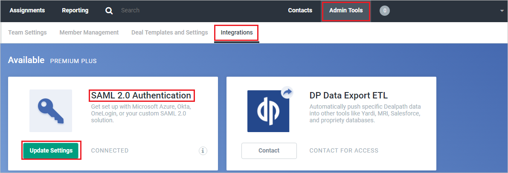
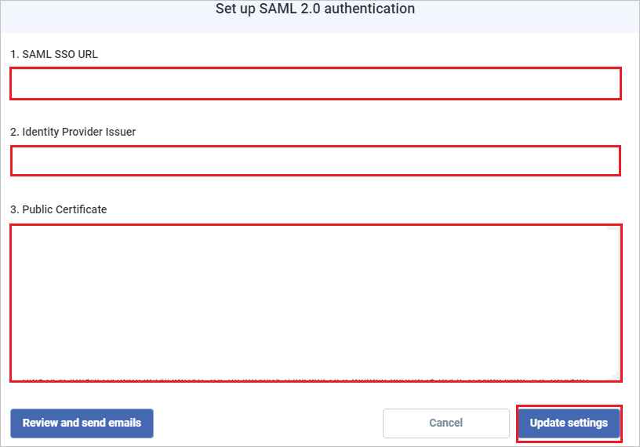

# Configure Dealpath for Single sign-on with Microsoft Entra ID

In this article,  you learn how to integrate Dealpath with Microsoft Entra ID. When you integrate Dealpath with Microsoft Entra ID, you can:

* Control in Microsoft Entra ID who has access to Dealpath.
* Enable your users to be automatically signed-in to Dealpath with their Microsoft Entra accounts.
* Manage your accounts in one central location.

## Prerequisites

The scenario outlined in this article assumes that you already have the following prerequisites:

[!INCLUDE [common-prerequisites.md](~/identity/saas-apps/includes/common-prerequisites.md)]
* Dealpath single sign-on (SSO) enabled subscription.

## Scenario description

In this article,  you configure and test Microsoft Entra single sign-on in a test environment.

* Dealpath supports **SP** initiated SSO.

## Add Dealpath from the gallery

To configure the integration of Dealpath into Microsoft Entra ID, you need to add Dealpath from the gallery to your list of managed SaaS apps.

1. Sign in to the [Microsoft Entra admin center](https://entra.microsoft.com) as at least a [Cloud Application Administrator](~/identity/role-based-access-control/permissions-reference.md#cloud-application-administrator).
1. Browse to **Entra ID** > **Enterprise apps** > **New application**.
1. In the **Add from the gallery** section, type **Dealpath** in the search box.
1. Select **Dealpath** from results panel and then add the app. Wait a few seconds while the app is added to your tenant.

 [!INCLUDE [sso-wizard.md](~/identity/saas-apps/includes/sso-wizard.md)]

## Configure and test Microsoft Entra SSO for Dealpath

Configure and test Microsoft Entra SSO with Dealpath using a test user called **B.Simon**. For SSO to work, you need to establish a link relationship between a Microsoft Entra user and the related user in Dealpath.

To configure and test Microsoft Entra SSO with Dealpath, perform the following steps:

1. **[Configure Microsoft Entra SSO](#configure-azure-ad-sso)** - to enable your users to use this feature.
    1. **Create a Microsoft Entra test user** - to test Microsoft Entra single sign-on with B.Simon.
    1. **Assign the Microsoft Entra test user** - to enable B.Simon to use Microsoft Entra single sign-on.
1. **[Configure Dealpath SSO](#configure-dealpath-sso)** - to configure the single sign-on settings on application side.
    1. **[Create Dealpath test user](#create-dealpath-test-user)** - to have a counterpart of B.Simon in Dealpath that's linked to the Microsoft Entra representation of user.
1. **[Test SSO](#test-sso)** - to verify whether the configuration works.

## Configure Microsoft Entra SSO

Follow these steps to enable Microsoft Entra SSO.

1. Sign in to the [Microsoft Entra admin center](https://entra.microsoft.com) as at least a [Cloud Application Administrator](~/identity/role-based-access-control/permissions-reference.md#cloud-application-administrator).
1. Browse to **Entra ID** > **Enterprise apps** > **Dealpath** > **Single sign-on**.
1. On the **Select a single sign-on method** page, select **SAML**.
1. On the **Set up single sign-on with SAML** page, select the pencil icon for **Basic SAML Configuration** to edit the settings.

   

1. On the **Basic SAML Configuration** section, perform the following steps:

	a. In the **Sign on URL** text box, type the URL:
    `https://app.dealpath.com/account/login`

    b. In the **Identifier (Entity ID)** text box, type a URL using the following pattern:
    `https://api.dealpath.com/saml/metadata/<ID>`

	> [!NOTE]
	> The Identifier value isn't real. Update the value with the actual Identifier. Contact [Dealpath Client support team](mailto:kenter@dealpath.com) to get these values. You can also refer to the patterns shown in the **Basic SAML Configuration** section.

1. On the **Set-up Single Sign-On with SAML** page, in the **SAML Signing Certificate** section, select **Download** to download the **Certificate (Base64)** from the given options as per your requirement and save it on your computer.

	

1. On the **Set up Dealpath** section, copy the appropriate URL(s) as per your requirement.

	

[!INCLUDE [create-assign-users-sso.md](~/identity/saas-apps/includes/create-assign-users-sso.md)]

## Configure Dealpath SSO

1. In a different web browser window, sign in to Dealpath as an Administrator.

2. In the top right, select **Admin Tools** and navigate to **Integrations**, then in **SAML 2.0 Authentication** section select **Update Settings**:

	

3. In the **Set up SAML 2.0 authentication** page, perform the following steps:

	 

	a. In the **SAML SSO URL** textbox, paste the value of **Login URL**.

	b. In the **Identity Provider Issuer** textbox, paste the value of **Microsoft Entra Identifier**, ..

	c. Copy the content of the downloaded **certificate(Base64)** file in notepad, and then paste it into the **Public Certificate** textbox.

	d. Select **Update settings**.

### Create Dealpath test user

In this section, you create a user called Britta Simon in Dealpath. Work with [Dealpath Client support team](mailto:kenter@dealpath.com) to add the users in the Dealpath platform. Users must be created and activated before you use single sign-on

## Test SSO 

In this section, you test your Microsoft Entra single sign-on configuration with following options. 

* Select **Test this application**, this option redirects to Dealpath Sign-on URL where you can initiate the login flow. 

* Go to Dealpath Sign-on URL directly and initiate the login flow from there.

* You can use Microsoft My Apps. When you select the Dealpath tile in the My Apps, this option redirects to Dealpath Sign-on URL. For more information, see [Microsoft Entra My Apps](/azure/active-directory/manage-apps/end-user-experiences#azure-ad-my-apps).

## Related content

Once you configure Dealpath you can enforce session control, which protects exfiltration and infiltration of your organization’s sensitive data in real time. Session control extends from Conditional Access. [Learn how to enforce session control with Microsoft Defender for Cloud Apps](/cloud-app-security/proxy-deployment-aad).
