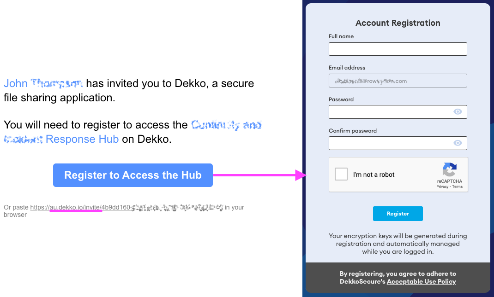
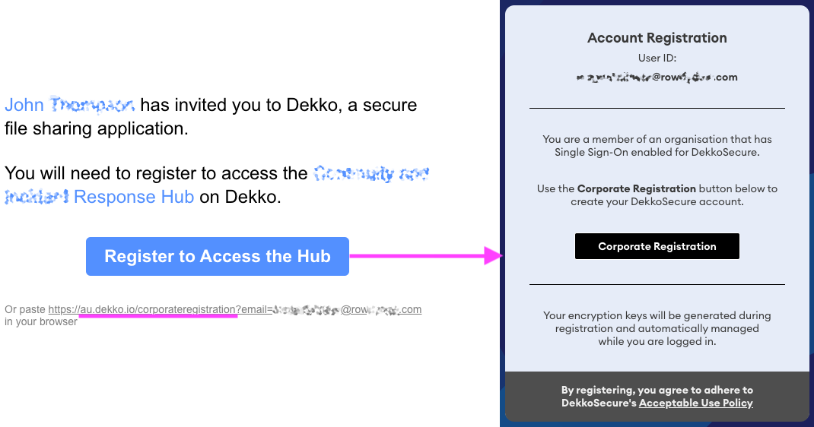

# Entra ID / Azure Active Directory Integration

Published: Yes
Suggested: No

💡 **Tip:** See also: [FAQ for SSO/Azure AD/Entra ID](https://help.dekkosecure.com/onboarding/neLDFwWz7SpDeVu65uBTbc/faq-for-ssoazure-ad/wcS7SYb411QFDkoSpz6ma7)

## Introduction

DekkoSecure natively supports Azure Active Directory/Entra ID integration for SSO. Custom integrations with alternative SSO services such as Okta are supported on a per-engagement basis. Please contact us for more information.

Critically, SSO integration is for authentication only. Access to content such as files and organisational governance is managed by the DekkoSecure application (via [sharing permission](https://help.dekkosecure.com/collaboration-requests-and-signing/2MPjiL8hQXtHCrCbLcZigq) and [Tenancy controls](https://help.dekkosecure.com/organisation-management/rbXt8jt5HAgHbNz8FYp1a9/tenancy-and-hub-roles/vdAyeUtuTXABuKcBB9P5kB)).

Users that authenticate using SSO are able to interact with SSO and non-SSO user respectively. If you start your DekkoSecure engagement without SSO, existing users can be [automatically migrated to SSO](https://help.dekkosecure.com/managing-your-account/jPq7opALsSsYrzVN8Uz3oS/migrate-your-account-to-single-sign-on/dkiSAZ9E71cANmrNCh1mBz) later after integration is complete. Migrated users’ files, contacts and Hub membership(s) will be retained.

Deleting an SSO user will delete their files, avoiding malicious account takeover.

💡 **Tip:** SSO integration is preferred to satisfy compliance requirements such as IRAP and your organisation’s internal “zero trust” security policies for logging and monitoring (such as [Sentinel](https://help.dekkosecure.com/organisation-management/rbXt8jt5HAgHbNz8FYp1a9/microsoft-sentinel-integration/wAdtY9fCGRRWeLDnAX8Kbw)).

## Integration steps

DekkoSecure is added to your Entra ID as an enterprise/third party application. Integration is done via a permissions request link which we will prepare and send to your administrative team following the receipt of your AAD tenant ID.

A formalised testing procedure covering auto-provisioning, account migration and account recreation for deleted accounts will follow.

Please [contact](https://www.dekkosecure.com/contact-us) DekkoSecure for more information.

## Enforcing SSO registration

After SSO integration is complete you are able to nominate your SSO domain(s) with DekkoSecure to enforce SSO registration for your internal users. After nomination, your new internal users (e.g., individuals that do not have a DekkoSecure account) will receive an invite containing a *corporate* account creation link instead of a *standard* account creation link. SSO domain registration nomination is imperative If you want to prevent your internal users from registering a *standard* account. Your externals will continue to receive *standard* invites.

💡 **Tip:** If you already have a group of users who have standard accounts which need to be migrated to SSO, they can follow [these steps](https://help.dekkosecure.com/managing-your-account/jPq7opALsSsYrzVN8Uz3oS/migrate-your-account-to-single-sign-on/dkiSAZ9E71cANmrNCh1mBz).

**Standard account registration example:**

New users that receive invites where their domain is not nominated for SSO registration enforcement will be led to the *standard* account creation page. This is noted by the ***dekko.io/invite*** URL in the invite.

**Corporate account registration example:**

New users that receive invites where their domain is nominated for SSO registration enforcement will be led to the *corporate* account creation page. This is noted by the ***dekko.io/corporateregistration*** URL in the invite.

## Group Access Controls

There are multiple options for granting personnel access to register and log in to DekkoSecure with elevated authentication controls, as described in the Microsoft documentation resource [here](https://docs.microsoft.com/en-us/azure/active-directory/fundamentals/active-directory-manage-groups).

Access to a resource (DekkoSecure) can be assigned on an individual basis, to all users in an AD, or users in a group. **DekkoSecure recommends the group option**, as this provides the most precise control. Steps for creating a group are [here](https://learn.microsoft.com/azure/active-directory/fundamentals/active-directory-groups-create-azure-portal).

If your organisation has already established user groups and wants to grant DekkoSecure access to a subset of those users, groups can be created within groups by following [these steps](https://learn.microsoft.com/azure/active-directory/fundamentals/active-directory-groups-membership-azure-portal). Finally, to grant DekkoSecure application access to the group, follow [these steps](https://learn.microsoft.com/azure/active-directory/users-groups-roles/groups-saasapps).

Optionally [Conditional Access](https://learn.microsoft.com/azure/active-directory/conditional-access/overview) controls can be set up to limit where/when/how a user can access DekkoSecure, for example, within the organisation’s network, only during business hours, or with a strict authentication type.

## Existing **Account Migration**

If your organisation started using DekkoSecure with ‘Standard’ logins for users, their accounts will be [automatically migrated the next time they log in](https://help.dekkosecure.com/managing-your-account/jPq7opALsSsYrzVN8Uz3oS/migrate-your-account-to-single-sign-on/dkiSAZ9E71cANmrNCh1mBz) using SSO **after** integration is complete.

For example if a ‘Standard’ DekkoSecure log in, ‘[john@company.com](mailto:john@company.com)’ exists and an SSO integration is established, the next time this user authenticates using the SSO account ‘[john@company.com](mailto:john@company.com)’, all data such as Hubs, files, messages, contacts and meetings will be retained. The only difference will be the way the user is authenticated in to DekkoSecure. The ‘Standard’ DekkoSecure log in for this user will also no longer be accessible.

Users external to an SSO-integrated organisation do not need to be in a common Entra ID to internals - any mix of users from different organisations with different authentication methods can interact freely on DekkoSecure.
