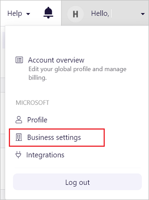
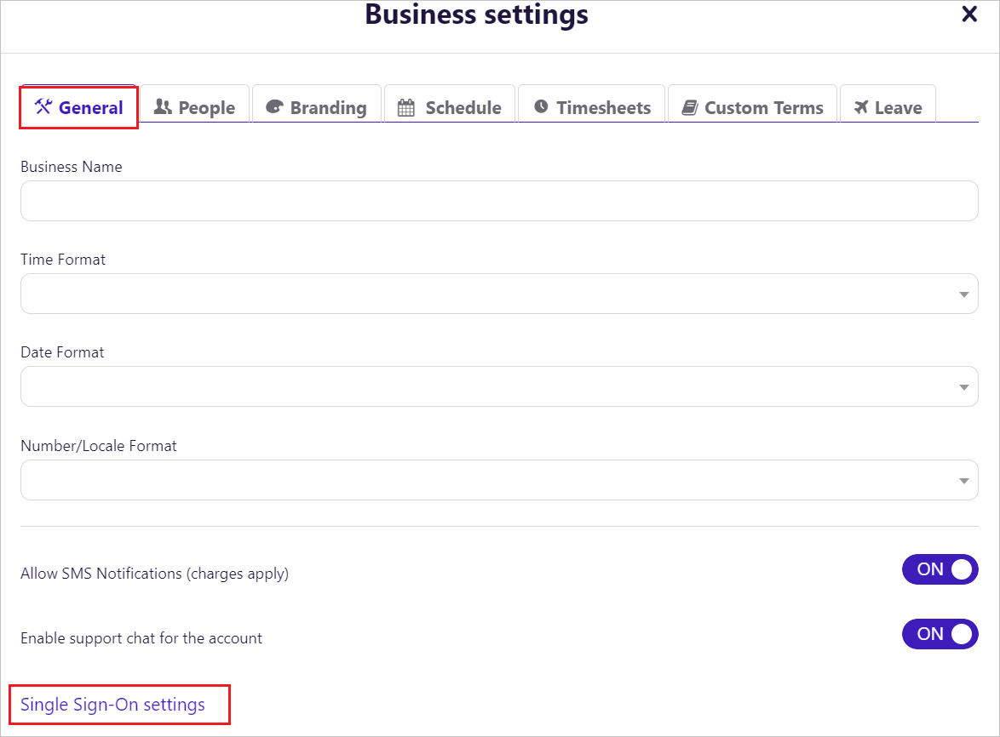
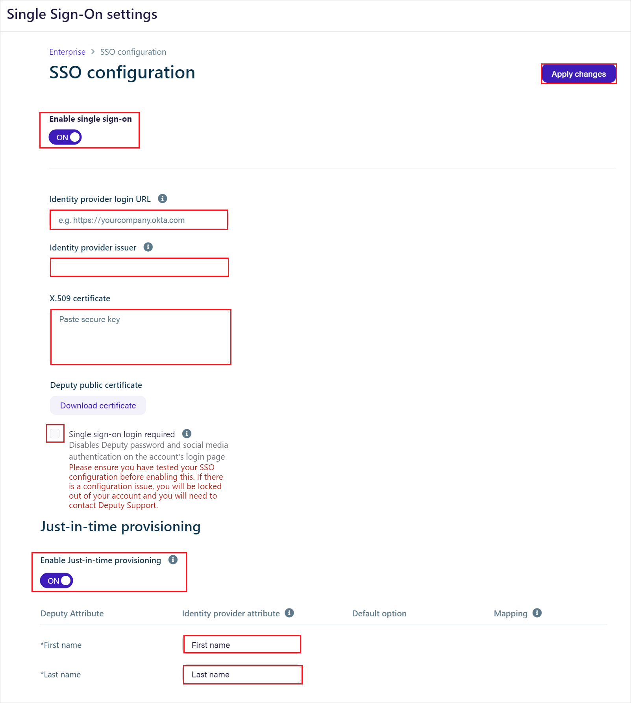
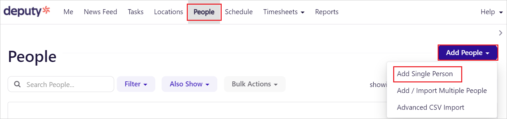
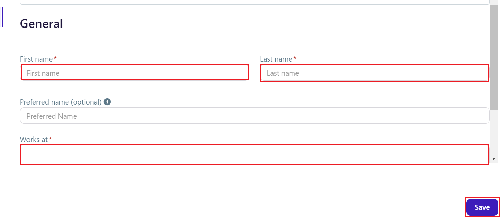

# Configure Deputy for Single sign-on with Microsoft Entra ID

In this article,  you learn how to integrate Deputy with Microsoft Entra ID. When you integrate Deputy with Microsoft Entra ID, you can:

* Control in Microsoft Entra ID who has access to Deputy.
* Enable your users to be automatically signed-in to Deputy with their Microsoft Entra accounts.
* Manage your accounts in one central location.

## Prerequisites

The scenario outlined in this article assumes that you already have the following prerequisites:

[!INCLUDE [common-prerequisites.md](~/identity/saas-apps/includes/common-prerequisites.md)]
* Deputy single sign-on (SSO) enabled subscription.

## Scenario description

In this article,  you configure and test Microsoft Entra SSO in a test environment.

* Deputy supports **SP and IDP** initiated SSO.
* Deputy supports **Just In Time** user provisioning.

## Add Deputy from the gallery

To configure the integration of Deputy into Microsoft Entra ID, you need to add Deputy from the gallery to your list of managed SaaS apps.

1. Sign in to the [Microsoft Entra admin center](https://entra.microsoft.com) as at least a [Cloud Application Administrator](~/identity/role-based-access-control/permissions-reference.md#cloud-application-administrator).
1. Browse to **Entra ID** > **Enterprise apps** > **New application**.
1. In the **Add from the gallery** section, type **Deputy** in the search box.
1. Select **Deputy** from results panel and then add the app. Wait a few seconds while the app is added to your tenant.

 [!INCLUDE [sso-wizard.md](~/identity/saas-apps/includes/sso-wizard.md)]

<a name='configure-and-test-azure-ad-sso-for-deputy'></a>

## Configure and test Microsoft Entra SSO for Deputy

Configure and test Microsoft Entra SSO with Deputy using a test user called **B.Simon**. For SSO to work, you need to establish a link relationship between a Microsoft Entra user and the related user in Deputy.

To configure and test Microsoft Entra SSO with Deputy, perform the following steps:

1. **[Configure Microsoft Entra SSO](#configure-azure-ad-sso)** - to enable your users to use this feature.
    1. **Create a Microsoft Entra test user** - to test Microsoft Entra single sign-on with B.Simon.
    1. **Assign the Microsoft Entra test user** - to enable B.Simon to use Microsoft Entra single sign-on.
1. **[Configure Deputy SSO](#configure-deputy-sso)** - to configure the single sign-on settings on application side.
    1. **[Create Deputy test user](#create-deputy-test-user)** - to have a counterpart of B.Simon in Deputy that's linked to the Microsoft Entra representation of user.
1. **[Test SSO](#test-sso)** - to verify whether the configuration works.

<a name='configure-azure-ad-sso'></a>

## Configure Microsoft Entra SSO

Follow these steps to enable Microsoft Entra SSO.

1. Sign in to the [Microsoft Entra admin center](https://entra.microsoft.com) as at least a [Cloud Application Administrator](~/identity/role-based-access-control/permissions-reference.md#cloud-application-administrator).
1. Browse to **Entra ID** > **Enterprise apps** > **Deputy** > **Single sign-on**.
1. On the **Select a single sign-on method** page, select **SAML**.
1. On the **Set up single sign-on with SAML** page, select the pencil icon for **Basic SAML Configuration** to edit the settings.

   

1. On the **Basic SAML Configuration** section, If you wish to configure the application in **IDP** initiated mode, perform the following steps:

    a. In the **Identifier** text box, type a URL using one of the following patterns:

    ```http
    https://<subdomain>.<region>.au.deputy.com
    https://<subdomain>.<region>.ent-au.deputy.com
    https://<subdomain>.<region>.na.deputy.com
    https://<subdomain>.<region>.ent-na.deputy.com
    https://<subdomain>.<region>.eu.deputy.com
    https://<subdomain>.<region>.ent-eu.deputy.com
    https://<subdomain>.<region>.as.deputy.com
    https://<subdomain>.<region>.ent-as.deputy.com
    https://<subdomain>.<region>.la.deputy.com
    https://<subdomain>.<region>.ent-la.deputy.com
    https://<subdomain>.<region>.af.deputy.com
    https://<subdomain>.<region>.ent-af.deputy.com
    https://<subdomain>.<region>.an.deputy.com
    https://<subdomain>.<region>.ent-an.deputy.com
    https://<subdomain>.<region>.deputy.com
    ```

    b. In the **Reply URL** text box, type a URL using one of the following patterns:
	
    ```http
    https://<subdomain>.<region>.au.deputy.com/exec/devapp/samlacs
    https://<subdomain>.<region>.ent-au.deputy.com/exec/devapp/samlacs
    https://<subdomain>.<region>.na.deputy.com/exec/devapp/samlacs
    https://<subdomain>.<region>.ent-na.deputy.com/exec/devapp/samlacs
    https://<subdomain>.<region>.eu.deputy.com/exec/devapp/samlacs
    https://<subdomain>.<region>.ent-eu.deputy.com/exec/devapp/samlacs
    https://<subdomain>.<region>.as.deputy.com/exec/devapp/samlacs.
    https://<subdomain>.<region>.ent-as.deputy.com/exec/devapp/samlacs
    https://<subdomain>.<region>.la.deputy.com/exec/devapp/samlacs
    https://<subdomain>.<region>.ent-la.deputy.com/exec/devapp/samlacs
    https://<subdomain>.<region>.af.deputy.com/exec/devapp/samlacs
    https://<subdomain>.<region>.ent-af.deputy.com/exec/devapp/samlacs
    https://<subdomain>.<region>.an.deputy.com/exec/devapp/samlacs
    https://<subdomain>.<region>.ent-an.deputy.com/exec/devapp/samlacs
    https://<subdomain>.<region>.deputy.com/exec/devapp/samlacs
    ```

5. Select **Set additional URLs** and perform the following step if you wish to configure the application in **SP** initiated mode:

    In the **Sign-on URL** text box, type a URL using the following pattern:
    `https://<your-subdomain>.<region>.deputy.com`

	>[!NOTE]
    > Deputy region suffix is optional, or it should use one of these: 
    > au | na | eu |as |la |af |an |ent-au |ent-na |ent-eu |ent-as | ent-la | ent-af | ent-an

	> [!NOTE]
	> These values aren't real. Update these values with the actual Identifier, Reply URL and Sign-on URL. Contact [Deputy Client support team](https://www.deputy.com/call-centers-customer-support-scheduling-software) to get these values. You can also refer to the patterns shown in the **Basic SAML Configuration** section.

1. Deputy application expects the SAML assertions in a specific format, which requires you to add custom attribute mappings to your SAML token attributes configuration. The following screenshot shows the list of default attributes.

	

1. In addition to above, Deputy application expects few more attributes to be passed back in SAML response, which are shown below. These attributes are also pre populated but you can review them as per your requirements.
	
	| Name |  Source Attribute|
	| -------------- | --------- |
	| First name | user.givenname|
	| Last name | user.surname |

6. On the **Set up Single Sign-On with SAML** page, in the **SAML Signing Certificate** section, select **Download** to download the **Certificate (Base64)** from the given options as per your requirement and save it on your computer.

	

7. On the **Set up Deputy** section, copy the appropriate URL(s) as per your requirement.

	

<a name='create-an-azure-ad-test-user'></a>

[!INCLUDE [create-assign-users-sso.md](~/identity/saas-apps/includes/create-assign-users-sso.md)]

## Configure Deputy SSO

1. Login to your Deputy account as an administrator.

1. In the upper right corner, select your account, select **Business settings**.

    

1. Then under the **General** tab, select **Single Sign-On settings**.

    

2. On this **Single Sign-On settings** page, perform the below steps.

	
	
	a. Select **Enable single sign-on**.
   
    b. In the **Identity provider login URL** textbox, paste the **Login URL** which you copied previously.

    c. In the **Identity provider issuer** textbox, paste the **Identifier(Entity ID)** which you copied previously.

    d. Open the downloaded **Certificate (Base64)** into Notepad and paste the content into the **X.509 certificate** textbox.

    e. Enable the **Single sign-on login required**, if you want to login with SSO.
   
    f. Enable the **Just-in-time provisioning** and in the **First name** and **Last name** fields, give the names of the attributes you have set up in **User Attributes & Claims** section, like `First name` and `Last name`.

    g. Select **Apply changes**.

### Create Deputy test user

In this section, a user called Britta Simon is created in Deputy. Deputy supports just-in-time user provisioning, which is enabled by default. There's no action item for you in this section. If a user doesn't already exist in Deputy, a new one is created after authentication.

#### To add the user manually, perform the following steps:

1. Log in to your Deputy company site as an administrator.

2. On the top navigation pane, select **People**.

3. Select the **Add People** button and select **Add Single Person**.
   
	

4. Perform the following steps in the **General** tab to add a user.
   
	

	a. In the **First name** and **Last name** textboxes, fill the fields like **Britta** and **Simon**.
   
	b. In the **Work at** textbox, type the business name.
   
	c. Select **Save** button.

## Test SSO 

In this section, you test your Microsoft Entra single sign-on configuration with following options. 

#### SP initiated:

* Select **Test this application**, this option redirects to TeamzSkill Sign on URL where you can initiate the login flow.  

* Go to TeamzSkill Sign-on URL directly and initiate the login flow from there.

#### IDP initiated:

* Select **Test this application**, and you should be automatically signed in to the TeamzSkill for which you set up the SSO 

You can also use Microsoft My Apps to test the application in any mode. When you select the TeamzSkill tile in the My Apps, if configured in SP mode you would be redirected to the application sign on page for initiating the login flow and if configured in IDP mode, you should be automatically signed in to the TeamzSkill for which you set up the SSO. For more information about the My Apps, see [Introduction to the My Apps](https://support.microsoft.com/account-billing/sign-in-and-start-apps-from-the-my-apps-portal-2f3b1bae-0e5a-4a86-a33e-876fbd2a4510).


## Related content

Once you configure Deputy you can enforce session control, which protects exfiltration and infiltration of your organization’s sensitive data in real time. Session control extends from Conditional Access. [Learn how to enforce session control with Microsoft Defender for Cloud Apps](/cloud-app-security/proxy-deployment-any-app).
