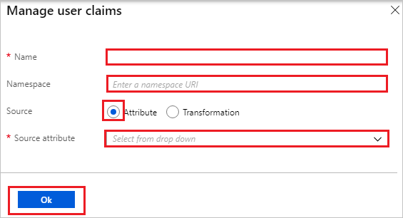

# Configure DigiCert for Single sign-on with Microsoft Entra ID

In this article,  you learn how to integrate DigiCert with Microsoft Entra ID. When you integrate DigiCert with Microsoft Entra ID, you can:

* Control in Microsoft Entra ID who has access to DigiCert.
* Enable your users to be automatically signed-in to DigiCert with their Microsoft Entra accounts.
* Manage your accounts in one central location.

## Prerequisites

The scenario outlined in this article assumes that you already have the following prerequisites:

[!INCLUDE [common-prerequisites.md](~/identity/saas-apps/includes/common-prerequisites.md)]
* DigiCert single sign-on (SSO) enabled subscription.

## Scenario description

In this article,  you configure and test Microsoft Entra single sign-on in a test environment.

* DigiCert supports **IDP** initiated SSO.

> [!NOTE]
> Identifier of this application is a fixed string value so only one instance can be configured in one tenant.

## Add DigiCert from the gallery

To configure the integration of DigiCert into Microsoft Entra ID, you need to add DigiCert from the gallery to your list of managed SaaS apps.

1. Sign in to the [Microsoft Entra admin center](https://entra.microsoft.com) as at least a [Cloud Application Administrator](~/identity/role-based-access-control/permissions-reference.md#cloud-application-administrator).
1. Browse to **Entra ID** > **Enterprise apps** > **New application**.
1. In the **Add from the gallery** section, type **DigiCert** in the search box.
1. Select **DigiCert** from results panel and then add the app. Wait a few seconds while the app is added to your tenant.

 [!INCLUDE [sso-wizard.md](~/identity/saas-apps/includes/sso-wizard.md)]

## Configure and test Microsoft Entra SSO for DigiCert

Configure and test Microsoft Entra SSO with DigiCert using a test user called **B.Simon**. For SSO to work, you need to establish a link relationship between a Microsoft Entra user and the related user in DigiCert.

To configure and test Microsoft Entra SSO with DigiCert, perform the following steps:

1. **[Configure Microsoft Entra SSO](#configure-azure-ad-sso)** - to enable your users to use this feature.
    1. **Create a Microsoft Entra test user** - to test Microsoft Entra single sign-on with B.Simon.
    1. **Assign the Microsoft Entra test user** - to enable B.Simon to use Microsoft Entra single sign-on.
1. **[Configure DigiCert SSO](#configure-digicert-sso)** - to configure the single sign-on settings on application side.
    1. **[Create DigiCert test user](#create-digicert-test-user)** - to have a counterpart of B.Simon in DigiCert that's linked to the Microsoft Entra representation of user.
1. **[Test SSO](#test-sso)** - to verify whether the configuration works.

## Configure Microsoft Entra SSO

Follow these steps to enable Microsoft Entra SSO.

1. Sign in to the [Microsoft Entra admin center](https://entra.microsoft.com) as at least a [Cloud Application Administrator](~/identity/role-based-access-control/permissions-reference.md#cloud-application-administrator).
1. Browse to **Entra ID** > **Enterprise apps** > **DigiCert** > **Single sign-on**.
1. On the **Select a single sign-on method** page, select **SAML**.
1. On the **Set up single sign-on with SAML** page, select the pencil icon for **Basic SAML Configuration** to edit the settings.

   

1. On the **Basic SAML Configuration** section, perform the following steps:

    a. In the **Identifier** text box, type the URL:
    `https://www.digicert.com/account/sso/metadata`

    b. In the **Reply URL** text box, type the URL:
    `https://www.digicert.com/account/sso/`

    c. In the **Sign on URL** text box, type a URL using the following pattern:
    `https://www.digicert.com/account/sso/<FEDERATION_NAME>/login`

	> [!NOTE]
    > The Sign-on URL value isn't real. Update this value with the actual Sign-on URL. Contact [DigiCert support team](mailto:support@digicert.com) to get the value. You can also refer to the patterns shown in the **Basic SAML Configuration** section.

5. DigiCert application expects the SAML assertions in a specific format. Configure the following claims for this application. You can manage the values of these attributes from the **User Attributes** section on application integration page. On the **Set up Single Sign-On with SAML** page, select **Edit** button to open **User Attributes** dialog.

	

6. In the **User Claims** section on the **User Attributes** dialog, edit the claims by using **Edit icon** or add the claims by using **Add new claim** to configure SAML token attribute as shown in the image above and perform the following steps: 

	| Name |  Source Attribute|
	| ---------------| --------------- |
	| nameidentifier | user.userprincipalname |
	| company | < companycode > |
	| digicertrole | CanAccessCertCentral |

    > [!Note]
	> The value of **company** attribute isn't real. Update this value with actual company code. To get the value of **company** attribute contact [DigiCert support team](mailto:support@digicert.com).

	a. Select **Add new claim** to open the **Manage user claims** dialog.

	

	

	b. In the **Name** textbox, type the attribute name shown for that row.

	c. Leave the **Namespace** blank.

	d. Select Source as **Attribute**.

	e. From the **Source attribute** list, type the attribute value shown for that row.

	f. Select **Ok**

	g. Select **Save**.

7. On the **Set up Single Sign-On with SAML** page, in the **SAML Signing Certificate** section, select **Download** to download the **Federation Metadata XML** from the given options as per your requirement and save it on your computer.

	

8. On the **Set up DigiCert** section, copy the appropriate URL(s) as per your requirement.

	

[!INCLUDE [create-assign-users-sso.md](~/identity/saas-apps/includes/create-assign-users-sso.md)]

## Configure DigiCert SSO

To configure single sign-on on **DigiCert** side, you need to send the downloaded **Federation Metadata XML** and appropriate copied URLs from the application configuration to [DigiCert support team](mailto:support@digicert.com). They set this setting to have the SAML SSO connection set properly on both sides.

### Create DigiCert test user

In this section, you create a user called Britta Simon in DigiCert. Work with [DigiCert support team](mailto:support@digicert.com) to add the users in the DigiCert platform. Users must be created and activated before you use single sign-on.

## Test SSO

In this section, you test your Microsoft Entra single sign-on configuration with following options.

* Select **Test this application**, and you should be automatically signed in to the DigiCert for which you set up the SSO.

* You can use Microsoft My Apps. When you select the DigiCert tile in the My Apps, you should be automatically signed in to the DigiCert for which you set up the SSO. For more information about the My Apps, see [Introduction to the My Apps](https://support.microsoft.com/account-billing/sign-in-and-start-apps-from-the-my-apps-portal-2f3b1bae-0e5a-4a86-a33e-876fbd2a4510).

## Related content

Once you configure DigiCert you can enforce session control, which protects exfiltration and infiltration of your organization’s sensitive data in real time. Session control extends from Conditional Access. [Learn how to enforce session control with Microsoft Defender for Cloud Apps](/cloud-app-security/proxy-deployment-any-app).
