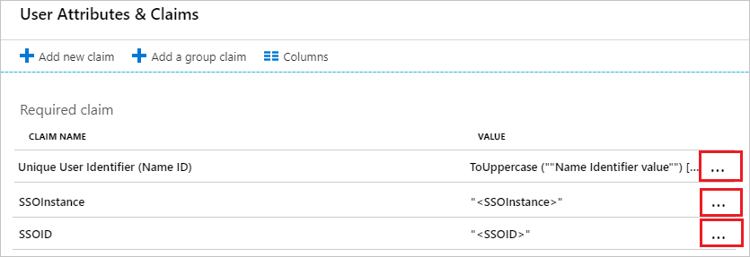
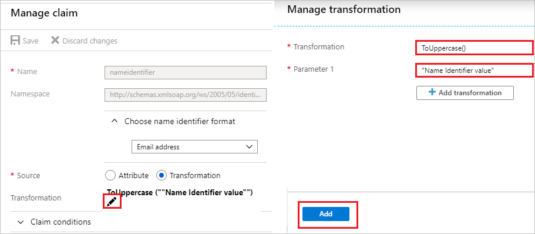
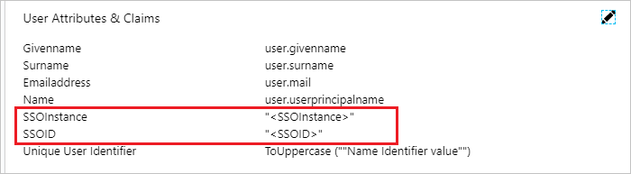

# Configure Discovery Benefits SSO for Single sign-on with Microsoft Entra ID

In this article,  you learn how to integrate Discovery Benefits SSO with Microsoft Entra ID. When you integrate Discovery Benefits SSO with Microsoft Entra ID, you can:

* Control in Microsoft Entra ID who has access to Discovery Benefits SSO.
* Enable your users to be automatically signed-in to Discovery Benefits SSO with their Microsoft Entra accounts.
* Manage your accounts in one central location.

## Prerequisites

The scenario outlined in this article assumes that you already have the following prerequisites:

[!INCLUDE [common-prerequisites.md](~/identity/saas-apps/includes/common-prerequisites.md)]
* Discovery Benefits SSO single sign-on (SSO) enabled subscription.

## Scenario description

In this article,  you configure and test Microsoft Entra SSO in a test environment.

* Discovery Benefits SSO supports **IDP** initiated SSO.

> [!NOTE]
> Identifier of this application is a fixed string value so only one instance can be configured in one tenant.

## Add Discovery Benefits SSO from the gallery

To configure the integration of Discovery Benefits SSO into Microsoft Entra ID, you need to add Discovery Benefits SSO from the gallery to your list of managed SaaS apps.

1. Sign in to the [Microsoft Entra admin center](https://entra.microsoft.com) as at least a [Cloud Application Administrator](~/identity/role-based-access-control/permissions-reference.md#cloud-application-administrator).
1. Browse to **Entra ID** > **Enterprise apps** > **New application**.
1. In the **Add from the gallery** section, type **Discovery Benefits SSO** in the search box.
1. Select **Discovery Benefits SSO** from results panel and then add the app. Wait a few seconds while the app is added to your tenant.

 [!INCLUDE [sso-wizard.md](~/identity/saas-apps/includes/sso-wizard.md)]

## Configure and test Microsoft Entra SSO for Discovery Benefits SSO

Configure and test Microsoft Entra SSO with Discovery Benefits SSO using a test user called **B.Simon**. For SSO to work, you need to establish a link relationship between a Microsoft Entra user and the related user in Discovery Benefits SSO.

To configure and test Microsoft Entra SSO with Discovery Benefits SSO, complete the following building blocks:

1. **[Configure Microsoft Entra SSO](#configure-azure-ad-sso)** - to enable your users to use this feature.
    1. **Create a Microsoft Entra test user** - to test Microsoft Entra single sign-on with B.Simon.
    1. **Assign the Microsoft Entra test user** - to enable B.Simon to use Microsoft Entra single sign-on.
1. **[Configure Discovery Benefits SSO](#configure-discovery-benefits-sso)** - to configure the single sign-on settings on application side.
    1. **[Create Discovery Benefits SSO test user](#create-discovery-benefits-sso-test-user)** - to have a counterpart of B.Simon in Discovery Benefits SSO that's linked to the Microsoft Entra representation of user.
1. **[Test SSO](#test-sso)** - to verify whether the configuration works.

## Configure Microsoft Entra SSO

Follow these steps to enable Microsoft Entra SSO.

1. Sign in to the [Microsoft Entra admin center](https://entra.microsoft.com) as at least a [Cloud Application Administrator](~/identity/role-based-access-control/permissions-reference.md#cloud-application-administrator).
1. Browse to **Entra ID** > **Enterprise apps** > **Discovery Benefits SSO** > **Single sign-on**.
1. On the **Select a single sign-on method** page, select **SAML**.
1. On the **Set up single sign-on with SAML** page, select the pencil icon for **Basic SAML Configuration** to edit the settings.

   

1. On the **Basic SAML Configuration** section the application is pre-configured in **IDP** initiated mode and the necessary URLs are already pre-populated with Azure. The user needs to save the configuration by selecting the **Save** button.

1. Discovery Benefits SSO application expects the SAML assertions in a specific format, which requires you to add custom attribute mappings to your SAML token attributes configuration. The following screenshot shows the list of default attributes. Select **Edit** icon to open User Attributes dialog.

	

	a. Select **Edit**  icon to open the **Unique User Identifier (Name ID)** dialog.

	

	

	b. Select **Edit** icon to open the **Manage transformation** dialog.

	c. In the **Transformation** textbox, type the **ToUppercase()** shown for that row.

	d. In the **Parameter 1** textbox, type the parameter like `<Name Identifier value>`.

	e. Select **Add**.

	> [!NOTE]
	> Discovery Benefits SSO requires a fixed string value to be passed in **Unique User Identifier (Name ID)** field to get this integration working. Microsoft Entra ID currently doesn't support this feature so as a work around, you can use **ToUpper** or **ToLower** transformations of NameID to set a fixed string value as shown above in the screenshot.

	f. We have auto-populated the additional claims which are required for SSO configuration (`SSOInstance` and `SSOID`). Use the **pencil** icon to map the values as per your organization.

	

1. On the **Set up single sign-on with SAML** page, in the **SAML Signing Certificate** section,  find **Certificate (Base64)** and select **Download** to download the certificate and save it on your computer.

	

1. On the **Set up Discovery Benefits SSO** section, copy the appropriate URL(s) based on your requirement.

	

[!INCLUDE [create-assign-users-sso.md](~/identity/saas-apps/includes/create-assign-users-sso.md)]

## Configure Discovery Benefits SSO

To configure single sign-on on **Discovery Benefits SSO** side, you need to send the downloaded **Certificate (Base64)** and appropriate copied URLs from the application configuration to [Discovery Benefits SSO support team](mailto:Jsimpson@DiscoveryBenefits.com). They set this setting to have the SAML SSO connection set properly on both sides.

### Create Discovery Benefits SSO test user

In this section, you create a user called Britta Simon in Discovery Benefits SSO. Work with [Discovery Benefits SSO support team](mailto:Jsimpson@DiscoveryBenefits.com) to add the users in the Discovery Benefits SSO platform. Users must be created and activated before you use single sign-on.

## Test SSO 

In this section, you test your Microsoft Entra single sign-on configuration with following options.

* Select **Test this application**, and you should be automatically signed in to the Discovery Benefits SSO for which you set up the SSO.

* You can use Microsoft My Apps. When you select the Discovery Benefits SSO tile in the My Apps, you should be automatically signed in to the Discovery Benefits SSO for which you set up the SSO. For more information about the My Apps, see [Introduction to the My Apps](https://support.microsoft.com/account-billing/sign-in-and-start-apps-from-the-my-apps-portal-2f3b1bae-0e5a-4a86-a33e-876fbd2a4510).

## Related content

Once you configure Discovery Benefits SSO you can enforce session control, which protects exfiltration and infiltration of your organization’s sensitive data in real time. Session control extends from Conditional Access. [Learn how to enforce session control with Microsoft Defender for Cloud Apps](/cloud-app-security/proxy-deployment-aad).
