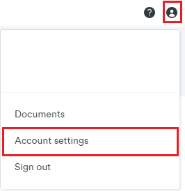
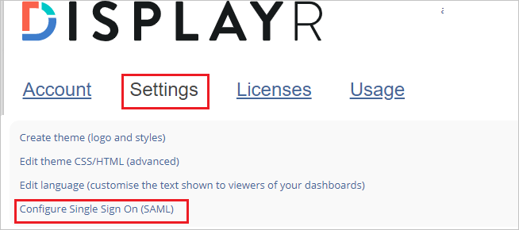
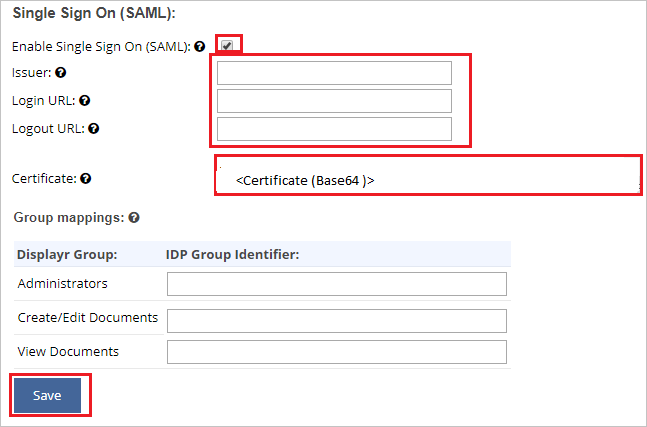

# Configure Displayr for Single sign-on with Microsoft Entra ID

In this article,  you learn how to integrate Displayr with Microsoft Entra ID. When you integrate Displayr with Microsoft Entra ID, you can:

* Control in Microsoft Entra ID who has access to Displayr.
* Enable your users to be automatically signed-in to Displayr with their Microsoft Entra accounts.
* Manage your accounts in one central location.

## Prerequisites

The scenario outlined in this article assumes that you already have the following prerequisites:

[!INCLUDE [common-prerequisites.md](~/identity/saas-apps/includes/common-prerequisites.md)]
* Displayr single sign-on (SSO) enabled company.

## Scenario description

In this article,  you learn to configure Microsoft Entra SSO in your Displayr company.

* Displayr supports **SP** initiated SSO.

## Add Displayr from the gallery

To configure the integration of Displayr into Microsoft Entra ID, you need to add Displayr from the gallery to your list of managed SaaS apps.

1. Sign in to the [Microsoft Entra admin center](https://entra.microsoft.com) as at least a [Cloud Application Administrator](~/identity/role-based-access-control/permissions-reference.md#cloud-application-administrator).
1. Browse to **Entra ID** > **Enterprise apps** > **New application**.
1. In the **Add from the gallery** section, type **Displayr** in the search box.
1. Select **Displayr** from results panel and then add the app. Wait a few seconds while the app is added to your tenant.

 [!INCLUDE [sso-wizard.md](~/identity/saas-apps/includes/sso-wizard.md)]

## Configure Microsoft Entra SSO for Displayr

To configure Microsoft Entra SSO with Displayr, perform the following steps:

1. **[Configure Microsoft Entra SSO](#configure-azure-ad-sso)** to enable your users to use this feature.
1. **[Configure Displayr SSO](#configure-displayr-sso)** to configure the SSO settings on application side.
1. **[Restrict access to specific users](#restrict-access-to-specific-users)** to restrict which of your Microsoft Entra users can sign in to Displayr.
1. **[Test SSO](#test-sso)** to verify whether the configuration works.

## Configure Microsoft Entra SSO

Follow these steps to enable Microsoft Entra SSO.

1. Sign in to the [Microsoft Entra admin center](https://entra.microsoft.com) as at least a [Cloud Application Administrator](~/identity/role-based-access-control/permissions-reference.md#cloud-application-administrator).
1. Browse to **Entra ID** > **Enterprise apps** > **Displayr** application integration page, find the **Manage** section and select **Single sign-on**.
1. On the **Select a Single sign-on method** page, select **SAML**.
1. On the **Set-up Single Sign-On with SAML** page, select the pencil icon for **Basic SAML Configuration** to edit the settings.

   

1. On the **Basic SAML Configuration** section, perform the following steps:

	a. In the **Identifier (Entity ID)** text box, type a value using the following pattern:
	`<EntityID>`
	
	b. In the **Reply URL** text box, type the URL:
	`<ACS URL>`.
	
	c. In the **Sign-on URL** text box, type a URL using the following pattern:
    `https://<YOURDOMAIN>.displayr.com`

	d. Select **Save**.

	>[!NOTE]
	>You can find the EntityID and ACS URL on your Displayr account settings page. Navigate to **Account Settings** > **Settings** tab > **Configure Single Sign On (SAML)**, the details are under the **Service Provider Information** heading.

1. On the **Set-up Single Sign-On with SAML** page, in the **SAML Signing Certificate** section, find **Certificate (Base64)** and select **Download** to download the certificate and save it on your computer.

   

1. Displayr application expects the SAML assertions in a specific format, which requires you to add custom attribute mappings to your SAML token attributes configuration. The following screenshot shows the list of default attributes. Select **Edit** icon to open User Attributes dialog.

   

1. In addition to above, Displayr application expects few more attributes to be passed back in SAML response. In the **User Attributes & Claims** section on the **Group Claims (Preview)** dialog, perform the following steps:

   1. Select **Add a group claim**.

   1. Select **All Groups** from the radio list.

   1. Select **Source Attribute** of **Group ID**.

   1. Select **Save**.

1. On the **Set-up Displayr** section, copy one or more appropriate URLs based on your requirement.

   

## Configure Displayr SSO

1. In a different web browser window, sign in to your up Displayr company site as an administrator

4. Select the **User** icon, then navigate to **Account settings**.

	

5. Switch to **Settings** from the top menu and scroll down the page to select **Configure Single Sign On (SAML)**.

	

6. On the **Single Sign On (SAML)** page, perform the following steps:

	

	a. Check the **Enable Single Sign On (SAML)** box.

	b. Copy the actual **Identifier** value from the **Basic SAML Configuration** section of Microsoft Entra ID and paste it into the **Issuer** text box.

	c. In the **Login URL** text box, paste the value of **Login URL**.

	d. In the **Logout URL** text box, paste the value of **Logout URL**.

	e. Open the Certificate (Base64) in Notepad, copy its content and paste it into the **Certificate** text box.

	f. **Group mappings** are optional.

	g. Select **Save**.	

### Restrict access to specific users

By default, all users in the tenant where you added the Displayr application can sign-in to Displayr by using SSO. If you want to restrict access to specific users or groups, see [Restrict your Microsoft Entra app to a set of users in a Microsoft Entra tenant](~/identity-platform/howto-restrict-your-app-to-a-set-of-users.md).

## Test SSO

In this section, you test your Microsoft Entra single sign-on configuration with following options. 

* Select **Test this application**, this option redirects to Displayr Sign-on URL where you can initiate the sign in flow. 

* Go to Displayr Sign-on URL directly and initiate the sign in flow from there.

* You can use Microsoft My Apps. When you select the Displayr tile in the My Apps, this option redirects to Displayr Sign-on URL. For more information about the My Apps, see [Introduction to the My Apps](https://support.microsoft.com/account-billing/sign-in-and-start-apps-from-the-my-apps-portal-2f3b1bae-0e5a-4a86-a33e-876fbd2a4510).

## Related content

Once you configure Displayr you can enforce session control, which protects exfiltration and infiltration of your organization’s sensitive data in real time. Session control extends from Conditional Access. [Learn how to enforce session control with Microsoft Defender for Cloud Apps](/cloud-app-security/proxy-deployment-aad).
