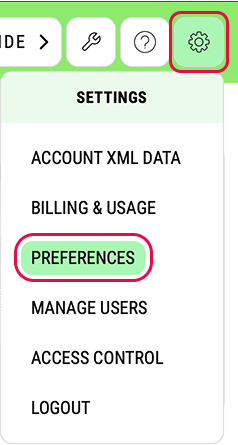
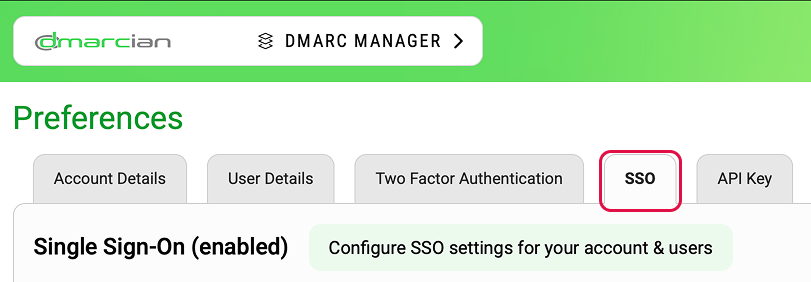
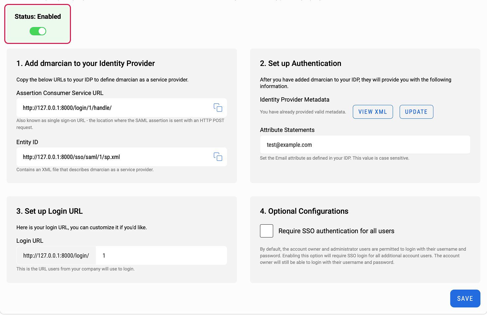
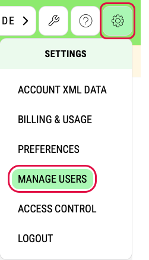
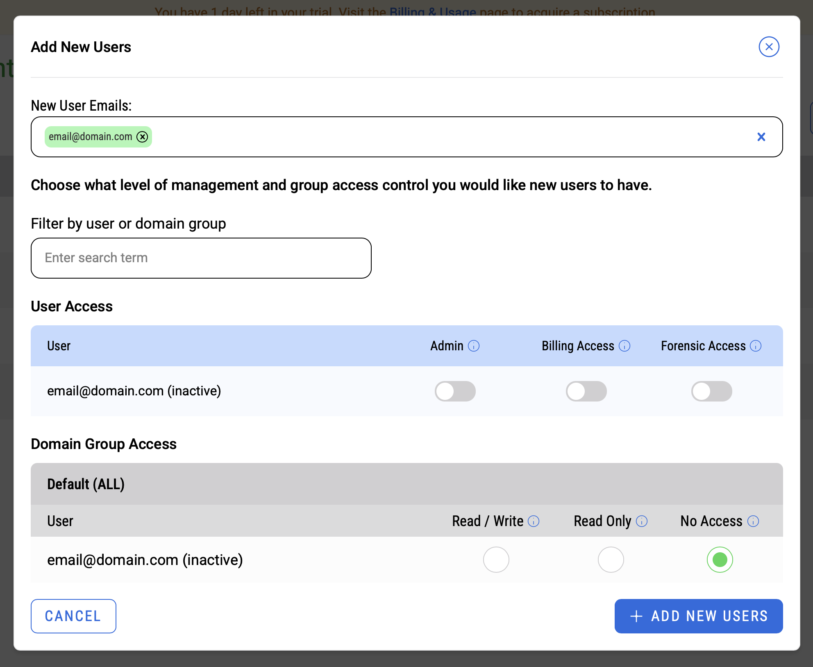

# Configure dmarcian for Single sign-on with Microsoft Entra ID

In this article, you learn how to integrate dmarcian with Microsoft Entra ID. When you integrate dmarcian with Microsoft Entra ID, you can:

- Control in Microsoft Entra ID who has access to dmarcian.
- Enable your users to be automatically signed-in to dmarcian with their Microsoft Entra accounts.
- Manage your accounts in one central location.

## Prerequisites

The scenario outlined in this article assumes that you already have the following prerequisites:

[!INCLUDE [common-prerequisites.md](~/identity/saas-apps/includes/common-prerequisites.md)]

- dmarcian single sign-on (SSO) enabled subscription.

## Scenario description

In this article, you configure and test Microsoft Entra SSO in a test environment.

- dmarcian supports **SP and IDP** initiated SSO.

## Add dmarcian from the gallery

To configure the integration of dmarcian into Microsoft Entra ID, you need to add dmarcian from the gallery to your list of managed SaaS apps.

1. Sign in to the [Microsoft Entra admin center](https://entra.microsoft.com) as at least a [Cloud Application Administrator](~/identity/role-based-access-control/permissions-reference.md#cloud-application-administrator).
2. Browse to **Entra ID** > **Enterprise apps** > **New application**.
3. In the **Add from the gallery** section, type **dmarcian** in the search box.
4. Select **dmarcian** from results panel and then add the app. Wait a few seconds while the app is added to your tenant.

[!INCLUDE [sso-wizard.md](~/identity/saas-apps/includes/sso-wizard.md)]

## Configure and test Microsoft Entra SSO for dmarcian

Configure and test Microsoft Entra SSO with dmarcian using a test user called **B.Simon**. For SSO to work, you need to establish a link relationship between a Microsoft Entra user and the related user in dmarcian.

To configure and test Microsoft Entra SSO with dmarcian, perform the following steps:

1. **[Configure Microsoft Entra SSO](#configure-azure-ad-sso)** - to enable your users to use this feature.
   1. **Create a Microsoft Entra test user** - to test Microsoft Entra single sign-on with B.Simon.
   2. **Assign the Microsoft Entra test user** - to enable B.Simon to use Microsoft Entra single sign-on.
2. **[Configure dmarcian SSO](#configure-dmarcian-sso)** - to configure the single sign-on settings on application side.
   1. **[Create dmarcian test user](#create-dmarcian-test-user)** - to have a counterpart of B.Simon in dmarcian that's linked to the Microsoft Entra representation of user.
3. **[Test SSO](#test-sso)** - to verify whether the configuration works.

## Configure Microsoft Entra SSO

Follow these steps to enable Microsoft Entra SSO.

1. Sign in to the [Microsoft Entra admin center](https://entra.microsoft.com) as at least a [Cloud Application Administrator](~/identity/role-based-access-control/permissions-reference.md#cloud-application-administrator).
2. Browse to **Entra ID** > **Enterprise apps** > **dmarcian** application integration page, find the **Manage** section and select **Single sign-on**.
3. On the **Select a Single sign-on method** page, select **SAML**.
4. On the **Set up Single Sign-On with SAML** page, select the pencil icon for **Basic SAML Configuration** to edit the settings.
   
5. On the **Basic SAML Configuration** section, If you wish to configure the application in **IDP** initiated mode, perform the following steps:

   1. In the **Identifier** text box, type a URL using the following pattern:

      | **Identifier**                                         |
      | ------------------------------------------------------ |
      | `https://us.dmarcian.com/sso/saml/<ACCOUNT_ID>/sp.xml` |
      | `https://eu.dmarcian.com/sso/saml/<ACCOUNT_ID>/sp.xml` |
      | `https://ca.dmarcian.com/sso/saml/<ACCOUNT_ID>/sp.xml` |
      | `https://ap.dmarcian.com/sso/saml/<ACCOUNT_ID>/sp.xml` |
      | `https://au.dmarcian.com/sso/saml/<ACCOUNT_ID>/sp.xml` |
      | `https://jp.dmarcian.com/sso/saml/<ACCOUNT_ID>/sp.xml` |

   2. In the **Reply URL** text box, type a URL using the following pattern:

      | **Reply URL**                                        |
      | ---------------------------------------------------- |
      | `https://us.dmarcian.com/login/<ACCOUNT_ID>/handle/` |
      | `https://eu.dmarcian.com/login/<ACCOUNT_ID>/handle/` |
      | `https://ca.dmarcian.com/login/<ACCOUNT_ID>/handle/` |
      | `https://ap.dmarcian.com/login/<ACCOUNT_ID>/handle/` |
      | `https://au.dmarcian.com/login/<ACCOUNT_ID>/handle/` |
      | `https://jp.dmarcian.com/login/<ACCOUNT_ID>/handle/` |

6. Select **Set additional URLs** and perform the following step if you wish to configure the application in **SP** initiated mode:

   In the **Sign-on URL** text box, type a URL using the following pattern:

   | **Sign-on URL**                              |
   | -------------------------------------------- |
   | `https://us.dmarcian.com/login/<ACCOUNT_ID>` |
   | `https://eu.dmarcian.com/login/<ACCOUNT_ID>` |
   | `https://ca.dmarcian.com/login/<ACCOUNT_ID>` |
   | `https://ap.dmarciam.com/login/<ACCOUNT_ID>` |
   | `https://au.dmarciam.com/login/<ACCOUNT_ID>` |
   | `https://jp.dmarciam.com/login/<ACCOUNT_ID>` |

   > [!NOTE]
   > These values aren't real. You update these values with the actual Identifier, Reply URL and Sign-On URL which is explained later in the article.

7. On the **Set up Single Sign-On with SAML** page, In the **SAML Signing Certificate** section, select copy button to copy **App Federation Metadata Url**, open it in a new browser tab, download the content of the page as an XML file and save it on your computer.

   

[!INCLUDE [create-assign-users-sso.md](~/identity/saas-apps/includes/create-assign-users-sso.md)]

## Configure dmarcian SSO

1. In a different web browser window, sign in to your dmarcian company site as an administrator

2. Click on the ⚙️ **Cog icon** in the top-right corner and select **Preferences**.

   

3. Click on the **SSO** tab.

   

4. Set the status to **Enabled** if it is not already set and perform the following steps:

   

   1. Under **Add dmarcian to your Identity Provider** section, click on the **Copy Icon** to copy the **Assertion Consumer Service URL** for your instance and paste it in **Reply URL** textbox in **Basic SAML Configuration section** on Azure portal.
   2. Under **Add dmarcian to your Identity Provider** section, click on the **Copy Icon** to copy the **Entity ID** for your instance and paste it in **Identifier** textbox in **Basic SAML Configuration section** on Azure portal.
   3. Under **Set up Authentication** section, under **Identity Provider Metadata**, click on the "Upload File" button to upload the XML file which you downloaded from the **App Federation Metadata Url**.
   4. Under **Set up Authentication** section, in the **Attribute Statements** textbox, paste the email address as provided on the Azure portal.
   5. Under **Set up Login URL** section, copy the **Login URL** for your instance and paste it in **Sign-on URL** textbox in **Basic SAML Configuration section** on Azure portal.

      > [!NOTE]
      > You can modify the **Login URL** according to your organization.

   6. Under "Optional Configurations" you can select whether you would like to enforce SSO authentication for all users by checking the checkbox.
   7. Select **Save**.

### Create dmarcian test user

To enable Microsoft Entra users to sign in to dmarcian, they must be provisioned into dmarcian. In dmarcian, provisioning is a manual task.

**To provision a user account, perform the following steps:**

1. Sign in to dmarcian as a Security Administrator.
2. Click on the ⚙️ **Cog icon** in the top-right corner and select **Preferences**.

   

3. Click on the **+ Add New Users** button.

   

4. In the **Add New Users** pop-up, perform the following steps:

   

   1. In the **New User Email** textbox, enter the email of the user, such as `email@domain.com` and press **Enter**.

   2. Optionally, you can change the user's permissions and domain group access.

   3. Click on the **+ Add New Users** button on the bottom-right of the pop-up.

## Test SSO

In this section, you test your Microsoft Entra single sign-on configuration with following options.

#### SP initiated

- Select **Test this application**, this option redirects to dmarcian Sign on URL where you can initiate the login flow.

- Go to dmarcian Sign-on URL directly and initiate the login flow from there.

#### IDP initiated

- Select **Test this application**, and you should be automatically signed in to the dmarcian for which you set up the SSO.

You can also use Microsoft My Apps to test the application in any mode. When you select the dmarcian tile in the My Apps, if configured in SP mode you would be redirected to the application sign on page for initiating the login flow and if configured in IDP mode, you should be automatically signed in to the dmarcian for which you set up the SSO. For more information about the My Apps, see [Introduction to the My Apps](https://support.microsoft.com/account-billing/sign-in-and-start-apps-from-the-my-apps-portal-2f3b1bae-0e5a-4a86-a33e-876fbd2a4510).

## Related content

Once you configure dmarcian you can enforce session control, which protects exfiltration and infiltration of your organization’s sensitive data in real time. Session control extends from Conditional Access. [Learn how to enforce session control with Microsoft Defender for Cloud Apps](/cloud-app-security/proxy-deployment-aad).
