# Configure DocuSign for Single sign-on with Microsoft Entra ID

In this article,  you learn how to integrate DocuSign with Microsoft Entra ID. When you integrate DocuSign with Microsoft Entra ID, you can:

* Use Microsoft Entra ID to control who has access to DocuSign.
* Enable automatic sign-in to DocuSign for your users through their Microsoft Entra accounts.
* Manage your accounts in one central location: the Azure portal.

## Prerequisites
The scenario outlined in this article assumes that you already have the following prerequisites:

[!INCLUDE [common-prerequisites.md](~/identity/saas-apps/includes/common-prerequisites.md)]
* A DocuSign subscription that's single sign-on (SSO) enabled.
* Control over your domain DNS. This is needed to claim domain on DocuSign. 

> [!NOTE]
> This integration is also available to use from Microsoft Entra US Government Cloud environment. You can find this application in the Microsoft Entra US Government Cloud Application Gallery and configure it in the same way as you do from public cloud.

## Scenario description

In this article,  you configure and test Microsoft Entra SSO in a test environment to verify that:

* DocuSign supports service provider **SP** initiated SSO.

* DocuSign supports **just-in-time** user provisioning.

* DocuSign supports [automatic user provisioning](./docusign-provisioning-tutorial.md).

## Add DocuSign from the gallery

To configure the integration of DocuSign into Microsoft Entra ID, you must add DocuSign from the gallery to your list of managed SaaS apps:

1. Sign in to the [Microsoft Entra admin center](https://entra.microsoft.com) as at least a [Cloud Application Administrator](~/identity/role-based-access-control/permissions-reference.md#cloud-application-administrator).
1. Browse to **Entra ID** > **Enterprise apps** > **New application**.
1. In the **Add from the gallery** section, type **DocuSign** in the search box.
1. Select **DocuSign** from the results panel and then add the app. Wait a few seconds while the app is added to your tenant.

[!INCLUDE [sso-wizard.md](~/identity/saas-apps/includes/sso-wizard.md)]

## Configure and test Microsoft Entra SSO for DocuSign

Configure and test Microsoft Entra SSO with DocuSign by using a test user named **B.Simon**. For SSO to work, you must establish a link relationship between a Microsoft Entra user and the corresponding user in DocuSign.

To configure and test Microsoft Entra SSO with DocuSign, perform the following steps:

1. [Configure Microsoft Entra SSO](#configure-azure-ad-sso) so that your users can use this feature.
    1. Create a Microsoft Entra test user to test Microsoft Entra single sign-on with B.Simon.
    1. Assign the Microsoft Entra test user to enable B.Simon to use Microsoft Entra single sign-on.
1. [Configure DocuSign SSO](#configure-docusign-sso) to configure the single sign-on settings on the application side.
    1. [Create a DocuSign test user](#create-docusign-test-user) to generate a counterpart of B.Simon in DocuSign that's linked to the Microsoft Entra representation of the user.
1. [Test SSO](#test-sso) to verify that the configuration works.

## Configure Microsoft Entra SSO

To enable Microsoft Entra SSO in the Azure portal, follow these steps:

1. Sign in to the [Microsoft Entra admin center](https://entra.microsoft.com) as at least a [Cloud Application Administrator](~/identity/role-based-access-control/permissions-reference.md#cloud-application-administrator).
1. Browse to **Entra ID** > **Enterprise apps** > **DocuSign** application integration page, find the **Manage** section, and then select **single sign-on**.
1. On the **Select a single sign-on method** page, select **SAML**.
1. On the **Set up single sign-on with SAML** page, select the pencil icon for **Basic SAML Configuration** to edit the settings.

   

1. In the **Basic SAML Configuration** section, perform the following steps:

    a. In the **Identifier (Entity ID)** textbox, type a URL using the following pattern:

    `https://<subdomain>.docusign.com/organizations/<OrganizationID>/saml2`

    b. In the **Reply URL** textbox, type a URL using one of the following patterns:
    
    | Reply URL |
    |-------------|
    | Production: |
    | `https://<subdomain>.docusign.com/organizations/<OrganizationID>/saml2/login/<IDPID>` |
    | `https://<subdomain>.docusign.net/SAML/` |
    | QA Instance:|
    | `https://<SUBDOMAIN>.docusign.com/organizations/saml2` |

    c. In the **Sign on URL** textbox, type a URL using the following pattern:

    `https://<subdomain>.docusign.com/organizations/<OrganizationID>/saml2/login/sp/<IDPID>`

	> [!NOTE]
	> These bracketed values are placeholders. Replace them with the values in the actual Identifier, Reply URL and Sign on URL. Reach out the Docusign support team to these values.

1. On the **Set up single sign-on with SAML** page, in the **SAML Signing Certificate** section,  find **Certificate (Base64)**. Select **Download** to download the certificate and save it on your computer.

	

1. In the **Set up DocuSign** section, copy the appropriate URL (or URLs) based on your requirements.

	

[!INCLUDE [create-assign-users-sso.md](~/identity/saas-apps/includes/create-assign-users-sso.md)]

## Configure DocuSign SSO
1. In a different web browser window, sign in to your up DocuSign company site as an administrator

4. In the upper-left corner of the page, select the  app launcher (9 dots), and then select **Admin**.
  
    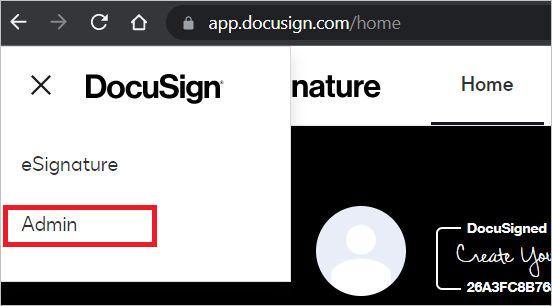

5. On your domain solutions page, select **Domains**.

    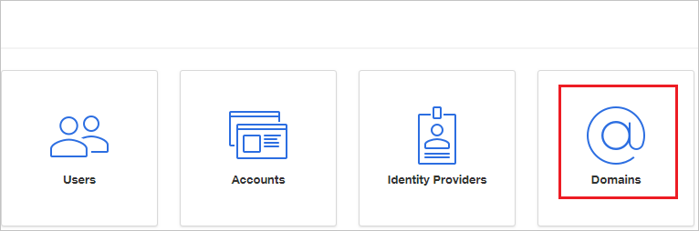

6. In the **Domains** section, select **CLAIM DOMAIN**.

    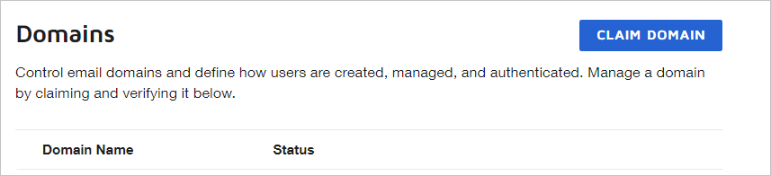

7. In the **Claim a Domain** dialog box, in the **Domain Name** box, type your company domain, and then select **CLAIM**. Make sure you verify the domain and that its status is active.

    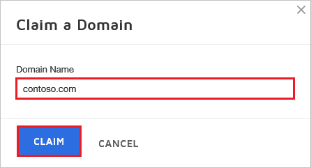

8. In the **Domains** section, select **Get Validation Token** of new domain added in the claim list.

    
    
9. Copy the **TXT Token**

    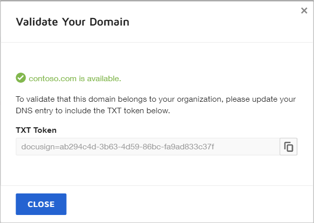

10. Configure your DNS provider with the **TXT Token** by following these steps:

	a. Navigate to your domain's DNS record management page.

	b. Add a new TXT record.

	c. Name: @ or *.

	d. Text: paste the **TXT Token** value, which you copied from the earlier step.

	e. TTL: Default or 1 hour / 3,600 seconds.

11. In the left navigation, select **Identity Providers** in **ACCESS MANAGEMENT**.
  
    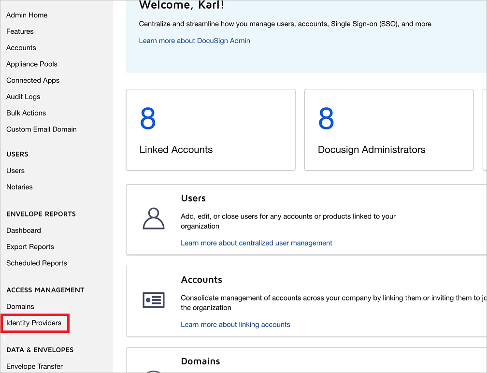

12. In the **Identity Providers** section, select **ADD IDENTITY PROVIDER**.

    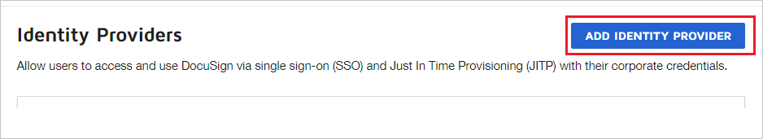

13. On the **Identity Provider Settings** page, follow these steps:

    a. In the **Custom Name** box, type a unique name for your configuration. Don't use spaces.
	
	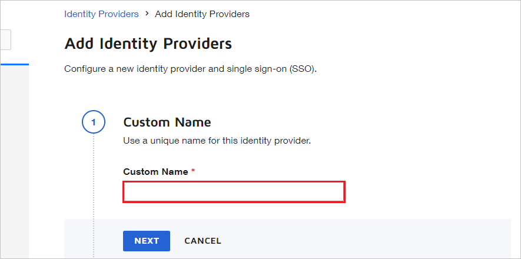

    b. In the **Identity Provider Issuer box**, paste the **Microsoft Entra Identifier** value, which you copied.

	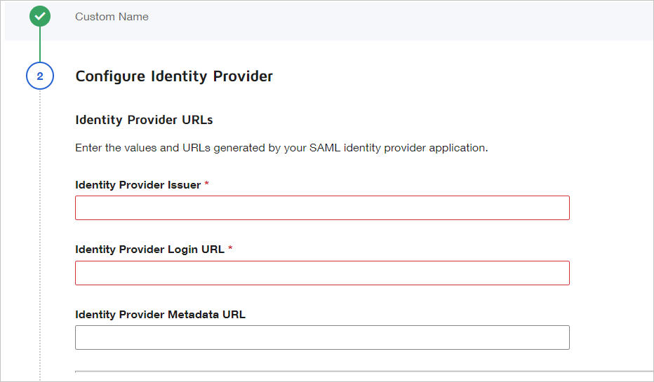

    c. In the **Identity Provider Login URL** box, paste the **Login URL** value, which you copied from Azure portal.

    d. In the **Identity Provider Logout URL** box, paste the value of **Logout URL**, which you  copied from Azure portal.
   
       

    e. For **Send AuthN request by**, select **POST**.

    f. For **Send logout request by**, select **GET**.

    g. In the **Custom Attribute Mapping** section, select **ADD NEW MAPPING**.

       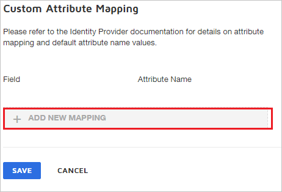

    h. Choose the field you want to map to the Microsoft Entra claim. In this example, the **emailaddress** claim is mapped with the value of `http://schemas.xmlsoap.org/ws/2005/05/identity/claims/emailaddress`. That's the default claim name from Microsoft Entra ID for the email claim. Select **SAVE**.

       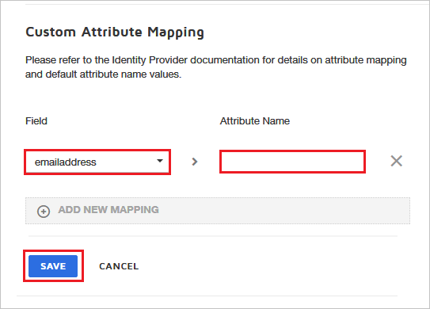

       > [!NOTE]
       > Use the appropriate **User identifier** to map the user from Microsoft Entra ID to DocuSign user mapping. Select the proper field, and enter the appropriate value based on your organization settings. Custom Attribute Mapping setting isn't mandatory.

    i. In the **Identity Provider Certificates** section, select **ADD CERTIFICATE**, upload the certificate you downloaded from Azure portal, and select **SAVE**.

       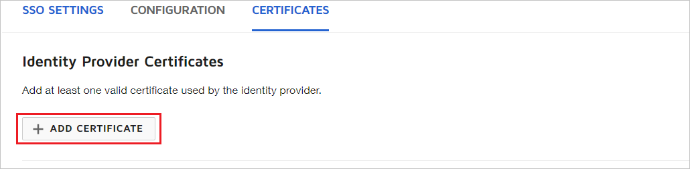

    j. In the **Identity Providers** section, select **ACTIONS**, and then select **Endpoints**.

       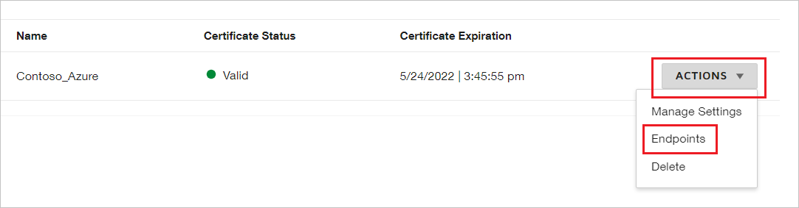

    k. In the **View SAML 2.0 Endpoints** section of the DocuSign admin portal, follow these steps:

       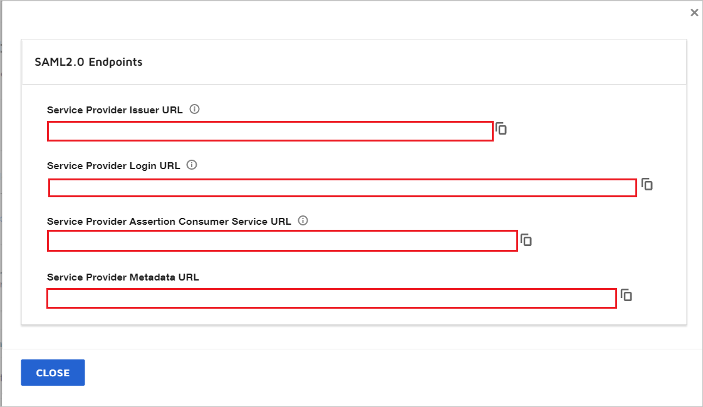
       
       1. Copy the **Service Provider Issuer URL**, and then paste it into the **Identifier** box in **Basic SAML Configuration** section.
       
       1. Copy the **Service Provider Assertion Consumer Service URL**, and then paste it into the **Reply URL** box in **Basic SAML Configuration** section.
       
       1. Copy the **Service Provider Login URL**, and then paste it into the **Sign On URL** box in **Basic SAML Configuration** section. At the end of the **Service Provider Login URL** you get the IDPID value.

       1. Select **Close**.

### Create DocuSign test user

In this section, a user named B.Simon is created in DocuSign. DocuSign supports just-in-time user provisioning, which is enabled by default. There's no action item for you in this section. If a user doesn't already exist in DocuSign, a new one is created after authentication.

> [!Note]
> If you need to create a user manually, contact the [DocuSign support team](https://support.docusign.com/).

## Test SSO 

In this section, you test your Microsoft Entra single sign-on configuration with following options. 

* Select **Test this application**, this option redirects to DocuSign Sign-on URL where you can initiate the login flow. 

* Go to DocuSign Sign-on URL directly and initiate the login flow from there.

* You can use Microsoft My Apps. When you select the DocuSign tile in the My Apps, you should be automatically signed in to the DocuSign for which you set up the SSO. For more information about the My Apps, see [Introduction to the My Apps](https://support.microsoft.com/account-billing/sign-in-and-start-apps-from-the-my-apps-portal-2f3b1bae-0e5a-4a86-a33e-876fbd2a4510).

## Related content

Once you configure DocuSign you can enforce Session control, which protects exfiltration and infiltration of your organization’s sensitive data in real time. Session control extends from Conditional Access. [Learn how to enforce session control with Microsoft Defender for Cloud Apps](/cloud-app-security/proxy-deployment-aad).
