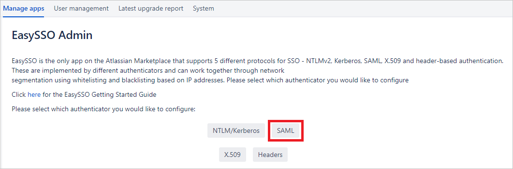
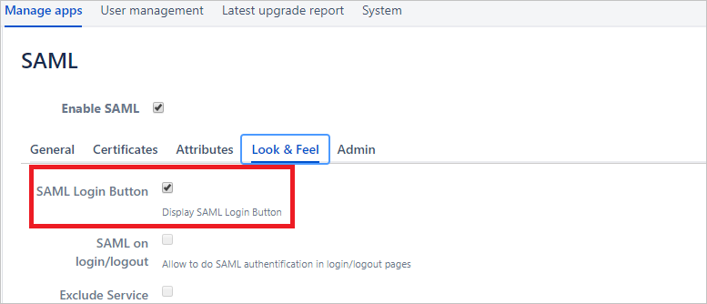

# Configure EasySSO for Jira for Single sign-on with Microsoft Entra ID

In this article,  you learn how to integrate EasySSO for Jira with Microsoft Entra ID. When you integrate EasySSO for Jira with Microsoft Entra ID, you can:

* Control in Microsoft Entra ID who has access to Jira.
* Enable your users to be automatically signed-in to Jira with their Microsoft Entra accounts.
* Manage your accounts in one central location.

## Prerequisites
The scenario outlined in this article assumes that you already have the following prerequisites:

[!INCLUDE [common-prerequisites.md](~/identity/saas-apps/includes/common-prerequisites.md)]
* EasySSO for Jira single sign-on (SSO) enabled subscription.

## Scenario description

In this article,  you configure and test Microsoft Entra SSO in a test environment.

* EasySSO for Jira supports **SP and IDP** initiated SSO.
* EasySSO for Jira supports **Just In Time** user provisioning.

## Add EasySSO for Jira from the gallery

To configure the integration of EasySSO for Jira into Microsoft Entra ID, you need to add EasySSO for Jira from the gallery to your list of managed SaaS apps.

1. Sign in to the [Microsoft Entra admin center](https://entra.microsoft.com) as at least a [Cloud Application Administrator](~/identity/role-based-access-control/permissions-reference.md#cloud-application-administrator).
1. Browse to **Entra ID** > **Enterprise apps** > **New application**.
1. In the **Add from the gallery** section, type **EasySSO for Jira** in the search box.
1. Select **EasySSO for Jira** from results panel and then add the app. Wait a few seconds while the app is added to your tenant.

 Alternatively, you can also use the [Enterprise App Configuration Wizard](https://portal.office.com/AdminPortal/home?Q=Docs#/azureadappintegration). In this wizard, you can add an application to your tenant, add users/groups to the app, assign roles, and walk through the SSO configuration as well. [Learn more about Microsoft 365 wizards.](/microsoft-365/admin/misc/azure-ad-setup-guides)

## Configure and test Microsoft Entra SSO for EasySSO for Jira

Configure and test Microsoft Entra SSO with EasySSO for Jira using a test user called **B.Simon**. For SSO to work, you need to establish a link relationship between a Microsoft Entra user and the related user in EasySSO for Jira.

To configure and test Microsoft Entra SSO with EasySSO for Jira, perform the following steps:

1. **[Configure Microsoft Entra SSO](#configure-azure-ad-sso)** - to enable your users to use this feature.
    1. **Create a Microsoft Entra test user** - to test Microsoft Entra single sign-on with B.Simon.
    1. **Assign the Microsoft Entra test user** - to enable B.Simon to use Microsoft Entra single sign-on.
1. **[Configure EasySSO for Jira SSO](#configure-easysso-for-jira-sso)** - to configure the single sign-on settings on application side.
    1. **[Create EasySSO for Jira test user](#create-easysso-for-jira-test-user)** - to have a counterpart of B.Simon in EasySSO for Jira that's linked to the Microsoft Entra representation of user.
1. **[Test SSO](#test-sso)** - to verify whether the configuration works.

## Configure Microsoft Entra SSO

Follow these steps to enable Microsoft Entra SSO.

1. Sign in to the [Microsoft Entra admin center](https://entra.microsoft.com) as at least a [Cloud Application Administrator](~/identity/role-based-access-control/permissions-reference.md#cloud-application-administrator).
1. Browse to **Entra ID** > **Enterprise apps** > **EasySSO for Jira** > **Single sign-on**.
1. On the **Select a single sign-on method** page, select **SAML**.
1. On the **Set up single sign-on with SAML** page, select the pencil icon for **Basic SAML Configuration** to edit the settings.

   

1. On the **Basic SAML Configuration** section, if you wish to configure the application in **IDP** initiated mode, perform the following steps:

    a. In the **Identifier** text box, type a URL using the following pattern:
    `https://<server-base-url>/plugins/servlet/easysso/saml`

    b. In the **Reply URL** text box, type a URL using the following pattern:
    `https://<server-base-url>/plugins/servlet/easysso/saml`

1. Select **Set additional URLs** and perform the following step if you wish to configure the application in **SP** initiated mode:

    In the **Sign-on URL** text box, type a URL using the following pattern:
    `https://<server-base-url>/login.jsp`

	> [!NOTE]
	> These values aren't real. Update these values with the actual Identifier, Reply URL and Sign-on URL. Contact [EasySSO support team](mailto:support@techtime.co.nz) to get these values if in doubt. You can also refer to the patterns shown in the **Basic SAML Configuration** section.

1. EasySSO for Jira application expects the SAML assertions in a specific format, which requires you to add custom attribute mappings to your SAML token attributes configuration. The following screenshot shows the list of default attributes.

	

1. In addition to above, EasySSO for Jira application expects few more attributes to be passed back in SAML response which are shown below. These attributes are also pre populated but you can review them as per your requirements.
	
	| Name | Source Attribute|
	| ---------------| --------- |
	| urn:oid:0.9.2342.19200300.100.1.1 | user.userprincipalname |
	| urn:oid:0.9.2342.19200300.100.1.3 | user.mail |
	| urn:oid:2.16.840.1.113730.3.1.241 | user.displayname |
	| urn:oid:2.5.4.4 | user.surname |
	| urn:oid:2.5.4.42 | user.givenname |
    
	In case your Microsoft Entra users have **sAMAccountName** configured you would have to map **urn:oid:0.9.2342.19200300.100.1.1** onto **sAMAccountName** attribute.
    
1. On the **Set up single sign-on with SAML** page, In the **SAML Signing Certificate** section, select **Download** links for **Certificate (Base64)** or **Federation Metadata XML** options and save either or all to your computer. You need it later to configure Jira EasySSO.

	
	
	If you plan to perform EasySSO for Jira configuration manually with certificate, you also need to copy **Login URL** and **Microsoft Entra Identifier** from the section below and save those on your computer.

[!INCLUDE [create-assign-users-sso.md](~/identity/saas-apps/includes/create-assign-users-sso.md)]

## Configure EasySSO for Jira SSO

1. Sign into your Atlassian Jira instance with Administrator privileges and navigate to the **Manage Apps** section. 

    

2. On the left side locate **EasySSO** and select it.

    

3. Select **SAML** option. This will take you to SAML configuration section.

    

4. Select **Certificates** tab on the top and you be presented with the following screen:

    

5. Now, locate **Certificate (Base64)** or **Metadata File** you have saved in the earlier steps of **Microsoft Entra SSO** configuration. You have following options on how to proceed:

    a. Use the App Federation **Metadata File** you downloaded to local file on your computer. Select **Upload** radio button and follow the upload file dialog specific to your operating system.

    **OR**

    b. Open the App Federation **Metadata File** to see the content (in any plain text editor) of the file and copy it into the clipboard. Select **Input** option and paste clipboard content into the text field.

     **OR**

    c. Fully manual configuration. Open the App Federation **Certificate (Base64)** to see the content (in any plain text editor) of the file and copy it into the clipboard. Paste it into **IdP Token Signing Certificates** text field. Then navigate to **General** tab and fill **POST Binding URL** and **Entity ID** fields with respective values for **Login URL** and **Microsoft Entra Identifier** you saved previously.
 
6. Select **Save** button on the bottom of the page. You see the content of the Metadata or Certificate files is parsed into the configuration fields. EasySSO for Jira configuration is complete.

7. For the best testing experience, navigate to **Look & Feel** tab and check the **SAML Login Button** option on. This will enable separate button on the Jira login screen specifically to test your Microsoft Entra SAML integration end to end. You can leave this button on and configure its placement, colour and translation for production mode, too.

    

    > [!NOTE]
    > Should you have any issues, please contact [EasySSO support team](mailto:support@techtime.co.nz).

### Create EasySSO for Jira test user

In this section, a user called Britta Simon is created in Jira. EasySSO for Jira supports just-in-time user provisioning, which is **disabled** by default. To enable user provisioning, you have to explicitly check **Create user on successful login** option on in the General section of EasySSO plugin configuration. If a user doesn't already exist in Jira, a new one is created after authentication.

However, if you don't wish to enable automatic user provisioning on the user first login, users must exist in backend User Directories the Jira instance make use of, such as LDAP or Atlassian Crowd.

## Test SSO 

### IdP-initiated workflow

In this section, you test your Microsoft Entra single sign-on configuration with following options.

* Select **Test this application**, and you should be automatically signed in to the EasySSO for Jira for which you set up the SSO. 

You can also use Microsoft My Apps to test the application in any mode. When you select the EasySSO for Jira tile in the My Apps, if configured in SP mode you would be redirected to the application sign on page for initiating the login flow and if configured in IDP mode, you should be automatically signed in to the EasySSO for Jira for which you set up the SSO. For more information about the My Apps, see [Introduction to the My Apps](https://support.microsoft.com/account-billing/sign-in-and-start-apps-from-the-my-apps-portal-2f3b1bae-0e5a-4a86-a33e-876fbd2a4510).

### SP-initiated workflow

In this section, you test your Microsoft Entra single sign-on configuration using Jira **SAML Login** button.

This scenario presumes you have enabled **SAML Login Button** in **Look & Feel** tab in your Jira EasySSO configuration page (see above). Open your Jira login URL in browser incognito mode to avoid any interference with your existing sessions. Select **SAML Login** button and you get redirected to Microsoft Entra user authentication flow. Once successfully completed you be redirected back to your Jira instance as authenticated user via SAML.

There's a possibility you may encounter the following screen after getting redirected back from Microsoft Entra ID.

In this case you have to follow the [instructions on this page](https://techtime.co.nz/display/TECHTIME/EasySSO+How+to+get+the+logs#EasySSOHowtogetthelogs-RETRIEVINGTHELOGS) to get access to **atlassian-jira.log** file. Details of the error is available by the reference ID found on EasySSO error page.

Should you have any issues digesting the log messages, please contact [EasySSO support team](mailto:support@techtime.co.nz).

## Related content

Once you configure EasySSO for Jira you can enforce session control, which protects exfiltration and infiltration of your organization’s sensitive data in real time. Session control extends from Conditional Access. [Learn how to enforce session control with Microsoft Defender for Cloud Apps](/cloud-app-security/proxy-deployment-aad).
