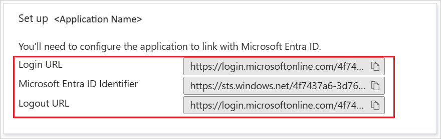

# Configure EFI Digital StoreFront for Single sign-on with Microsoft Entra ID

In this article,  you learn how to integrate EFI Digital StoreFront with Microsoft Entra ID. When you integrate EFI Digital StoreFront with Microsoft Entra ID, you can:

* Control in Microsoft Entra ID who has access to EFI Digital StoreFront.
* Enable your users to be automatically signed-in to EFI Digital StoreFront with their Microsoft Entra accounts.
* Manage your accounts in one central location.

## Prerequisites
The scenario outlined in this article assumes that you already have the following prerequisites:

[!INCLUDE [common-prerequisites.md](~/identity/saas-apps/includes/common-prerequisites.md)]
* EFI Digital StoreFront single sign-on (SSO) enabled subscription.

## Scenario description

In this article,  you configure and test Microsoft Entra single sign-on in a test environment.

* EFI Digital StoreFront supports **SP** initiated SSO.

## Add EFI Digital StoreFront from the gallery

To configure the integration of EFI Digital StoreFront into Microsoft Entra ID, you need to add EFI Digital StoreFront from the gallery to your list of managed SaaS apps.

1. Sign in to the [Microsoft Entra admin center](https://entra.microsoft.com) as at least a [Cloud Application Administrator](~/identity/role-based-access-control/permissions-reference.md#cloud-application-administrator).
1. Browse to **Entra ID** > **Enterprise apps** > **New application**.
1. In the **Add from the gallery** section, type **EFI Digital StoreFront** in the search box.
1. Select **EFI Digital StoreFront** from results panel and then add the app. Wait a few seconds while the app is added to your tenant.

 Alternatively, you can also use the [Enterprise App Configuration Wizard](https://portal.office.com/AdminPortal/home?Q=Docs#/azureadappintegration). In this wizard, you can add an application to your tenant, add users/groups to the app, assign roles, and walk through the SSO configuration as well. [Learn more about Microsoft 365 wizards.](/microsoft-365/admin/misc/azure-ad-setup-guides)

## Configure and test Microsoft Entra SSO for EFI Digital StoreFront

Configure and test Microsoft Entra SSO with EFI Digital StoreFront using a test user called **B.Simon**. For SSO to work, you need to establish a link relationship between a Microsoft Entra user and the related user in EFI Digital StoreFront.

To configure and test Microsoft Entra SSO with EFI Digital StoreFront, perform the following steps:

1. **[Configure Microsoft Entra SSO](#configure-azure-ad-sso)** - to enable your users to use this feature.
    1. **Create a Microsoft Entra test user** - to test Microsoft Entra single sign-on with B.Simon.
    1. **Assign the Microsoft Entra test user** - to enable B.Simon to use Microsoft Entra single sign-on.
1. **[Configure EFI Digital StoreFront SSO](#configure-efi-digital-storefront-sso)** - to configure the single sign-on settings on application side.
    1. **[Create EFI Digital StoreFront test user](#create-efi-digital-storefront-test-user)** - to have a counterpart of B.Simon in EFI Digital StoreFront that's linked to the Microsoft Entra representation of user.
1. **[Test SSO](#test-sso)** - to verify whether the configuration works.

## Configure Microsoft Entra SSO

Follow these steps to enable Microsoft Entra SSO.

1. Sign in to the [Microsoft Entra admin center](https://entra.microsoft.com) as at least a [Cloud Application Administrator](~/identity/role-based-access-control/permissions-reference.md#cloud-application-administrator).
1. Browse to **Entra ID** > **Enterprise apps** > **EFI Digital StoreFront** > **Single sign-on**.
1. On the **Select a single sign-on method** page, select **SAML**.
1. On the **Set up single sign-on with SAML** page, select the pencil icon for **Basic SAML Configuration** to edit the settings.

   

1. On the **Basic SAML Configuration** section, perform the following steps:

	a. In the **Sign on URL** text box, type a URL using the following pattern:
    `https://<COMPANY_NAME>.myprintdesk.net/DSF`

    b. In the **Identifier (Entity ID)** text box, type a URL using the following pattern:
    `https://<COMPANY_NAME>.myprintdesk.net/DSF/asp4/`

	> [!NOTE]
	> These values aren't real. Update these values with the actual Sign on URL and Identifier. Contact [EFI Digital StoreFront Client support team](https://www.efi.com/support-and-downloads/) to get these values. You can also refer to the patterns shown in the **Basic SAML Configuration** section.

1. On the **Set up Single Sign-On with SAML** page, in the **SAML Signing Certificate** section, select **Download** to download the **Federation Metadata XML** from the given options as per your requirement and save it on your computer.

	

6. On the **Set up EFI Digital StoreFront** section, copy the appropriate URL(s) as per your requirement.

	

[!INCLUDE [create-assign-users-sso.md](~/identity/saas-apps/includes/create-assign-users-sso.md)]

## Configure EFI Digital StoreFront SSO

To configure single sign-on on **EFI Digital StoreFront** side, you need to send the downloaded **Federation Metadata XML** and appropriate copied URLs from the application configuration to [EFI Digital StoreFront Client support team](https://www.efi.com/support-and-downloads/). They set this setting to have the SAML SSO connection set properly on both sides.

### Create EFI Digital StoreFront test user

In this section, you create a user called Britta Simon in EFI Digital StoreFront. Work with [EFI Digital StoreFront support team](https://www.efi.com/support-and-downloads/) to add the users in the EFI Digital StoreFront platform. Users must be created and activated before you use single sign-on.

## Test SSO

In this section, you test your Microsoft Entra single sign-on configuration with following options. 

* Select **Test this application**, this option redirects to EFI Digital StoreFront Sign-on URL where you can initiate the login flow. 

* Go to EFI Digital StoreFront Sign-on URL directly and initiate the login flow from there.

* You can use Microsoft My Apps. When you select the EFI Digital StoreFront tile in the My Apps, this option redirects to EFI Digital StoreFront Sign-on URL. For more information about the My Apps, see [Introduction to the My Apps](https://support.microsoft.com/account-billing/sign-in-and-start-apps-from-the-my-apps-portal-2f3b1bae-0e5a-4a86-a33e-876fbd2a4510).

## Related content

Once you configure EFI Digital StoreFront you can enforce session control, which protects exfiltration and infiltration of your organization’s sensitive data in real time. Session control extends from Conditional Access. [Learn how to enforce session control with Microsoft Defender for Cloud Apps](/cloud-app-security/proxy-deployment-aad).
