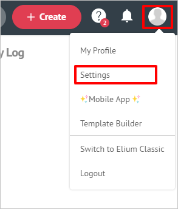
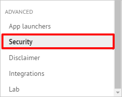
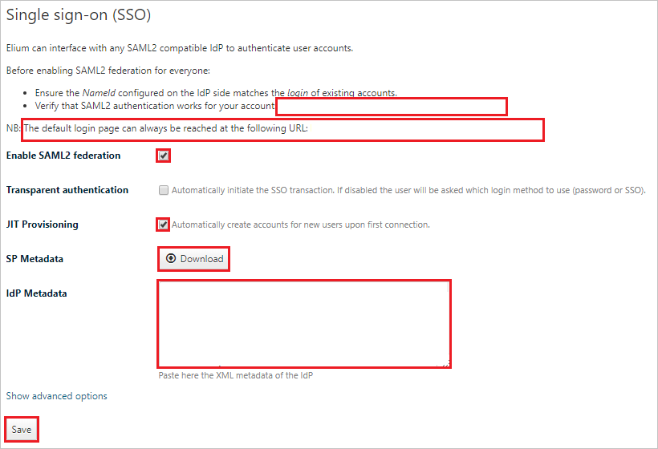
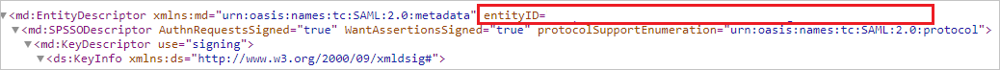
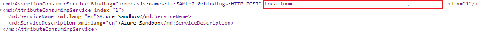

# Configure Elium for Single sign-on with Microsoft Entra ID

In this article,  you learn how to integrate Elium with Microsoft Entra ID. When you integrate Elium with Microsoft Entra ID, you can:

* Control in Microsoft Entra ID who has access to Elium.
* Enable your users to be automatically signed-in to Elium with their Microsoft Entra accounts.
* Manage your accounts in one central location.

## Prerequisites
The scenario outlined in this article assumes that you already have the following prerequisites:

[!INCLUDE [common-prerequisites.md](~/identity/saas-apps/includes/common-prerequisites.md)]
* Elium single sign-on (SSO) enabled subscription.

> [!NOTE]
> This integration is also available to use from Microsoft Entra US Government Cloud environment. You can find this application in the Microsoft Entra US Government Cloud Application Gallery and configure it in the same way as you do from public cloud.

## Scenario description

In this article,  you configure and test Microsoft Entra SSO in a test environment.

* Elium supports **SP and IDP** initiated SSO.
* Elium supports **Just In Time** user provisioning.
* Elium supports [Automated user provisioning](elium-provisioning-tutorial.md).

## Add Elium from the gallery

To configure the integration of Elium into Microsoft Entra ID, you need to add Elium from the gallery to your list of managed SaaS apps.

1. Sign in to the [Microsoft Entra admin center](https://entra.microsoft.com) as at least a [Cloud Application Administrator](~/identity/role-based-access-control/permissions-reference.md#cloud-application-administrator).
1. Browse to **Entra ID** > **Enterprise apps** > **New application**.
1. In the **Add from the gallery** section, type **Elium** in the search box.
1. Select **Elium** from results panel and then add the app. Wait a few seconds while the app is added to your tenant.

 Alternatively, you can also use the [Enterprise App Configuration Wizard](https://portal.office.com/AdminPortal/home?Q=Docs#/azureadappintegration). In this wizard, you can add an application to your tenant, add users/groups to the app, assign roles, and walk through the SSO configuration as well. [Learn more about Microsoft 365 wizards.](/microsoft-365/admin/misc/azure-ad-setup-guides)

## Configure and test Microsoft Entra SSO for Elium

Configure and test Microsoft Entra SSO with Elium using a test user called **B.Simon**. For SSO to work, you need to establish a link relationship between a Microsoft Entra user and the related user in Elium.

To configure and test Microsoft Entra SSO with Elium, perform the following steps:

1. **[Configure Microsoft Entra SSO](#configure-azure-ad-sso)** - to enable your users to use this feature.
    1. **Create a Microsoft Entra test user** - to test Microsoft Entra single sign-on with B.Simon.
    1. **Assign the Microsoft Entra test user** - to enable B.Simon to use Microsoft Entra single sign-on.
1. **[Configure Elium SSO](#configure-elium-sso)** - to configure the single sign-on settings on application side.
    1. **[Create Elium test user](#create-elium-test-user)** - to have a counterpart of B.Simon in Elium that's linked to the Microsoft Entra representation of user.
1. **[Test SSO](#test-sso)** - to verify whether the configuration works.

## Configure Microsoft Entra SSO

Follow these steps to enable Microsoft Entra SSO.

1. Sign in to the [Microsoft Entra admin center](https://entra.microsoft.com) as at least a [Cloud Application Administrator](~/identity/role-based-access-control/permissions-reference.md#cloud-application-administrator).
1. Browse to **Entra ID** > **Enterprise apps** > **Elium** > **Single sign-on**.
1. On the **Select a single sign-on method** page, select **SAML**.
1. On the **Set up single sign-on with SAML** page, select the pencil icon for **Basic SAML Configuration** to edit the settings.

   

1. On the **Basic SAML Configuration** section, if you wish to configure the application in **IDP** initiated mode, perform the following steps:

    a. In the **Identifier** text box, type a URL using the following pattern:
    `https://<platform-domain>.elium.com/login/saml2/metadata`

    b. In the **Reply URL** text box, type a URL using the following pattern:
    `https://<platform-domain>.elium.com/login/saml2/acs`

1. Select **Set additional URLs** and perform the following step if you wish to configure the application in **SP** initiated mode:

    In the **Sign-on URL** text box, type a URL using the following pattern:
    `https://<platform-domain>.elium.com/login/saml2/login`

	> [!NOTE]
	> These values aren't real. You get these values from the **SP metadata file** downloadable at `https://<platform-domain>.elium.com/login/saml2/metadata`, which is explained later in this article.

1. Elium application expects the SAML assertions in a specific format, which requires you to add custom attribute mappings to your SAML token attributes configuration. The following screenshot shows the list of default attributes.

	

1. In addition to above, Elium application expects few more attributes to be passed back in SAML response which are shown below. These attributes are also pre populated but you can review them as per your requirements.

	| Name | Source Attribute|
	| ---------------| ----------------|
	| email   |user.mail |
	| first_name| user.givenname |
	| last_name| user.surname|
	| job_title| user.jobtitle|
	| company| user.companyname|

	> [!NOTE]
	> These are the default claims. **Only email claim is required**. For JIT provisioning also only email claim is mandatory. Other custom claims can vary from one customer platform to another customer platform.

1. On the **Set up single sign-on with SAML** page, in the **SAML Signing Certificate** section,  find **Federation Metadata XML** and select **Download** to download the certificate and save it on your computer.

	

1. On the **Set up Elium** section, copy the appropriate URL(s) based on your requirement.

	

[!INCLUDE [create-assign-users-sso.md](~/identity/saas-apps/includes/create-assign-users-sso.md)]

## Configure Elium SSO

1. In a different web browser window, sign in to your Elium company site as an administrator

1. Select the **User profile** from right top corner and then select **Settings**.

	

1. Select **Security** under **Advanced**.

	

1. Scroll down to the **Single sign-on (SSO)** section and perform the following steps:

	

	a. Copy the value of **Verify that SAML2 authentication works for your account** and paste it in the **Sign-on URL** textbox on the **Basic SAML Configuration** section.

	> [!NOTE]
	> After configuring SSO, you can always access the default remote login page at the following URL: `https://<platform_domain>/login/regular/login`. 

	b. Select **Enable SAML2 federation** checkbox.

	c. Select **JIT Provisioning** checkbox.

	d. Open the **SP Metadata** by selecting the **Download** button.

	e. Search for the **entityID** in the **SP Metadata** file, copy the **entityID** value and paste it in the **Identifier** textbox on the **Basic SAML Configuration** section. 

	

	f. Search for the **AssertionConsumerService** in the **SP Metadata** file, copy the **Location** value and paste it in the **Reply URL** textbox on the **Basic SAML Configuration** section.

	

	g. Open the downloaded metadata file from Azure portal into notepad, copy the content and paste it into the **IdP Metadata** textbox.

	h. Select **Save**.

### Create Elium test user

In this section, a user called B.Simon is created in Elium. Elium supports **just-in-time provisioning**, which is enabled by default. There's no action item for you in this section. If a user doesn't already exist in Elium, a new one is created when you attempt to access Elium.

Elium also supports automatic user provisioning, you can find more details [here](./elium-provisioning-tutorial.md) on how to configure automatic user provisioning.

## Test SSO 

In this section, you test your Microsoft Entra single sign-on configuration with following options. 
 
#### SP initiated:
 
* Select **Test this application**, this option redirects to Elium Sign on URL where you can initiate the login flow.  
 
* Go to Elium Sign-on URL directly and initiate the login flow from there.
 
#### IDP initiated:
 
* Select **Test this application**, and you should be automatically signed in to the Elium for which you set up the SSO 
 
You can also use Microsoft My Apps to test the application in any mode. When you select the Elium tile in the My Apps, if configured in SP mode you would be redirected to the application sign on page for initiating the login flow and if configured in IDP mode, you should be automatically signed in to the Elium for which you set up the SSO. For more information about the My Apps, see [Introduction to the My Apps](https://support.microsoft.com/account-billing/sign-in-and-start-apps-from-the-my-apps-portal-2f3b1bae-0e5a-4a86-a33e-876fbd2a4510).

## Related content

Once you configure Elium you can enforce session control, which protects exfiltration and infiltration of your organization’s sensitive data in real time. Session control extends from Conditional Access. [Learn how to enforce session control with Microsoft Defender for Cloud Apps](/cloud-app-security/proxy-deployment-any-app).
