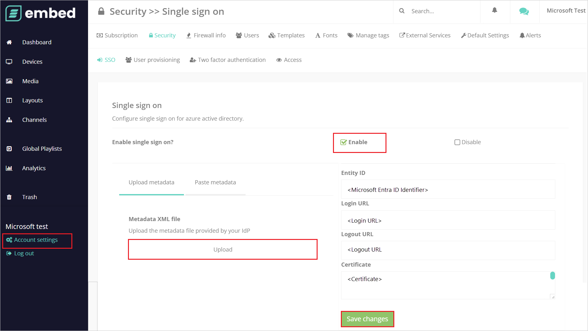
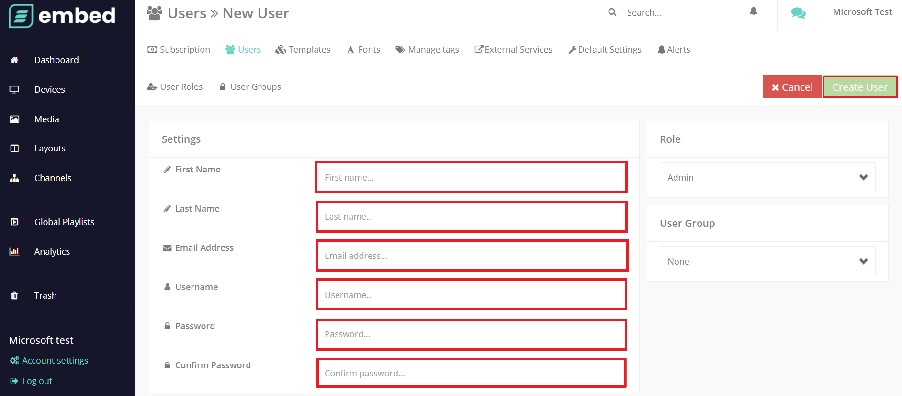

# Configure embed signage for Single sign-on with Microsoft Entra ID

In this article,  you learn how to integrate embed signage with Microsoft Entra ID. When you integrate embed signage with Microsoft Entra ID, you can:

* Control in Microsoft Entra ID who has access to embed signage.
* Enable your users to be automatically signed-in to embed signage with their Microsoft Entra accounts.
* Manage your accounts in one central location.

## Prerequisites
The scenario outlined in this article assumes that you already have the following prerequisites:

[!INCLUDE [common-prerequisites.md](~/identity/saas-apps/includes/common-prerequisites.md)]
* embed signage single sign-on (SSO) enabled subscription.

## Scenario description

In this article,  you configure and test Microsoft Entra SSO in a test environment.

* embed signage supports **IDP** initiated SSO.

## Add embed signage from the gallery

To configure the integration of embed signage into Microsoft Entra ID, you need to add embed signage from the gallery to your list of managed SaaS apps.

1. Sign in to the [Microsoft Entra admin center](https://entra.microsoft.com) as at least a [Cloud Application Administrator](~/identity/role-based-access-control/permissions-reference.md#cloud-application-administrator).
1. Browse to **Entra ID** > **Enterprise apps** > **New application**.
1. In the **Add from the gallery** section, type **embed signage** in the search box.
1. Select **embed signage** from results panel and then add the app. Wait a few seconds while the app is added to your tenant.

 Alternatively, you can also use the [Enterprise App Configuration Wizard](https://portal.office.com/AdminPortal/home?Q=Docs#/azureadappintegration). In this wizard, you can add an application to your tenant, add users/groups to the app, assign roles, and walk through the SSO configuration as well. [Learn more about Microsoft 365 wizards.](/microsoft-365/admin/misc/azure-ad-setup-guides)

## Configure and test Microsoft Entra SSO for embed signage

Configure and test Microsoft Entra SSO with embed signage using a test user called **B.Simon**. For SSO to work, you need to establish a link relationship between a Microsoft Entra user and the related user in embed signage.

To configure and test Microsoft Entra SSO with embed signage, perform the following steps:

1. **[Configure Microsoft Entra SSO](#configure-azure-ad-sso)** - to enable your users to use this feature.
    1. **Create a Microsoft Entra test user** - to test Microsoft Entra single sign-on with B.Simon.
    1. **Assign the Microsoft Entra test user** - to enable B.Simon to use Microsoft Entra single sign-on.
1. **[Configure embed signage SSO](#configure-embed-signage-sso)** - to configure the single sign-on settings on application side.
    1. **[Create embed signage test user](#create-embed-signage-test-user)** - to have a counterpart of B.Simon in embed signage that's linked to the Microsoft Entra representation of user.
1. **[Test SSO](#test-sso)** - to verify whether the configuration works.

## Configure Microsoft Entra SSO

Follow these steps to enable Microsoft Entra SSO.

1. Sign in to the [Microsoft Entra admin center](https://entra.microsoft.com) as at least a [Cloud Application Administrator](~/identity/role-based-access-control/permissions-reference.md#cloud-application-administrator).
1. Browse to **Entra ID** > **Enterprise apps** > **embed signage** > **Single sign-on**.
1. On the **Select a single sign-on method** page, select **SAML**.
1. On the **Set up single sign-on with SAML** page, select the pencil icon for **Basic SAML Configuration** to edit the settings.

   

1. On the **Basic SAML Configuration** page, perform the following steps:

    a. In the **Identifier** text box, type a URL using the following pattern:
    `https://app.embedsignage.com/auth/saml/<ID>`

    b. In the **Reply URL** text box, type a URL using the following pattern:
    `https://app.embedsignage.com/auth/saml/login/<ID>`

	> [!NOTE]
	> These values aren't real. Update these values with the actual Identifier and Reply URL. Contact [embed signage Client support team](mailto:support@embedsignage.com) to get these values. You can also refer to the patterns shown in the **Basic SAML Configuration** section.

1. On the **Set up single sign-on with SAML** page, in the **SAML Signing Certificate** section,  find **Federation Metadata XML** and select **Download** to download the certificate and save it on your computer.

	

1. On the **Set up embed signage** section, copy the appropriate URL(s) based on your requirement.

	

[!INCLUDE [create-assign-users-sso.md](~/identity/saas-apps/includes/create-assign-users-sso.md)]

## Configure embed signage SSO

1. In a different web browser window, sign in to your up Embed Signage company site as an administrator

1. Go to **Account settings** and select **Security** > **Single sign on**.

1. In the **Single sign on** section, perform the following steps:

    

    1. **Enable** single sign on checkbox.

    1. Open the downloaded **Federation Metadata XML** and upload the file into **Metadata XML file**.

    1. Select **Save Changes**.

### Create embed signage test user

1. In a different web browser window, sign in to your embed signage company site as an administrator.

1. Go to **Account settings** and select **Users** > **New User**.

1. In the **Settings** section, fill the required fields  manually in the following page and select **Create User**.  

    

## Test SSO 

In this section, you test your Microsoft Entra single sign-on configuration with following options.

* Select **Test this application**, and you should be automatically signed in to the embed signage for which you set up the SSO.

* You can use Microsoft My Apps. When you select the embed signage tile in the My Apps, you should be automatically signed in to the embed signage for which you set up the SSO. For more information, see [Microsoft Entra My Apps](/azure/active-directory/manage-apps/end-user-experiences#azure-ad-my-apps).

## Related content

Once you configure embed signage you can enforce session control, which protects exfiltration and infiltration of your organization’s sensitive data in real time. Session control extends from Conditional Access. [Learn how to enforce session control with Microsoft Defender for Cloud Apps](/cloud-app-security/proxy-deployment-aad).
