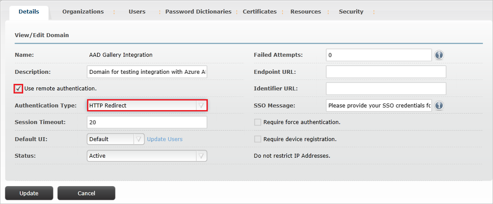
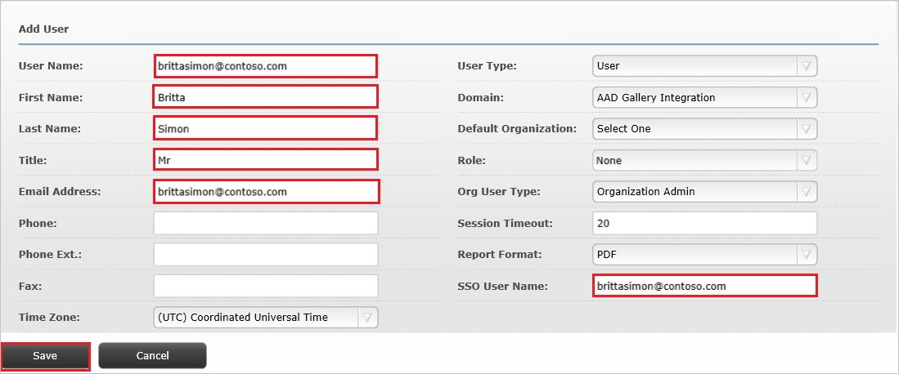

# Microsoft Entra integration with Envi MMIS

In this article,  you learn how to integrate Envi MMIS with Microsoft Entra ID. When you integrate Envi MMIS with Microsoft Entra ID, you can:

* Control in Microsoft Entra ID who has access to Envi MMIS.
* Enable your users to be automatically signed-in to Envi MMIS with their Microsoft Entra accounts.
* Manage your accounts in one central location.

## Prerequisites
The scenario outlined in this article assumes that you already have the following prerequisites:
[!INCLUDE [common-prerequisites.md](~/identity/saas-apps/includes/common-prerequisites.md)]
* Envi MMIS single sign-on (SSO) enabled subscription.

## Scenario description

In this article,  you configure and test Microsoft Entra single sign-on in a test environment.

* Envi MMIS supports **SP** and **IDP** initiated SSO.

## Add Envi MMIS from the gallery

To configure the integration of Envi MMIS into Microsoft Entra ID, you need to add Envi MMIS from the gallery to your list of managed SaaS apps.

1. Sign in to the [Microsoft Entra admin center](https://entra.microsoft.com) as at least a [Cloud Application Administrator](~/identity/role-based-access-control/permissions-reference.md#cloud-application-administrator).
1. Browse to **Identity** > **Applications** > **Enterprise applications** > **New application**.
1. In the **Add from the gallery** section, type **Envi MMIS** in the search box.
1. Select **Envi MMIS** from results panel and then add the app. Wait a few seconds while the app is added to your tenant.

 Alternatively, you can also use the [Enterprise App Configuration Wizard](https://portal.office.com/AdminPortal/home?Q=Docs#/azureadappintegration). In this wizard, you can add an application to your tenant, add users/groups to the app, assign roles, and walk through the SSO configuration as well. [Learn more about Microsoft 365 wizards.](/microsoft-365/admin/misc/azure-ad-setup-guides)

## Configure and test Microsoft Entra SSO for Envi MMIS

Configure and test Microsoft Entra SSO with Envi MMIS using a test user called **B.Simon**. For SSO to work, you need to establish a link relationship between a Microsoft Entra user and the related user in Envi MMIS.

To configure and test Microsoft Entra SSO with Envi MMIS, perform the following steps:

1. **[Configure Microsoft Entra SSO](#configure-azure-ad-sso)** - to enable your users to use this feature.
    1. **Create a Microsoft Entra test user** - to test Microsoft Entra single sign-on with B.Simon.
    1. **Assign the Microsoft Entra test user** - to enable B.Simon to use Microsoft Entra single sign-on.
1. **[Configure Envi MMIS SSO](#configure-envi-mmis-sso)** - to configure the single sign-on settings on application side.
    1. **[Create Envi MMIS test user](#create-envi-mmis-test-user)** - to have a counterpart of B.Simon in Envi MMIS that's linked to the Microsoft Entra representation of user.
1. **[Test SSO](#test-sso)** - to verify whether the configuration works.

## Configure Microsoft Entra SSO

Follow these steps to enable Microsoft Entra SSO.

1. Sign in to the [Microsoft Entra admin center](https://entra.microsoft.com) as at least a [Cloud Application Administrator](~/identity/role-based-access-control/permissions-reference.md#cloud-application-administrator).
1. Browse to **Identity** > **Applications** > **Enterprise applications** > **Envi MMIS** > **Single sign-on**.
1. On the **Select a single sign-on method** page, select **SAML**.
1. On the **Set up single sign-on with SAML** page, select the pencil icon for **Basic SAML Configuration** to edit the settings.

   

1. On the **Basic SAML Configuration** section, If you wish to configure the application in **IDP** initiated mode, perform the following steps:

    1. In the **Identifier** text box, type a URL using the following pattern:
    `https://www.<CUSTOMER DOMAIN>.com/Account`

    1. In the **Reply URL** text box, type a URL using the following pattern:
    `https://www.<CUSTOMER DOMAIN>.com/Account/Acs`

1. Select **Set additional URLs** and perform the following step if you wish to configure the application in **SP** initiated mode:

    In the **Sign-on URL** text box, type a URL using the following pattern:
    `https://www.<CUSTOMER DOMAIN>.com/Account`

    > [!NOTE]
    > These values aren't real. Update these values with the actual Identifier, Reply URL and Sign-on URL. Contact [Envi MMIS Client support team](mailto:support@ioscorp.com) to get these values. You can also refer to the patterns shown in the **Basic SAML Configuration** section.

1. On the **Set-up Single Sign-On with SAML** page, in the **SAML Signing Certificate** section, select **Download** to download the **Federation Metadata XML** from the given options as per your requirement and save it on your computer.

    

1. On the **Set up Envi MMIS** section, copy the appropriate URL(s) as per your requirement.

    

[!INCLUDE [create-assign-users-sso.md](~/identity/saas-apps/includes/create-assign-users-sso.md)]

## Configure Envi MMIS SSO

1. In a different web browser window, sign into your Envi MMIS site as an administrator.

2. Select **My Domain** tab.

    

3. Select **Edit**.

    

4. Select **Use remote authentication** checkbox and then select **HTTP Redirect** from the **Authentication Type** dropdown.

    

5. Select **Resources** tab and then select **Upload Metadata**.

    

6. In the **Upload Metadata** pop-up, perform the following steps:

    

    1. Select **File** option from the **Upload From** dropdown.

    1. Upload the downloaded metadata file from Azure portal by selecting the **choose file icon**.

    1. Select **Ok**.

7. After uploading the downloaded metadata file, the fields gets populated automatically. Select **Update**.

    

### Create Envi MMIS test user

To enable Microsoft Entra users to sign in to Envi MMIS, they must be provisioned into Envi MMIS. In the case of Envi MMIS, provisioning is a manual task.

**To provision a user account, perform the following steps:**

1. Sign in to your Envi MMIS company site as an administrator.

2. Select **User List** tab.

    

3. Select **Add User** button.

    

4. In the **Add User** section, perform the following steps:

    

    1. In the **User Name** textbox, type the username of Britta Simon account like **brittasimon\@contoso.com**.
    
    1. In the **First Name** textbox, type the first name of BrittaSimon like **Britta**.

    1. In the **Last Name** textbox, type the last name of BrittaSimon like **Simon**.

    1. Enter the Title of the user in the **Title** of the textbox.

    1. In the **Email Address** textbox, type the email address of Britta Simon account like **brittasimon\@contoso.com**.

    1. In the **SSO User Name** textbox, type the username of Britta Simon account like **brittasimon\@contoso.com**.

    1. Select **Save**.

## Test SSO

In this section, you test your Microsoft Entra single sign-on configuration with following options. 

#### SP initiated:

* Select **Test this application**, this option redirects to Envi MMIS Sign on URL where you can initiate the login flow.  

* Go to Envi MMIS Sign-on URL directly and initiate the login flow from there.

#### IDP initiated:

* Select **Test this application**, and you should be automatically signed in to the Envi MMIS for which you set up the SSO. 

You can also use Microsoft My Apps to test the application in any mode. When you select the Envi MMIS tile in the My Apps, if configured in SP mode you would be redirected to the application sign on page for initiating the login flow and if configured in IDP mode, you should be automatically signed in to the Envi MMIS for which you set up the SSO. For more information about the My Apps, see [Introduction to the My Apps](https://support.microsoft.com/account-billing/sign-in-and-start-apps-from-the-my-apps-portal-2f3b1bae-0e5a-4a86-a33e-876fbd2a4510).

## Related content

Once you configure Envi MMIS you can enforce session control, which protects exfiltration and infiltration of your organization’s sensitive data in real time. Session control extends from Conditional Access. [Learn how to enforce session control with Microsoft Defender for Cloud Apps](/cloud-app-security/proxy-deployment-aad).
