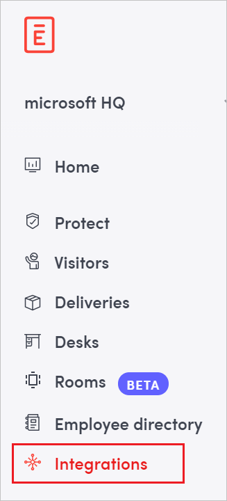
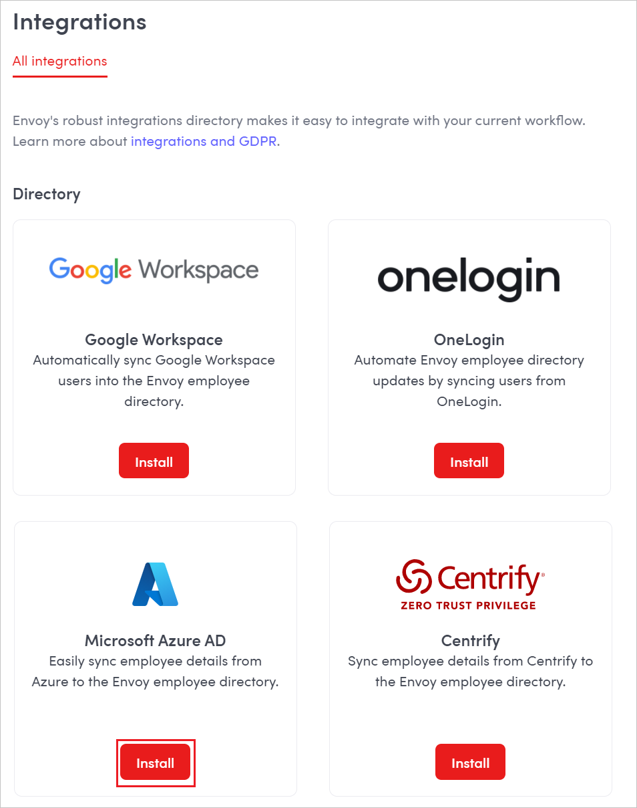
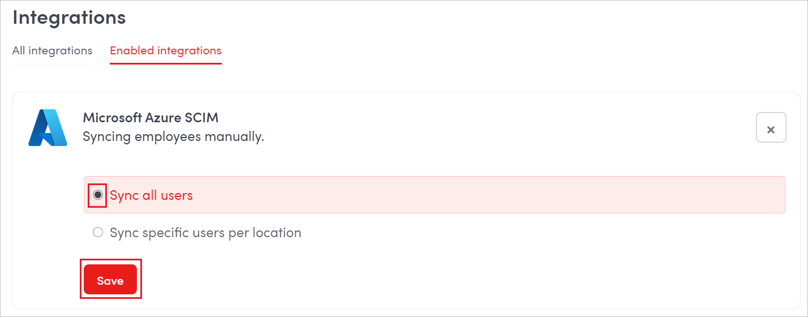
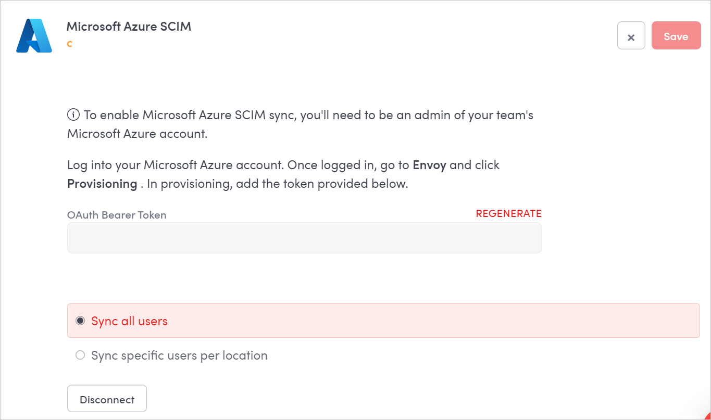

# Configure Envoy for automatic user provisioning with Microsoft Entra ID

This article describes the steps you need to perform in both Envoy and Microsoft Entra ID to configure automatic user provisioning. When configured, Microsoft Entra ID automatically provisions and de-provisions users and groups to [Envoy](https://envoy.com/pricing/) using the Microsoft Entra provisioning service. For important details on what this service does, how it works, and frequently asked questions, see [Automate user provisioning and deprovisioning to SaaS applications with Microsoft Entra ID](~/identity/app-provisioning/user-provisioning.md). 

## Capabilities supported
> [!div class="checklist"]
> * Create users in Envoy
> * Remove users in Envoy when they don't require access anymore
> * Keep user attributes synchronized between Microsoft Entra ID and Envoy
> * Provision groups and group memberships in Envoy
> * [Single sign-on](./envoy-tutorial.md) to Envoy (recommended)

## Prerequisites

The scenario outlined in this article assumes that you already have the following prerequisites:

* [A Microsoft Entra tenant](~/identity-platform/quickstart-create-new-tenant.md) 
* A user account in Microsoft Entra ID with [permission](~/identity/role-based-access-control/permissions-reference.md) to configure provisioning (like [Application Administrator](/entra/identity/role-based-access-control/permissions-reference#application-administrator), [Cloud Application Administrator](/entra/identity/role-based-access-control/permissions-reference#cloud-application-administrator), or [Application Owner](/entra/fundamentals/users-default-permissions#owned-enterprise-applications)). 
* [An Envoy tenant](https://envoy.com/pricing/).
* A user account in Envoy with Admin permissions.

> [!NOTE]
> This integration is also available to use from Microsoft Entra US Government Cloud environment. You can find this application in the Microsoft Entra US Government Cloud Application Gallery and configure it in the same way as you do from public cloud.

## Step 1: Plan your provisioning deployment
1. Learn about [how the provisioning service works](~/identity/app-provisioning/user-provisioning.md).
2. Determine who's in [scope for provisioning](~/identity/app-provisioning/define-conditional-rules-for-provisioning-user-accounts.md).
3. Determine what data to [map between Microsoft Entra ID and Envoy](~/identity/app-provisioning/customize-application-attributes.md). 

## Step 2: Configure Envoy to support provisioning with Microsoft Entra ID

1. Sign in to your [Envoy Admin Console](https://dashboard.envoy.com/login). Select **Integrations**.

	

2. Select **Install** for the **Microsoft Azure SCIM integration**.

	

3. Select **Save** for **Sync all users**. 

	

4. Copy the **OAUTH BEARER TOKEN**. This value is entered in the **Secret Token** field in the provisioning tab of your Envoy application.
	
	

## Step 3: Add Envoy from the Microsoft Entra application gallery

Add Envoy from the Microsoft Entra application gallery to start managing provisioning to Envoy. If you have previously setup Envoy for SSO you can use the same application. However, we recommend that you create a separate app when testing out the integration initially. Learn more about adding an application from the gallery [here](~/identity/enterprise-apps/add-application-portal.md). 

## Step 4: Define who is in scope for provisioning 

[!INCLUDE [create-assign-users-provisioning.md](~/identity/saas-apps/includes/create-assign-users-provisioning.md)]

## Step 5: Configure automatic user provisioning to Envoy 

This section guides you through the steps to configure the Microsoft Entra provisioning service to create, update, and disable users and/or groups in TestApp based on user and/or group assignments in Microsoft Entra ID.

### To configure automatic user provisioning for Envoy in Microsoft Entra ID:

1. Sign in to the [Microsoft Entra admin center](https://entra.microsoft.com) as at least a [Cloud Application Administrator](~/identity/role-based-access-control/permissions-reference.md#cloud-application-administrator).
1. Browse to **Entra ID** > **Enterprise apps**

	

1. In the applications list, select **Envoy**.

	

3. Select the **Provisioning** tab.

	

4. Set the **Provisioning Mode** to **Automatic**.

	

5. Under the **Admin Credentials** section, input `https://app.envoy.com/scim/v2` in **Tenant URL**. Input the **OAUTH BEARER TOKEN** value retrieved earlier in **Secret Token**. Select **Test Connection** to ensure Microsoft Entra ID can connect to Envoy. If the connection fails, ensure your Envoy account has Admin permissions and try again.

   

6. In the **Notification Email** field, enter the email address of a person or group who should receive the provisioning error notifications and select the **Send an email notification when a failure occurs** check box.

	

7. Select **Save**.

8. Under the **Mappings** section, select **Synchronize Microsoft Entra users to Envoy**.

9. Review the user attributes that are synchronized from Microsoft Entra ID to Envoy in the **Attribute-Mapping** section. The attributes selected as **Matching** properties are used to match the user accounts in Envoy for update operations. If you choose to change the [matching target attribute](~/identity/app-provisioning/customize-application-attributes.md), you need to ensure that the Envoy API supports filtering users based on that attribute. Select the **Save** button to commit any changes.

   |Attribute|Type|
   |---|---|
   |userName|String|
   |externalId|String|
   |displayName|String|
   |title|String|
   |emails[type eq "work"].value|String|
   |preferredLanguage|String|
   |department|String|
   |addresses[type eq "work"].country|String|
   |addresses[type eq "work"].locality|String|
   |addresses[type eq "work"].region|String|
   |addresses[type eq "work"].postalCode|String|
   |addresses[type eq "work"].formatted|String|
   |addresses[type eq "work"].streetAddress|String|
   |name.givenName|String|
   |name.familyName|String|
   |name.formatted|String|
   |phoneNumbers[type eq "mobile"].value|String|
   |phoneNumbers[type eq "work"].value|String|
   |locale|String|

10. Under the **Mappings** section, select **Synchronize Microsoft Entra groups to Envoy**.

11. Review the group attributes that are synchronized from Microsoft Entra ID to Envoy in the **Attribute-Mapping** section. The attributes selected as **Matching** properties are used to match the groups in Envoy for update operations. Select the **Save** button to commit any changes.

      |Attribute|Type|
      |---|---|
      |displayName|String|
      |externalId|String|
      |members|Reference|

12. To configure scoping filters, refer to the following instructions provided in the [Scoping filter  article](~/identity/app-provisioning/define-conditional-rules-for-provisioning-user-accounts.md).

13. To enable the Microsoft Entra provisioning service for Envoy, change the **Provisioning Status** to **On** in the **Settings** section.

	

14. Define the users and/or groups that you would like to provision to Envoy by choosing the desired values in **Scope** in the **Settings** section.

	

15. When you're ready to provision, select **Save**.

	

This operation starts the initial synchronization cycle of all users and groups defined in **Scope** in the **Settings** section. The initial cycle takes longer to perform than subsequent cycles, which occur approximately every 40 minutes as long as the Microsoft Entra provisioning service is running. 

## Step 6: Monitor your deployment

[!INCLUDE [monitor-deployment.md](~/identity/saas-apps/includes/monitor-deployment.md)]

## Additional resources

* [Managing user account provisioning for Enterprise Apps](~/identity/app-provisioning/configure-automatic-user-provisioning-portal.md)
* [What is application access and single sign-on with Microsoft Entra ID?](~/identity/enterprise-apps/what-is-single-sign-on.md)

## Related content

* [Learn how to review logs and get reports on provisioning activity](~/identity/app-provisioning/check-status-user-account-provisioning.md)
