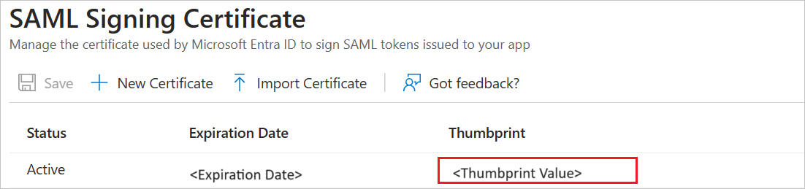
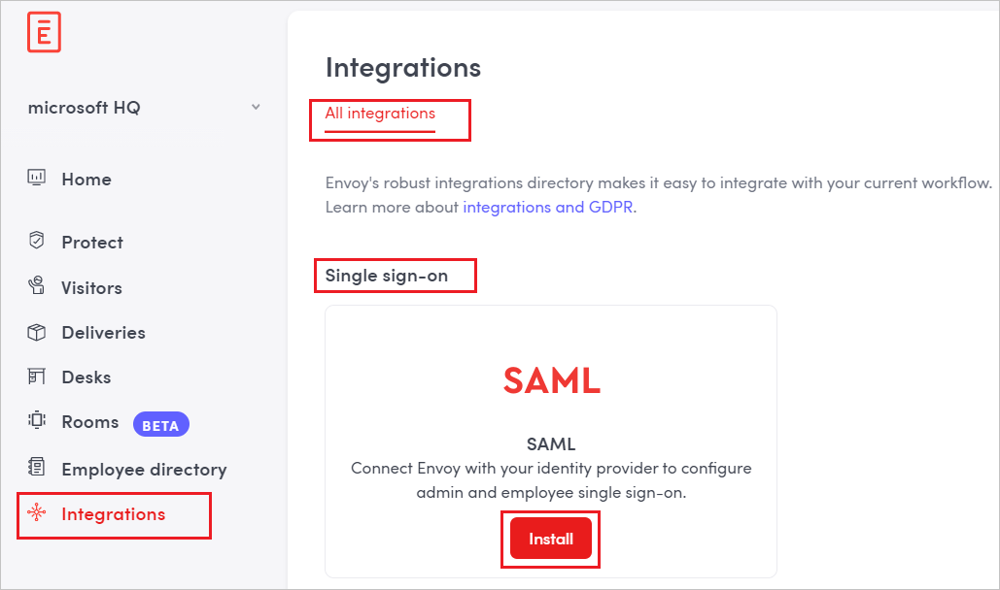
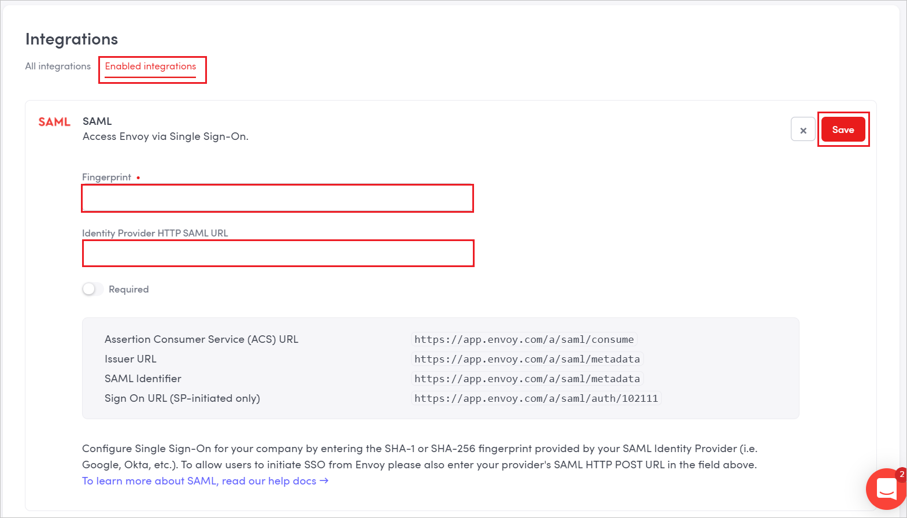

# Configure Envoy for Single sign-on with Microsoft Entra ID

In this article,  you learn how to integrate Envoy with Microsoft Entra ID. When you integrate Envoy with Microsoft Entra ID, you can:

* Control in Microsoft Entra ID who has access to Envoy.
* Enable your users to be automatically signed-in to Envoy with their Microsoft Entra accounts.
* Manage your accounts in one central location.

## Prerequisites

The scenario outlined in this article assumes that you already have the following prerequisites:

[!INCLUDE [common-prerequisites.md](~/identity/saas-apps/includes/common-prerequisites.md)]
* Envoy single sign-on (SSO) enabled subscription.

> [!NOTE]
> This integration is also available to use from Microsoft Entra US Government Cloud environment. You can find this application in the Microsoft Entra US Government Cloud Application Gallery and configure it in the same way as you do from public cloud.

## Scenario description

In this article,  you configure and test Microsoft Entra SSO in a test environment.

* Envoy supports **SP** initiated SSO.

* Envoy supports **Just In Time** user provisioning.

* Envoy supports [Automated user provisioning](envoy-provisioning-tutorial.md).

> [!NOTE]
> Identifier of this application is a fixed string value so only one instance can be configured in one tenant.

## Add Envoy from the gallery

To configure the integration of Envoy into Microsoft Entra ID, you need to add Envoy from the gallery to your list of managed SaaS apps.

1. Sign in to the [Microsoft Entra admin center](https://entra.microsoft.com) as at least a [Cloud Application Administrator](~/identity/role-based-access-control/permissions-reference.md#cloud-application-administrator).
1. Browse to **Entra ID** > **Enterprise apps** > **New application**.
1. In the **Add from the gallery** section, type **Envoy** in the search box.
1. Select **Envoy** from results panel and then add the app. Wait a few seconds while the app is added to your tenant.

 [!INCLUDE [sso-wizard.md](~/identity/saas-apps/includes/sso-wizard.md)]

## Configure and test Microsoft Entra SSO for Envoy

Configure and test Microsoft Entra SSO with Envoy using a test user called **B.Simon**. For SSO to work, you need to establish a link relationship between a Microsoft Entra user and the related user in Envoy.

To configure and test Microsoft Entra SSO with Envoy, perform the following steps:

1. **[Configure Microsoft Entra SSO](#configure-azure-ad-sso)** - to enable your users to use this feature.
    1. **Create a Microsoft Entra test user** - to test Microsoft Entra single sign-on with B.Simon.
    1. **Assign the Microsoft Entra test user** - to enable B.Simon to use Microsoft Entra single sign-on.
1. **[Configure Envoy SSO](#configure-envoy-sso)** - to configure the single sign-on settings on application side.
    1. **[Create Envoy test user](#create-envoy-test-user)** - to have a counterpart of B.Simon in Envoy that's linked to the Microsoft Entra representation of user.
1. **[Test SSO](#test-sso)** - to verify whether the configuration works.

## Configure Microsoft Entra SSO

Follow these steps to enable Microsoft Entra SSO.

1. Sign in to the [Microsoft Entra admin center](https://entra.microsoft.com) as at least a [Cloud Application Administrator](~/identity/role-based-access-control/permissions-reference.md#cloud-application-administrator).
1. Browse to **Entra ID** > **Enterprise apps** > **Envoy** > **Single sign-on**.
1. On the **Select a single sign-on method** page, select **SAML**.
1. On the **Set up single sign-on with SAML** page, select the pencil icon for **Basic SAML Configuration** to edit the settings.

   

1. On the **Basic SAML Configuration** section, perform the following step:

    In the **Sign-on URL** text box, type a URL using the following pattern:
    `https://app.envoy.com/a/saml/auth/<company-ID-from-Envoy>`

	> [!NOTE]
	> The value isn't real. Update the value with the actual Sign-On URL. Contact [Envoy Client support team](https://envoy.com/contact/) to get the value. You can also refer to the patterns shown in the **Basic SAML Configuration** section.

1. In the **SAML Signing Certificate** section, select **Edit** button to open **SAML Signing Certificate** dialog.

	

1. In the **SAML Signing Certificate** section, copy the **Thumbprint Value** and save it on your computer.

    

1. On the **Set up Envoy** section, copy the appropriate URL(s) based on your requirement.

	

[!INCLUDE [create-assign-users-sso.md](~/identity/saas-apps/includes/create-assign-users-sso.md)]

## Configure Envoy SSO

1. In a different web browser window, sign in to your Envoy company site as an administrator

4. Go to **Integrations** > **All integrations** and select to **Install** SAML under **Single sign-on**.

	

5. Navigate to **Enabled integrations** section, and  perform the following steps:

	
	
	>[!NOTE]
	>The value for the HQ location ID is auto generated by the application.
	
	a. In **Fingerprint** textbox, paste the **Thumbprint** value of certificate.
	
	b. Paste **Login URL** value, which you have copied form the Azure portal into the **IDENTITY PROVIDER HTTP SAML URL** textbox.
	
	c. Select **Save**.

### Create Envoy test user

In this section, a user called Britta Simon is created in Envoy. 

Envoy supports automatic user provisioning, which you can read about [here](./envoy-provisioning-tutorial.md) on how to configure automatic user provisioning.

## Test SSO 

In this section, you test your Microsoft Entra single sign-on configuration with following options. 

* Select **Test this application**, this option redirects to Envoy Sign-on URL where you can initiate the login flow. 

* Go to Envoy Sign-on URL directly and initiate the login flow from there.

* You can use Microsoft My Apps. When you select the Envoy tile in the My Apps, this option redirects to Envoy Sign-on URL. For more information about the My Apps, see [Introduction to the My Apps](https://support.microsoft.com/account-billing/sign-in-and-start-apps-from-the-my-apps-portal-2f3b1bae-0e5a-4a86-a33e-876fbd2a4510).

## Related content

Once you configure Envoy you can enforce session control, which protects exfiltration and infiltration of your organization’s sensitive data in real time. Session control extends from Conditional Access. [Learn how to enforce session control with Microsoft Defender for Cloud Apps](/cloud-app-security/proxy-deployment-any-app).
