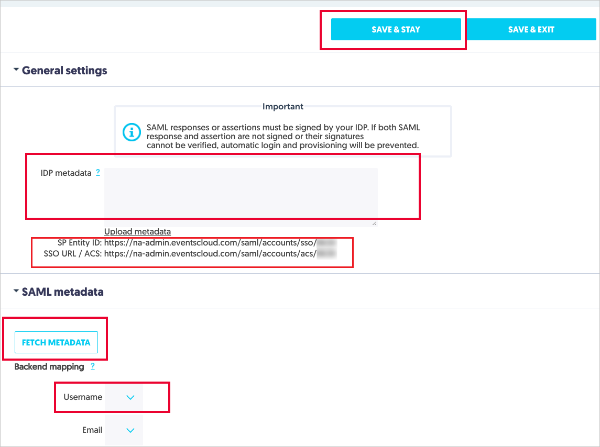

# Configure Aventri for Single sign-on with Microsoft Entra ID

In this article,  you learn how to integrate Aventri with Microsoft Entra ID. When you integrate Aventri with Microsoft Entra ID, you can:

* Control in Microsoft Entra ID who has access to Aventri.
* Enable your users to be automatically signed-in to Aventri with their Microsoft Entra accounts.
* Manage your accounts in one central location.

To learn more about SaaS app integration with Microsoft Entra ID, see [What is application access and single sign-on with Microsoft Entra ID](~/identity/enterprise-apps/what-is-single-sign-on.md).

## Prerequisites

The scenario outlined in this article assumes that you already have the following prerequisites:

[!INCLUDE [common-prerequisites.md](~/identity/saas-apps/includes/common-prerequisites.md)]
* Aventri single sign-on (SSO) enabled subscription.

## Scenario description

In this article,  you configure and test Microsoft Entra SSO in a test environment.

* Aventri supports **SP** initiated SSO
* Once you configure Aventri you can enforce Session Control, which protect exfiltration and infiltration of your organization’s sensitive data in real-time. Session Control extend from Conditional Access. [Learn how to enforce session control with Microsoft Defender for Cloud Apps](/cloud-app-security/proxy-deployment-aad).

## Adding Aventri from the gallery

To configure the integration of Aventri into Microsoft Entra ID, you need to add Aventri from the gallery to your list of managed SaaS apps.

1. Sign in to the [Microsoft Entra admin center](https://entra.microsoft.com) as at least a [Cloud Application Administrator](~/identity/role-based-access-control/permissions-reference.md#cloud-application-administrator).
1. Browse to **Entra ID** > **Enterprise apps** > **New application**.
1. In the **Add from the gallery** section, type **Aventri** in the search box.
1. Select **Aventri** from results panel and then add the app. Wait a few seconds while the app is added to your tenant.

 [!INCLUDE [sso-wizard.md](~/identity/saas-apps/includes/sso-wizard.md)]

## Configure and test Microsoft Entra single sign-on for Aventri

Configure and test Microsoft Entra SSO with Aventri using a test user called **B.Simon**. For SSO to work, you need to establish a link relationship between a Microsoft Entra user and the related user in Aventri.

To configure and test Microsoft Entra SSO with Aventri, complete the following building blocks:

1. **[Configure Microsoft Entra SSO](#configure-azure-ad-sso)** - to enable your users to use this feature.
    1. **Create a Microsoft Entra test user** - to test Microsoft Entra single sign-on with B.Simon.
    1. **Assign the Microsoft Entra test user** - to enable B.Simon to use Microsoft Entra single sign-on.
1. **[Configure Aventri SSO](#configure-aventri-sso)** - to configure the single sign-on settings on application side.
    1. **[Create Aventri test user](#create-aventri-test-user)** - to have a counterpart of B.Simon in Aventri that's linked to the Microsoft Entra representation of user.
1. **[Test SSO](#test-sso)** - to verify whether the configuration works.

## Configure Microsoft Entra SSO

Follow these steps to enable Microsoft Entra SSO.

1. Sign in to the [Microsoft Entra admin center](https://entra.microsoft.com) as at least a [Cloud Application Administrator](~/identity/role-based-access-control/permissions-reference.md#cloud-application-administrator).
1. Browse to **Entra ID** > **Enterprise apps** > **Aventri** > **Single sign-on**.
1. On the **Select a single sign-on method** page, select **SAML**.
1. On the **Set up single sign-on with SAML** page, select the edit/pen icon for **Basic SAML Configuration** to edit the settings.

   

1. On the **Basic SAML Configuration** section, enter the values for the following fields:

    a. In the **Sign on URL** text box, type a URL using the following pattern:
    `https://na-admin.eventscloud.com/saml/accounts/acs/<ACCOUNTID>`

    b. In the **Identifier (Entity ID)** text box, type a URL using the following pattern:
    `https://na-admin.eventscloud.com/saml/accounts/sso/<ACCOUNTID>`

    > [!NOTE] 
    > These values aren't real. You update the value with the actual Sign on URL and Identifier, which is explained later in the article.

1. Aventri application expects the SAML assertions in a specific format, which requires you to add custom attribute mappings to your SAML token attributes configuration. The following screenshot shows the list of default attributes.

    

1. In addition to above, Aventri application expects few more attributes to be passed back in SAML response which are shown below. These attributes are also pre populated but you can review them as per your requirement.

    | Name | Source Attribute|
    | ------------------- | -------------------- |
    | Email | user.mail | 

1. On the **Set up single sign-on with SAML** page, in the **SAML Signing Certificate** section,  find **Federation Metadata XML** and select **Download** to download the certificate and save it on your computer.

    

1. On the **Set up Aventri** section, copy the appropriate URL(s) based on your requirement.

    

[!INCLUDE [create-assign-users-sso.md](~/identity/saas-apps/includes/create-assign-users-sso.md)]

## Configure Aventri SSO

1. To get SSO configured for your application, perform the following steps in the Aventri application: 

     

    a. Sign in to **Aventri** application using the Admin rights.
   
    b. Go to the **SAML** Configuration.

    c. In the **General Settings** section, open your downloaded certificate from Azure portal in notepad, copy the content, and then paste it into the IDP metadata textbox. 

    d. Select the **Save & Stay** button.
  
    e. Select the **Update Metadata** button in the SAML Metadata section. 

    f. This opens the page and performs SSO. Once the SSO is working then you can set up the username.

    g. In the Username field, select the **emailaddress** as shown in the image below. 

    h. Copy the **SP entity ID** value and paste it into the **Identifier**  textbox, which is in **Basic SAML Configuration** section.

    i. Copy the **SSO URL / ACS** value and paste it into the **Sign-on URL** textbox, which is in **Basic SAML Configuration** section.

### Create Aventri test user

In this section, you create a user called B.Simon in Aventri. Work with [Aventri Client support team](mailto:support@aventri.com) to add the users in the Aventri platform.

## Test SSO 

In this section, you test your Microsoft Entra single sign-on configuration using the Access Panel.

When you select the Aventri tile in the Access Panel, you should be automatically signed in to the Aventri for which you set up SSO. For more information about the Access Panel, see [Introduction to the Access Panel](https://support.microsoft.com/account-billing/sign-in-and-start-apps-from-the-my-apps-portal-2f3b1bae-0e5a-4a86-a33e-876fbd2a4510).

## Additional resources

- [List of articles on How to Integrate SaaS Apps with Microsoft Entra ID](./tutorial-list.md)

- [What is application access and single sign-on with Microsoft Entra ID?](~/identity/enterprise-apps/what-is-single-sign-on.md)

- [What is Conditional Access in Microsoft Entra ID?](~/identity/conditional-access/overview.md)

- [What is session control in Microsoft Defender for Cloud Apps?](/cloud-app-security/proxy-intro-aad)
