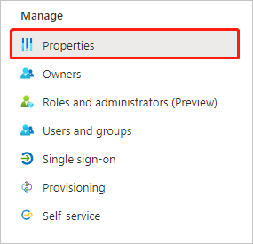
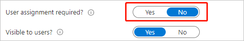

# Configure Euromonitor International for Single sign-on with Microsoft Entra ID

In this article,  you learn how to integrate Euromonitor International with Microsoft Entra ID. When you integrate Euromonitor International with Microsoft Entra ID, you can:

* Control in Microsoft Entra ID who has access to Euromonitor International.
* Enable your users to be automatically signed-in to Euromonitor International with their Microsoft Entra accounts.
* Manage your accounts in one central location.

## Prerequisites

The scenario outlined in this article assumes that you already have the following prerequisites:

[!INCLUDE [common-prerequisites.md](~/identity/saas-apps/includes/common-prerequisites.md)]
* Euromonitor International subscription.

## Scenario description

In this article,  you configure and test Microsoft Entra SSO in a test environment.

* Euromonitor International supports **SP** initiated SSO.

## Add Euromonitor International from the gallery

To configure the integration of Euromonitor International into Microsoft Entra ID, you need to add Euromonitor International from the gallery to your list of managed SaaS apps.

1. Sign in to the [Microsoft Entra admin center](https://entra.microsoft.com) as at least a [Cloud Application Administrator](~/identity/role-based-access-control/permissions-reference.md#cloud-application-administrator).
1. Browse to **Entra ID** > **Enterprise apps** > **New application**.
1. In the **Add from the gallery** section, type **Euromonitor International** in the search box.
1. Select **Euromonitor International** from results panel and then add the app. Wait a few seconds while the app is added to your tenant.

 [!INCLUDE [sso-wizard.md](~/identity/saas-apps/includes/sso-wizard.md)]

## Configure and test Microsoft Entra SSO for Euromonitor International

Configure and test Microsoft Entra SSO with Euromonitor International using a test user called **B.Simon**. For SSO to work, you need to establish a link relationship between a Microsoft Entra user and the related user in Euromonitor International.

To configure and test Microsoft Entra SSO with Euromonitor International, perform the following steps:

1. **[Configure Microsoft Entra SSO](#configure-azure-ad-sso)** - to enable your users to use this feature.
    1. **Create a Microsoft Entra test user** - to test Microsoft Entra single sign-on with B.Simon.
    1. **Assign the Microsoft Entra test user** - to enable B.Simon to use Microsoft Entra single sign-on.
1. **[Configure Euromonitor International SSO](#configure-euromonitor-international-sso)** - to configure the single sign-on settings on application side.
1. **[Test SSO](#test-sso)** - to verify whether the configuration works.

## Configure Microsoft Entra SSO

Follow these steps to enable Microsoft Entra SSO.

1. Sign in to the [Microsoft Entra admin center](https://entra.microsoft.com) as at least a [Cloud Application Administrator](~/identity/role-based-access-control/permissions-reference.md#cloud-application-administrator).
1. Browse to **Entra ID** > **Enterprise apps** > **Euromonitor International** > **Single sign-on**.
1. On the **Select a single sign-on method** page, select **SAML**.
1. In the **SAML Signing Certificate** section, select copy button to copy **App Federation Metadata Url** and save it on your computer.

 

1. You need to send the **App Federation Metadata Url** to the [Euromonitor International support team](mailto:passport.support@euromonitor.com). They set this setting to have the SAML SSO connection set properly on both sides. Wait for a reply.
1. After receiving configuration values from Euromonitor's reply, proceed below.

1. On the **Select a single sign-on method** page, select **SAML**.
1. On the **Set up single sign-on with SAML** page, select the pencil icon for **Basic SAML Configuration** to edit the settings.

   

1. On the **Basic SAML Configuration** section, perform the following steps:

    a. In the **Identifier (Entity ID)** text box, paste the URL provided by Euromonitor support using the following pattern:
    `https://auth.euromonitor.com/<CustomerID>`

    b. In the **Reply URL** text box, paste the URL:
    `https://auth.euromonitor.com/saml20/sp/acs`

    c. In the **Sign on URL** text box, paste the URL provided by Euromonitor support using the following pattern:
    
    `https://login.euromonitor.com/Account/ExternalLogin?provider=<PROVIDER>&returnUrl=<PROVIDER>-signin-oidc&login_hint=<CustomerID>`

	> [!NOTE]
	> These values aren't real. Update these values with the actual Identifier and Sign-on URL. [Euromonitor International support team](mailto:passport.support@euromonitor.com) provides these values. You can also refer to the patterns shown in the **Basic SAML Configuration** section in the Microsoft Entra admin center.

1. Euromonitor International application expects the SAML assertions in a specific format, which requires you to add custom attribute mappings to your SAML token attributes configuration. The following screenshot shows the list of default attributes.

	

1. In addition to above, Euromonitor International application expects few more attributes to be passed back in SAML response which are shown below. These attributes are also pre populated but you can review them as per your requirements.

	| Name | Source Attribute|
	| ---------------| --------- |
	| city | user.city |
	| department | user.department |
	| country | user.country |
	| telephone number | user.telephonenumber |
	| subtitle | user.jobtitle |
	| company name | user.companyname |
	
1. Unless otherwise requested, Euromonitor strongly recommends the below configuration option:

	
* Browse to **Properties**. Set **Assignment Required?** to 'No'.

	

	

[!INCLUDE [create-assign-users-sso.md](~/identity/saas-apps/includes/create-assign-users-sso.md)]

## Configure Euromonitor International SSO

The [Euromonitor International support team](mailto:passport.support@euromonitor.com) configures and administers all application-side settings.

### Create Euromonitor International test user

In this section, you create a user called B.Simon in Euromonitor International. The SSO allows you to self-register the test user on the application side without Euromonitor support action.

## Test SSO 

In this section, you test your Microsoft Entra single sign-on configuration with following options. 

#### SP initiated:

* Select **Test this application**, this option redirects to Euromonitor International Sign on URL where you can initiate the sign-in flow.  

* Go to Euromonitor International Sign-on URL directly and initiate the sign-in flow from there.

#### IDP initiated:

* Select **Test this application**, and you should be automatically signed in to the Euromonitor International for which you set up the SSO. 

You can also use Microsoft My Apps to test the application in any mode. When you select the Euromonitor International tile in the My Apps, you should be automatically signed in to the Euromonitor International for which you set up the SSO. For more information about the My Apps, see [Introduction to the My Apps](https://support.microsoft.com/account-billing/sign-in-and-start-apps-from-the-my-apps-portal-2f3b1bae-0e5a-4a86-a33e-876fbd2a4510).

## Related content

Once you configure Euromonitor International you can enforce session control, which protects exfiltration and infiltration of your organization’s sensitive data in real time. Session control extends from Conditional Access. [Learn how to enforce session control with Microsoft Defender for Cloud Apps](/cloud-app-security/proxy-deployment-any-app).