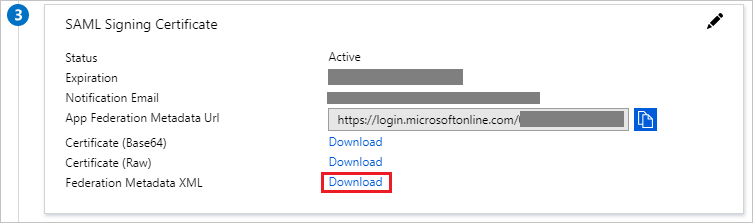
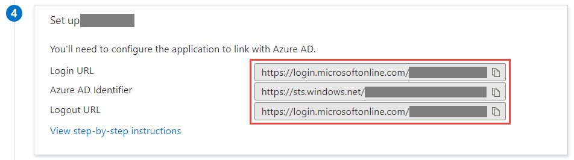
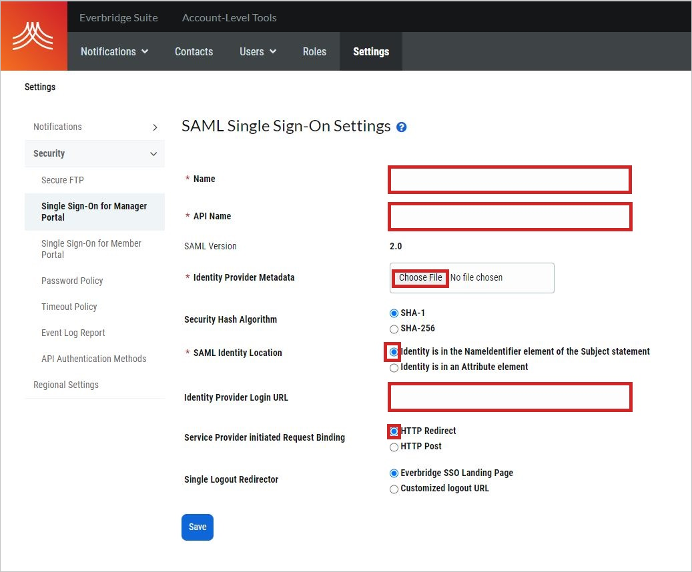

# Configure EverBridge for Single sign-on with Microsoft Entra ID

In this article,  you learn how to integrate EverBridge with Microsoft Entra ID.
When you integrate EverBridge with Microsoft Entra ID, you can:

* Control in Microsoft Entra ID who has access to EverBridge.
* Allow your users to be automatically signed in to EverBridge with their Microsoft Entra accounts. This access control is called single sign-on (SSO).
* Manage your accounts in one central location by using the Azure portal.

## Prerequisites

The scenario outlined in this article assumes that you already have the following prerequisites:

[!INCLUDE [common-prerequisites.md](~/identity/saas-apps/includes/common-prerequisites.md)]
* An EverBridge subscription that uses single sign-on.

## Scenario description

In this article,  you configure and test Microsoft Entra single sign-on in a test environment.

* EverBridge supports IDP-initiated SSO.

## Add EverBridge from the Gallery

To configure the integration of EverBridge into Microsoft Entra ID, you need to add EverBridge from the gallery to your list of managed SaaS apps.

1. Sign in to the [Microsoft Entra admin center](https://entra.microsoft.com) as at least a [Cloud Application Administrator](~/identity/role-based-access-control/permissions-reference.md#cloud-application-administrator).
1. Browse to **Entra ID** > **Enterprise apps** > **New application**.
1. In the **Add from the gallery** section, type **EverBridge** in the search box.
1. Select **EverBridge** from results panel and then add the app. Wait a few seconds while the app is added to your tenant.

 [!INCLUDE [sso-wizard.md](~/identity/saas-apps/includes/sso-wizard.md)]

## Configure and test Microsoft Entra SSO for EverBridge

Configure and test Microsoft Entra SSO with EverBridge using a test user called **B.Simon**. For SSO to work, you need to establish a link relationship between a Microsoft Entra user and the related user in EverBridge.

To configure and test Microsoft Entra SSO with EverBridge, perform the following steps:

1. **[Configure Microsoft Entra SSO](#configure-azure-ad-sso)** - to enable your users to use this feature.
    1. **Create a Microsoft Entra test user** - to test Microsoft Entra single sign-on with B.Simon.
    1. **Assign the Microsoft Entra test user** - to enable B.Simon to use Microsoft Entra single sign-on.
1. **[Configure EverBridge SSO](#configure-everbridge-sso)** - to configure the single sign-on settings on application side.
    1. **[Create EverBridge test user](#create-everbridge-test-user)** - to have a counterpart of B.Simon in EverBridge that's linked to the Microsoft Entra representation of user.
1. **[Test SSO](#test-sso)** - to verify whether the configuration works.

### Configure Microsoft Entra SSO

Follow these steps to enable Microsoft Entra SSO.

1. Sign in to the [Microsoft Entra admin center](https://entra.microsoft.com) as at least a [Cloud Application Administrator](~/identity/role-based-access-control/permissions-reference.md#cloud-application-administrator).
1. Browse to **Entra ID** > **Enterprise apps** > **EverBridge** application integration page, find the **Manage** section and select **Single sign-on**.
1. On the **Select a Single sign-on method** page, select **SAML**.
1. On the **Set up Single Sign-On with SAML** page, select the pencil icon for **Basic SAML Configuration** to edit the settings.

   

    >[!NOTE]
	>Configure the application either as the manager portal *or* as the member portal on both the Azure portal and the EverBridge portal.

5. To configure the **EverBridge** application as the **EverBridge manager portal**, in the **Basic SAML Configuration** section, follow these steps:

    a. In the **Identifier** box, enter a URL that follows the pattern.
    `https://sso.everbridge.net/<API_Name>`

    b. In the **Reply URL** box, enter a URL that follows below pattern.
    * If you are configuring an account level SSO, use
      `https://manager.everbridge.net/saml/SSO/<API_Name>/alias/defaultAlias`

    * If you are configuring an org level SSO, use
      `https://manager.everbridge.net/saml/SSO/<API_Name>/<Organization_ID>alias/defaultAlias`

	> [!NOTE]
	> The URLs above illustrate a general pattern, not actual data. You need to update strings in <> with the actual Identifier. To get those values, check your SSO configuration in Everbridge Manager Portal

6. To configure the **EverBridge** application as the **EverBridge member portal**, in the **Basic SAML Configuration** section, follow these steps:

    * If you want to configure the application in IDP-initiated mode, follow these steps:

       a. In the **Identifier** box, enter a URL that follows the pattern `https://sso.everbridge.net/<API_Name>/<Organization_ID>`

       b. In the **Reply URL** box, enter a URL that follows the pattern `https://member.everbridge.net/saml/SSO/<API_Name>/<Organization_ID>/alias/defaultAlias`

   * If you want to configure the application in SP-initiated mode, select **Set additional URLs** and follow this step:

     a. In the **Sign on URL** box, enter a URL that follows the pattern `https://member.everbridge.net/saml/login/<API_Name>/<Organization_ID>/alias/defaultAlias?disco=true`

     > [!NOTE]
     > The URLs above illustrate a general pattern, not actual data. You need to update strings in <> with the actual Identifier. To get those values, check your SSO configuration in Everbridge Manager Portal

7. On the **Set up Single Sign-On with SAML** page, in the **SAML Signing Certificate** section, select **Download** to download the **Federation Metadata XML**. Save it on your computer.

	

8. In the **Set up EverBridge** section, copy the URLs you need for your requirements:

	

[!INCLUDE [create-assign-users-sso.md](~/identity/saas-apps/includes/create-assign-users-sso.md)]

## Configure EverBridge SSO

To configure SSO on **EverBridge** as an **EverBridge manager portal** application, follow these steps.
 
1. In a different web browser window, sign in to EverBridge Manager Portal as an account or org administrator.

1. From the menu on the left, select the **Settings** menu. Under **Security**, select **Single Sign-On for Manager Portal**.
   
     
   
     a. In the **Name** box, enter the name of this setting. An example is your company name.
   
     b. In the **API Name** box, enter the name of the API. This is the unique identifier for your SSO configuration.
   
     c. Pick the **Identity Provider** from the dropdown list. If not found, choose "Other" and provide the name.

     d. Choose the **Service Provider Certificate** you would like to use. The certificate of 3072 bit length is recommended. 
   
     e. Click **Upload** to upload the metadata file that you downloaded from your IDP.
   
     f. For **SAML Identity Location**, select **Identity is in the NameIdentifier element of the Subject statement**.
   
     g. In the **Identity Provider Login URL** box, paste the **Login URL** value that you copied.
   
     h. For **Service Provider initiated Request Binding**, select **HTTP Redirect**.

     i. Click **Save**.

### Create EverBridge test user

Create a test user in EverBridge. Ensure the "SSO User ID" field of the user matches the user's identifier in your IDP. 

## Test SSO

In this section, you test your Microsoft Entra single sign-on configuration with following options.

* Select **Test this application**, and you should be automatically signed in to the EverBridge for which you set up the SSO.

* You can use Microsoft My Apps. When you select the EverBridge tile in the My Apps, you should be automatically signed in to the EverBridge for which you set up the SSO. For more information about the My Apps, see [Introduction to the My Apps](https://support.microsoft.com/account-billing/sign-in-and-start-apps-from-the-my-apps-portal-2f3b1bae-0e5a-4a86-a33e-876fbd2a4510).

## Related content

Once you configure EverBridge you can enforce session control, which protects exfiltration and infiltration of your organization’s sensitive data in real time. Session control extends from Conditional Access. [Learn how to enforce session control with Microsoft Defender for Cloud Apps](/cloud-app-security/proxy-deployment-any-app).
