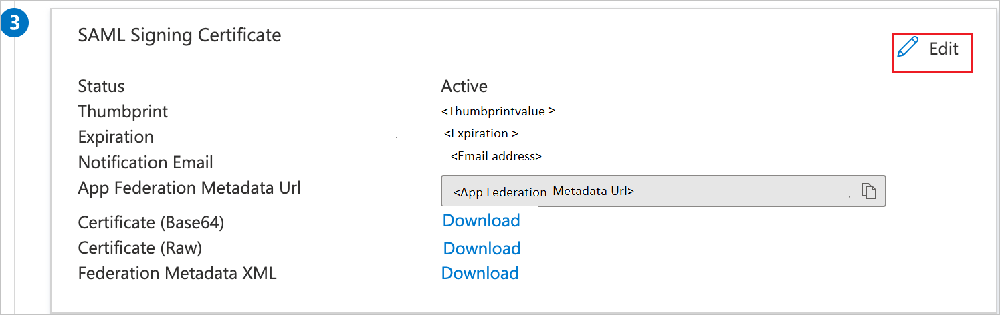
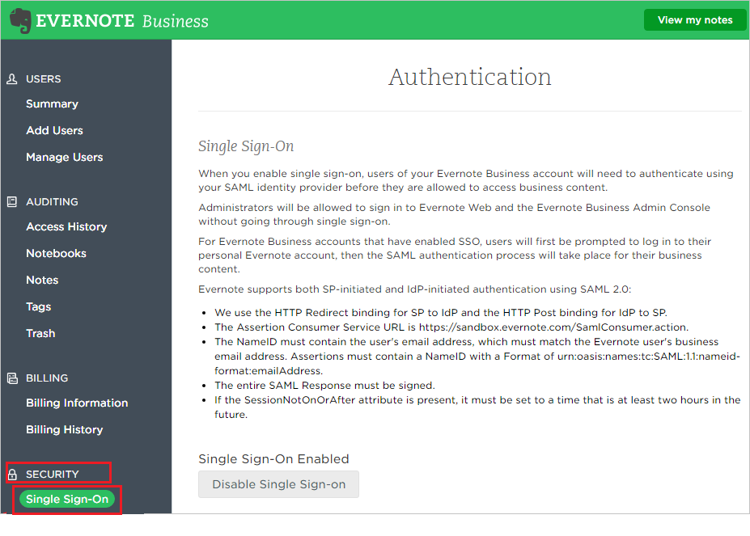
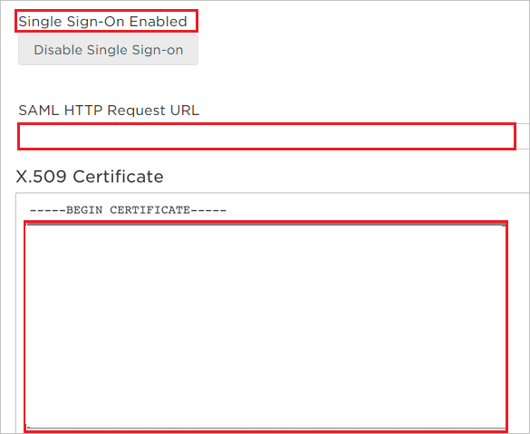
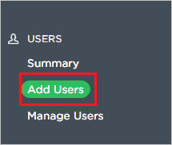
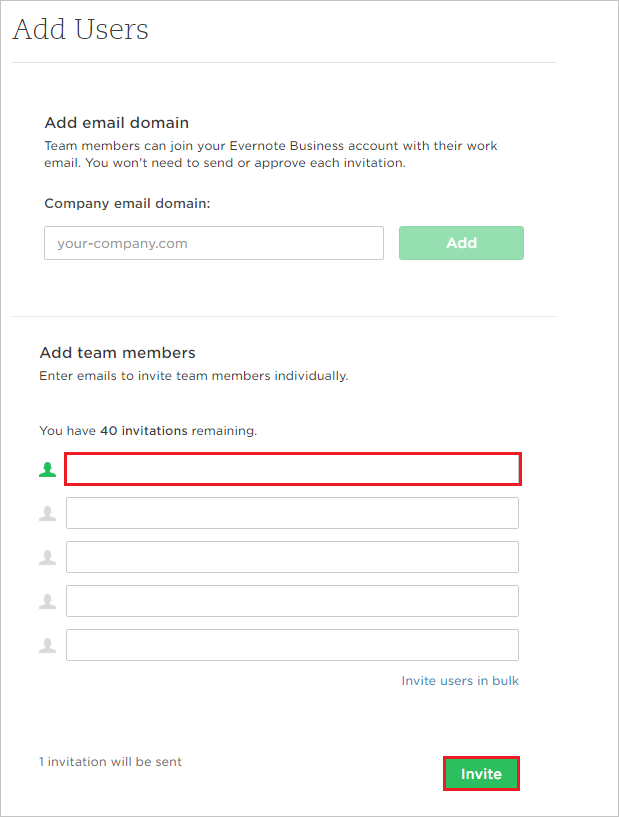

# Configure Evernote for Single sign-on with Microsoft Entra ID

In this article,  you learn how to integrate Evernote with Microsoft Entra ID. When you integrate Evernote with Microsoft Entra ID, you can:

* Control in Microsoft Entra ID who has access to Evernote.
* Enable your users to be automatically signed-in to Evernote with their Microsoft Entra accounts.
* Manage your accounts in one central location.

## Prerequisites

The scenario outlined in this article assumes that you already have the following prerequisites:

[!INCLUDE [common-prerequisites.md](~/identity/saas-apps/includes/common-prerequisites.md)]
* Evernote single sign-on (SSO) enabled subscription.

## Scenario description

In this article,  you configure and test Microsoft Entra SSO in a test environment.

* Evernote supports **SP and IDP** initiated SSO.

> [!NOTE]
> Identifier of this application is a fixed string value so only one instance can be configured in one tenant.

## Add Evernote from the gallery

To configure the integration of Evernote into Microsoft Entra ID, you need to add Evernote from the gallery to your list of managed SaaS apps.

1. Sign in to the [Microsoft Entra admin center](https://entra.microsoft.com) as at least a [Cloud Application Administrator](~/identity/role-based-access-control/permissions-reference.md#cloud-application-administrator).
1. Browse to **Entra ID** > **Enterprise apps** > **New application**.
1. In the **Add from the gallery** section, type **Evernote** in the search box.
1. Select **Evernote** from results panel and then add the app. Wait a few seconds while the app is added to your tenant.

 [!INCLUDE [sso-wizard.md](~/identity/saas-apps/includes/sso-wizard.md)]

## Configure and test Microsoft Entra SSO for Evernote

Configure and test Microsoft Entra SSO with Evernote using a test user called **B.Simon**. For SSO to work, you need to establish a link relationship between a Microsoft Entra user and the related user in Evernote.

To configure and test Microsoft Entra SSO with Evernote, perform the following steps:

1. **[Configure Microsoft Entra SSO](#configure-azure-ad-sso)** - to enable your users to use this feature.
    1. **Create a Microsoft Entra test user** - to test Microsoft Entra single sign-on with B.Simon.
    1. **Assign the Microsoft Entra test user** - to enable B.Simon to use Microsoft Entra single sign-on.
1. **[Configure Evernote SSO](#configure-evernote-sso)** - to configure the single sign-on settings on application side.
    1. **[Create Evernote test user](#create-evernote-test-user)** - to have a counterpart of B.Simon in Evernote that's linked to the Microsoft Entra representation of user.
1. **[Test SSO](#test-sso)** - to verify whether the configuration works.

## Configure Microsoft Entra SSO

Follow these steps to enable Microsoft Entra SSO.

1. Sign in to the [Microsoft Entra admin center](https://entra.microsoft.com) as at least a [Cloud Application Administrator](~/identity/role-based-access-control/permissions-reference.md#cloud-application-administrator).
1. Browse to **Entra ID** > **Enterprise apps** > **Evernote** > **Single sign-on**.
1. On the **Select a single sign-on method** page, select **SAML**.
1. On the **Set up single sign-on with SAML** page, select the pencil icon for **Basic SAML Configuration** to edit the settings.

   

1. On the **Basic SAML Configuration** section, if you wish to configure the application in **IDP** initiated mode,perform the following steps: 

    In the **Identifier** text box, type the URL:
    `https://www.evernote.com/saml2`

1. Select **Set additional URLs** and perform the following step if you wish to configure the application in **SP** initiated mode:

    In the **Sign-on URL** text box, type the URL:
    `https://www.evernote.com/Login.action`

1. On the **Set up single sign-on with SAML** page, in the **SAML Signing Certificate** section,  find **Certificate (Base64)** and select **Download** to download the certificate and save it on your computer.

	

7. To modify the **Signing** options, select the **Edit** button to open the **SAML Signing Certificate** dialog.

	 

	a. Select the **Sign SAML response and assertion** option for **Signing Option**.

	b. Select **Save**

1. On the **Set up Evernote** section, copy the appropriate URL(s) based on your requirement.

	

[!INCLUDE [create-assign-users-sso.md](~/identity/saas-apps/includes/create-assign-users-sso.md)]

## Configure Evernote SSO

1. In a different web browser window, sign in to your Evernote company site as an administrator

4. Go to **'Admin Console'**

	

5. From the **'Admin Console'**, go to **‘Security’** and select **‘Single Sign-On’**

	

6. Configure the following values:

	
	
	a.  **Enable SSO:** SSO is enabled by default (Select **Disable Single Sign-on** to remove the SSO requirement)

	b. Paste **Login URL** value into the **SAML HTTP Request URL** textbox.

	c. Open the downloaded certificate from Microsoft Entra ID in a notepad and copy the content including "BEGIN CERTIFICATE" and "END CERTIFICATE" and paste it into the **X.509 Certificate** textbox. 

	d.Select **Save Changes**

### Create Evernote test user

In order to enable Microsoft Entra users to sign into Evernote, they must be provisioned into Evernote.  
In the case of Evernote, provisioning is a manual task.

**To provision a user accounts, perform the following steps:**

1. Sign in to your Evernote company site as an administrator.

2. Select the **'Admin Console'**.

	

3. From the **'Admin Console'**, go to **‘Add users’**.

	

4. **Add team members** in the **Email** textbox, type the email address of user account and select **Invite.**

	
	
5. After invitation is sent, the Microsoft Entra account holder will receive an email to accept the invitation.

## Test SSO 

In this section, you test your Microsoft Entra single sign-on configuration with following options. 

#### SP initiated:

* Select **Test this application**, this option redirects to Evernote Sign on URL where you can initiate the login flow.  

* Go to Evernote Sign-on URL directly and initiate the login flow from there.

#### IDP initiated:

* Select **Test this application**, and you should be automatically signed in to the Evernote for which you set up the SSO. 

You can also use Microsoft My Apps to test the application in any mode. When you select the Evernote tile in the My Apps, if configured in SP mode you would be redirected to the application sign on page for initiating the login flow and if configured in IDP mode, you should be automatically signed in to the Evernote for which you set up the SSO. For more information about the My Apps, see [Introduction to the My Apps](https://support.microsoft.com/account-billing/sign-in-and-start-apps-from-the-my-apps-portal-2f3b1bae-0e5a-4a86-a33e-876fbd2a4510).

## Related content

Once you configure Evernote you can enforce session control, which protects exfiltration and infiltration of your organization’s sensitive data in real time. Session control extends from Conditional Access. [Learn how to enforce session control with Microsoft Defender for Cloud Apps](/cloud-app-security/proxy-deployment-aad).
