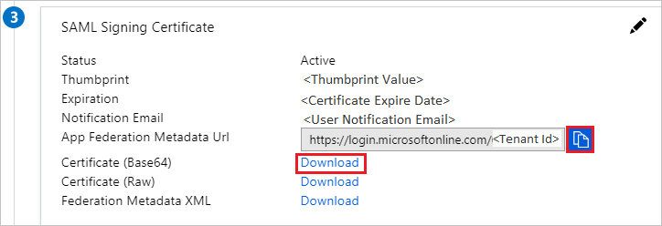

# Configure ExpenseIn for Single sign-on with Microsoft Entra ID

In this article,  you learn how to integrate ExpenseIn with Microsoft Entra ID. When you integrate ExpenseIn with Microsoft Entra ID, you can:

* Control in Microsoft Entra ID who has access to ExpenseIn.
* Enable your users to be automatically signed-in to ExpenseIn with their Microsoft Entra accounts.
* Manage your accounts in one central location.

## Prerequisites

The scenario outlined in this article assumes that you already have the following prerequisites:

[!INCLUDE [common-prerequisites.md](~/identity/saas-apps/includes/common-prerequisites.md)]
* ExpenseIn single sign-on (SSO) enabled subscription.

## Scenario description

In this article,  you configure and test Microsoft Entra SSO in a test environment. 

* ExpenseIn supports **SP and IDP** initiated SSO.

## Add ExpenseIn from the gallery

To configure the integration of ExpenseIn into Microsoft Entra ID, you need to add ExpenseIn from the gallery to your list of managed SaaS apps.

1. Sign in to the [Microsoft Entra admin center](https://entra.microsoft.com) as at least a [Cloud Application Administrator](~/identity/role-based-access-control/permissions-reference.md#cloud-application-administrator).
1. Browse to **Entra ID** > **Enterprise apps** > **New application**.
1. In the **Add from the gallery** section, type **ExpenseIn** in the search box.
1. Select **ExpenseIn** from results panel and then add the app. Wait a few seconds while the app is added to your tenant.

 [!INCLUDE [sso-wizard.md](~/identity/saas-apps/includes/sso-wizard.md)]

## Configure and test Microsoft Entra SSO for ExpenseIn

Configure and test Microsoft Entra SSO with ExpenseIn using a test user called **B.Simon**. For SSO to work, you need to establish a link relationship between a Microsoft Entra user and the related user in ExpenseIn.

To configure and test Microsoft Entra SSO with ExpenseIn, perform the following steps:

1. **[Configure Microsoft Entra SSO](#configure-azure-ad-sso)** to enable your users to use this feature.
    1. **Create a Microsoft Entra test user** to test Microsoft Entra single sign-on with B.Simon.
    1. **Assign the Microsoft Entra test user** to enable B.Simon to use Microsoft Entra single sign-on.
1. **[Configure ExpenseIn SSO](#configure-expensein-sso)** to configure the SSO settings on application side.
    1. **[Create ExpenseIn test user](#create-expensein-test-user)** to have a counterpart of B.Simon in ExpenseIn that's linked to the Microsoft Entra representation of user.
1. **[Test SSO](#test-sso)** to verify whether the configuration works.

## Configure Microsoft Entra SSO

Follow these steps to enable Microsoft Entra SSO.

1. Sign in to the [Microsoft Entra admin center](https://entra.microsoft.com) as at least a [Cloud Application Administrator](~/identity/role-based-access-control/permissions-reference.md#cloud-application-administrator).
1. Browse to **Entra ID** > **Enterprise apps** > **ExpenseIn** application integration page, find the **Manage** section and select **Single sign-on**.
1. On the **Select a Single sign-on method** page, select **SAML**.
1. On the **Set up Single Sign-On with SAML** page, select the pencil icon for **Basic SAML Configuration** to edit the settings.

   

1. On the **Basic SAML Configuration** section, the user doesn't have to perform any steps as the app is already pre-integrated with Azure.

5. Select **Set additional URLs** and perform the following step if you wish to configure the application in **SP** initiated mode:

    In the **Sign-on URL** text box, type the URL:
    `https://app.expensein.com/saml`

1. On the **Set up Single Sign-On with SAML** page, in the **SAML Signing Certificate** section, select copy button to copy **App Federation Metadata Url** and select **Download** to download the **Certificate (Base64)** and save it on your computer.

   

1. On the **Set up ExpenseIn** section, copy the appropriate URL(s) based on your requirement.

   

[!INCLUDE [create-assign-users-sso.md](~/identity/saas-apps/includes/create-assign-users-sso.md)]

## Configure ExpenseIn SSO

1. In a different web browser window, sign in to your ExpenseIn company site as an administrator

1. Select **Admin** on the top of the page then navigate to **Single Sign-On** and select **Add provider**.

	 

1. On the **New Identity Provider** pop-up, Perform the following steps:

    

	a. In the **Provider Name** text box, type the name; for example, Azure.

	b. Select **Yes** for **Allow Provider Initiated Sign-On**.

	c. In the **Target Url** text box, paste the value of **Login URL**.

    d. In the **Issuer** text box, paste the value of **Microsoft Entra Identifier**.

    e. Open the Certificate (Base64) in Notepad, copy its content and paste it in the **Certificate** text box.

	f. Select **Create**.

### Create ExpenseIn test user

To enable Microsoft Entra users to sign in to ExpenseIn, they must be provisioned into ExpenseIn. In ExpenseIn, provisioning is a manual task.

**To provision a user account, perform the following steps:**

1. Sign in to ExpenseIn as an Administrator.

2. Select **Admin** on the top of the page then navigate to **Users** and select **New User**.

	 

3. On the **Details** pop-up, perform the following steps:

    

    a. In **First Name** text box, enter the first name of user like **B**.

    b. In **Last Name** text box, enter the last name of user like **Simon**.

    c. In **Email** text box, enter the email of user like `B.Simon@contoso.com`.

    d. Select **Create**.

## Test SSO

In this section, you test your Microsoft Entra single sign-on configuration with following options. 

#### SP initiated:

* Select **Test this application**, this option redirects to ExpenseIn Sign on URL where you can initiate the login flow.  

* Go to ExpenseIn Sign-on URL directly and initiate the login flow from there.

#### IDP initiated:

* Select **Test this application**, and you should be automatically signed in to the ExpenseIn for which you set up the SSO. 

You can also use Microsoft My Apps to test the application in any mode. When you select the ExpenseIn tile in the My Apps, if configured in SP mode you would be redirected to the application sign on page for initiating the login flow and if configured in IDP mode, you should be automatically signed in to the ExpenseIn for which you set up the SSO. For more information, see [Microsoft Entra My Apps](/azure/active-directory/manage-apps/end-user-experiences#azure-ad-my-apps).

## Related content

Once you configure ExpenseIn you can enforce session control, which protects exfiltration and infiltration of your organization’s sensitive data in real time. Session control extends from Conditional Access. [Learn how to enforce session control with Microsoft Defender for Cloud Apps](/cloud-app-security/proxy-deployment-aad).
