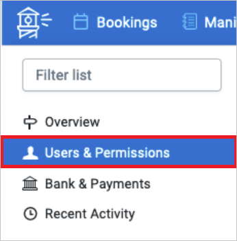
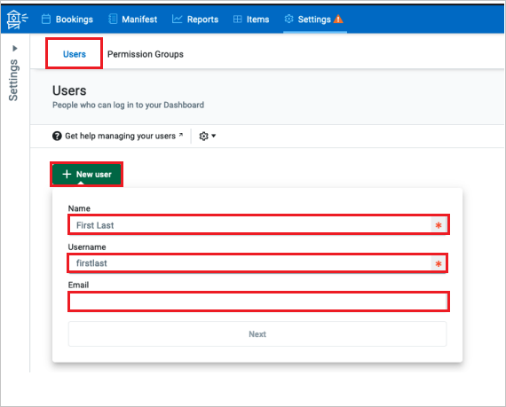

# Microsoft Entra SSO integration with Fareharbor SAML SSO

In this article,  you learn how to integrate Fareharbor SAML SSO with Microsoft Entra ID. When you integrate Fareharbor SAML SSO with Microsoft Entra ID, you can:

* Control in Microsoft Entra ID who has access to Fareharbor SAML SSO.
* Enable your users to be automatically signed-in to Fareharbor SAML SSO with their Microsoft Entra accounts.
* Manage your accounts in one central location.

## Prerequisites
The scenario outlined in this article assumes that you already have the following prerequisites:
[!INCLUDE [common-prerequisites.md](~/identity/saas-apps/includes/common-prerequisites.md)]
* Fareharbor SAML SSO single sign-on (SSO) enabled subscription.

## Scenario description

In this article,  you configure and test Microsoft Entra SSO in a test environment.

* Fareharbor SAML SSO supports only **SP** initiated SSO.

> [!NOTE]
> Identifier of this application is a fixed string value so only one instance can be configured in one tenant.

## Add Fareharbor SAML SSO from the gallery

To configure the integration of Fareharbor SAML SSO into Microsoft Entra ID, you need to add Fareharbor SAML SSO from the gallery to your list of managed SaaS apps.

1. Sign in to the [Microsoft Entra admin center](https://entra.microsoft.com) as at least a [Cloud Application Administrator](~/identity/role-based-access-control/permissions-reference.md#cloud-application-administrator).
1. Browse to **Entra ID** > **Enterprise apps** > **New application**.
1. In the **Add from the gallery** section, type **Fareharbor SAML SSO** in the search box.
1. Select **Fareharbor SAML SSO** from results panel and then add the app. Wait a few seconds while the app is added to your tenant.

Alternatively, you can also use the [Enterprise App Configuration Wizard](https://portal.office.com/AdminPortal/home?Q=Docs#/azureadappintegration). In this wizard, you can add an application to your tenant, add users/groups to the app, assign roles, and walk through the SSO configuration as well. [Learn more about Microsoft 365 wizards.](/microsoft-365/admin/misc/azure-ad-setup-guides)

## Configure and test Microsoft Entra SSO for Fareharbor SAML SSO

Configure and test Microsoft Entra SSO with Fareharbor SAML SSO using a test user called **B.Simon**. For SSO to work, you need to establish a link relationship between a Microsoft Entra user and the related user in Fareharbor SAML SSO.

To configure and test Microsoft Entra SSO with Fareharbor SAML SSO, perform the following steps:

1. **[Configure Microsoft Entra SSO](#configure-microsoft-entra-sso)** - to enable your users to use this feature.
    1. **Create a Microsoft Entra test user** - to test Microsoft Entra single sign-on with B.Simon.
    1. **Assign the Microsoft Entra test user** - to enable B.Simon to use Microsoft Entra single sign-on.
1. **[Configure Fareharbor SAML SSO](#configure-fareharbor-saml-sso)** - to configure the single sign-on settings on application side.
    1. **[Create Fareharbor SAML SSO test user](#create-fareharbor-saml-sso-test-user)** - to have a counterpart of B.Simon in Fareharbor SAML SSO that's linked to the Microsoft Entra representation of user.
1. **[Test SSO](#test-sso)** - to verify whether the configuration works.

## Configure Microsoft Entra SSO

Follow these steps to enable Microsoft Entra SSO in the Microsoft Entra admin center.

1. Sign in to the [Microsoft Entra admin center](https://entra.microsoft.com) as at least a [Cloud Application Administrator](~/identity/role-based-access-control/permissions-reference.md#cloud-application-administrator).
1. Browse to **Entra ID** > **Enterprise apps** > **Fareharbor SAML SSO** > **Single sign-on**.
1. On the **Select a single sign-on method** page, select **SAML**.
1. On the **Set up single sign-on with SAML** page, select the pencil icon for **Basic SAML Configuration** to edit the settings.

   

1. On the **Basic SAML Configuration** section, perform the following steps:

    a. In the **Identifier (Entity ID)** text box, type the URL:
    `https://fareharbor.com`

    b. In the **Reply URL** textbox, type one of the following URL/pattern:

    |**Reply URL**|
    |-------------|
    |`https://fareharbor.com/api/v1/login/provider/azure/complete/`|
    |`https://<ENVIRONMENT>.fareharbor.com/api/v1/login/provider/azure/complete/`|
    
    c. In the **Sign on URL** text box, type one of the following URL/pattern:

    |**Sign on URL**|
    |---------------|
    |`https://fareharbor.com/login/`|
    |`https://<ENVIRONMENT>.fareharbor.com/login/`|

	> [!NOTE]
	> These values aren't real. Update these values with the actual Reply URL and Sign on URL. Contact [Fareharbor SAML SSO support team](mailto:support@fareharbor.com) to get these values. You can also refer to the patterns shown in the **Basic SAML Configuration** section in the Microsoft Entra admin center.

1. On the **Set up single sign-on with SAML** page, in the **SAML Signing Certificate** section, find **Certificate (Raw)** and select **Download** to download the certificate and save it on your computer.

	

1. On the **Set up Fareharbor SAML SSO** section, copy the appropriate URL(s) based on your requirement.

	

[!INCLUDE [create-assign-users-sso.md](~/identity/saas-apps/includes/create-assign-users-sso.md)]

## Configure Fareharbor SAML SSO

To configure single sign-on on **Fareharbor SAML SSO** side, you need to send the downloaded **Certificate (Raw)** and appropriate copied URLs from Microsoft Entra admin center to [Fareharbor SAML SSO support team](mailto:support@fareharbor.com). They set this setting to have the SAML SSO connection set properly on both sides.

### Create Fareharbor SAML SSO test user

1. Log in to Fareharbor SAML SSO company site as an administrator.

1. Go to **Settings** > **Users & Permissions**.

    

1. Navigate to **Users** > **New User** and perform the following steps.

    

    1. In the **Name** textbox, enter a valid name of the user.

    1. In the **Username** textbox, enter the username.

    1. In the **Email** textbox, enter your Azure SSO email address.

## Test SSO 

In this section, you test your Microsoft Entra single sign-on configuration with following options.
 
* Select **Test this application** in Microsoft Entra admin center. this option redirects to Fareharbor SAML SSO Sign-on URL where you can initiate the login flow.
 
* Go to Fareharbor SAML SSO Sign-on URL directly and initiate the login flow from there.
 
* You can use Microsoft My Apps. When you select the Fareharbor SAML SSO tile in the My Apps, this option redirects to Fareharbor SAML SSO Sign-on URL. For more information about the My Apps, see [Introduction to the My Apps](https://support.microsoft.com/account-billing/sign-in-and-start-apps-from-the-my-apps-portal-2f3b1bae-0e5a-4a86-a33e-876fbd2a4510).

## Related content

Once you configure Fareharbor SAML SSO you can enforce session control, which protects exfiltration and infiltration of your organization's sensitive data in real time. Session control extends from Conditional Access. [Learn how to enforce session control with Microsoft Defender for Cloud Apps](/cloud-app-security/proxy-deployment-any-app).
