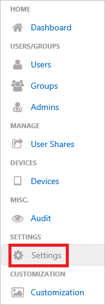
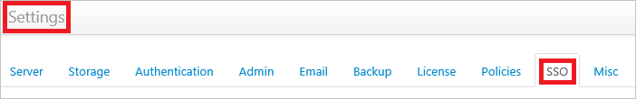
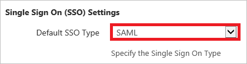

# Configure FileCloud for Single sign-on with Microsoft Entra ID

In this article,  you learn how to integrate FileCloud with Microsoft Entra ID. When you integrate FileCloud with Microsoft Entra ID, you can:

* Control in Microsoft Entra ID who has access to FileCloud.
* Enable your users to be automatically signed-in to FileCloud with their Microsoft Entra accounts.
* Manage your accounts in one central location.

## Prerequisites

The scenario outlined in this article assumes that you already have the following prerequisites:

[!INCLUDE [common-prerequisites.md](~/identity/saas-apps/includes/common-prerequisites.md)]
* FileCloud single sign-on (SSO) enabled subscription.

## Scenario description

In this article,  you configure and test Microsoft Entra single sign-on in a test environment.

* FileCloud supports **SP** initiated SSO.

* FileCloud supports **Just In Time** user provisioning.

## Add FileCloud from the gallery

To configure the integration of FileCloud into Microsoft Entra ID, you need to add FileCloud from the gallery to your list of managed SaaS apps.

1. Sign in to the [Microsoft Entra admin center](https://entra.microsoft.com) as at least a [Cloud Application Administrator](~/identity/role-based-access-control/permissions-reference.md#cloud-application-administrator).
1. Browse to **Entra ID** > **Enterprise apps** > **New application**.
1. In the **Add from the gallery** section, type **FileCloud** in the search box.
1. Select **FileCloud** from results panel and then add the app. Wait a few seconds while the app is added to your tenant.

 [!INCLUDE [sso-wizard.md](~/identity/saas-apps/includes/sso-wizard.md)]

## Configure and test Microsoft Entra SSO for FileCloud

Configure and test Microsoft Entra SSO with FileCloud using a test user called **B.Simon**. For SSO to work, you need to establish a link relationship between a Microsoft Entra user and the related user in FileCloud.

To configure and test Microsoft Entra SSO with FileCloud, perform the following steps:

1. **[Configure Microsoft Entra SSO](#configure-azure-ad-sso)** - to enable your users to use this feature.
    1. **Create a Microsoft Entra test user** - to test Microsoft Entra single sign-on with B.Simon.
    1. **Assign the Microsoft Entra test user** - to enable B.Simon to use Microsoft Entra single sign-on.
1. **[Configure FileCloud SSO](#configure-filecloud-sso)** - to configure the single sign-on settings on application side.
    1. **[Create FileCloud test user](#create-filecloud-test-user)** - to have a counterpart of B.Simon in FileCloud that's linked to the Microsoft Entra representation of user.
1. **[Test SSO](#test-sso)** - to verify whether the configuration works.

## Configure Microsoft Entra SSO

Follow these steps to enable Microsoft Entra SSO.

1. Sign in to the [Microsoft Entra admin center](https://entra.microsoft.com) as at least a [Cloud Application Administrator](~/identity/role-based-access-control/permissions-reference.md#cloud-application-administrator).
1. Browse to **Entra ID** > **Enterprise apps** > **FileCloud** > **Single sign-on**.
1. On the **Select a single sign-on method** page, select **SAML**.
1. On the **Set up single sign-on with SAML** page, select the pencil icon for **Basic SAML Configuration** to edit the settings.

   

1. On the **Basic SAML Configuration** section, perform the following steps:

	a. In the **Sign on URL** text box, type a URL using the following pattern:
    `https://<SUBDOMAIN>.filecloudonline.com`

    b. In the **Identifier (Entity ID)** text box, type a URL using the following pattern:
    `https://<SUBDOMAIN>.filecloudonline.com/simplesaml/module.php/saml/sp/metadata.php/default-sp`

	> [!NOTE]
	> These values aren't real. Update these values with the actual Sign on URL and Identifier. Contact [FileCloud Client support team](mailto:support@codelathe.com) to get these values. You can also refer to the patterns shown in the **Basic SAML Configuration** section.

1. On the **Set up Single Sign-On with SAML** page, in the **SAML Signing Certificate** section, select **Download** to download the **Federation Metadata XML** from the given options as per your requirement and save it on your computer.

	

6. On the **Set up FileCloud** section, copy the appropriate URL(s) as per your requirement.

	

[!INCLUDE [create-assign-users-sso.md](~/identity/saas-apps/includes/create-assign-users-sso.md)]

## Configure FileCloud SSO

1. In a different web browser window, sign-on to your FileCloud tenant as an administrator.

2. On the left navigation pane, select **Settings**. 
   
    

3. Select **SSO** tab on Settings section. 
   
    

4. Select **SAML** as **Default SSO Type** on **Single Sign On (SSO) Settings** panel.
   
    

5. In the **IdP End Point URL** textbox, paste the value of **Microsoft Entra Identifier**..

    

6. Open your downloaded metadata file in notepad, copy the content of it into your clipboard, and then paste it to the **IdP Meta Data** textbox on **SAML Settings** panel.

	

7. Select **Save** button.

### Create FileCloud test user

In this section, a user called Britta Simon is created in FileCloud. FileCloud supports just-in-time user provisioning, which is enabled by default. There's no action item for you in this section. If a user doesn't already exist in FileCloud, a new one is created after authentication.

>[!NOTE]
>If you need to create a user manually, you need to contact the [FileCloud Client support team](mailto:support@codelathe.com).

## Test SSO 

In this section, you test your Microsoft Entra single sign-on configuration with following options. 

* Select **Test this application**, this option redirects to FileCloud Sign-on URL where you can initiate the login flow. 

* Go to FileCloud Sign-on URL directly and initiate the login flow from there.

* You can use Microsoft My Apps. When you select the FileCloud tile in the My Apps, this option redirects to FileCloud Sign-on URL. For more information about the My Apps, see [Introduction to the My Apps](https://support.microsoft.com/account-billing/sign-in-and-start-apps-from-the-my-apps-portal-2f3b1bae-0e5a-4a86-a33e-876fbd2a4510).

## Related content

Once you configure FileCloud you can enforce session control, which protects exfiltration and infiltration of your organization’s sensitive data in real time. Session control extends from Conditional Access. [Learn how to enforce session control with Microsoft Defender for Cloud Apps](/cloud-app-security/proxy-deployment-aad).
