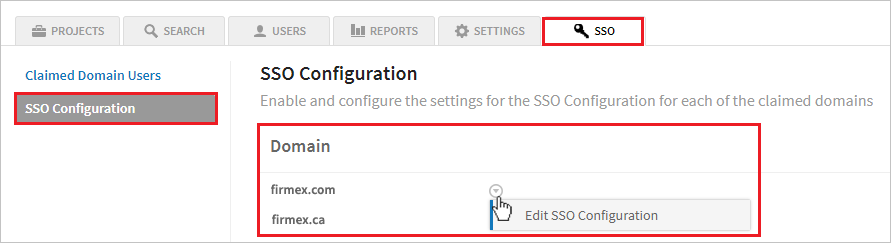
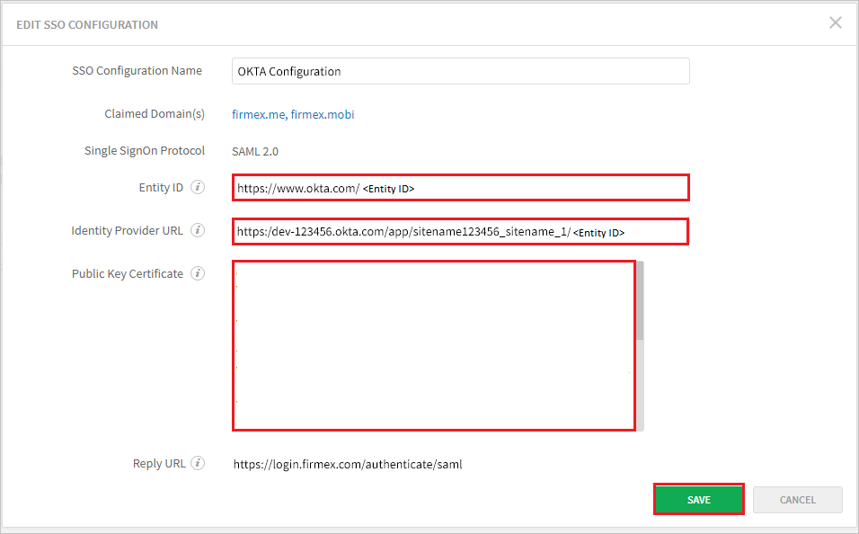

# Configure Firmex VDR for Single sign-on with Microsoft Entra ID

In this article,  you learn how to integrate Firmex VDR with Microsoft Entra ID. When you integrate Firmex VDR with Microsoft Entra ID, you can:

* Control in Microsoft Entra ID who has access to Firmex VDR.
* Enable your users to be automatically signed-in to Firmex VDR with their Microsoft Entra accounts.
* Manage your accounts in one central location.

## Prerequisites

The scenario outlined in this article assumes that you already have the following prerequisites:

[!INCLUDE [common-prerequisites.md](~/identity/saas-apps/includes/common-prerequisites.md)]
* Firmex VDR single sign-on (SSO) enabled subscription.

## Scenario description

In this article,  you configure and test Microsoft Entra SSO in a test environment.

* Firmex VDR supports **SP and IDP** initiated SSO.

## Add Firmex VDR from the gallery

To configure the integration of Firmex VDR into Microsoft Entra ID, you need to add Firmex VDR from the gallery to your list of managed SaaS apps.

1. Sign in to the [Microsoft Entra admin center](https://entra.microsoft.com) as at least a [Cloud Application Administrator](~/identity/role-based-access-control/permissions-reference.md#cloud-application-administrator).
1. Browse to **Entra ID** > **Enterprise apps** > **New application**.
1. In the **Add from the gallery** section, type **Firmex VDR** in the search box.
1. Select **Firmex VDR** from results panel and then add the app. Wait a few seconds while the app is added to your tenant.

 [!INCLUDE [sso-wizard.md](~/identity/saas-apps/includes/sso-wizard.md)]

## Configure and test Microsoft Entra SSO for Firmex VDR

Configure and test Microsoft Entra SSO with Firmex VDR using a test user called **B.Simon**. For SSO to work, you need to establish a link relationship between a Microsoft Entra user and the related user in Firmex VDR.

To configure and test Microsoft Entra SSO with Firmex VDR, perform the following steps:

1. **[Configure Microsoft Entra SSO](#configure-azure-ad-sso)** - to enable your users to use this feature.
    1. **Create a Microsoft Entra test user** - to test Microsoft Entra single sign-on with B.Simon.
    1. **Assign the Microsoft Entra test user** - to enable B.Simon to use Microsoft Entra single sign-on.
1. **[Configure Firmex VDR SSO](#configure-firmex-vdr-sso)** - to configure the single sign-on settings on application side.
    1. **[Create Firmex VDR test user](#create-firmex-vdr-test-user)** - to have a counterpart of B.Simon in Firmex VDR that's linked to the Microsoft Entra representation of user.
1. **[Test SSO](#test-sso)** - to verify whether the configuration works.

## Configure Microsoft Entra SSO

Follow these steps to enable Microsoft Entra SSO.

1. Sign in to the [Microsoft Entra admin center](https://entra.microsoft.com) as at least a [Cloud Application Administrator](~/identity/role-based-access-control/permissions-reference.md#cloud-application-administrator).
1. Browse to **Entra ID** > **Enterprise apps** > **Firmex VDR** > **Single sign-on**.
1. On the **Select a single sign-on method** page, select **SAML**.
1. On the **Set-up single sign-on with SAML** page, select the pencil icon for **Basic SAML Configuration** to edit the settings.

   

1. On the **Basic SAML Configuration** section, the user doesn't have to perform any step as the app is already pre-integrated with Azure.

1. Select **Set additional URLs** and perform the following step if you wish to configure the application in **SP** initiated mode:

    In the **Sign-on URL** text box, type the URL:
    `https://login.firmex.com`

1. Select **Save**.

1. Firmex VDR application expects the SAML assertions in a specific format, which requires you to add custom attribute mappings to your SAML token attributes configuration. The following screenshot shows the list of default attributes.

	

1. In addition to above, Firmex VDR application expects few more attributes to be passed back in SAML response which are shown below. These attributes are also pre populated but you can review them as per your requirements.

	| Name | Source Attribute|
	| ------------ | --------- |
	| email | user.mail |

1. On the **Set-up single sign-on with SAML** page, in the **SAML Signing Certificate** section,  find **Federation Metadata XML** and select **Download** to download the certificate and save it on your computer.

	

1. On the **Set-up Firmex VDR** section, copy the appropriate URL(s) based on your requirement.

	

[!INCLUDE [create-assign-users-sso.md](~/identity/saas-apps/includes/create-assign-users-sso.md)]

## Configure Firmex VDR SSO

### Before you get started

#### What you’ll need

-   An active Firmex subscription.
-   Microsoft Entra ID as your SSO service.
-   Your IT administrator to configure SSO.
-   Once SSO is enabled, all of your company’s users must log in to Firmex using SSO, and not using a login/password.

#### How long will this take?

Implementing SSO takes a few minutes. There's virtually no downtime between Firmex Support enabling SSO for your site, and your company’s users authenticating using SSO. Just follow the steps below.

### Step 1 - Identify your company’s domains

Identify the domains with which your company’s users are logging in.

For example:

- @firmex.com.
- @firmex.ca.

### Step 2 - Contact Firmex Support with your domains

Email [Firmex Support Team](mailto:support@firmex.com) or call 1888 688 4042 x.11 to speak to Firmex Support. Pass along your domain information. Firmex Support will add the domains to your VDR as **claimed domains**. Your admin must now configure SSO.

Warning: Until your site admin configures the claimed domains, your company’s users aren't able to log in to the VDR. Non-company users (that is, guest users) can still log in using their email/password. Configuration should take a few minutes.

### Step 3 - Configure the claimed domains

1. Log in to Firmex as a Site Administrator.
1. From the top-left corner, select your company logo.
1. Select the  **SSO**  tab. Then select  **SSO Configuration**. Select the domain you want to configure.

      

1. Have your IT Administrator fill in the following fields. The fields should be taken from your identity provider:  

    

    a. In the **Entity ID** textbox, paste the **Microsoft Entra Identifier** value, which you copied previously.

    b. In the **Identity Provider URL** textbox, paste the **Login URL** value, which you copied previously.

    c. **Public Key Certificate**  - For authentication purposes, a SAML message may be digitally signed by the issuer. To verify the signature on the message, the message receiver uses a public key known to belong to the issuer. Similarly, to encrypt a message, a public encryption key belonging to the ultimate receiver must be known to the issuer. In both situations—signing and encryption—trusted public keys must be shared in advance.  This is the **X509Certificate** from **Federation Metadata XML**

    d. Select **Save** to complete the SSO configuration. Changes take effect immediately.

1. At this time, SSO is enabled for your site.

### Create Firmex VDR test user

In this section, you create a user called B.Simon in Firmex. Work with [Firmex Support Team](mailto:support@firmex.com) to add the users in the Firmex platform. Users must be created and activated before you use single sign-on.

## Test SSO

In this section, you test your Microsoft Entra single sign-on configuration with the following options. 

#### SP initiated:

* Select **Test this application**, this option redirects to Firmex VDR Sign on URL where you can initiate the login flow.  

* Go to Firmex VDR Sign-on URL directly and initiate the login flow from there.

#### IDP initiated:

* Select **Test this application**, and you should be automatically signed in to the Firmex VDR for which you set up the SSO. 

You can also use Microsoft My Apps to test the application in any mode. When you select the Firmex VDR tile in the My Apps, if configured in SP mode you would be redirected to the application sign on page for initiating the login flow and if configured in IDP mode, you should be automatically signed in to the Firmex VDR for which you set up the SSO. For more information, see [Microsoft Entra My Apps](/azure/active-directory/manage-apps/end-user-experiences#azure-ad-my-apps).

## Related content

Once you configure Firmex VDR you can enforce session control, which protects exfiltration and infiltration of your organization’s sensitive data in real time. Session control extends from Conditional Access. [Learn how to enforce session control with Microsoft Cloud App Security](/cloud-app-security/proxy-deployment-aad).
