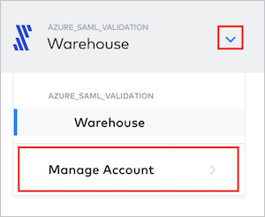
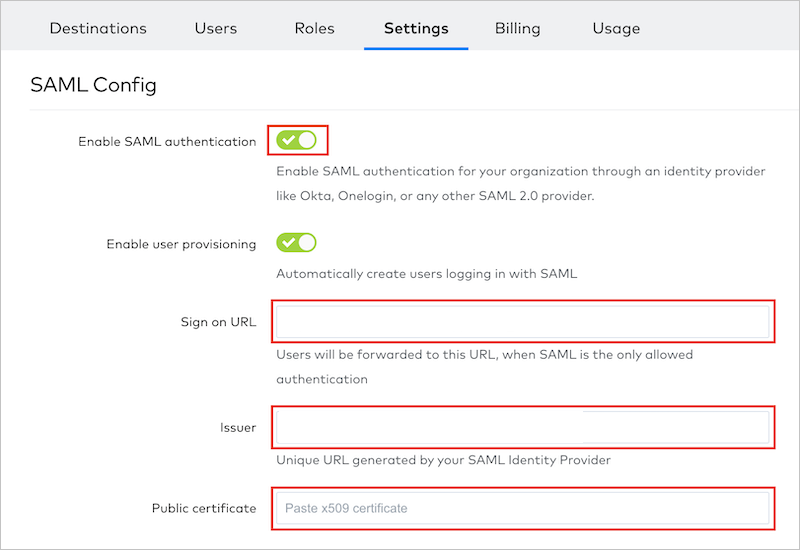

# Configure Fivetran for Single sign-on with Microsoft Entra ID

In this article,  you learn how to integrate Fivetran with Microsoft Entra ID. When you integrate Fivetran with Microsoft Entra ID, you can:

* Control in Microsoft Entra ID who has access to Fivetran.
* Enable your users to be automatically signed-in to Fivetran with their Microsoft Entra accounts.
* Manage your accounts in one central location.

## Prerequisites

The scenario outlined in this article assumes that you already have the following prerequisites:

[!INCLUDE [common-prerequisites.md](~/identity/saas-apps/includes/common-prerequisites.md)]
* A Fivetran account.

## Scenario description

In this article,  you configure and test Microsoft Entra SSO in a test environment.

* Fivetran supports **IDP** initiated SSO.
* Fivetran supports **Just In Time** user provisioning.

> [!NOTE]
> Identifier of this application is a fixed string value so only one instance can be configured in one tenant.

## Add Fivetran from the gallery

To configure the integration of Fivetran into Microsoft Entra ID, you need to add Fivetran from the gallery to your list of managed SaaS apps.

1. Sign in to the [Microsoft Entra admin center](https://entra.microsoft.com) as at least a [Cloud Application Administrator](~/identity/role-based-access-control/permissions-reference.md#cloud-application-administrator).
1. Browse to **Entra ID** > **Enterprise apps** > **New application**.
1. In the **Add from the gallery** section, type **Fivetran** in the search box.
1. Select **Fivetran** from results panel and then add the app. Wait a few seconds while the app is added to your tenant.

 [!INCLUDE [sso-wizard.md](~/identity/saas-apps/includes/sso-wizard.md)]

## Configure and test Microsoft Entra SSO for Fivetran

Configure and test Microsoft Entra SSO with Fivetran using a test user called **B.Simon**. For SSO to work, you need to establish a link relationship between a Microsoft Entra user and the related user in Fivetran.

To configure and test Microsoft Entra SSO with Fivetran, perform the following steps:

1. **[Configure Microsoft Entra SSO](#configure-azure-ad-sso)** - to enable your users to use this feature.
    1. **Create a Microsoft Entra test user** - to test Microsoft Entra single sign-on with B.Simon.
    1. **Assign the Microsoft Entra test user** - to enable B.Simon to use Microsoft Entra single sign-on.
1. **[Configure Fivetran SSO](#configure-fivetran-sso)** - to configure the single sign-on settings on application side.
    1. **[Create Fivetran test user](#create-fivetran-test-user)** - to have a counterpart of B.Simon in Fivetran that's linked to the Microsoft Entra representation of user.
1. **[Test SSO](#test-sso)** - to verify whether the configuration works.

## Configure Microsoft Entra SSO

Follow these steps to enable Microsoft Entra SSO.

1. Sign in to the [Microsoft Entra admin center](https://entra.microsoft.com) as at least a [Cloud Application Administrator](~/identity/role-based-access-control/permissions-reference.md#cloud-application-administrator).
1. Browse to **Entra ID** > **Enterprise apps** > **Fivetran** > **Single sign-on**.
1. On the **Select a single sign-on method** page, select **SAML**.
1. On the **Set up single sign-on with SAML** page, select the pencil icon for **Basic SAML Configuration** to edit the settings.

   

1. On the **Basic SAML Configuration** section, the application is pre-configured and the necessary URLs are already pre-populated with Azure. The user needs to save the configuration by selecting the **Save** button.

1. Fivetran application expects the SAML assertions in a specific format, which requires you to add custom attribute mappings to your SAML token attributes configuration. The following screenshot shows the list of default attributes.

	

1. In addition to above, Fivetran application expects few more attributes to be passed back in SAML response which are shown below. These attributes are also pre populated but you can review them as per your requirements.
	
	| Name |  Source Attribute|
	| -------------- | --------- |
	| FirstName | user.givenname |
	| LastName | user.surname |

1. On the **Set up single sign-on with SAML** page, in the **SAML Signing Certificate** section,  find **Certificate (Base64)** and select **Download** to download the certificate and save it on your computer.

	

1. On the **Set up Fivetran** section, copy the **Login URL** and **Microsoft Entra Identifier** values.

	

[!INCLUDE [create-assign-users-sso.md](~/identity/saas-apps/includes/create-assign-users-sso.md)]

## Configure Fivetran SSO

In this section, you configure single sign-on on the **Fivetran** side.

1. In a different web browser window, sign in to your Fivetran account as the account owner.

1. Select the arrow in the top left corner of the window, and then select **Manage Account** from the drop-down list.

   

1. Go to the **SAML Config** section of the **Settings** page.

   

   1. For **Enable SAML authentication**, select **ON**.
   1. In **Sign on URL**, paste the value of **Login URL**, which you copied.
   1. In **Issuer**, paste the value of **Microsoft Entra Identifier**, which you copied.
   1. Open your downloaded certificate file in a text editor, copy the certificate into your clipboard, and then paste it to in the **Public certificate** text box.
   1. Select **SAVE CONFIG**.

### Create Fivetran test user

In this section, a user called B.Simon is created in Fivetran. Fivetran supports just-in-time user provisioning, which is enabled by default. There's no action item for you in this section. If a user doesn't already exist in Fivetran, a new one is created after authentication.

## Test SSO 

In this section, you test your Microsoft Entra single sign-on configuration with following options.

* Select **Test this application**, and you should be automatically signed in to the Fivetran for which you set up the SSO.

* You can use Microsoft My Apps. When you select the Fivetran tile in the My Apps, you should be automatically signed in to the Fivetran for which you set up the SSO. For more information about the My Apps, see [Introduction to the My Apps](https://support.microsoft.com/account-billing/sign-in-and-start-apps-from-the-my-apps-portal-2f3b1bae-0e5a-4a86-a33e-876fbd2a4510).

## Related content

Once you configure Fivetran you can enforce session control, which protects exfiltration and infiltration of your organization’s sensitive data in real time. Session control extends from Conditional Access. [Learn how to enforce session control with Microsoft Defender for Cloud Apps](/cloud-app-security/proxy-deployment-any-app).
