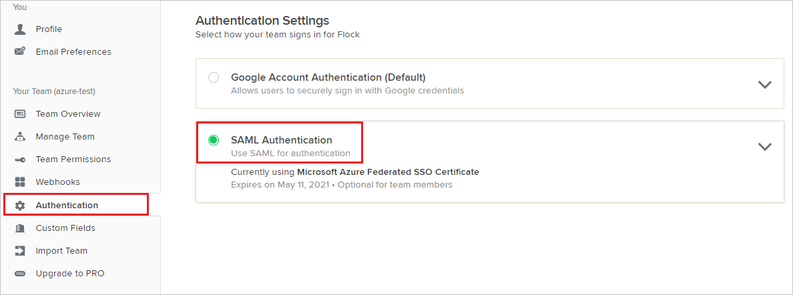

# Configure Flock for Single sign-on with Microsoft Entra ID

In this article,  you learn how to integrate Flock with Microsoft Entra ID. When you integrate Flock with Microsoft Entra ID, you can:

* Control in Microsoft Entra ID who has access to Flock.
* Enable your users to be automatically signed-in to Flock with their Microsoft Entra accounts.
* Manage your accounts in one central location.

## Prerequisites

The scenario outlined in this article assumes that you already have the following prerequisites:

[!INCLUDE [common-prerequisites.md](~/identity/saas-apps/includes/common-prerequisites.md)]
* Flock single sign-on (SSO) enabled subscription.

## Scenario description

In this article,  you configure and test Microsoft Entra single sign-on in a test environment.

* Flock supports **SP** initiated SSO.
* Flock supports [Automated user provisioning](flock-provisioning-tutorial.md).

## Adding Flock from the gallery

To configure the integration of Flock into Microsoft Entra ID, you need to add Flock from the gallery to your list of managed SaaS apps.

1. Sign in to the [Microsoft Entra admin center](https://entra.microsoft.com) as at least a [Cloud Application Administrator](~/identity/role-based-access-control/permissions-reference.md#cloud-application-administrator).
1. Browse to **Entra ID** > **Enterprise apps** > **New application**.
1. In the **Add from the gallery** section, type **Flock** in the search box.
1. Select **Flock** from results panel and then add the app. Wait a few seconds while the app is added to your tenant.

 [!INCLUDE [sso-wizard.md](~/identity/saas-apps/includes/sso-wizard.md)]

## Configure and test Microsoft Entra SSO for Flock

Configure and test Microsoft Entra SSO with Flock using a test user called **B.Simon**. For SSO to work, you need to establish a link relationship between a Microsoft Entra user and the related user in Flock.

To configure and test Microsoft Entra SSO with Flock, perform the following steps:

1. **[Configure Microsoft Entra SSO](#configure-azure-ad-sso)** - to enable your users to use this feature.
	1. **Create a Microsoft Entra test user** - to test Microsoft Entra single sign-on with Britta Simon.
	1. **Assign the Microsoft Entra test user** - to enable Britta Simon to use Microsoft Entra single sign-on.
2. **[Configure Flock SSO](#configure-flock-sso)** - to configure the Single Sign-On settings on application side.
	1. **[Create Flock test user](#create-flock-test-user)** - to have a counterpart of Britta Simon in Flock that's linked to the Microsoft Entra representation of user.
1. **[Test SSO](#test-sso)** - to verify whether the configuration works.

## Configure Microsoft Entra SSO

Follow these steps to enable Microsoft Entra SSO.

1. Sign in to the [Microsoft Entra admin center](https://entra.microsoft.com) as at least a [Cloud Application Administrator](~/identity/role-based-access-control/permissions-reference.md#cloud-application-administrator).
1. Browse to **Entra ID** > **Enterprise apps** > **Flock** > **Single sign-on**.
1. On the **Select a single sign-on method** page, select **SAML**.
1. On the **Set up single sign-on with SAML** page, select the pencil icon for **Basic SAML Configuration** to edit the settings.

   

1. On the **Basic SAML Configuration** section, perform the following steps:

	a. In the **Sign on URL** text box, type a URL using the following pattern:
    `https://<subdomain>.flock.com/`

    b. In the **Identifier (Entity ID)** text box, type a URL using the following pattern:
    `https://<subdomain>.flock.com/`

	> [!NOTE]
	> These values aren't real. Update these values with the actual Sign on URL and Identifier. Contact [Flock Client support team](mailto:support@flock.com) to get these values. You can also refer to the patterns shown in the **Basic SAML Configuration** section.

4. On the **Set up Single Sign-On with SAML** page, in the **SAML Signing Certificate** section, select **Download** to download the **Certificate (Base64)** from the given options as per your requirement and save it on your computer.

	

1. On the **Set up Flock** section, copy the appropriate URL(s) as per your requirement.

	

[!INCLUDE [create-assign-users-sso.md](~/identity/saas-apps/includes/create-assign-users-sso.md)]

## Configure Flock SSO

1. In a different web browser window, log in to your Flock company site as an administrator.

2. Select **Authentication** tab from the left navigation panel and then select **SAML Authentication**.

	

3. In the **SAML Authentication** section, perform the following steps:

	

	a. In the **SAML 2.0 Endpoint(HTTP)** textbox, paste **Login URL** value which you copied previously.

	b. In the **Identity Provider Issuer** textbox, paste **Microsoft Entra Identifier** value which you copied previously.

	c. Open the downloaded **Certificate(Base64)** from Azure portal in notepad, paste the content into the **Public Certificate** textbox.

	d. Select **Save**.

### Create Flock test user

To enable Microsoft Entra users to log in to Flock, they must be provisioned into Flock. In the case of Flock, provisioning is a manual task.

**To provision a user account, perform the following steps:**

1. Log in to your Flock company site as an administrator.

2. Select **Manage Team** from the left navigation panel.

    

3. Select **Add Member** tab and then select **Team Members**.

	

4. Enter the email address of the user like **Brittasimon\@contoso.com** and then select **Add Users**.

	

> [!NOTE]
>Flock also supports automatic user provisioning, you can find more details [here](./flock-provisioning-tutorial.md) on how to configure automatic user provisioning.

## Test SSO 

In this section, you test your Microsoft Entra single sign-on configuration with following options. 

* Select **Test this application**, this option redirects to Flock Sign-on URL where you can initiate the login flow. 

* Go to Flock Sign-on URL directly and initiate the login flow from there.

* You can use Microsoft My Apps. When you select the Flock tile in the My Apps, this option redirects to Flock Sign-on URL. For more information, see [Microsoft Entra My Apps](/azure/active-directory/manage-apps/end-user-experiences#azure-ad-my-apps).

## Related content

Once you configure Flock you can enforce session control, which protects exfiltration and infiltration of your organization’s sensitive data in real time. Session control extends from Conditional Access. [Learn how to enforce session control with Microsoft Defender for Cloud Apps](/cloud-app-security/proxy-deployment-any-app).
