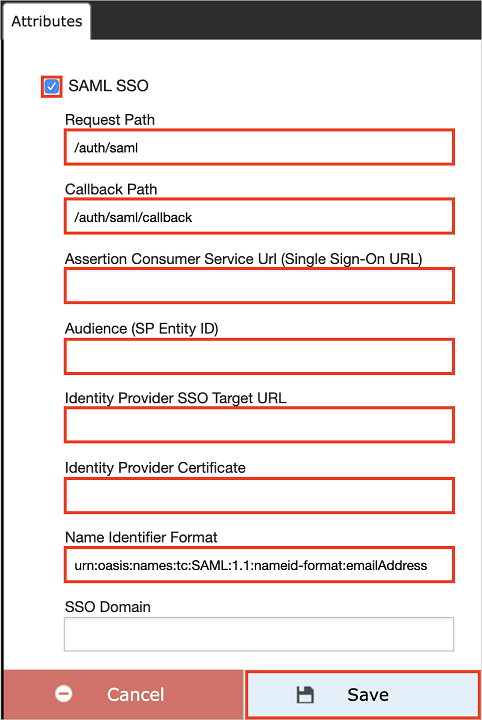
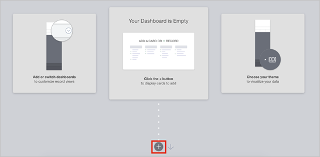
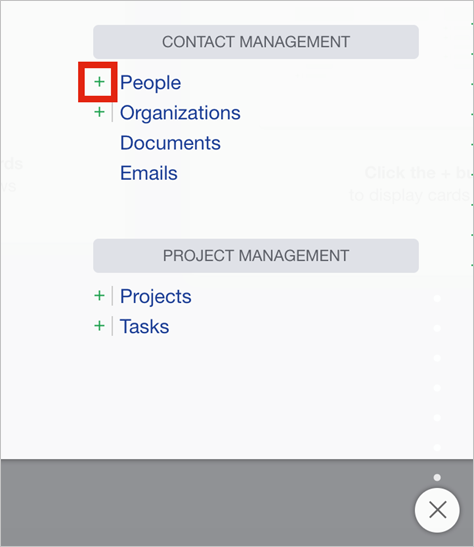
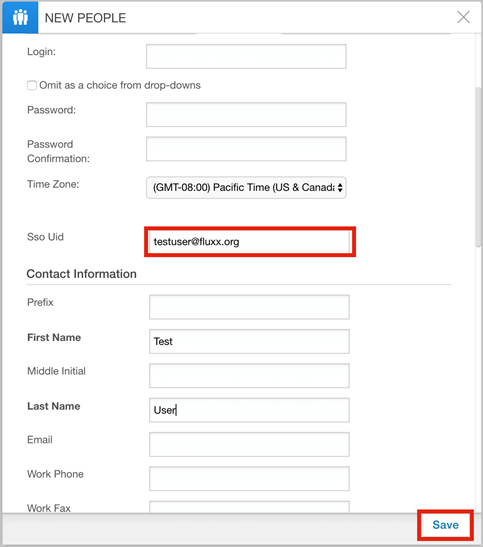

# Configure Fluxx Labs for Single sign-on with Microsoft Entra ID

In this article,  you learn how to integrate Fluxx Labs with Microsoft Entra ID. When you integrate Fluxx Labs with Microsoft Entra ID, you can:

* Control in Microsoft Entra ID who has access to Fluxx Labs.
* Enable your users to be automatically signed-in to Fluxx Labs with their Microsoft Entra accounts.
* Manage your accounts in one central location.

## Prerequisites

The scenario outlined in this article assumes that you already have the following prerequisites:

[!INCLUDE [common-prerequisites.md](~/identity/saas-apps/includes/common-prerequisites.md)]
* Fluxx Labs single sign-on (SSO) enabled subscription.

## Scenario description

In this article,  you configure and test Microsoft Entra SSO in a test environment.

* Fluxx Labs supports **IDP** initiated SSO.

## Add Fluxx Labs from the gallery

To configure the integration of Fluxx Labs into Microsoft Entra ID, you need to add Fluxx Labs from the gallery to your list of managed SaaS apps.

1. Sign in to the [Microsoft Entra admin center](https://entra.microsoft.com) as at least a [Cloud Application Administrator](~/identity/role-based-access-control/permissions-reference.md#cloud-application-administrator).
1. Browse to **Entra ID** > **Enterprise apps** > **New application**.
1. In the **Add from the gallery** section, type **Fluxx Labs** in the search box.
1. Select **Fluxx Labs** from results panel and then add the app. Wait a few seconds while the app is added to your tenant.

 [!INCLUDE [sso-wizard.md](~/identity/saas-apps/includes/sso-wizard.md)]

## Configure and test Microsoft Entra SSO for Fluxx Labs

Configure and test Microsoft Entra SSO with Fluxx Labs using a test user called **B.Simon**. For SSO to work, you need to establish a link relationship between a Microsoft Entra user and the related user in Fluxx Labs.

To configure and test Microsoft Entra SSO with Fluxx Labs, perform the following steps:

1. **[Configure Microsoft Entra SSO](#configure-azure-ad-sso)** - to enable your users to use this feature.
    1. **Create a Microsoft Entra test user** - to test Microsoft Entra single sign-on with B.Simon.
    1. **Assign the Microsoft Entra test user** - to enable B.Simon to use Microsoft Entra single sign-on.
1. **[Configure Fluxx Labs SSO](#configure-fluxx-labs-sso)** - to configure the single sign-on settings on application side.
    1. **[Create Fluxx Labs test user](#create-fluxx-labs-test-user)** - to have a counterpart of B.Simon in Fluxx Labs that's linked to the Microsoft Entra representation of user.
1. **[Test SSO](#test-sso)** - to verify whether the configuration works.

## Configure Microsoft Entra SSO

Follow these steps to enable Microsoft Entra SSO.

1. Sign in to the [Microsoft Entra admin center](https://entra.microsoft.com) as at least a [Cloud Application Administrator](~/identity/role-based-access-control/permissions-reference.md#cloud-application-administrator).
1. Browse to **Entra ID** > **Enterprise apps** > **Fluxx Labs** > **Single sign-on**.
1. On the **Select a single sign-on method** page, select **SAML**.
1. On the **Set up single sign-on with SAML** page, select the pencil icon for **Basic SAML Configuration** to edit the settings.

   

1. On the **Set up Single Sign-On with SAML** page, perform the following steps:

    a. In the **Identifier** text box, type a URL using one of the following patterns:

    | Environment | URL Pattern|
	|-------------|------------|
	| Production | `https://<subdomain>.fluxx.io` |
	| Pre production | `https://<subdomain>.preprod.fluxxlabs.com`|

    b. In the **Reply URL** text box, type a URL using one of the following patterns:

    | Environment | URL Pattern|
	|-------------|------------|
	| Production | `https://<subdomain>.fluxx.io/auth/saml/callback` |
	| Pre production | `https://<subdomain>.preprod.fluxxlabs.com/auth/saml/callback`|

	> [!NOTE]
	> These values aren't real. Update these values with the actual Identifier and Reply URL. Contact [Fluxx Labs Client support team](https://fluxx.zendesk.com) to get these values. You can also refer to the patterns shown in the **Basic SAML Configuration** section.

1. On the **Set up single sign-on with SAML** page, in the **SAML Signing Certificate** section,  find **Certificate (Base64)** and select **Download** to download the certificate and save it on your computer.

	

1. On the **Set up Fluxx Labs** section, copy the appropriate URL(s) based on your requirement.

	

[!INCLUDE [create-assign-users-sso.md](~/identity/saas-apps/includes/create-assign-users-sso.md)]

## Configure Fluxx Labs SSO

1. In a different web browser window, sign in to your Fluxx Labs company site as administrator.

2. Select **Admin** below the **Settings** section.

	

3. In the Admin Panel, Select **Plug-ins** > **Integrations** and then select **SAML SSO-(Disabled)**

	

4. In the attribute section, perform the following steps:

	

	a. Select the **SAML SSO** checkbox.

	b. In the **Request Path** textbox, type **/auth/saml**.

	c. In the **Callback Path** textbox, type **/auth/saml/callback**.

	d. In the **Assertion Consumer Service Url(Single Sign-On URL)** textbox, enter the **Reply URL** value, which you have entered.

	e. In the **Audience(SP Entity ID)** textbox, enter the **Identifier** value, which you have entered.

	f. In the **Identity Provider SSO Target URL** textbox, paste the **Login URL** value, which you copied previously.

	g. Open your base-64 encoded certificate in notepad, copy the content of it into your clipboard, and then paste it to the **Identity Provider Certificate** textbox.

	h. In **Name identifier Format** textbox, enter the value `urn:oasis:names:tc:SAML:1.1:nameid-format:emailAddress`.

	i. Select **Save**.

	> [!NOTE]
	> Once the content saved, the field appears blank for security, but the value has been saved in the configuration.

### Create Fluxx Labs test user

To enable Microsoft Entra users to sign in to Fluxx Labs, they must be provisioned into Fluxx Labs. In the case of Fluxx Labs, provisioning is a manual task.

**To provision a user account, perform the following steps:**

1. Sign in to your Fluxx Labs company site as an administrator.

2. Select the  below displayed **icon**.

	

3. On the dashboard, select the below displayed icon to open the **New PEOPLE** card.

    

4. On the **NEW PEOPLE** section, perform the following steps:

	

	a. Fluxx Labs use email as the unique identifier for SSO logins. Populate the **SSO UID** field with the user’s email address, that matches the email address, which they are using as login with SSO.

	b. Select **Save**.

## Test SSO

In this section, you test your Microsoft Entra single sign-on configuration with following options.

* Select **Test this application**, and you should be automatically signed in to the Fluxx Labs for which you set up the SSO.

* You can use Microsoft My Apps. When you select the Fluxx Labs tile in the My Apps, you should be automatically signed in to the Fluxx Labs for which you set up the SSO. For more information about the My Apps, see [Introduction to the My Apps](https://support.microsoft.com/account-billing/sign-in-and-start-apps-from-the-my-apps-portal-2f3b1bae-0e5a-4a86-a33e-876fbd2a4510).

## Related content

Once you configure Fluxx Labs you can enforce session control, which protects exfiltration and infiltration of your organization’s sensitive data in real time. Session control extends from Conditional Access. [Learn how to enforce session control with Microsoft Defender for Cloud Apps](/cloud-app-security/proxy-deployment-any-app).
