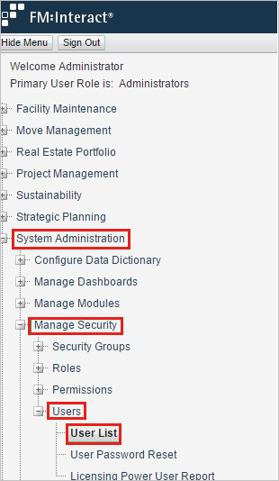
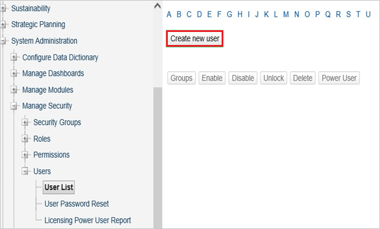
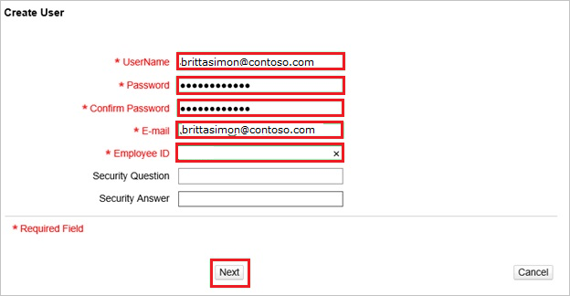

# Configure FM:Systems for Single sign-on with Microsoft Entra ID

In this article,  you learn how to integrate FM:Systems with Microsoft Entra ID. When you integrate FM:Systems with Microsoft Entra ID, you can:

* Control in Microsoft Entra ID who has access to FM:Systems.
* Enable your users to be automatically signed-in to FM:Systems with their Microsoft Entra accounts.
* Manage your accounts in one central location.

## Prerequisites

The scenario outlined in this article assumes that you already have the following prerequisites:

[!INCLUDE [common-prerequisites.md](~/identity/saas-apps/includes/common-prerequisites.md)]
* FM:Systems single sign-on enabled subscription.

## Scenario description

In this article,  you configure and test Microsoft Entra single sign-on in a test environment.

* FM:Systems supports **IDP** initiated SSO.

> [!NOTE]
> Identifier of this application is a fixed string value so only one instance can be configured in one tenant.

## Add FM:Systems from the gallery

To configure the integration of FM:Systems into Microsoft Entra ID, you need to add FM:Systems from the gallery to your list of managed SaaS apps.

1. Sign in to the [Microsoft Entra admin center](https://entra.microsoft.com) as at least a [Cloud Application Administrator](~/identity/role-based-access-control/permissions-reference.md#cloud-application-administrator).
1. Browse to **Entra ID** > **Enterprise apps** > **New application**.
1. In the **Add from the gallery** section, type **FM:Systems** in the search box.
1. Select **FM:Systems** from results panel and then add the app. Wait a few seconds while the app is added to your tenant.

 [!INCLUDE [sso-wizard.md](~/identity/saas-apps/includes/sso-wizard.md)]

## Configure and test Microsoft Entra SSO for FM:Systems

Configure and test Microsoft Entra SSO with FM:Systems using a test user called **B.Simon**. For SSO to work, you need to establish a link relationship between a Microsoft Entra user and the related user in FM:Systems.

To configure and test Microsoft Entra SSO with FM:Systems, perform the following steps:

1. **[Configure Microsoft Entra SSO](#configure-azure-ad-sso)** - to enable your users to use this feature.
    1. **Create a Microsoft Entra test user** - to test Microsoft Entra single sign-on with B.Simon.
    1. **Assign the Microsoft Entra test user** - to enable B.Simon to use Microsoft Entra single sign-on.
1. **[Configure FM:Systems SSO](#configure-fmsystems-sso)** - to configure the single sign-on settings on application side.
    1. **[Create FM:Systems test user](#create-fmsystems-test-user)** - to have a counterpart of B.Simon in FM:Systems that's linked to the Microsoft Entra representation of user.
1. **[Test SSO](#test-sso)** - to verify whether the configuration works.

## Configure Microsoft Entra SSO

Follow these steps to enable Microsoft Entra SSO.

1. Sign in to the [Microsoft Entra admin center](https://entra.microsoft.com) as at least a [Cloud Application Administrator](~/identity/role-based-access-control/permissions-reference.md#cloud-application-administrator).
1. Browse to **Entra ID** > **Enterprise apps** > **FM:Systems** > **Single sign-on**.
1. On the **Select a single sign-on method** page, select **SAML**.
1. On the **Set up single sign-on with SAML** page, select the pencil icon for **Basic SAML Configuration** to edit the settings.

   

1. On the **Basic SAML Configuration** section, perform the following step:

    In the **Reply URL** text box, type a URL using the following pattern:
    `https://<companyname>.fmshosted.com/fminteract/ConsumerService2.aspx`
    
    > [!NOTE]
    > This value isn't real. Update this value with the actual Reply URL. Contact [FM:Systems Client support team](https://fmsystems.com/support-services/) to get the value. You can also refer to the patterns shown in the **Basic SAML Configuration** section.

1. On the **Set up Single Sign-On with SAML** page, in the **SAML Signing Certificate** section, select **Download** to download the **Federation Metadata XML** from the given options as per your requirement and save it on your computer.

    

6. On the **Set up FM:Systems** section, copy the appropriate URL(s) as per your requirement.

    

[!INCLUDE [create-assign-users-sso.md](~/identity/saas-apps/includes/create-assign-users-sso.md)]

## Configure FM:Systems SSO

To configure single sign-on on **FM:Systems** side, you need to send the downloaded **Federation Metadata XML** and appropriate copied URLs from the application configuration to [FM:Systems support team](https://fmsystems.com/support-services/). They set this setting to have the SAML SSO connection set properly on both sides.

### Create FM:Systems test user

1. In a web browser window, sign into your FM:Systems company site as an administrator.

2. Go to **System Administration** > **Manage Security** > **Users** > **User list**.
   
    

3. Select **Create new user**.
   
    

4. In the **Create User** section, perform the following steps:
   
    
   
    a. Type the **UserName**, the **Password**, **Confirm Password**, **E-mail** and the **Employee ID** of a valid Microsoft Entra account you want to provision into the related textboxes.
   
    b. Select **Next**.

## Test SSO

In this section, you test your Microsoft Entra single sign-on configuration with following options.

* Select **Test this application**, and you should be automatically signed in to the FM:Systems for which you set up the SSO.

* You can use Microsoft My Apps. When you select the FM:Systems tile in the My Apps, you should be automatically signed in to the FM:Systems for which you set up the SSO. For more information, see [Microsoft Entra My Apps](/azure/active-directory/manage-apps/end-user-experiences#azure-ad-my-apps).

## Related content

Once you configure FM:Systems you can enforce session control, which protects exfiltration and infiltration of your organization’s sensitive data in real time. Session control extends from Conditional Access. [Learn how to enforce session control with Microsoft Defender for Cloud Apps](/cloud-app-security/proxy-deployment-aad).
