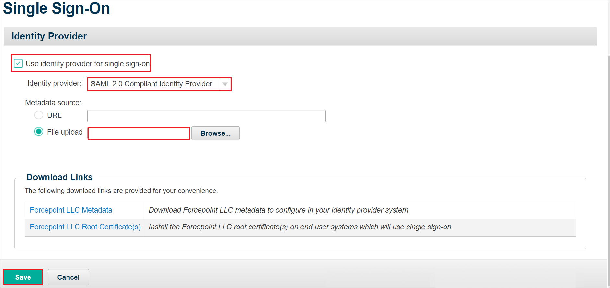

# Configure Forcepoint Cloud Security Gateway - User Authentication for Single sign-on with Microsoft Entra ID

In this article,  you learn how to integrate Forcepoint Cloud Security Gateway - User Authentication with Microsoft Entra ID. When you integrate Forcepoint Cloud Security Gateway - User Authentication with Microsoft Entra ID, you can:

* Control in Microsoft Entra ID who has access to Forcepoint Cloud Security Gateway - User Authentication.
* Enable your users to be automatically signed-in to Forcepoint Cloud Security Gateway - User Authentication with their Microsoft Entra accounts.
* Manage your accounts in one central location.

## Prerequisites

To get started, you need the following items:

* A Microsoft Entra subscription. If you don't have a subscription, you can get a [free account](https://azure.microsoft.com/free/).
* Forcepoint Cloud Security Gateway - User Authentication single sign-on (SSO) enabled subscription.
* Along with Cloud Application Administrator, Application Administrator can also add or manage applications in Microsoft Entra ID.
For more information, see [Azure built-in roles](~/identity/role-based-access-control/permissions-reference.md).

## Scenario description

In this article,  you configure and test Microsoft Entra SSO in a test environment.

* Forcepoint Cloud Security Gateway - User Authentication supports **SP** initiated SSO.
* Forcepoint Cloud Security Gateway - User Authentication supports [Automated user provisioning](forcepoint-cloud-security-gateway-provisioning-tutorial.md).

> [!NOTE]
> Identifier of this application is a fixed string value so only one instance can be configured in one tenant.

## Add Forcepoint Cloud Security Gateway - User Authentication from the gallery

To configure the integration of Forcepoint Cloud Security Gateway - User Authentication into Microsoft Entra ID, you need to add Forcepoint Cloud Security Gateway - User Authentication from the gallery to your list of managed SaaS apps.

1. Sign in to the [Microsoft Entra admin center](https://entra.microsoft.com) as at least a [Cloud Application Administrator](~/identity/role-based-access-control/permissions-reference.md#cloud-application-administrator).
1. Browse to **Entra ID** > **Enterprise apps** > **New application**.
1. In the **Add from the gallery** section, type **Forcepoint Cloud Security Gateway - User Authentication** in the search box.
1. Select **Forcepoint Cloud Security Gateway - User Authentication** from results panel and then add the app. Wait a few seconds while the app is added to your tenant.

 [!INCLUDE [sso-wizard.md](~/identity/saas-apps/includes/sso-wizard.md)]

## Configure and test Microsoft Entra SSO for Forcepoint Cloud Security Gateway - User Authentication

Configure and test Microsoft Entra SSO with Forcepoint Cloud Security Gateway - User Authentication using a test user called **B.Simon**. For SSO to work, you need to establish a link relationship between a Microsoft Entra user and the related user in Forcepoint Cloud Security Gateway - User Authentication.

To configure and test Microsoft Entra SSO with Forcepoint Cloud Security Gateway - User Authentication, perform the following steps:

1. **[Configure Microsoft Entra SSO](#configure-azure-ad-sso)** - to enable your users to use this feature.
    1. **Create a Microsoft Entra test user** - to test Microsoft Entra single sign-on with B.Simon.
    1. **Assign the Microsoft Entra test user** - to enable B.Simon to use Microsoft Entra single sign-on.
1. **[Configure Forcepoint Cloud Security Gateway - User Authentication SSO](#configure-forcepoint-cloud-security-gateway---user-authentication-sso)** - to configure the single sign-on settings on application side.
    1. **[Create Forcepoint Cloud Security Gateway - User Authentication test user](#create-forcepoint-cloud-security-gateway---user-authentication-test-user)** - to have a counterpart of B.Simon in Forcepoint Cloud Security Gateway - User Authentication that's linked to the Microsoft Entra representation of user.
1. **[Test SSO](#test-sso)** - to verify whether the configuration works.

## Configure Microsoft Entra SSO

Follow these steps to enable Microsoft Entra SSO.

1. Sign in to the [Microsoft Entra admin center](https://entra.microsoft.com) as at least a [Cloud Application Administrator](~/identity/role-based-access-control/permissions-reference.md#cloud-application-administrator).
1. Browse to **Entra ID** > **Enterprise apps** > **Forcepoint Cloud Security Gateway - User Authentication** > **Single sign-on**.
1. On the **Select a single sign-on method** page, select **SAML**.
1. On the **Set up single sign-on with SAML** page, select the pencil icon for **Basic SAML Configuration** to edit the settings.

    

1. On the **Basic SAML Configuration** section, perform the following steps:

    a. In the **Identifier** text box, type the URL:
    `https://mailcontrol.com/sp_metadata.xml`

    b. In the **Reply URL** text box, type the URL:
    `https://proxy-login.blackspider.com/`

    c. In the **Sign-on URL** text box, type the URL:
    `https://forcepoint.com`

1. On the **Set up Single Sign-On with SAML** page, in the **SAML Signing Certificate** section, select **Download** to download the **Federation Metadata XML** from the given options as per your requirement and save it on your computer.

    

1. On the **Set up Forcepoint Cloud Security Gateway - User Authentication** section, copy the appropriate URL(s) based on your requirement.

   

[!INCLUDE [create-assign-users-sso.md](~/identity/saas-apps/includes/create-assign-users-sso.md)]

## Configure Forcepoint Cloud Security Gateway - User Authentication SSO

1. Log in to your Forcepoint Cloud Security Gateway - User Authentication company site as an administrator.

1. Go to **Web** > **SETTINGS** and select **Single Sign-On**.

1. In the **Single Sign-On** page, perform the following steps:
    
    

    a. Enable **Use identity provider for single sign-on** checkbox.

    b. Select **Identity provider** from the dropdown.

    c. Upload the **Federation Metadata XML** file into the **File upload** textbox by selecting **Browse** option.

    d. Select **Save**.

### Create Forcepoint Cloud Security Gateway - User Authentication test user

In this section, you create a user called Britta Simon in Forcepoint Cloud Security Gateway - User Authentication. Work with [Forcepoint Cloud Security Gateway - User Authentication support team](mailto:support@forcepoint.com) to add the users in the Forcepoint Cloud Security Gateway - User Authentication platform. Users must be created and activated before you use single sign-on.

## Test SSO 

In this section, you test your Microsoft Entra single sign-on configuration with following options. 

* Select **Test this application**, this option redirects to Forcepoint Cloud Security Gateway - User Authentication Sign-on URL where you can initiate the login flow. 

* Go to Forcepoint Cloud Security Gateway - User Authentication Sign-on URL directly and initiate the login flow from there.

* You can use Microsoft My Apps. When you select the Forcepoint Cloud Security Gateway - User Authentication tile in the My Apps, this option redirects to Forcepoint Cloud Security Gateway - User Authentication Sign-on URL. For more information about the My Apps, see [Introduction to the My Apps](https://support.microsoft.com/account-billing/sign-in-and-start-apps-from-the-my-apps-portal-2f3b1bae-0e5a-4a86-a33e-876fbd2a4510).

## Related content

Once you configure Forcepoint Cloud Security Gateway - User Authentication you can enforce session control, which protects exfiltration and infiltration of your organization’s sensitive data in real time. Session control extends from Conditional Access. [Learn how to enforce session control with Microsoft Defender for Cloud Apps](/cloud-app-security/proxy-deployment-any-app).
