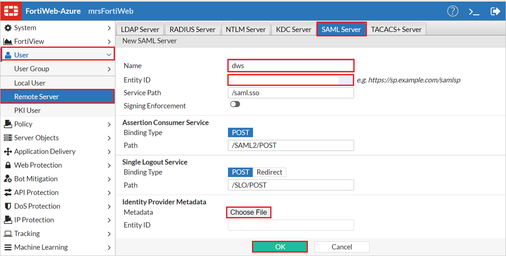
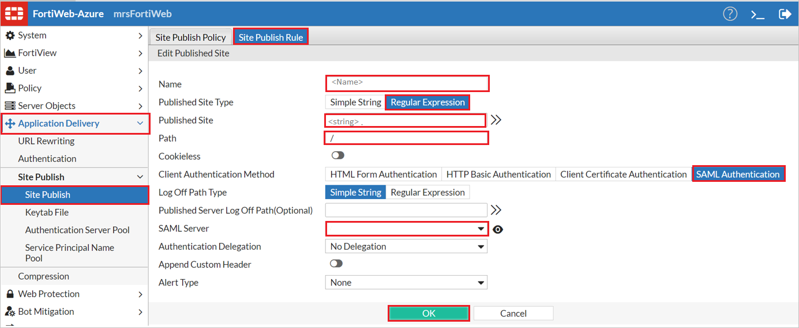
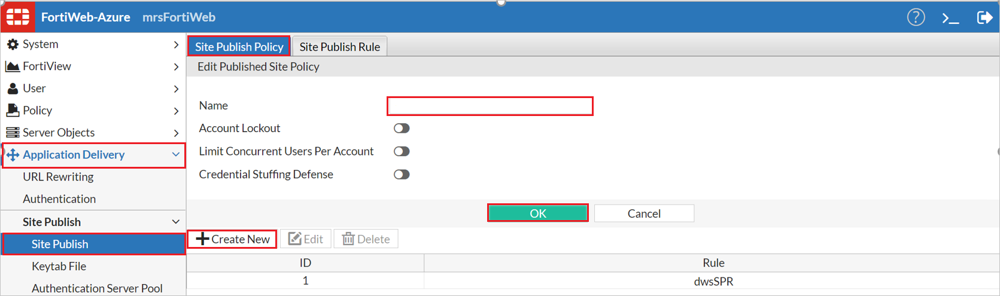
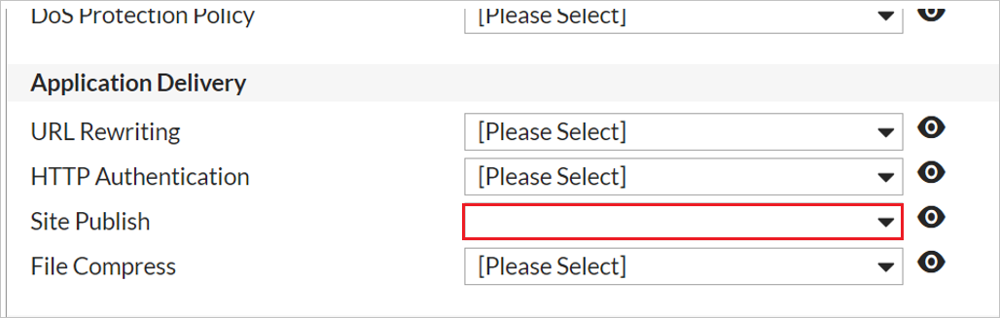

# Configure FortiWeb Web Application Firewall for Single sign-on with Microsoft Entra ID

In this article,  you learn how to integrate FortiWeb Web Application Firewall with Microsoft Entra ID. When you integrate FortiWeb Web Application Firewall with Microsoft Entra ID, you can:

* Control in Microsoft Entra ID who has access to FortiWeb Web Application Firewall.
* Enable your users to be automatically signed-in to FortiWeb Web Application Firewall with their Microsoft Entra accounts.
* Manage your accounts in one central location.

## Prerequisites

The scenario outlined in this article assumes that you already have the following prerequisites:

[!INCLUDE [common-prerequisites.md](~/identity/saas-apps/includes/common-prerequisites.md)]
* FortiWeb Web Application Firewall single sign-on (SSO) enabled subscription.

> [!NOTE]
> This integration is also available to use from Microsoft Entra US Government Cloud environment. You can find this application in the Microsoft Entra US Government Cloud Application Gallery and configure it in the same way as you do from public cloud.

## Scenario description

In this article,  you configure and test Microsoft Entra SSO in a test environment.

* FortiWeb Web Application Firewall supports **SP** initiated SSO.

## Adding FortiWeb Web Application Firewall from the gallery

To configure the integration of FortiWeb Web Application Firewall into Microsoft Entra ID, you need to add FortiWeb Web Application Firewall from the gallery to your list of managed SaaS apps.

1. Sign in to the [Microsoft Entra admin center](https://entra.microsoft.com) as at least a [Cloud Application Administrator](~/identity/role-based-access-control/permissions-reference.md#cloud-application-administrator).
1. Browse to **Entra ID** > **Enterprise apps** > **New application**.
1. In the **Add from the gallery** section, type **FortiWeb Web Application Firewall** in the search box.
1. Select **FortiWeb Web Application Firewall** from results panel and then add the app. Wait a few seconds while the app is added to your tenant.

 [!INCLUDE [sso-wizard.md](~/identity/saas-apps/includes/sso-wizard.md)]

## Configure and test Microsoft Entra SSO for FortiWeb Web Application Firewall

Configure and test Microsoft Entra SSO with FortiWeb Web Application Firewall using a test user called **B.Simon**. For SSO to work, you need to establish a link relationship between a Microsoft Entra user and the related user in FortiWeb Web Application Firewall.

To configure and test Microsoft Entra SSO with FortiWeb Web Application Firewall, perform the following steps:

1. **[Configure Microsoft Entra SSO](#configure-azure-ad-sso)** - to enable your users to use this feature.
    1. **Create a Microsoft Entra test user** - to test Microsoft Entra single sign-on with B.Simon.
    1. **Assign the Microsoft Entra test user** - to enable B.Simon to use Microsoft Entra single sign-on.
1. **[Configure FortiWeb Web Application Firewall SSO](#configure-fortiweb-web-application-firewall-sso)** - to configure the single sign-on settings on application side.
    1. **[Create FortiWeb Web Application Firewall test user](#create-fortiweb-web-application-firewall-test-user)** - to have a counterpart of B.Simon in FortiWeb Web Application Firewall that's linked to the Microsoft Entra representation of user.
1. **[Test SSO](#test-sso)** - to verify whether the configuration works.

## Configure Microsoft Entra SSO

Follow these steps to enable Microsoft Entra SSO.

1. Sign in to the [Microsoft Entra admin center](https://entra.microsoft.com) as at least a [Cloud Application Administrator](~/identity/role-based-access-control/permissions-reference.md#cloud-application-administrator).
1. Browse to **Entra ID** > **Enterprise apps** > **FortiWeb Web Application Firewall** > **Single sign-on**.
1. On the **Select a single sign-on method** page, select **SAML**.
1. On the **Set up single sign-on with SAML** page, select the pen icon for **Basic SAML Configuration** to edit the settings.

   

1. On the **Basic SAML Configuration** section, enter the values for the following fields:

    1. In the **Identifier (Entity ID)** text box, type a URL using the following pattern: `https://www.<CUSTOMER_DOMAIN>.com`

    1. In the **Reply URL** text box, type a URL using the following pattern:
    `https://www.<CUSTOMER_DOMAIN>.com/<FORTIWEB_NAME>/saml.sso/SAML2/POST`

    1. In the **Sign on URL** text box, type a URL using the following pattern:
    `https://www.<CUSTOMER_DOMAIN>.com`

    1. In the **Logout URL** text box, type a URL using the following pattern:
    `https://www.<CUSTOMER_DOMAIN>.info/<FORTIWEB_NAME>/saml.sso/SLO/POST`
 
    > [!NOTE]
    > `<FORTIWEB_NAME>` is a name identifier that's used later when supplying configuration to FortiWeb.
    > Contact [FortiWeb Web Application Firewall support team](mailto:support@fortinet.com) to get the real URL values. You can also refer to the patterns shown in the **Basic SAML Configuration** section.

1. On the **Set up single sign-on with SAML** page, in the **SAML Signing Certificate** section,  find **Federation Metadata XML** and select **Download** to download the certificate and save it on your computer.

    

[!INCLUDE [create-assign-users-sso.md](~/identity/saas-apps/includes/create-assign-users-sso.md)]

## Configure FortiWeb Web Application Firewall SSO

1.	Navigate to `https://<address>:8443` where `<address>` is the FQDN or the public IP address assigned to the FortiWeb VM.

2.	Sign-in using the administrator credentials provided during the FortiWeb VM deployment.

1. Perform the following steps in the following page.

    

    a.	In the left-hand menu, select **User**.

    b.	Under User, select **Remote Server**.

    c.	Select **SAML Server**.

    d.	Select **Create New**.

    e.	In the **Name** field, provide the value for `<fwName>` used in the Configure Microsoft Entra ID section.

    f.	In the **Entity ID** textbox, Enter the **Identifier (Entity ID)** value, like `https://www.<CUSTOMER_DOMAIN>.com/samlsp`

    g. Next to **Metadata**, select **Choose File** and select the **Federation Metadata XML** file which you have downloaded.

    h.	Select **OK**.

### Create a Site Publishing Rule

1.	Navigate to `https://<address>:8443` where `<address>` is the FQDN or the public IP address assigned to the FortiWeb VM.

1.	Sign-in using the administrator credentials provided during the FortiWeb VM deployment.
1. Perform the following steps in the following page.

    

    a.	In the left-hand menu, select **Application Delivery**.
    
    b.	Under **Application Delivery**, select **Site Publish**.
    
    c.	Under **Site Publish**, select **Site Publish**.
    
    d.	Select **Site Publish Rule**.
    
    e.	Select **Create New**.
    
    f.	Provide a name for the site publishing rule.
    
    g.	Next to **Published Site Type**, select **Regular Expression**.
    
    i.	Next to **Published Site**, provide a string that will match the host header of the web site you're publishing.
    
    j.	Next to **Path**, provide a /.
    
    k.	Next to **Client Authentication Method**, select **SAML Authentication**.
    
    l.	In the **SAML Server** drop-down, select the SAML Server you created earlier.
    
    m.	Select **OK**.

### Create a Site Publishing Policy

1.	Navigate to `https://<address>:8443` where `<address>` is the FQDN or the public IP address assigned to the FortiWeb VM.

2.	Sign-in using the administrator credentials provided during the FortiWeb VM deployment.

1. Perform the following steps in the following page.

    

    a.	In the left-hand menu, select **Application Delivery**.

    b.	Under **Application Delivery**, select **Site Publish**.

    c.	Under **Site Publish**, select **Site Publish**.

    d.	Select **Site Publish Policy**.

    e.	Select **Create New**.

    f.	Provide a name for the Site Publishing Policy.

    g.	Select **OK**.

    h.	Select **Create New**.

    i.	In the **Rule** drop-down, select the site publishing rule you created earlier.

    j.	Select **OK**.

### Create and assign a Web Protection Profile

1.	Navigate to `https://<address>:8443` where `<address>` is the FQDN or the public IP address assigned to the FortiWeb VM.

2.	Sign-in using the administrator credentials provided during the FortiWeb VM deployment.
3.	In the left-hand menu, select **Policy**.
4.	Under **Policy**, select **Web Protection Profile**.
5.	Select **Inline Standard Protection** and select **Clone**.
6.	Provide a name for the new web protection profile and select **OK**.
7.	Select the new web protection profile and select **Edit**.
8.	Next to **Site Publish**, select the site publishing policy you created earlier.
9.	Select **OK**.
 
    

10.	In the left-hand menu, select **Policy**.
11.	Under **Policy**, select **Server Policy**.
12.	Select the server policy used to publish the web site for which you wish to use Microsoft Entra ID for authentication.
13.	Select **Edit**.
14.	In the **Web Protection Profile** drop-down, select the web protection profile that you just created.
15.	Select **OK**.
16.	Attempt to access the external URL to which FortiWeb publishes the web site. You should be redirected to Microsoft Entra ID for authentication.

### Create FortiWeb Web Application Firewall test user

In this section, you create a user called Britta Simon in FortiWeb Web Application Firewall. Work with [FortiWeb Web Application Firewall support team](mailto:support@fortinet.com) to add the users in the FortiWeb Web Application Firewall platform. Users must be created and activated before you use single sign-on.

## Test SSO 

In this section, you test your Microsoft Entra single sign-on configuration with following options. 

* Select **Test this application**, this option redirects to FortiWeb Web Application Sign-on URL where you can initiate the login flow. 

* Go to FortiWeb Web Application Sign-on URL directly and initiate the login flow from there.

* You can use Microsoft My Apps. When you select the FortiWeb Web Application tile in the My Apps, this option redirects to FortiWeb Web Application Sign-on URL. For more information about the My Apps, see [Introduction to the My Apps](https://support.microsoft.com/account-billing/sign-in-and-start-apps-from-the-my-apps-portal-2f3b1bae-0e5a-4a86-a33e-876fbd2a4510).

## Related content

Once you configure FortiWeb Web Application Firewall you can enforce session control, which protects exfiltration and infiltration of your organization’s sensitive data in real time. Session control extends from Conditional Access. [Learn how to enforce session control with Microsoft Defender for Cloud Apps](/cloud-app-security/proxy-deployment-any-app).
