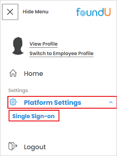
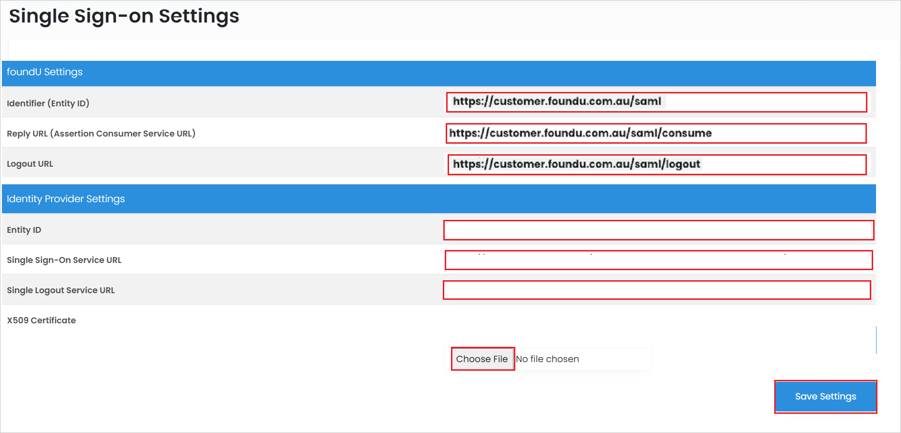

# Configure foundU for Single sign-on with Microsoft Entra ID

In this article,  you learn how to integrate foundU with Microsoft Entra ID. When you integrate foundU with Microsoft Entra ID, you can:

* Control in Microsoft Entra ID who has access to foundU.
* Enable your users to be automatically signed-in to foundU with their Microsoft Entra accounts.
* Manage your accounts in one central location.

## Prerequisites

The scenario outlined in this article assumes that you already have the following prerequisites:

[!INCLUDE [common-prerequisites.md](~/identity/saas-apps/includes/common-prerequisites.md)]
* foundU single sign-on (SSO) enabled subscription.

## Scenario description

In this article,  you configure and test Microsoft Entra SSO in a test environment.

* foundU supports **SP and IDP** initiated SSO.

## Adding foundU from the gallery

To configure the integration of foundU into Microsoft Entra ID, you need to add foundU from the gallery to your list of managed SaaS apps.

1. Sign in to the [Microsoft Entra admin center](https://entra.microsoft.com) as at least a [Cloud Application Administrator](~/identity/role-based-access-control/permissions-reference.md#cloud-application-administrator).
1. Browse to **Entra ID** > **Enterprise apps** > **New application**.
1. In the **Add from the gallery** section, type **foundU** in the search box.
1. Select **foundU** from results panel and then add the app. Wait a few seconds while the app is added to your tenant.

 [!INCLUDE [sso-wizard.md](~/identity/saas-apps/includes/sso-wizard.md)]

## Configure and test Microsoft Entra SSO for foundU

Configure and test Microsoft Entra SSO with foundU using a test user called **B.Simon**. For SSO to work, you need to establish a link relationship between a Microsoft Entra user and the related user in foundU.

To configure and test Microsoft Entra SSO with foundU, perform the following steps:

1. **[Configure Microsoft Entra SSO](#configure-azure-ad-sso)** - to enable your users to use this feature.
    1. **Create a Microsoft Entra test user** - to test Microsoft Entra single sign-on with B.Simon.
    1. **Assign the Microsoft Entra test user** - to enable B.Simon to use Microsoft Entra single sign-on.
1. **[Configure foundU SSO](#configure-foundu-sso)** - to configure the single sign-on settings on application side.
    1. **[Create foundU test user](#create-foundu-test-user)** - to have a counterpart of B.Simon in foundU that's linked to the Microsoft Entra representation of user.
1. **[Test SSO](#test-sso)** - to verify whether the configuration works.

## Configure Microsoft Entra SSO

Follow these steps to enable Microsoft Entra SSO.

1. Sign in to the [Microsoft Entra admin center](https://entra.microsoft.com) as at least a [Cloud Application Administrator](~/identity/role-based-access-control/permissions-reference.md#cloud-application-administrator).
1. Browse to **Entra ID** > **Enterprise apps** > **foundU** > **Single sign-on**.
1. On the **Select a single sign-on method** page, select **SAML**.
1. On the **Set up single sign-on with SAML** page, select the pencil icon for **Basic SAML Configuration** to edit the settings.

   

1. On the **Basic SAML Configuration** section, enter the values for the following fields:

    a. In the **Identifier** text box, type a URL using the following pattern:
    `https://<CUSTOMER_NAME>.foundu.com.au/saml`

    b. In the **Reply URL** text box, type a URL using the following pattern:
    `https://<CUSTOMER_NAME>.foundu.com.au/saml/consume`

    c. In the **Logout URL** text box, type a URL using the following pattern:
    `https://<CUSTOMER_NAME>.foundu.com.au/saml/logout`

	> [!NOTE]
	> These values aren't real. Update these values with the actual Identifier, Reply URL and Logout URL. Contact [foundU Client support team](mailto:help@foundu.com.au) to get these values. You can also refer to the patterns shown in the **Basic SAML Configuration** section in the Azure portal.

1. On the **Set up single sign-on with SAML** page, in the **SAML Signing Certificate** section,  find **Certificate (Base64)** and select **Download** to download the certificate and save it on your computer.

	

1. On the **Set up foundU** section, copy the appropriate URL(s) based on your requirement.

	

[!INCLUDE [create-assign-users-sso.md](~/identity/saas-apps/includes/create-assign-users-sso.md)]

## Configure foundU SSO

1. Log in to foundU website as an administrator.

1. Select Menu icon and in the **Platform Settings** select **Single Sign-on**.

    

1. Perform the following steps in the **Single Sign-on Settings** page.

    

    a. Copy **Identifier(Entity ID)** value, paste this value into the **Identifier** text box in the **Basic SAML Configuration section** in the Azure portal.

    b. Copy **Reply URL (Assertion Consumer Service URL)** value, paste this value into the **Reply URL** text box in the **Basic SAML Configuration section** in the Azure portal.

    c. Copy **Logout URL** value, paste this value into the **Logout URL** text box in the **Basic SAML Configuration section** in the Azure portal.

    d. In the **Entity ID** textbox, paste the **Identifier** value, which you have copied from the Azure portal.

    e. In the **Single Sign-on Service URL** textbox, paste the **Login URL** value, which you have copied from the Azure portal.

    f. In the **Single Logout Service URL** textbox, paste the **Logout URL** value, which you have copied from the Azure portal.

    g. Select **Choose File** to upload the downloaded **Certificate (Base64)** file from Azure portal.

    h. Select **Save Settings**.

### Create foundU test user

In this section, you create a user called Britta Simon in foundU. Work with [foundU support team](mailto:help@foundu.com.au) to add the users in the foundU platform. Users must be created and activated before you use single sign-on.

## Test SSO 

In this section, you test your Microsoft Entra single sign-on configuration with following options. 

#### SP initiated:

* Select **Test this application** in Azure portal. this option redirects to foundU Sign on URL where you can initiate the login flow.  

* Go to foundU Sign-on URL directly and initiate the login flow from there.

#### IDP initiated:

* Select **Test this application** in Azure portal and you should be automatically signed in to the foundU for which you set up the SSO 

You can also use Microsoft My Apps to test the application in any mode. When you select the foundU tile in the My Apps, if configured in SP mode you would be redirected to the application sign-on page for initiating the login flow and if configured in IDP mode, you should be automatically signed in to the foundU for which you set up the SSO. For more information about the My Apps, see [Introduction to the My Apps](https://support.microsoft.com/account-billing/sign-in-and-start-apps-from-the-my-apps-portal-2f3b1bae-0e5a-4a86-a33e-876fbd2a4510).

## Related content

Once you configure foundU you can enforce session control, which protects exfiltration and infiltration of your organization’s sensitive data in real time. Session control extends from Conditional Access. [Learn how to enforce session control with Microsoft Defender for Cloud Apps](/cloud-app-security/proxy-deployment-any-app).
