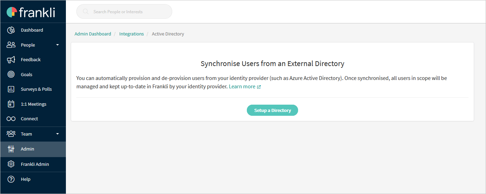
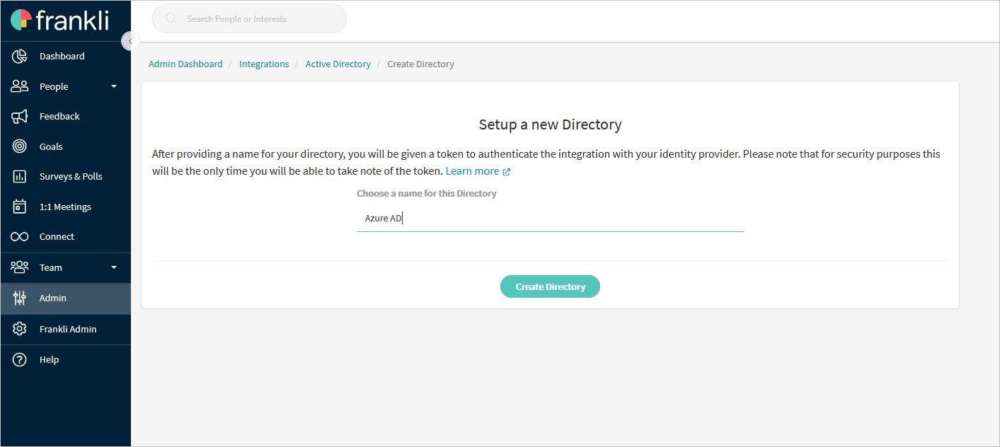
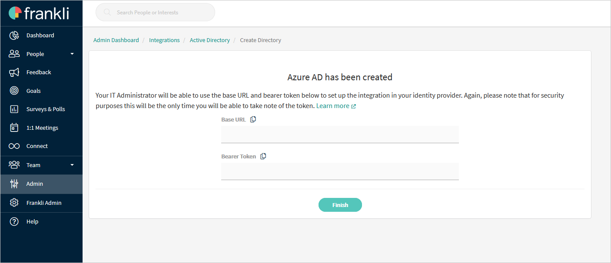

# Configure frankli for automatic user provisioning with Microsoft Entra ID

This article describes the steps you need to do in both frankli and Microsoft Entra ID to configure automatic user provisioning. When configured, Microsoft Entra ID automatically provisions and de-provisions users and groups to [frankli](https://www.frankli.io/) using the Microsoft Entra provisioning service. For important details on what this service does, how it works, and frequently asked questions, see [Automate user provisioning and deprovisioning to SaaS apps with Microsoft Entra ID](~/identity/app-provisioning/user-provisioning.md). 

## Capabilities supported
> [!div class="checklist"]
> * Create users in frankli.
> * Remove users in frankli when they don't require access anymore.
> * Keep user attributes synchronized between Microsoft Entra ID and frankli.
> * [Single sign-on](~/identity/enterprise-apps/add-application-portal-setup-oidc-sso.md) to frankli.

## Prerequisites

The scenario outlined in this article assumes that you already have the following prerequisites:

* [A Microsoft Entra tenant](~/identity-platform/quickstart-create-new-tenant.md). 
* One of the following roles: [Application Administrator](/entra/identity/role-based-access-control/permissions-reference#application-administrator), [Cloud Application Administrator](/entra/identity/role-based-access-control/permissions-reference#cloud-application-administrator), or [Application Owner](/entra/fundamentals/users-default-permissions#owned-enterprise-applications).

## Step 1: Plan your provisioning deployment
1. Learn about [how the provisioning service works](~/identity/app-provisioning/user-provisioning.md).
1. Determine who's in [scope for provisioning](~/identity/app-provisioning/define-conditional-rules-for-provisioning-user-accounts.md).
1. Determine what data to [map between Microsoft Entra ID and frankli](~/identity/app-provisioning/customize-application-attributes.md). 

## Step 2: Configure frankli to support provisioning with Microsoft Entra ID

1. Log in to [Frankli](https://beta.frankli.io/login) using your admin account. 
1. Navigate to **Admin -> Integrations -> Microsoft Entra ID**.

1. Select **Setup a Directory**.
1. Define a name for your new external directory.

1. Select **Create Directory**.

1. Take note of the **Base URL** and the **Bearer Token**.The **Base URL** is entered into the **Tenant URL** field. The **Bearer Token** is entered into the **Secret Token** field.

## Step 3: Add frankli from the Microsoft Entra application gallery

Add frankli from the Microsoft Entra application gallery to start managing provisioning to frankli. If you have previously setup frankli for SSO, you can use the same application. However it's recommended you create a separate app when testing out the integration initially. Learn more about adding an application from the gallery [here](~/identity/enterprise-apps/add-application-portal.md). 

## Step 4: Define who is in scope for provisioning 

[!INCLUDE [create-assign-users-provisioning.md](~/identity/saas-apps/includes/create-assign-users-provisioning.md)]

## Step 5: Configure automatic user provisioning to frankli 

This section guides you through the steps to configure the Microsoft Entra provisioning service to create, update, and disable users and groups in frankli based on user and group assignments in Microsoft Entra ID.

### To configure automatic user provisioning for frankli in Microsoft Entra ID:

1. Sign in to the [Microsoft Entra admin center](https://entra.microsoft.com) as at least a [Cloud Application Administrator](~/identity/role-based-access-control/permissions-reference.md#cloud-application-administrator).
1. Browse to **Entra ID** > **Enterprise apps**

	

1. In the applications list, select **frankli**.

	

1. Select the **Provisioning** tab.

	

1. Set the **Provisioning Mode** to **Automatic**.

	

1. Under the **Admin Credentials** section, input your frankli Tenant URL and Secret Token. Select **Test Connection** to ensure Microsoft Entra ID can connect to frankli. If the connection fails, ensure your frankli account has Admin permissions and try again.

 	

1. In the **Notification Email** field, enter the email address of a person or group who should receive the provisioning error notifications and select the **Send an email notification when a failure occurs** check box.

	

1. Select **Save**.

1. Under the **Mappings** section, select **Synchronize Microsoft Entra users to frankli**.

1. Review the user attributes that are synchronized from Microsoft Entra ID to frankli in the **Attribute-Mapping** section. The attributes selected as **Matching** properties are used to match the user accounts in frankli for update operations. If you choose to change the [matching target attribute](~/identity/app-provisioning/customize-application-attributes.md), you need to ensure that the frankli API supports filtering users based on that attribute. Select the **Save** button to commit any changes.

   |Attribute|Type|Supported for filtering|Required by frankliio|
   |---|---|---|---|
   |userName|String|&check;|&check;|
   |active|Boolean||&check;|
   |name.givenName|String||&check;|
   |name.familyName|String||&check;|
   |emails[type eq "work"].value|String||&check;|
   |addresses[type eq "work"].formatted|String||&check;|
   |addresses[type eq "work"].streetAddress|String||&check;|
   |addresses[type eq "work"].locality|String||&check;|
   |addresses[type eq "work"].postalCode|String||&check;|
   |addresses[type eq "work"].country|String||&check;|
   |title|String|||
   |urn:ietf:params:scim:schemas:extension:enterprise:2.0:User:department|String|||
   |urn:ietf:params:scim:schemas:extension:enterprise:2.0:User:manager|String|||

1. To configure scoping filters, refer to the following instructions provided in the [Scoping filter article](~/identity/app-provisioning/define-conditional-rules-for-provisioning-user-accounts.md).

1. To enable the Microsoft Entra provisioning service for frankli, change the **Provisioning Status** to **On** in the **Settings** section.

	

1. Define the users and groups that you would like to provision to frankli by choosing the appropriate values in **Scope** in the **Settings** section.

	

1. When you're ready to provision, select **Save**.

	

This operation starts the initial synchronization cycle of all users and groups defined in **Scope** in the **Settings** section. The initial cycle takes longer to complete than next cycles, which occur approximately every 40 minutes as long as the Microsoft Entra provisioning service is running. 

## Step 6: Monitor your deployment

[!INCLUDE [monitor-deployment.md](~/identity/saas-apps/includes/monitor-deployment.md)]

## More resources

* [Managing user account provisioning for Enterprise Apps](~/identity/app-provisioning/configure-automatic-user-provisioning-portal.md)
* [What is application access and single sign-on with Microsoft Entra ID?](~/identity/enterprise-apps/what-is-single-sign-on.md)

## Related content

* [Learn how to review logs and get reports on provisioning activity](~/identity/app-provisioning/check-status-user-account-provisioning.md)
