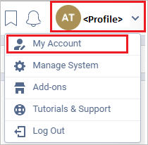
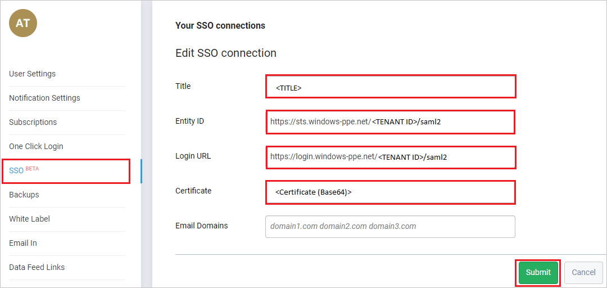
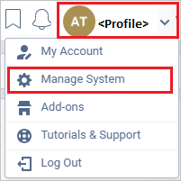
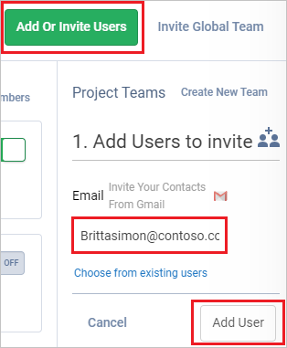

# Configure Freedcamp for Single sign-on with Microsoft Entra ID

In this article,  you learn how to integrate Freedcamp with Microsoft Entra ID. When you integrate Freedcamp with Microsoft Entra ID, you can:

* Control in Microsoft Entra ID who has access to Freedcamp.
* Enable your users to be automatically signed-in to Freedcamp with their Microsoft Entra accounts.
* Manage your accounts in one central location.

## Prerequisites

The scenario outlined in this article assumes that you already have the following prerequisites:

[!INCLUDE [common-prerequisites.md](~/identity/saas-apps/includes/common-prerequisites.md)]
* Freedcamp single sign-on (SSO) enabled subscription.

> [!NOTE]
> This integration is also available to use from Microsoft Entra US Government Cloud environment. You can find this application in the Microsoft Entra US Government Cloud Application Gallery and configure it in the same way as you do from public cloud.

## Scenario description

In this article,  you configure and test Microsoft Entra SSO in a test environment.

* Freedcamp supports **SP and IDP** initiated SSO.

## Add Freedcamp from the gallery

To configure the integration of Freedcamp into Microsoft Entra ID, you need to add Freedcamp from the gallery to your list of managed SaaS apps.

1. Sign in to the [Microsoft Entra admin center](https://entra.microsoft.com) as at least a [Cloud Application Administrator](~/identity/role-based-access-control/permissions-reference.md#cloud-application-administrator).
1. Browse to **Entra ID** > **Enterprise apps** > **New application**.
1. In the **Add from the gallery** section, type **Freedcamp** in the search box.
1. Select **Freedcamp** from results panel and then add the app. Wait a few seconds while the app is added to your tenant.

 [!INCLUDE [sso-wizard.md](~/identity/saas-apps/includes/sso-wizard.md)]

## Configure and test Microsoft Entra SSO for Freedcamp

Configure and test Microsoft Entra SSO with Freedcamp using a test user called **Britta Simon**. For SSO to work, you need to establish a link relationship between a Microsoft Entra user and the related user in Freedcamp.

To configure and test Microsoft Entra SSO with Freedcamp, perform the following steps:

1. **[Configure Microsoft Entra SSO](#configure-azure-ad-sso)** - to enable your users to use this feature.
    1. **Create a Microsoft Entra test user** - to test Microsoft Entra single sign-on with B.Simon.
    1. **Assign the Microsoft Entra test user** - to enable B.Simon to use Microsoft Entra single sign-on.
1. **[Configure Freedcamp SSO](#configure-freedcamp-sso)** - to configure the single sign-on settings on application side.
    1. **[Create Freedcamp test user](#create-freedcamp-test-user)** - to have a counterpart of B.Simon in Freedcamp that's linked to the Microsoft Entra representation of user.
1. **[Test SSO](#test-sso)** - to verify whether the configuration works.

## Configure Microsoft Entra SSO

Follow these steps to enable Microsoft Entra SSO.

1. Sign in to the [Microsoft Entra admin center](https://entra.microsoft.com) as at least a [Cloud Application Administrator](~/identity/role-based-access-control/permissions-reference.md#cloud-application-administrator).
1. Browse to **Entra ID** > **Enterprise apps** > **Freedcamp** application integration page, find the **Manage** section and select **Single sign-on**.
1. On the **Select a Single sign-on method** page, select **SAML**.
1. On the **Set up Single Sign-On with SAML** page, select the pencil icon for **Basic SAML Configuration** to edit the settings.

   

1. On the **Basic SAML Configuration** section, if you wish to configure the application in **IDP** initiated mode, perform the following steps:

    1. In the **Identifier** text box, type a URL using the following pattern:
    `https://<SUBDOMAIN>.freedcamp.com/sso/<UNIQUEID>`

    2. In the **Reply URL** text box, type a URL using the following pattern:
    `https://<SUBDOMAIN>.freedcamp.com/sso/acs/<UNIQUEID>`

1. Select **Set additional URLs** and perform the following step if you wish to configure the application in **SP** initiated mode:

    In the **Sign-on URL** text box, type a URL using the following pattern:
    `https://<SUBDOMAIN>.freedcamp.com/login`

	> [!NOTE]
	> These values aren't real. Update these values with the actual Identifier, Reply URL and Sign-on URL. Users can also enter the URL values with respect to their own customer domain and they may not be necessarily of the pattern `freedcamp.com`, they can enter any customer domain specific value, specific to their application instance. Also you can contact [Freedcamp Client support team](mailto:devops@freedcamp.com) for further information on URL patterns.

1. On the **Set up Single Sign-On with SAML** page, in the **SAML Signing Certificate** section, find **Certificate (Base64)** and select **Download** to download the certificate and save it on your computer.

   

1. On the **Set up Freedcamp** section, copy the appropriate URL(s) based on your requirement.

   

[!INCLUDE [create-assign-users-sso.md](~/identity/saas-apps/includes/create-assign-users-sso.md)]

## Configure Freedcamp SSO

1. In a different web browser window, sign in to your Freedcamp company site as an administrator

4. On the top-right corner of the page, select **profile** and then navigate to **My Account**.

	

5. From the left side of the menu bar, select **SSO** and on the **Your SSO connections** page perform the following steps:

	

	a. In the **Title** text box, type the title.

	b. In the **Entity ID** text box, Paste the **Microsoft Entra Identifier** value, which you copied previously.

	c. In the **Login URL** text box, Paste the **Login URL** value, which you copied previously.

	d. Open the Base64 encoded certificate in notepad, copy its content and paste it into the **Certificate** text box.

	e. Select **Submit**.

### Create Freedcamp test user

To enable Microsoft Entra users, sign in to Freedcamp, they must be provisioned into Freedcamp. In Freedcamp, provisioning is a manual task.

**To provision a user account, perform the following steps:**

1. In a different web browser window, sign in to Freedcamp as a Security Administrator.

2. On the top-right corner of the page, select **profile** and then navigate to **Manage System**.

	

3. On the right side of the Manage System page, perform the following steps:

	

	a. Select **Add or invite Users**.

	b. In the **Email** text box, enter the email of user like `Brittasimon@contoso.com`.

	c. Select **Add User**.

## Test SSO

In this section, you test your Microsoft Entra single sign-on configuration with following options. 

#### SP initiated:

* Select **Test this application**, this option redirects to Freedcamp Sign on URL where you can initiate the login flow.  

* Go to Freedcamp Sign-on URL directly and initiate the login flow from there.

#### IDP initiated:

* Select **Test this application**, and you should be automatically signed in to the Freedcamp for which you set up the SSO. 

You can also use Microsoft My Apps to test the application in any mode. When you select the Freedcamp tile in the My Apps, if configured in SP mode you would be redirected to the application sign on page for initiating the login flow and if configured in IDP mode, you should be automatically signed in to the Freedcamp for which you set up the SSO. For more information about the My Apps, see [Introduction to the My Apps](https://support.microsoft.com/account-billing/sign-in-and-start-apps-from-the-my-apps-portal-2f3b1bae-0e5a-4a86-a33e-876fbd2a4510).

## Related content

Once you configure Freedcamp you can enforce session control, which protects exfiltration and infiltration of your organization’s sensitive data in real time. Session control extends from Conditional Access. [Learn how to enforce session control with Microsoft Defender for Cloud Apps](/cloud-app-security/proxy-deployment-aad).
