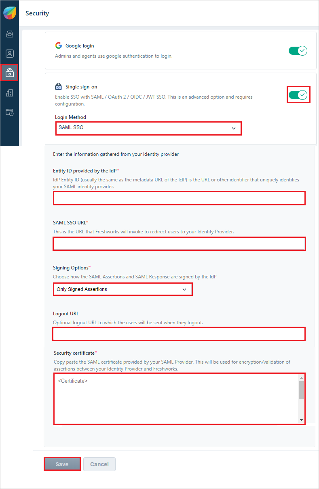
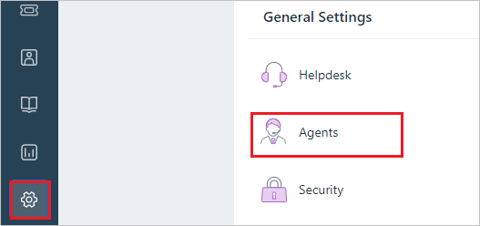
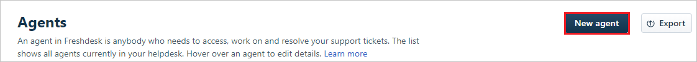
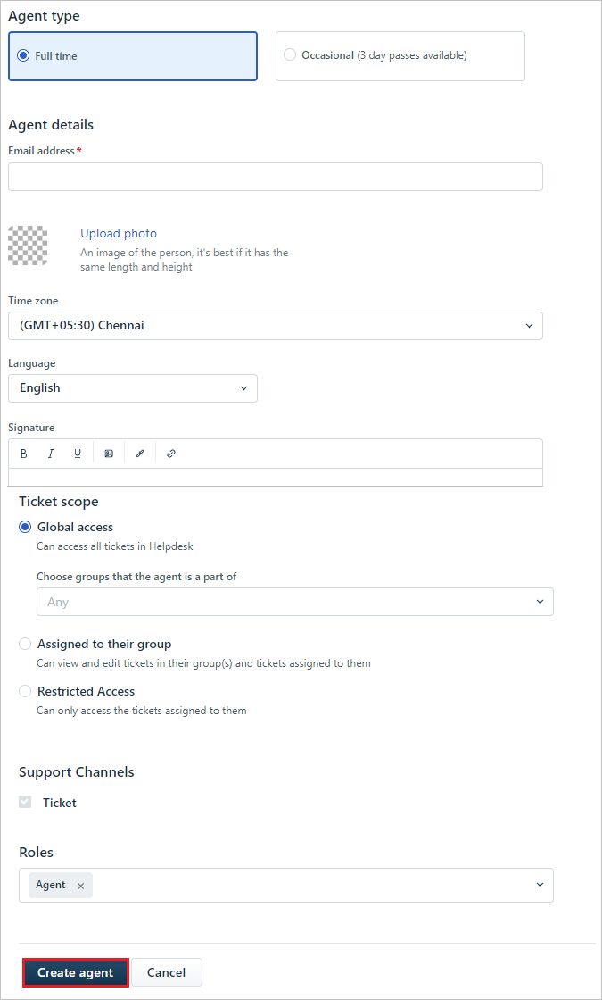

# Configure Freshdesk for Single sign-on with Microsoft Entra ID

In this article,  you learn how to integrate Freshdesk with Microsoft Entra ID. When you integrate Freshdesk with Microsoft Entra ID, you can:

* Control in Microsoft Entra ID who has access to Freshdesk.
* Enable your users to be automatically signed-in to Freshdesk with their Microsoft Entra accounts.
* Manage your accounts in one central location.

## Prerequisites

The scenario outlined in this article assumes that you already have the following prerequisites:

[!INCLUDE [common-prerequisites.md](~/identity/saas-apps/includes/common-prerequisites.md)]
* A Freshdesk single sign-on (SSO)-enabled subscription.

## Scenario description

In this article,  you configure and test Microsoft Entra single sign-on in a test environment.

* Freshdesk supports **SP** initiated SSO

## Add Freshdesk from the gallery

To configure the integration of Freshdesk into Microsoft Entra ID, you need to add Freshdesk from the gallery to your list of managed SaaS apps.

1. Sign in to the [Microsoft Entra admin center](https://entra.microsoft.com) as at least a [Cloud Application Administrator](~/identity/role-based-access-control/permissions-reference.md#cloud-application-administrator).
1. Browse to **Entra ID** > **Enterprise apps** > **New application**.
1. In the **Add from the gallery** section, type **Freshdesk** in the search box.
1. Select **Freshdesk** from results panel and then add the app. Wait a few seconds while the app is added to your tenant.

 [!INCLUDE [sso-wizard.md](~/identity/saas-apps/includes/sso-wizard.md)]

## Configure and test Microsoft Entra SSO for Freshdesk

Configure and test Microsoft Entra SSO with Freshdesk using a test user called **B.Simon**. For SSO to work, you need to establish a link relationship between a Microsoft Entra user and the related user in Freshdesk.

To configure and test Microsoft Entra SSO with Freshdesk, perform the following steps:

1. **[Configure Microsoft Entra SSO](#configure-azure-ad-sso)** - to enable your users to use this feature.
    1. **Create a Microsoft Entra test user** - to test Microsoft Entra single sign-on with Britta Simon.
    1. **Assign the Microsoft Entra test user** - to enable Britta Simon to use Microsoft Entra single sign-on.
1. **[Configure Freshdesk SSO](#configure-freshdesk-sso)** - to configure the Single Sign-On settings on application side.
    - **[Create Freshdesk test user](#create-freshdesk-test-user)** - to have a counterpart of Britta Simon in Freshdesk that's linked to the Microsoft Entra representation of user.
1. **[Test SSO](#test-sso)** - to verify whether the configuration works.

## Configure Microsoft Entra SSO

1. Sign in to the [Microsoft Entra admin center](https://entra.microsoft.com) as at least a [Cloud Application Administrator](~/identity/role-based-access-control/permissions-reference.md#cloud-application-administrator).
1. Browse to **Entra ID** > **Enterprise apps** > **Freshdesk** > **Single sign-on**.
1. On the **Select a single sign-on method** page, select **SAML**.
1. On the **Set-up single sign-on with SAML** page, select the pencil icon for **Basic SAML Configuration** to edit the settings.

   

1. On the **Basic SAML Configuration** section, enter the values for the following fields:

    1. In the **Sign-on URL** text box, type a URL using the following pattern:
    `https://<tenant-name>.freshdesk.com` or any other value Freshdesk has suggested.

    1. In the **Identifier (Entity ID)** text box, type a URL using the following pattern:
    `https://<tenant-name>.freshdesk.com` or any other value Freshdesk has suggested.
     
    1. In the **Reply URL** text box, type a URL using the following pattern:
    `https://<tenant-name>.freshdesk.com/login/saml`

    > [!NOTE]
    > These values aren't real. Update these values with the actual Sign on URL, Identifier and Reply URL. Contact [Freshdesk Client support team](https://freshdesk.com/helpdesk-software?utm_source=Google-AdWords&utm_medium=Search-IND-Brand&utm_campaign=Search-IND-Brand&utm_term=freshdesk&device=c&gclid=COSH2_LH7NICFVUDvAodBPgBZg) to get these values. You can also refer to the patterns shown in the **Basic SAML Configuration** section.

1. Freshdesk application expects the SAML assertions in a specific format, which requires you to add custom attribute mappings to your SAML token attributes configuration. The following screenshot shows the list of default attributes, whereas **Unique User Identifier** is mapped with **user.userprincipalname** but Freshdesk expects this claim to be mapped with **user.mail**, so you need to edit the attribute mapping by selecting Edit icon and change the attribute mapping.

    

1. On the **Set-up Single Sign-On with SAML** page, in the **SAML Signing Certificate** section, select **Download** to download the **Certificate (Base64)** from the given options as per your requirement and save it on your computer.

    

1. On the **Set-up Freshdesk** section, copy the appropriate URL(s) as per your requirement.

    

[!INCLUDE [create-assign-users-sso.md](~/identity/saas-apps/includes/create-assign-users-sso.md)]

## Configure Freshdesk SSO

1. In a different web browser window, log in to your Freshdesk company site as an administrator.

1. Select the **Security icon** and in the **Security** section, perform the following steps:

    
  
    1. For **Single Sign On**, select **On**.

    1. In the **Login Method**, select **SAML SSO**.

    1. In the **Entity ID provided by the IdP** textbox, paste **Entity ID** value, which you copied previously.

    1. In the **SAML SSO URL** textbox, paste **Login URL** value, which you copied previously.

    1. In the **Signing Options**, select **Only Signed Assertions** from the dropdown.

    1. In the **Logout URL** textbox, paste **Logout URL** value, which you copied previously.

    1. In the **Security Certificate** textbox, paste **Certificate (Base64)** value, which you have obtained earlier.
  
    1. Select **Save**.

## Create Freshdesk test user

In order to enable Microsoft Entra users to log in to Freshdesk, they must be provisioned into Freshdesk.  
In the case of Freshdesk, provisioning is a manual task.

**To provision a user account, perform the following steps:**

1. Log in to your **Freshdesk** tenant.

1. In the menu on the left, select **Admin** and in the **General Settings** tab, select **Agents**.
  
    

1. Select **New Agent**.

    

1. On the Agent Information dialog, enter the required fields and select **Create agent**.

    

    >[!NOTE]
    >The Microsoft Entra account holder gets an email that includes a link to confirm the account before it's activated.
    >
    >[!NOTE]
    >You can use any other Freshdesk user account creation tools or APIs provided by Freshdesk to provision Microsoft Entra user accounts to Freshdesk.

### Test SSO

In this section, you test your Microsoft Entra single sign-on configuration with following options. 

* Select **Test this application**, this option redirects to Freshdesk Sign-on URL where you can initiate the login flow. 

* Go to Freshdesk Sign-on URL directly and initiate the login flow from there.

* You can use Microsoft My Apps. When you select the Freshdesk tile in the My Apps, you should be automatically signed in to the Freshdesk for which you set up the SSO. For more information about the My Apps, see [Introduction to the My Apps](https://support.microsoft.com/account-billing/sign-in-and-start-apps-from-the-my-apps-portal-2f3b1bae-0e5a-4a86-a33e-876fbd2a4510).

## Related content

Once you configure Freshdesk you can enforce session control, which protects exfiltration and infiltration of your organization’s sensitive data in real time. Session control extends from Conditional Access. [Learn how to enforce session control with Microsoft Defender for Cloud Apps](/cloud-app-security/proxy-deployment-any-app).
