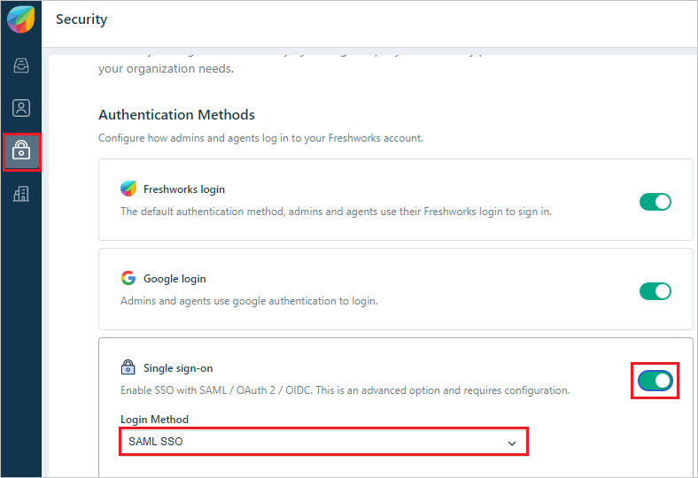
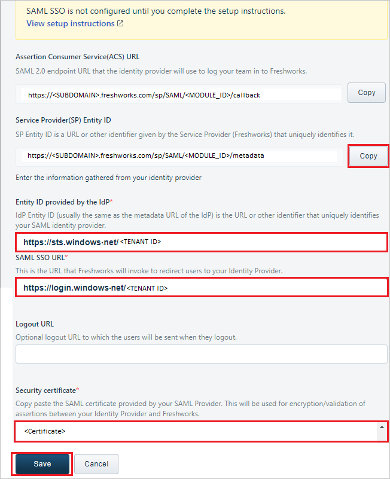

# Configure Freshworks for Single sign-on with Microsoft Entra ID

In this article,  you learn how to integrate Freshworks with Microsoft Entra ID. When you integrate Freshworks with Microsoft Entra ID, you can:

* Control in Microsoft Entra ID who has access to Freshworks.
* Enable your users to be automatically signed-in to Freshworks with their Microsoft Entra accounts.
* Manage your accounts in one central location.

## Prerequisites

The scenario outlined in this article assumes that you already have the following prerequisites:

[!INCLUDE [common-prerequisites.md](~/identity/saas-apps/includes/common-prerequisites.md)]
* Freshworks single sign-on (SSO) enabled subscription.

> [!NOTE]
> This integration is also available to use from Microsoft Entra US Government Cloud environment. You can find this application in the Microsoft Entra US Government Cloud Application Gallery and configure it in the same way as you do from public cloud.

## Scenario description

In this article,  you configure and test Microsoft Entra SSO in a test environment.

* Freshworks supports **SP and IDP** initiated SSO

## Add Freshworks from the gallery

To configure the integration of Freshworks into Microsoft Entra ID, you need to add Freshworks from the gallery to your list of managed SaaS apps.

1. Sign in to the [Microsoft Entra admin center](https://entra.microsoft.com) as at least a [Cloud Application Administrator](~/identity/role-based-access-control/permissions-reference.md#cloud-application-administrator).
1. Browse to **Entra ID** > **Enterprise apps** > **New application**.
1. In the **Add from the gallery** section, type **Freshworks** in the search box.
1. Select **Freshworks** from results panel and then add the app. Wait a few seconds while the app is added to your tenant.

 [!INCLUDE [sso-wizard.md](~/identity/saas-apps/includes/sso-wizard.md)]

## Configure and test Microsoft Entra SSO for Freshworks

Configure and test Microsoft Entra SSO with Freshworks using a test user called **B.Simon**. For SSO to work, you need to establish a link relationship between a Microsoft Entra user and the related user in Freshworks.

To configure and test Microsoft Entra SSO with Freshworks, perform the following steps:

1. **[Configure Microsoft Entra SSO](#configure-azure-ad-sso)** - to enable your users to use this feature.
    1. **Create a Microsoft Entra test user** - to test Microsoft Entra single sign-on with B.Simon.
    1. **Assign the Microsoft Entra test user** - to enable B.Simon to use Microsoft Entra single sign-on.
1. **[Configure Freshworks SSO](#configure-freshworks-sso)** - to configure the single sign-on settings on application side.
    1. **[Create Freshworks test user](#create-freshworks-test-user)** - to have a counterpart of B.Simon in Freshworks that's linked to the Microsoft Entra representation of user.
1. **[Test SSO](#test-sso)** - to verify whether the configuration works.

## Configure Microsoft Entra SSO

Follow these steps to enable Microsoft Entra SSO.

1. Sign in to the [Microsoft Entra admin center](https://entra.microsoft.com) as at least a [Cloud Application Administrator](~/identity/role-based-access-control/permissions-reference.md#cloud-application-administrator).
1. Browse to **Entra ID** > **Enterprise apps** > **Freshworks** > **Single sign-on**.
1. On the **Select a single sign-on method** page, select **SAML**.
1. On the **Set up single sign-on with SAML** page, select the pencil icon for **Basic SAML Configuration** to edit the settings.

   

1. On the **Basic SAML Configuration** section, if you wish to configure the application in **IDP** initiated mode, enter the values for the following fields:

    a. In the **Identifier (Entity ID)** text box, type a URL using the following pattern:
    `https://<SUBDOMAIN>.freshworks.com/sp/SAML/<MODULE_ID>/metadata`

    b. In the **Reply URL** text box, type a URL using the following pattern:
    `https://<SUBDOMAIN>.freshworks.com/sp/SAML/CUSTOM_URL`

1. Select **Set additional URLs** and perform the following step if you wish to configure the application in **SP** initiated mode:

	In the **Sign-on URL** text box, type a URL using the following pattern:
    `https://<SUBDOMAIN>.freshworks.com/login`

	> [!NOTE]
	> These values aren't real. Update these values with the actual Identifier, Reply URL and Sign on URL. Contact [Freshworks Client support team](mailto:support@freshworks.com) to get these values. You can also refer to the patterns shown in the **Basic SAML Configuration** section.

1. On the **Set up single sign-on with SAML** page, in the **SAML Signing Certificate** section,  find **Certificate (Base64)** and select **Download** to download the certificate and save it on your computer.

	

1. To modify the **Signing** options as per your requirement, select **Edit** button to open **SAML Signing Certificate** dialog.

     

1. In the **SAML Signing Certificate** dialog, for **Signing Option**, select **Sign SAML response**. Then select **Save**.

1. On the **Set up Freshworks** section, copy the appropriate URL(s) based on your requirement.

	

[!INCLUDE [create-assign-users-sso.md](~/identity/saas-apps/includes/create-assign-users-sso.md)]

## Configure Freshworks SSO

1. Open a new web browser window and sign into your Freshworks company site as an administrator and perform the following steps:

2. From the left side of menu, select on **Security** icon then check the **Single sign-on** option and select **SAML SSO** under **Authentication Methods**.

    

3. On the **Single sign-on** section, perform the following steps:

    

    a. Select **Copy** to copy the **Service Provider(SP) Entity ID** for your instance and paste it in **Identifier (Entity ID)** text box in **Basic SAML Configuration** section.

    b. In the **Entity ID provided by the IdP** text box, Paste the **Microsoft Entra Identifier** value, which you copied previously.

    c. In the **SAML SSO URL** text box, Paste the **Login URL** value, which you copied previously.

    d. Open the Base64 encoded certificate in notepad, copy its content and paste it into the **Security certificate** text box.

    e. Select **Save**.

### Create Freshworks test user

In this section, you create a user called B.Simon in Freshworks. Work with [Freshworks Client support team](mailto:support@freshworks.com) to add the users in the Freshworks platform. Users must be created and activated before you use single sign-on. 

## Test SSO 

In this section, you test your Microsoft Entra single sign-on configuration with following options. 

#### SP initiated:

* Select **Test this application**, this option redirects to Freshworks Sign on URL where you can initiate the login flow.  

* Go to Freshworks Sign-on URL directly and initiate the login flow from there.

#### IDP initiated:

* Select **Test this application**, and you should be automatically signed in to the Freshworks for which you set up the SSO 

You can also use Microsoft My Apps to test the application in any mode. When you select the Freshworks tile in the My Apps, if configured in SP mode you would be redirected to the application sign on page for initiating the login flow and if configured in IDP mode, you should be automatically signed in to the Freshworks for which you set up the SSO. For more information about the My Apps, see [Introduction to the My Apps](https://support.microsoft.com/account-billing/sign-in-and-start-apps-from-the-my-apps-portal-2f3b1bae-0e5a-4a86-a33e-876fbd2a4510).

## Related content

Once you configure Freshworks you can enforce session control, which protects exfiltration and infiltration of your organization’s sensitive data in real time. Session control extends from Conditional Access. [Learn how to enforce session control with Microsoft Defender for Cloud Apps](/cloud-app-security/proxy-deployment-any-app).
