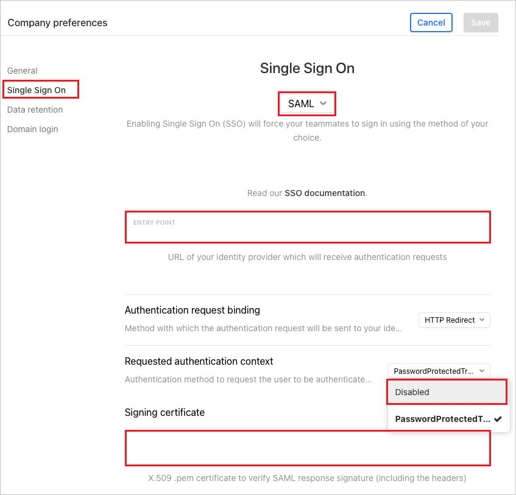
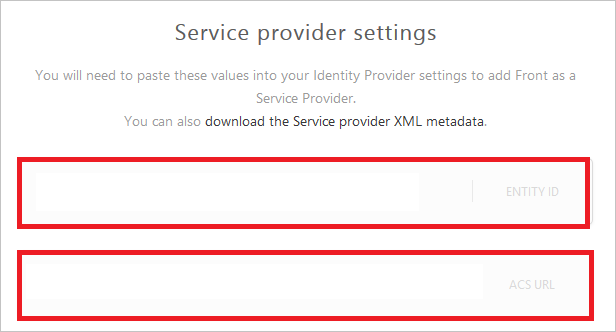

# Tutorial: Microsoft Entra integration with Front

In this tutorial, you'll learn how to integrate Front with Microsoft Entra ID. When you integrate Front with Microsoft Entra ID, you can:

* Control in Microsoft Entra ID who has access to Front.
* Enable your users to be automatically signed-in to Front with their Microsoft Entra accounts.
* Manage your accounts in one central location.

## Prerequisites

To get started, you need the following items:

* A Microsoft Entra subscription. If you don't have a subscription, you can get a [free account](https://azure.microsoft.com/free/).
* Front single sign-on (SSO) enabled subscription.

## Scenario description

In this tutorial, you configure and test Microsoft Entra single sign-on in a test environment.

* Front supports **IDP** initiated SSO.

## Adding Front from the gallery

To configure the integration of Front into Microsoft Entra ID, you need to add Front from the gallery to your list of managed SaaS apps.

1. Sign in to the [Microsoft Entra admin center](https://entra.microsoft.com) as at least a [Cloud Application Administrator](~/identity/role-based-access-control/permissions-reference.md#cloud-application-administrator).
1. Browse to **Identity** > **Applications** > **Enterprise applications** > **New application**.
1. In the **Add from the gallery** section, type **Front** in the search box.
1. Select **Front** from results panel and then add the app. Wait a few seconds while the app is added to your tenant.

 Alternatively, you can also use the [Enterprise App Configuration Wizard](https://portal.office.com/AdminPortal/home?Q=Docs#/azureadappintegration). In this wizard, you can add an application to your tenant, add users/groups to the app, assign roles, as well as walk through the SSO configuration as well. [Learn more about Microsoft 365 wizards.](/microsoft-365/admin/misc/azure-ad-setup-guides)

## Configure and test Microsoft Entra SSO for Front

Configure and test Microsoft Entra SSO with Front using a test user called **B.Simon**. For SSO to work, you need to establish a link relationship between a Microsoft Entra user and the related user in Front.

To configure and test Microsoft Entra SSO with Front, perform the following steps:

1. **[Configure Microsoft Entra SSO](#configure-azure-ad-sso)** - to enable your users to use this feature.
    1. **[Create a Microsoft Entra test user](#create-an-azure-ad-test-user)** - to test Microsoft Entra single sign-on with B.Simon.
    1. **[Assign the Microsoft Entra test user](#assign-the-azure-ad-test-user)** - to enable B.Simon to use Microsoft Entra single sign-on.
1. **[Configure Front SSO](#configure-front-sso)** - to configure the single sign-on settings on application side.
    1. **[Create Front test user](#create-front-test-user)** - to have a counterpart of B.Simon in Front that is linked to the Microsoft Entra representation of user.
1. **[Test SSO](#test-sso)** - to verify whether the configuration works.

## Configure Microsoft Entra SSO

Follow these steps to enable Microsoft Entra SSO.

1. Sign in to the [Microsoft Entra admin center](https://entra.microsoft.com) as at least a [Cloud Application Administrator](~/identity/role-based-access-control/permissions-reference.md#cloud-application-administrator).
1. Browse to **Identity** > **Applications** > **Enterprise applications** > **Front** > **Single sign-on**.
1. On the **Select a single sign-on method** page, select **SAML**.
1. On the **Set up single sign-on with SAML** page, click the pencil icon for **Basic SAML Configuration** to edit the settings.

   

1. On the **Set up Single Sign-On with SAML** page, perform the following steps:

    a. In the **Identifier** text box, type a URL using the following pattern:
    `https://<companyname>.frontapp.com`

    b. In the **Reply URL** text box, type a URL using the following pattern:
    `https://<companyname>.frontapp.com/sso/saml/callback`

	> [!NOTE]
	> These values are not real. Update these values with the actual Identifier and Reply URL. Contact [Front Client support team](mailto:support@frontapp.com) to get these values. You can also refer to the patterns shown in the **Basic SAML Configuration** section.

1. On the **Set up Single Sign-On with SAML** page, in the **SAML Signing Certificate** section, click **Download** to download the **Certificate (Base64)** from the given options as per your requirement and save it on your computer.

	

1. On the **Set up Front** section, copy the appropriate URL(s) as per your requirement.

	

### Create a Microsoft Entra test user

In this section, you'll create a test user called B.Simon.

1. Sign in to the [Microsoft Entra admin center](https://entra.microsoft.com) as at least a [User Administrator](~/identity/role-based-access-control/permissions-reference.md#user-administrator).
1. Browse to **Identity** > **Users** > **All users**.
1. Select **New user** > **Create new user**, at the top of the screen.
1. In the **User** properties, follow these steps:
   1. In the **Display name** field, enter `B.Simon`.  
   1. In the **User principal name** field, enter the username@companydomain.extension. For example, `B.Simon@contoso.com`.
   1. Select the **Show password** check box, and then write down the value that's displayed in the **Password** box.
   1. Select **Review + create**.
1. Select **Create**.

### Assign the Microsoft Entra test user

In this section, you'll enable B.Simon to use single sign-on by granting access to Front.

1. Sign in to the [Microsoft Entra admin center](https://entra.microsoft.com) as at least a [Cloud Application Administrator](~/identity/role-based-access-control/permissions-reference.md#cloud-application-administrator).
1. Browse to **Identity** > **Applications** > **Enterprise applications** > **Front**.
1. In the app's overview page, select **Users and groups**.
1. Select **Add user/group**, then select **Users and groups** in the **Add Assignment** dialog.
   1. In the **Users and groups** dialog, select **B.Simon** from the Users list, then click the **Select** button at the bottom of the screen.
   1. If you are expecting a role to be assigned to the users, you can select it from the **Select a role** dropdown. If no role has been set up for this app, you see "Default Access" role selected.
   1. In the **Add Assignment** dialog, click the **Assign** button.

## Configure Front SSO

1. Log in to your Front website as an administrator.

2. Go to the **settings** and select the**Preferences**.

3. Perform the following steps in the **Company preferences** page.
   
    

    a. Click **Single Sign On** on the left side navigation.

    b. Select **SAML** in the drop-down list of **Single Sign On**.

    c. In the **Entry Point** textbox enter the value of **Login URL** which you copied previously.

    d. Select the **Requested authentication context** type as **Disabled**.

    e. Open your downloaded **Certificate(Base64)** file in notepad, copy the content of it into your clipboard, and then paste it to the **Signing certificate** textbox.

7. On the **Service provider settings** section, perform the following steps:

	

	a. Copy the value of **Entity ID** and paste it into the **Identifier** textbox in **Front Domain and URLs** section in Azure portal.

	b. Copy the value of **ACS URL** and paste it into the **Reply URL** textbox in **Front Domain and URLs** section in Azure portal.
	
8. Click **Save** button.

### Create Front test user

In this section, you create a user called Britta Simon in Front. Work with [Front Client support team](mailto:support@frontapp.com) to add the users in the Front platform. Users must be created and activated before you use single sign-on.

## Test SSO 

In this section, you test your Microsoft Entra single sign-on configuration with following options.

* Click on **Test this application**, and you should be automatically signed in to the Front for which you set up the SSO

* You can use Microsoft My Apps. When you click the Front tile in the My Apps, you should be automatically signed in to the Front for which you set up the SSO. For more information about the My Apps, see [Introduction to the My Apps](https://support.microsoft.com/account-billing/sign-in-and-start-apps-from-the-my-apps-portal-2f3b1bae-0e5a-4a86-a33e-876fbd2a4510).

## Next steps

Once you configure Front you can enforce session control, which protects exfiltration and infiltration of your organization’s sensitive data in real time. Session control extends from Conditional Access. [Learn how to enforce session control with Microsoft Defender for Cloud Apps](/cloud-app-security/proxy-deployment-any-app).
