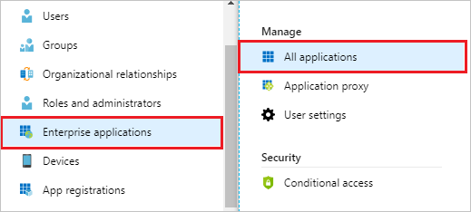
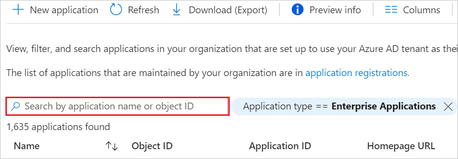
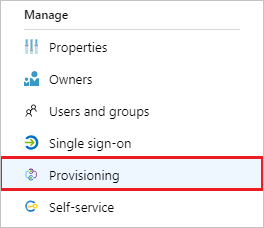
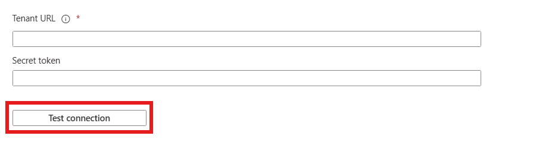
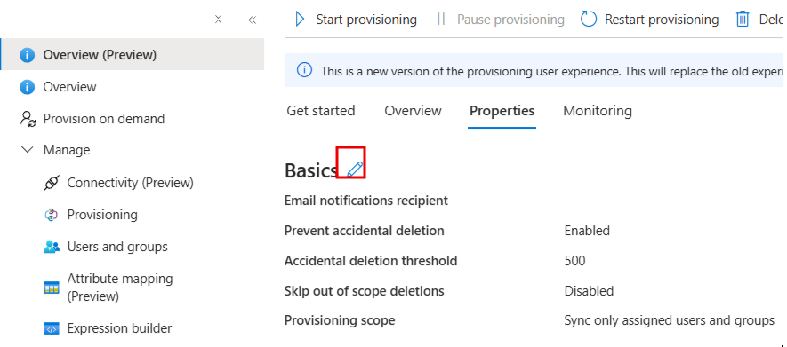

# Configure Funnel Leasing for automatic user provisioning with Microsoft Entra ID

This article describes the steps you need to perform in both Funnel Leasing and Microsoft Entra ID to configure automatic user provisioning. When configured, Microsoft Entra ID automatically provisions and de-provisions users to [Funnel Leasing](https://funnelleasing.com) using the Microsoft Entra provisioning service. For important details on what this service does, how it works, and frequently asked questions, see [Automate user provisioning and deprovisioning to SaaS applications with Microsoft Entra ID](~/identity/app-provisioning/user-provisioning.md). 

## Supported capabilities
> [!div class="checklist"]
> * Create users in Funnel Leasing.
> * Remove users in Funnel Leasing when they don't require access anymore.
> * Keep user attributes synchronized between Microsoft Entra ID and Funnel Leasing.
> * [Single sign-on](~/identity/enterprise-apps/add-application-portal-setup-oidc-sso.md) to Funnel Leasing (recommended).

## Prerequisites

The scenario outlined in this article assumes that you already have the following prerequisites:

* [A Microsoft Entra tenant](~/identity-platform/quickstart-create-new-tenant.md) 
* One of the following roles: [Application Administrator](/entra/identity/role-based-access-control/permissions-reference#application-administrator), [Cloud Application Administrator](/entra/identity/role-based-access-control/permissions-reference#cloud-application-administrator), or [Application Owner](/entra/fundamentals/users-default-permissions#owned-enterprise-applications).
* A live community in Funnel or at least a confirmation that all the required configuration is done on the Funnel side in preparation for a go-live date.

## Step 1: Plan your provisioning deployment
1. Learn about [how the provisioning service works](~/identity/app-provisioning/user-provisioning.md).
1. Determine who's in [scope for provisioning](~/identity/app-provisioning/define-conditional-rules-for-provisioning-user-accounts.md).
1. Determine what data to [map between Microsoft Entra ID and Funnel Leasing](~/identity/app-provisioning/customize-application-attributes.md).

## Step 2: Configure Funnel Leasing to support provisioning with Microsoft Entra ID
Contact your Funnel Account Manager and let them know you want to enable Microsoft Entra user provisioning, they will provide an authentication Bearer token.

## Step 3: Add Funnel Leasing from the Microsoft Entra application gallery

Add Funnel Leasing from the Microsoft Entra application gallery to start managing provisioning to Funnel Leasing. If you have previously setup Funnel Leasing for SSO you can use the same application. However it's recommended that you create a separate app when testing out the integration initially. Learn more about adding an application from the gallery [here](~/identity/enterprise-apps/add-application-portal.md). 

## Step 4: Define who is in scope for provisioning 

[!INCLUDE [create-assign-users-provisioning.md](~/identity/saas-apps/includes/create-assign-users-provisioning.md)]

## Step 5: Configure automatic user provisioning to Funnel Leasing 

This section guides you through connecting your Microsoft Entra ID to Funnel's user account provisioning API, and configuring the provisioning service to create, update, and disable assigned user accounts in Funnel based on user assignment in Microsoft Entra ID.

### To configure automatic user provisioning for Funnel Leasing in Microsoft Entra ID:

1. Sign in to the [Microsoft Entra admin center](https://entra.microsoft.com) as at least a [Cloud Application Administrator](~/identity/role-based-access-control/permissions-reference.md#cloud-application-administrator).
1. Browse to **Entra ID** > **Enterprise apps**

	

1. In the applications list, select **Funnel**.

	

1. Select the **Provisioning** tab.

	

1. Select **+ New configuration**.

	

1. In the **Tenant URL** field, enter your Funnel Tenant URL and Secret Token. Select **Test Connection** to ensure Microsoft Entra ID can connect to Funnel. If the connection fails, ensure your Funnel account has the required admin permissions and try again.

   

1. Select **Create** to create your configuration.

1. Select **Properties** on the **Overview** page.

1. In the **Notification Email** field, enter the email address of a person who should receive the provisioning error notifications and select the **Send an email notification when a failure occurs** check box.

   

1. Select **Attribute Mapping** in the left panel and select **users**.

1. Review the user attributes that are synchronized from Microsoft Entra ID to Funnel in the **Attribute-Mapping** section. The attributes selected as **Matching** properties are used to match the user accounts in Funnel for update operations. If you choose to change the [matching target attribute](~/identity/app-provisioning/customize-application-attributes.md), you need to ensure that the Funnel API supports filtering users based on that attribute. Select the **Save** button to commit any changes.

   |Attribute|Type|Supported for filtering|Required by Funnel Leasing|
   |---|---|---|---|
   |userName|String|&check;|&check;|
   |active|Boolean||&check;|
   |title|String|||
   |emails[type eq "work"].value|String||&check;|
   |name.givenName|String||&check;|
   |name.familyName|String||&check;|
   |phoneNumbers[type eq "work"].value|String|||
   |phoneNumbers[type eq "mobile"].value|String|||
   |externalId|String|||

1. To configure scoping filters, refer to the instructions provided in the [Scoping filter article](~/identity/app-provisioning/define-conditional-rules-for-provisioning-user-accounts.md).

1. Use [on-demand provisioning](~/identity/app-provisioning/provision-on-demand.md) to validate sync with a small number of users before deploying more broadly in your organization.

1. When you're ready to provision, select **Start Provisioning** from the **Overview** page.

## Step 6: Monitor your deployment

[!INCLUDE [monitor-deployment.md](~/identity/saas-apps/includes/monitor-deployment.md)]

## Role and Group Mappings
To associate an Azure user to a Funnel role, or an Azure user to a Funnel employee group, Funnel uses a custom mapping functionality.

- Which Azure fields are used?
    
    For role mappings, Funnel looks at the SCIM `title` attribute by default. This SCIM attribute is mapped to the `jobTitle` Azure user attribute by default.
    
    For group mappings, Funnel looks at the SCIM `userType` attribute by default. This SCIM attribute is mapped to the `department` Azure user attribute by default.
    
    If you want to change which fields are used, you can edit the **Attribute Mappings** section and map your desired fields to `title` and `userType`.

- Which values are used?
    
    For initial setup, determine every value that you want to use for role and group mappings. Provide these values to your Funnel Account Manager to set up the configuration in Funnel.
    
    For example, if you want to set the `jobTitle` field with an `agent` value, you need to tell your Funnel Account Manager which Funnel role this value should be mapped. 
    
    If you need to update or add new values in the future, you need to notify your Funnel Account Manager.

- How do I associate a user to several roles and groups?
    
    It isn't possible to associate a user to several Funnel roles, but it's possible to associate a user to several Funnel employee groups.
    
    To associate a user to several Funnel employee groups, you need to specify multiple values in the `department` user attribute (or whichever attribute you mapped to `userType`).
    Each value will need to be separated by a delimiter. By default the `-` character is used as the delimiter. To use another delimiter, you need to notify your Funnel account manager.

## More resources

* [Managing user account provisioning for Enterprise Apps](~/identity/app-provisioning/configure-automatic-user-provisioning-portal.md)
* [What is application access and single sign-on with Microsoft Entra ID?](~/identity/enterprise-apps/what-is-single-sign-on.md)

## Related content

* [Learn how to review logs and get reports on provisioning activity](~/identity/app-provisioning/check-status-user-account-provisioning.md)
