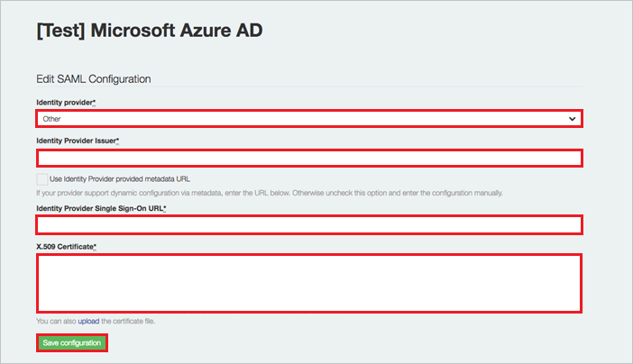

# Configure GaggleAMP for Single sign-on with Microsoft Entra ID

In this article,  you learn how to integrate GaggleAMP with Microsoft Entra ID. When you integrate GaggleAMP with Microsoft Entra ID, you can:

* Control in Microsoft Entra ID who has access to GaggleAMP.
* Enable your users to be automatically signed-in to GaggleAMP with their Microsoft Entra accounts.
* Manage your accounts in one central location.

## Prerequisites

The scenario outlined in this article assumes that you already have the following prerequisites:

[!INCLUDE [common-prerequisites.md](~/identity/saas-apps/includes/common-prerequisites.md)]
* GaggleAMP single sign-on (SSO) enabled subscription.

## Scenario description

In this article,  you configure and test Microsoft Entra single sign-on in a test environment.

* GaggleAMP supports **SP** and **IDP** initiated SSO.

* GaggleAMP supports **Just In Time** user provisioning.

> [!NOTE]
> Identifier of this application is a fixed string value so only one instance can be configured in one tenant.

## Add GaggleAMP from the gallery

To configure the integration of GaggleAMP into Microsoft Entra ID, you need to add GaggleAMP from the gallery to your list of managed SaaS apps.

1. Sign in to the [Microsoft Entra admin center](https://entra.microsoft.com) as at least a [Cloud Application Administrator](~/identity/role-based-access-control/permissions-reference.md#cloud-application-administrator).
1. Browse to **Entra ID** > **Enterprise apps** > **New application**.
1. In the **Add from the gallery** section, type **GaggleAMP** in the search box.
1. Select **GaggleAMP** from results panel and then add the app. Wait a few seconds while the app is added to your tenant.

 [!INCLUDE [sso-wizard.md](~/identity/saas-apps/includes/sso-wizard.md)]

## Configure and test Microsoft Entra SSO for GaggleAMP

Configure and test Microsoft Entra SSO with GaggleAMP using a test user called **B.Simon**. For SSO to work, you need to establish a link relationship between a Microsoft Entra user and the related user in GaggleAMP.

To configure and test Microsoft Entra SSO with GaggleAMP, perform the following steps:

1. **[Configure Microsoft Entra SSO](#configure-azure-ad-sso)** - to enable your users to use this feature.
    1. **Create a Microsoft Entra test user** - to test Microsoft Entra single sign-on with B.Simon.
    1. **Assign the Microsoft Entra test user** - to enable B.Simon to use Microsoft Entra single sign-on.
1. **[Configure GaggleAMP SSO](#configure-gaggleamp-sso)** - to configure the single sign-on settings on application side.
    1. **[Create GaggleAMP test user](#create-gaggleamp-test-user)** - to have a counterpart of B.Simon in GaggleAMP that's linked to the Microsoft Entra representation of user.
1. **[Test SSO](#test-sso)** - to verify whether the configuration works.

## Configure Microsoft Entra SSO

Follow these steps to enable Microsoft Entra SSO.

1. Sign in to the [Microsoft Entra admin center](https://entra.microsoft.com) as at least a [Cloud Application Administrator](~/identity/role-based-access-control/permissions-reference.md#cloud-application-administrator).
1. Browse to **Entra ID** > **Enterprise apps** > **GaggleAMP** > **Single sign-on**.
1. On the **Select a single sign-on method** page, select **SAML**.
1. On the **Set up single sign-on with SAML** page, select the pencil icon for **Basic SAML Configuration** to edit the settings.

   

1. On the **Basic SAML Configuration** section, If you wish to configure the application in **IDP** initiated mode, perform the following step:

    In the **Identifier** text box, type the URL:
    `https://accounts.gaggleamp.com/auth/saml/callback`

1. On the **Set up Single Sign-On with SAML** page, in the **SAML Signing Certificate** section, select **Download** to download the **Certificate (Base64)** from the given options as per your requirement and save it on your computer.

	

1. On the **Set up GaggleAMP** section, copy the appropriate URL(s) as per your requirement.

	

[!INCLUDE [create-assign-users-sso.md](~/identity/saas-apps/includes/create-assign-users-sso.md)]

## Configure GaggleAMP SSO

1. In another browser instance, navigate to the SAML SSO page created for you by the Gaggle support team (for example: *https://accounts.gaggleamp.com/saml_configurations/oXH8sQcP79dOzgFPqrMTyw/edit*).

2. On your **SAML SSO** page, perform the following steps:  
   
    

	a. Select **Other** from the **Identity provider** dropdown menu.
	
	b. In the **Identity Provider Issuer** textbox, paste the value of **Microsoft Entra Identifier**..
	
	c. In the **Identity Provider Single Sign-On URL** textbox, paste the  value of **Login URL**..
	
	d. Open your downloaded **Certificate(Base64)** file in notepad, copy the content of it into your clipboard, and then paste it to the **X.509 Certificate** textbox.
	
	e. Select **Save**.

### Create GaggleAMP test user

In this section, a user called Britta Simon is created in GaggleAMP. GaggleAMP supports just-in-time user provisioning, which is enabled by default. There's no action item for you in this section. If a user doesn't already exist in GaggleAMP, a new one is created after authentication.

## Test SSO 

In this section, you test your Microsoft Entra single sign-on configuration with following options. 

#### SP initiated:

* Visit the invitation page of your Gaggle, you can find its unique link on the Manager View, menu **option Members > Invite**.

* Select the **Sign in with SAML** button to initiate the login flow from there.

#### IdP initiated:

* Select **Test this application**, and you should be automatically signed in to GaggleAMP.

You can also use Microsoft My Apps to test the application in any mode. When you select the GaggleAMP tile in the My Apps, if configured in SP mode you would be redirected to the application sign on page for initiating the login flow and if configured in IDP mode, you should be automatically signed in to the GaggleAMP for which you set up the SSO. For more information, see [Microsoft Entra My Apps](/azure/active-directory/manage-apps/end-user-experiences#azure-ad-my-apps).

## Related content

Once you configure GaggleAMP you can enforce session control, which protects exfiltration and infiltration of your organization’s sensitive data in real time. Session control extends from Conditional Access. [Learn how to enforce session control with Microsoft Defender for Cloud Apps](/cloud-app-security/proxy-deployment-aad).
