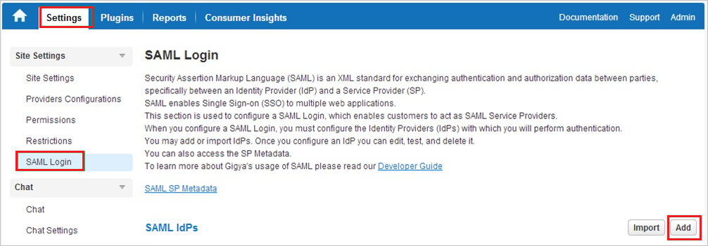
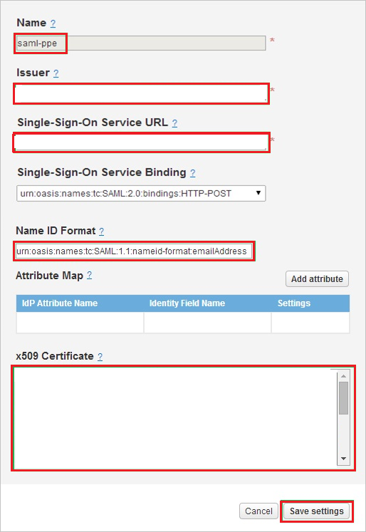
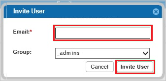

# Configure Gigya for Single sign-on with Microsoft Entra ID

In this article,  you learn how to integrate Gigya with Microsoft Entra ID. When you integrate Gigya with Microsoft Entra ID, you can:

* Control in Microsoft Entra ID who has access to Gigya.
* Enable your users to be automatically signed-in to Gigya with their Microsoft Entra accounts.
* Manage your accounts in one central location.

## Prerequisites

The scenario outlined in this article assumes that you already have the following prerequisites:

[!INCLUDE [common-prerequisites.md](~/identity/saas-apps/includes/common-prerequisites.md)]
* Gigya single sign-on (SSO) enabled subscription.

## Scenario description

In this article,  you configure and test Microsoft Entra single sign-on in a test environment.

* Gigya supports **SP** initiated SSO.

## Add Gigya from the gallery

To configure the integration of Gigya into Microsoft Entra ID, you need to add Gigya from the gallery to your list of managed SaaS apps.

1. Sign in to the [Microsoft Entra admin center](https://entra.microsoft.com) as at least a [Cloud Application Administrator](~/identity/role-based-access-control/permissions-reference.md#cloud-application-administrator).
1. Browse to **Entra ID** > **Enterprise apps** > **New application**.
1. In the **Add from the gallery** section, type **Gigya** in the search box.
1. Select **Gigya** from results panel and then add the app. Wait a few seconds while the app is added to your tenant.

 [!INCLUDE [sso-wizard.md](~/identity/saas-apps/includes/sso-wizard.md)]

## Configure and test Microsoft Entra SSO for Gigya

Configure and test Microsoft Entra SSO with Gigya using a test user called **B.Simon**. For SSO to work, you need to establish a link relationship between a Microsoft Entra user and the related user in Gigya.

To configure and test Microsoft Entra SSO with Gigya, perform the following steps:

1. **[Configure Microsoft Entra SSO](#configure-azure-ad-sso)** - to enable your users to use this feature.
    1. **Create a Microsoft Entra test user** - to test Microsoft Entra single sign-on with B.Simon.
    1. **Assign the Microsoft Entra test user** - to enable B.Simon to use Microsoft Entra single sign-on.
1. **[Configure Gigya SSO](#configure-gigya-sso)** - to configure the single sign-on settings on application side.
    1. **[Create Gigya test user](#create-gigya-test-user)** - to have a counterpart of B.Simon in Gigya that's linked to the Microsoft Entra representation of user.
1. **[Test SSO](#test-sso)** - to verify whether the configuration works.

## Configure Microsoft Entra SSO

Follow these steps to enable Microsoft Entra SSO.

1. Sign in to the [Microsoft Entra admin center](https://entra.microsoft.com) as at least a [Cloud Application Administrator](~/identity/role-based-access-control/permissions-reference.md#cloud-application-administrator).
1. Browse to **Entra ID** > **Enterprise apps** > **Gigya** > **Single sign-on**.
1. On the **Select a single sign-on method** page, select **SAML**.
1. On the **Set up single sign-on with SAML** page, select the pencil icon for **Basic SAML Configuration** to edit the settings.

   

1. On the **Basic SAML Configuration** section, perform the following steps:

	a. In the **Sign on URL** text box, type a URL using the following pattern:
    `http://<companyname>.gigya.com`

    b. In the **Identifier (Entity ID)** text box, type a URL using the following pattern:
    `https://fidm.gigya.com/saml/v2.0/<companyname>`

	> [!NOTE]
	> These values aren't real. Update these values with the actual Sign on URL and Identifier. Contact [Gigya Client support team](https://developers.gigya.com/display/GD/Opening+A+Support+Incident) to get these values. You can also refer to the patterns shown in the **Basic SAML Configuration** section.

1. On the **Set up Single Sign-On with SAML** page, in the **SAML Signing Certificate** section, select **Download** to download the **Certificate (Base64)** from the given options as per your requirement and save it on your computer.

	

1. On the **Set up Gigya** section, copy the appropriate URL(s) as per your requirement.

	

[!INCLUDE [create-assign-users-sso.md](~/identity/saas-apps/includes/create-assign-users-sso.md)]

## Configure Gigya SSO

1. In a different web browser window, log into your Gigya company site as an administrator.

2. Go to **Settings** > **SAML Login**, and then select the **Add** button.
   
    

3. In the **SAML Login** section, perform the following steps:
   
    
   
    a. In the **Name** textbox, type a name for your configuration.
   
    b. In **Issuer** textbox, paste the value of **Microsoft Entra Identifier**.. 
   
    c. In **Single Sign-On Service URL** textbox, paste the value of **Login URL**..
   
    d. In **Name ID Format** textbox, paste the value of **Name Identifier Format**..
   
    e. Open your base-64 encoded certificate in notepad downloaded from Azure portal, copy the content of it into your clipboard, and then paste it to the **X.509 Certificate** textbox.
   
    f. Select **Save Settings**.

## Create Gigya test user

In order to enable Microsoft Entra users to log into Gigya, they must be provisioned into Gigya. In the case of Gigya, provisioning is a manual task.

### To provision a user accounts, perform the following steps:

1. Log in to your **Gigya** company site as an administrator.

2. Go to **Admin** > **Manage Users**, and then select **Invite Users**.
   
    

3. On the Invite Users dialog, perform the following steps:
   
    
   
    a. In the **Email** textbox, type the email alias of a valid Microsoft Entra account you want to provision.
    
    b. Select **Invite User**.
      
    > [!NOTE]
    > The Microsoft Entra account holder will receive an email that includes a link to confirm the account before it becomes active.
    > 

## Test SSO

In this section, you test your Microsoft Entra single sign-on configuration with following options. 

* Select **Test this application**, this option redirects to Gigya Sign-on URL where you can initiate the login flow. 

* Go to Gigya Sign-on URL directly and initiate the login flow from there.

* You can use Microsoft My Apps. When you select the Gigya tile in the My Apps, this option redirects to Gigya Sign-on URL. For more information about the My Apps, see [Introduction to the My Apps](https://support.microsoft.com/account-billing/sign-in-and-start-apps-from-the-my-apps-portal-2f3b1bae-0e5a-4a86-a33e-876fbd2a4510).

## Related content

Once you configure Gigya you can enforce session control, which protects exfiltration and infiltration of your organization’s sensitive data in real time. Session control extends from Conditional Access. [Learn how to enforce session control with Microsoft Defender for Cloud Apps](/cloud-app-security/proxy-deployment-any-app).
