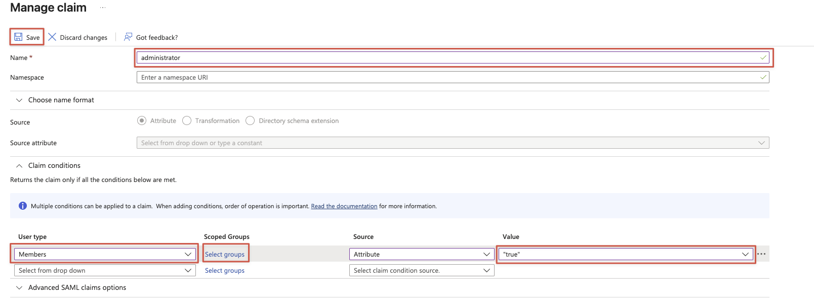

# Configure GitHub Enterprise Server for Single sign-on with Microsoft Entra ID

In this article, you learn how to integrate GitHub Enterprise Server with Microsoft Entra ID. When you integrate GitHub Enterprise Server with Microsoft Entra ID, you can:

* Control in Microsoft Entra ID who has access to GitHub Enterprise Server.
* Enable your users to be automatically signed-in to GitHub Enterprise Server with their Microsoft Entra accounts.
* Manage your accounts in one central location.

## Prerequisites

To get started, you need the following items:

* A Microsoft Entra subscription. If you don't have a subscription, you can get a [free account](https://azure.microsoft.com/free/).
* GitHub Enterprise Server, ready for [initialization](https://docs.github.com/enterprise-server/admin/overview/about-github-enterprise-server).
* Along with Cloud Application Administrator, Application Administrator can also add or manage applications in Microsoft Entra ID.
For more information, see [Azure built-in roles](~/identity/role-based-access-control/permissions-reference.md).

## Scenario description

In this article, you configure and test Microsoft Entra SSO in a test environment.

* GitHub Enterprise Server supports **SP** and **IDP** initiated SSO.
* GitHub Enterprise Server supports **Just In Time** user provisioning.
* GitHub Enterprise Server supports [Automated user provisioning](./github-server-provisioning-tutorial.md).

## Add GitHub Enterprise Server from the gallery

To configure the integration of GitHub Enterprise Server into Microsoft Entra ID, you need to add GitHub Enterprise Server from the gallery to your list of managed SaaS apps.

1. Sign in to the [Microsoft Entra admin center](https://entra.microsoft.com) as at least a [Cloud Application Administrator](~/identity/role-based-access-control/permissions-reference.md#cloud-application-administrator).
1. Browse to **Entra ID** > **Enterprise apps** > **New application**.
1. In the **Add from the gallery** section, type **GitHub Enterprise Server** in the search box.
1. Select **GitHub Enterprise Server** from results panel and then add the app. Wait a few seconds while the app is added to your tenant.

 [!INCLUDE [sso-wizard.md](~/identity/saas-apps/includes/sso-wizard.md)]

## Configure and test Microsoft Entra SSO for GitHub Enterprise Server

Configure and test Microsoft Entra SSO with GitHub Enterprise Server using a test user called **B.Simon**. For SSO to work, you need to establish a link relationship between a Microsoft Entra user and the related user in GitHub Enterprise Server.

To configure and test Microsoft Entra SSO with GitHub Enterprise Server, perform the following steps:

1. **[Configure Microsoft Entra SSO](#configure-azure-ad-sso)** - to enable your users to use this feature.
    1. **Create a Microsoft Entra test user** - to test Microsoft Entra single sign-on with B.Simon.
    1. **Assign the Microsoft Entra test user** - to enable B.Simon to use Microsoft Entra single sign-on.
1. **[Configure GitHub Enterprise Server SSO](#configure-github-enterprise-server-sso)** - to configure the single sign-on settings on application side.
    1. **[Create GitHub Enterprise Server test user](#create-github-enterprise-server-test-user)** - to have a counterpart of B.Simon in GitHub Enterprise Server that's linked to the Microsoft Entra representation of user.
1. **[Test SSO](#test-sso)** - to verify whether the configuration works.

## Configure Microsoft Entra SSO

Follow these steps to enable Microsoft Entra SSO.

1. Sign in to the [Microsoft Entra admin center](https://entra.microsoft.com) as at least a [Cloud Application Administrator](~/identity/role-based-access-control/permissions-reference.md#cloud-application-administrator).
1. Browse to **Entra ID** > **Enterprise apps** > **GitHub Enterprise Server** > **Single sign-on**.
1. On the **Select a single sign-on method** page, select **SAML**.
1. On the **Set up single sign-on with SAML** page, select the pencil icon for **Basic SAML Configuration** to edit the settings.

   

1. On the **Basic SAML Configuration** section, if you wish to configure the application in **IDP** initiated mode, perform the following steps:

    a. In the **Identifier (Entity ID)** text box, type a URL using the following pattern:
    `https://<YOUR-GITHUB-ENTERPRISE-SERVER-HOSTNAME>`

    b. In the **Reply URL** text box, type a URL using the following pattern:
    `https://<YOUR-GITHUB-ENTERPRISE-SERVER-HOSTNAME>/saml/consume`

1. Select **Set additional URLs** and perform the following step if you wish to configure the application in **SP** initiated mode:

     In the **Sign on URL** text box, type a URL using the following pattern:
    `https://<YOUR-GITHUB-ENTERPRISE-SERVER-HOSTNAME>/sso`

    > [!NOTE]
    > These values aren't real. Update these values with the actual Identifier, Reply URL and Sign on URL. Contact [GitHub Enterprise Server Client support team](mailto:support@github.com) to get these values. You can also refer to the patterns shown in the **Basic SAML Configuration** section.

1. GitHub Enterprise Server application expects the SAML assertions in a specific format, which requires you to add custom attribute mappings to your SAML token attributes configuration. The following screenshot shows the list of default attributes.

    

1. Edit **User Attributes & Claims**.

1. Select **Add new claim** and enter the name as `administrator` in the textbox (the `administrator` value is case-sensitive).

1. Expand **Claim conditions** and select **Members** from **User type**.

1. Select **Select groups** and search for the **Group** you want to include this claim, where its members should be administrators for GHES.

1. Select **Attribute** for **Source** and enter `true` (without quotes) for the **Value**. 

1. Select **Save**.

    

1. On the **Set up single sign-on with SAML** page, in the **SAML Signing Certificate** section,  find **Certificate (Base64)** and select **Download** to download the certificate and save it on your computer.

    

1. On the **Set up GitHub Enterprise Server** section, copy the appropriate URL(s) based on your requirement.

    

[!INCLUDE [create-assign-users-sso.md](~/identity/saas-apps/includes/create-assign-users-sso.md)]

## Configure GitHub Enterprise Server SSO

To configure SSO on GitHub Enterprise Server side, you need to follow the instructions mentioned [here](https://docs.github.com/enterprise-server/admin/managing-iam/using-saml-for-enterprise-iam/configuring-saml-single-sign-on-for-your-enterprise).

### Create GitHub Enterprise Server test user

In this section, a user called B.Simon is created in GitHub Enterprise Server. GitHub Enterprise Server supports just-in-time user provisioning, which is enabled by default. There's no action item for you in this section. If a user doesn't already exist in GitHub Enterprise Server, a new one is created after authentication.

GitHub Enterprise Server also supports automatic user provisioning, you can find more details [here](./github-server-provisioning-tutorial.md) on how to configure automatic user provisioning.

## Test SSO 

In this section, you test your Microsoft Entra single sign-on configuration with following options. 

#### SP initiated:

* Select **Test this application**, this option redirects to GitHub Enterprise Server Sign-on URL where you can initiate the login flow.  

* Go to GitHub Enterprise Server Sign-on URL directly and initiate the login flow from there.

#### IDP initiated:

* Select **Test this application**, and you should be automatically signed in to the GitHub Enterprise Server for which you set up the SSO. 

You can also use Microsoft My Apps to test the application in any mode. When you select the GitHub Enterprise Server tile in the My Apps, if configured in SP mode you would be redirected to the application sign-on page for initiating the login flow and if configured in IDP mode, you should be automatically signed in to the GitHub Enterprise Server for which you set up the SSO. For more information, see [Microsoft Entra My Apps](/azure/active-directory/manage-apps/end-user-experiences#azure-ad-my-apps).

## Related content

* [Configuring SCIM provisioning to manage users](https://docs.github.com/enterprise-server/admin/managing-iam/provisioning-user-accounts-with-scim/configuring-scim-provisioning-for-users).

* Once you configure GitHub Enterprise Server you can enforce session control, which protects exfiltration and infiltration of your organization’s sensitive data in real time. Session control extends from Conditional Access. [Learn how to enforce session control with Microsoft Defender for Cloud Apps](/cloud-app-security/proxy-deployment-any-app).